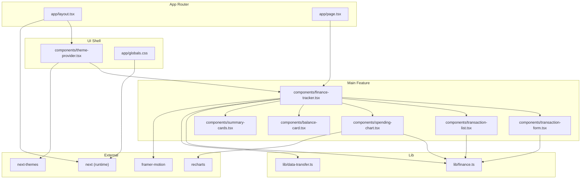
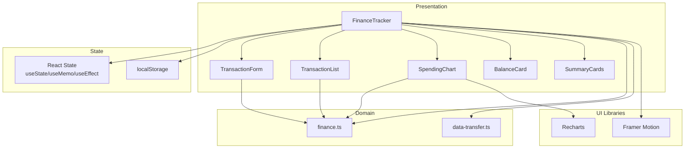
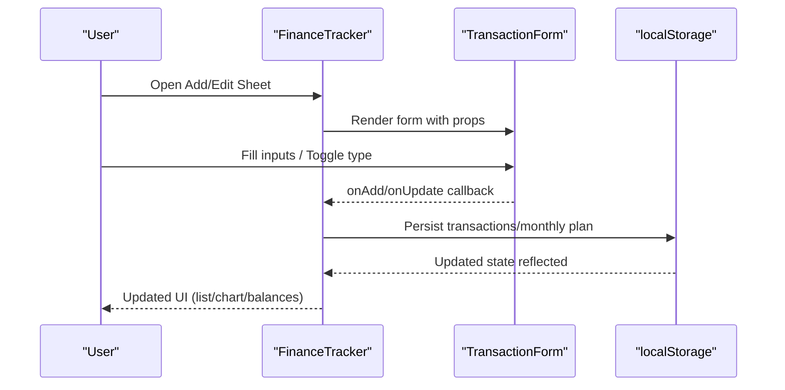
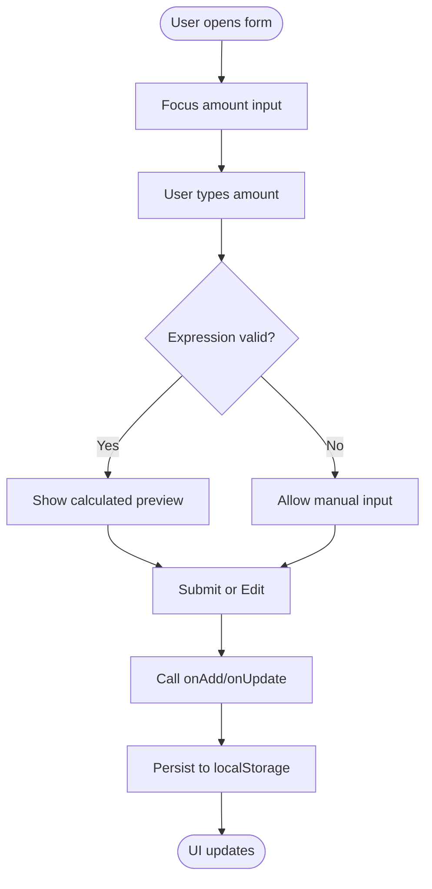
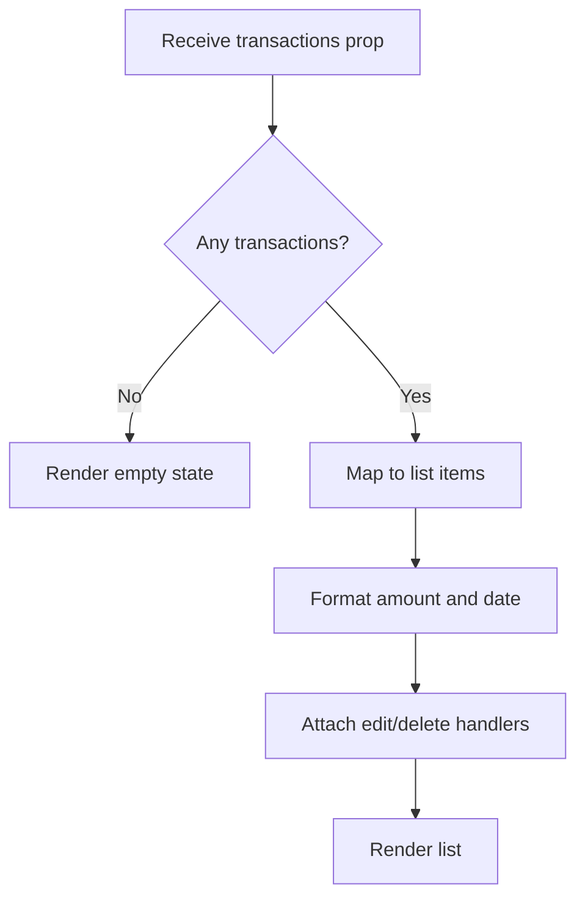
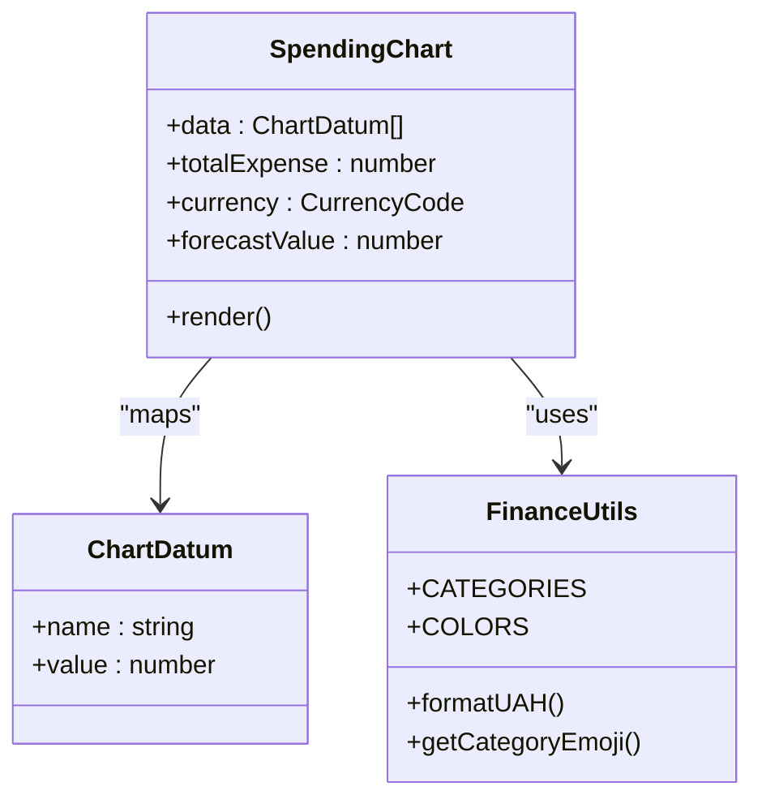
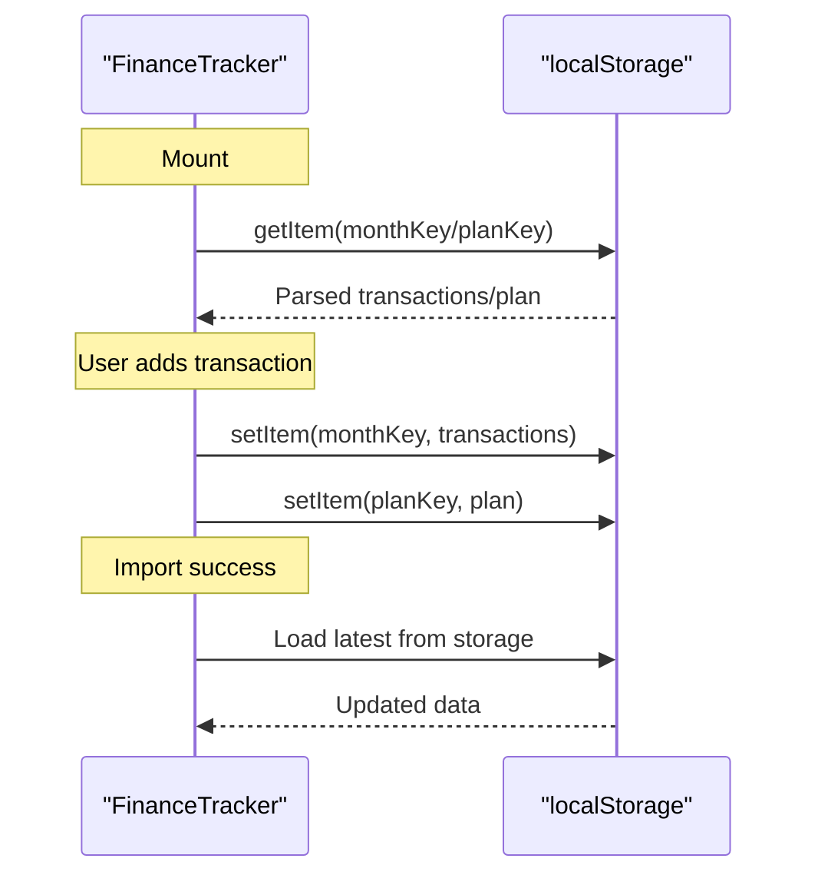
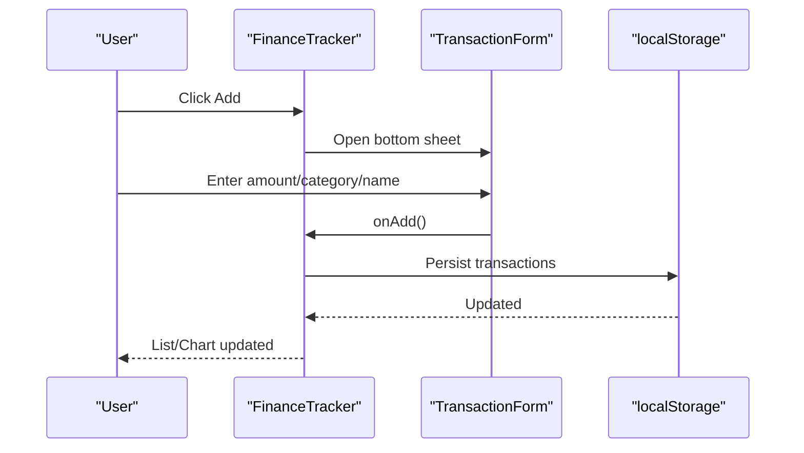
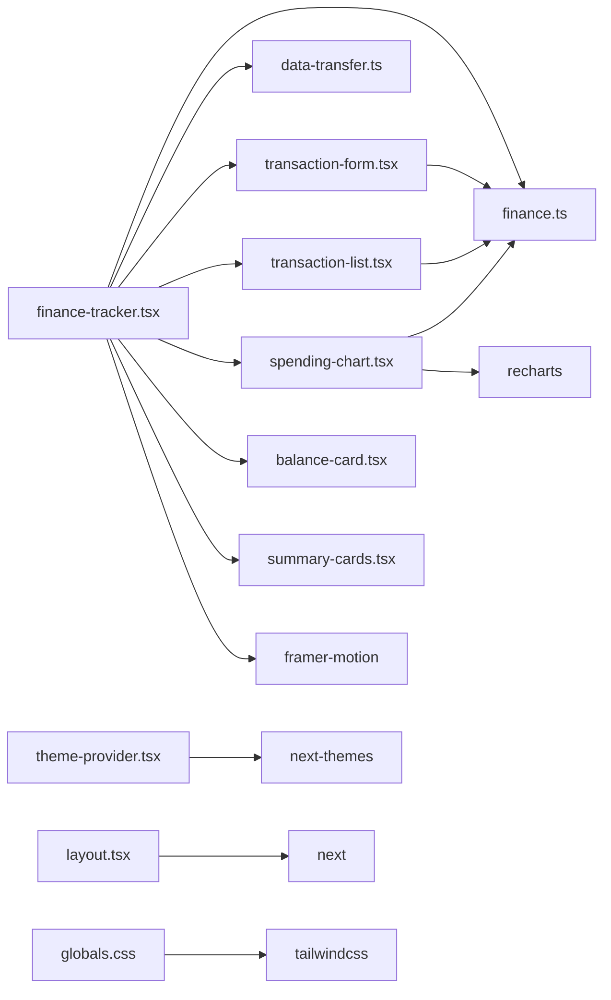

# Application Architecture

<cite>
**Referenced Files in This Document**
- [app/page.tsx](file://app/page.tsx)
- [app/layout.tsx](file://app/layout.tsx)
- [app/globals.css](file://app/globals.css)
- [components/theme-provider.tsx](file://components/theme-provider.tsx)
- [components/finance-tracker.tsx](file://components/finance-tracker.tsx)
- [components/transaction-form.tsx](file://components/transaction-form.tsx)
- [components/transaction-list.tsx](file://components/transaction-list.tsx)
- [components/spending-chart.tsx](file://components/spending-chart.tsx)
- [components/balance-card.tsx](file://components/balance-card.tsx)
- [components/summary-cards.tsx](file://components/summary-cards.tsx)
- [lib/finance.ts](file://lib/finance.ts)
- [lib/data-transfer.ts](file://lib/data-transfer.ts)
- [package.json](file://package.json)
- [next.config.mjs](file://next.config.mjs)
- [tsconfig.json](file://tsconfig.json)
</cite>

## Table of Contents
1. [Introduction](#introduction)
2. [Project Structure](#project-structure)
3. [Core Components](#core-components)
4. [Architecture Overview](#architecture-overview)
5. [Detailed Component Analysis](#detailed-component-analysis)
6. [Dependency Analysis](#dependency-analysis)
7. [Performance Considerations](#performance-considerations)
8. [Troubleshooting Guide](#troubleshooting-guide)
9. [Conclusion](#conclusion)
10. [Appendices](#appendices)

## Introduction
This document describes the architectural design of finTracker, a financial tracking application built with Next.js App Router and React 19. The system follows a mobile-first, local-first approach with centralized state managed in memory and persisted to localStorage. It implements a provider pattern for theme management and a practical observer-like synchronization model using localStorage change events and effect-driven persistence. The application emphasizes simplicity, offline-first behavior, and responsive UI composition across devices.

## Project Structure
The project is organized into feature-focused directories under app and components, with shared utilities under lib. The Next.js App Router entry point renders the main FinanceTracker component, which orchestrates child components for forms, lists, charts, and summaries. Styling leverages Tailwind CSS v4 with custom theme tokens and animations.

**Diagram sources**
- [app/page.tsx:1-6](file://app/page.tsx#L1-L6)
- [app/layout.tsx:1-53](file://app/layout.tsx#L1-L53)
- [components/theme-provider.tsx:1-12](file://components/theme-provider.tsx#L1-L12)
- [components/finance-tracker.tsx:1-907](file://components/finance-tracker.tsx#L1-L907)
- [components/transaction-form.tsx:1-401](file://components/transaction-form.tsx#L1-L401)
- [components/transaction-list.tsx:1-92](file://components/transaction-list.tsx#L1-L92)
- [components/spending-chart.tsx:1-96](file://components/spending-chart.tsx#L1-L96)
- [components/balance-card.tsx:1-80](file://components/balance-card.tsx#L1-L80)
- [components/summary-cards.tsx:1-50](file://components/summary-cards.tsx#L1-L50)
- [lib/finance.ts:1-122](file://lib/finance.ts#L1-L122)
- [lib/data-transfer.ts:1-115](file://lib/data-transfer.ts#L1-L115)

**Section sources**
- [app/page.tsx:1-6](file://app/page.tsx#L1-L6)
- [app/layout.tsx:1-53](file://app/layout.tsx#L1-L53)
- [app/globals.css:1-142](file://app/globals.css#L1-L142)
- [components/theme-provider.tsx:1-12](file://components/theme-provider.tsx#L1-L12)
- [package.json:1-73](file://package.json#L1-L73)
- [next.config.mjs:1-12](file://next.config.mjs#L1-L12)
- [tsconfig.json:1-42](file://tsconfig.json#L1-L42)

## Core Components
- FinanceTracker: Central orchestrator managing state, persistence, derived computations, and rendering child components. Implements hydration detection, localStorage synchronization, and data transfer flows.
- TransactionForm: Input-centric component handling amount parsing, category selection, recurring templates, smart paste, and submission callbacks.
- TransactionList: Read-only list rendering transactions with edit/delete actions and currency formatting.
- SpendingChart: Data visualization of expense breakdown using Recharts with responsive container sizing.
- BalanceCard and SummaryCards: Present financial summaries with currency switching and formatted totals.
- ThemeProvider: Provider wrapper for next-themes enabling system-aware theme switching.
- Finance utilities: Shared types, categories, currency conversion/formatting, and key generation helpers.
- Data transfer: Export/import logic for backup files and validation.

**Section sources**
- [components/finance-tracker.tsx:56-461](file://components/finance-tracker.tsx#L56-L461)
- [components/transaction-form.tsx:96-401](file://components/transaction-form.tsx#L96-L401)
- [components/transaction-list.tsx:14-92](file://components/transaction-list.tsx#L14-L92)
- [components/spending-chart.tsx:16-96](file://components/spending-chart.tsx#L16-L96)
- [components/balance-card.tsx:11-80](file://components/balance-card.tsx#L11-L80)
- [components/summary-cards.tsx:10-50](file://components/summary-cards.tsx#L10-L50)
- [components/theme-provider.tsx:9-11](file://components/theme-provider.tsx#L9-L11)
- [lib/finance.ts:1-122](file://lib/finance.ts#L1-L122)
- [lib/data-transfer.ts:1-115](file://lib/data-transfer.ts#L1-L115)

## Architecture Overview
The system follows a layered architecture:
- Presentation Layer: React 19 components with Next.js App Router routing.
- State Management: Centralized React state with localStorage persistence and hydration.
- Data Access: Local-first storage with explicit load/persist effects.
- Visualization: Recharts for pie charts and responsive containers.
- Theming: Provider-based theme management via next-themes.
- Utilities: Shared domain logic for categories, currencies, and formatting.

**Diagram sources**
- [components/finance-tracker.tsx:56-461](file://components/finance-tracker.tsx#L56-L461)
- [components/transaction-form.tsx:96-401](file://components/transaction-form.tsx#L96-L401)
- [components/transaction-list.tsx:14-92](file://components/transaction-list.tsx#L14-L92)
- [components/spending-chart.tsx:16-96](file://components/spending-chart.tsx#L16-L96)
- [lib/finance.ts:1-122](file://lib/finance.ts#L1-L122)
- [lib/data-transfer.ts:1-115](file://lib/data-transfer.ts#L1-L115)

## Detailed Component Analysis

### FinanceTracker Component
FinanceTracker is the root component responsible for:
- State orchestration: manages transactions, plan, balances, currency, templates, and UI sheets.
- Hydration: detects client-side initialization to avoid SSR mismatches.
- Persistence: loads/saves to localStorage with keys per month and plan, and persists balances, currency, and templates.
- Derived computations: total income/expense, chart data aggregation, monthly forecast calculation.
- Child component wiring: passes props to header, balance card, summary cards, chart, list, and modal/sheet.
- Data transfer: import/export flows with validation and success/error callbacks.

**Diagram sources**
- [components/finance-tracker.tsx:207-292](file://components/finance-tracker.tsx#L207-L292)
- [components/transaction-form.tsx:159-165](file://components/transaction-form.tsx#L159-L165)

**Section sources**
- [components/finance-tracker.tsx:56-461](file://components/finance-tracker.tsx#L56-L461)

### TransactionForm Component
TransactionForm encapsulates:
- Input handling: amount parsing with expression evaluation, smart paste from clipboard, and category selection.
- UX enhancements: cursor positioning, iOS math keypad, quick templates, and submit-on-Enter.
- Callbacks: exposes add/update, cancel-edit, and template application to parent.

**Diagram sources**
- [components/transaction-form.tsx:136-171](file://components/transaction-form.tsx#L136-L171)
- [components/finance-tracker.tsx:207-267](file://components/finance-tracker.tsx#L207-L267)

**Section sources**
- [components/transaction-form.tsx:96-401](file://components/transaction-form.tsx#L96-L401)

### TransactionList Component
TransactionList renders:
- Periodic transactions with currency formatting and category emojis.
- Action buttons to edit or delete entries.
- Empty-state messaging when no transactions exist.

**Diagram sources**
- [components/transaction-list.tsx:14-92](file://components/transaction-list.tsx#L14-L92)
- [lib/finance.ts:107-121](file://lib/finance.ts#L107-L121)

**Section sources**
- [components/transaction-list.tsx:14-92](file://components/transaction-list.tsx#L14-L92)

### SpendingChart Component
SpendingChart displays:
- Pie chart visualization of expense categories using Recharts.
- Percentage bars and category colors aligned with domain definitions.
- Forecast message computed from plan and current spending.

**Diagram sources**
- [components/spending-chart.tsx:16-96](file://components/spending-chart.tsx#L16-L96)
- [lib/finance.ts:1-122](file://lib/finance.ts#L1-L122)

**Section sources**
- [components/spending-chart.tsx:16-96](file://components/spending-chart.tsx#L16-L96)

### BalanceCard and SummaryCards
- BalanceCard: Shows global balance (card + cash), individual card/cash, savings, and currency selector.
- SummaryCards: Displays income and expense totals with directional styling.

**Section sources**
- [components/balance-card.tsx:11-80](file://components/balance-card.tsx#L11-L80)
- [components/summary-cards.tsx:10-50](file://components/summary-cards.tsx#L10-L50)

### Theme Provider Pattern
ThemeProvider wraps the application with next-themes to enable system-aware theme switching and persist theme preferences.

**Section sources**
- [components/theme-provider.tsx:9-11](file://components/theme-provider.tsx#L9-L11)
- [app/layout.tsx:44-52](file://app/layout.tsx#L44-L52)

### Observer Pattern for localStorage Synchronization
The system does not rely on a dedicated localStorage event listener. Instead, it uses effect-driven persistence:
- On mount/hydrate, data is loaded from localStorage keyed by month and plan.
- On state changes, data is persisted immediately to localStorage.
- Import/Export triggers explicit reloads of state from localStorage.

**Diagram sources**
- [components/finance-tracker.tsx:107-167](file://components/finance-tracker.tsx#L107-L167)
- [lib/data-transfer.ts:56-114](file://lib/data-transfer.ts#L56-L114)

**Section sources**
- [components/finance-tracker.tsx:107-167](file://components/finance-tracker.tsx#L107-L167)
- [lib/data-transfer.ts:56-114](file://lib/data-transfer.ts#L56-L114)

### Data Flow Patterns
- User interactions: opening the FAB, toggling income/expense, selecting category, entering amount, applying templates, and submitting.
- Form submission: validated amount parsing, optional recurring template creation, and transaction insertion/update.
- Automatic synchronization: immediate localStorage writes after state changes; import/export refreshes state from storage.

**Diagram sources**
- [components/finance-tracker.tsx:301-309](file://components/finance-tracker.tsx#L301-L309)
- [components/transaction-form.tsx:159-165](file://components/transaction-form.tsx#L159-L165)

**Section sources**
- [components/finance-tracker.tsx:207-292](file://components/finance-tracker.tsx#L207-L292)
- [components/transaction-form.tsx:136-171](file://components/transaction-form.tsx#L136-L171)

### Integration Patterns with External APIs
- Recharts: Visualization library for pie charts and responsive containers.
- Framer Motion: Animations for bottom sheet transitions and backdrop fade.
- next-themes: Theme provider for system-aware dark/light mode.
- Vercel Analytics: Optional analytics in production builds.

**Section sources**
- [package.json:47-61](file://package.json#L47-L61)
- [app/layout.tsx:3-4](file://app/layout.tsx#L3-L4)

## Dependency Analysis
The application relies on a focused set of libraries:
- Next.js runtime and App Router for routing and SSR/SSG behavior.
- React 19 for component model and hooks.
- Tailwind CSS v4 for styling and design tokens.
- Recharts for data visualization.
- Framer Motion for animations.
- next-themes for theme management.
- date-fns for date utilities.
- lucide-react for icons.

**Diagram sources**
- [components/finance-tracker.tsx:1-22](file://components/finance-tracker.tsx#L1-L22)
- [components/transaction-form.tsx:1-18](file://components/transaction-form.tsx#L1-L18)
- [components/spending-chart.tsx:1-5](file://components/spending-chart.tsx#L1-L5)
- [components/theme-provider.tsx:1-11](file://components/theme-provider.tsx#L1-L11)
- [app/layout.tsx:1-53](file://app/layout.tsx#L1-L53)
- [app/globals.css:1-142](file://app/globals.css#L1-L142)
- [package.json:11-61](file://package.json#L11-L61)

**Section sources**
- [package.json:11-61](file://package.json#L11-L61)
- [next.config.mjs:1-12](file://next.config.mjs#L1-L12)
- [tsconfig.json:1-42](file://tsconfig.json#L1-L42)

## Performance Considerations
- Local-first persistence: Minimizes network overhead and enables offline operation. Effects are scoped to relevant state slices to reduce unnecessary writes.
- Memoization: Uses useMemo for derived values (month/plan keys, period label, forecast) to avoid recomputation.
- Rendering: Lists and charts render only visible data; responsive containers adapt to viewport.
- Animations: Framer Motion is used sparingly for modal transitions to maintain smoothness on mobile devices.
- Fonts and CSS: Tailwind CSS v4 with custom tokens reduces runtime CSS generation overhead.
- Build configuration: TypeScript ignores build errors and images are unoptimized for simplicity.

[No sources needed since this section provides general guidance]

## Troubleshooting Guide
- Import/Export failures: The import function validates backup format and clears existing keys before writing. Errors are surfaced via callbacks.
- Malformed localStorage entries: FinanceTracker’s loading logic safely parses and skips invalid entries.
- Hydration mismatch: The component checks for client-side environment before accessing localStorage.
- Clipboard permissions: Smart paste gracefully handles unavailable clipboard APIs.

**Section sources**
- [lib/data-transfer.ts:56-114](file://lib/data-transfer.ts#L56-L114)
- [components/finance-tracker.tsx:107-142](file://components/finance-tracker.tsx#L107-L142)
- [components/transaction-form.tsx:173-190](file://components/transaction-form.tsx#L173-L190)

## Conclusion
finTracker implements a clean, local-first architecture centered on React 19 and Next.js App Router. Centralized state with localStorage persistence ensures simplicity, reliability, and offline capability. The provider pattern for themes and effect-driven synchronization deliver a cohesive user experience across devices. The modular component design and shared domain utilities support maintainability and extensibility.

[No sources needed since this section summarizes without analyzing specific files]

## Appendices

### System Boundaries
- Internal: Components, utilities, and state within the FinanceTracker boundary.
- External: localStorage for persistence, Recharts for visualization, next-themes for theming, and optional analytics.

**Section sources**
- [components/finance-tracker.tsx:107-167](file://components/finance-tracker.tsx#L107-L167)
- [lib/data-transfer.ts:14-54](file://lib/data-transfer.ts#L14-L54)

### Mobile-First Design and Responsive Composition
- Layout: Fixed bottom sheet for add/edit flows with safe-area insets considered.
- Typography and spacing: Tailwind utilities and custom tokens ensure readable scales.
- Interaction: Touch-friendly controls, focused input behavior, and gesture-friendly navigation.

**Section sources**
- [components/finance-tracker.tsx:360-428](file://components/finance-tracker.tsx#L360-L428)
- [app/globals.css:1-142](file://app/globals.css#L1-L142)

### Cross-Platform Compatibility
- Next.js App Router ensures consistent behavior across platforms.
- localStorage provides universal persistence.
- Optional analytics are gated behind environment checks.

**Section sources**
- [app/layout.tsx:48-49](file://app/layout.tsx#L48-L49)
- [next.config.mjs:1-12](file://next.config.mjs#L1-L12)