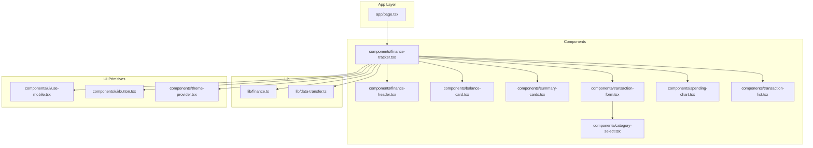
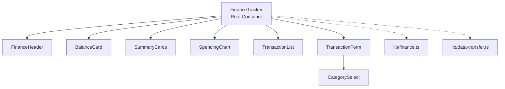
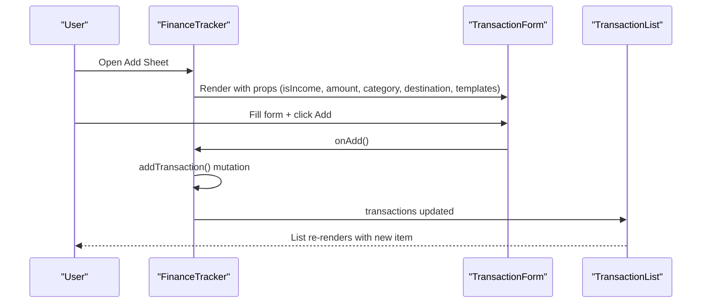
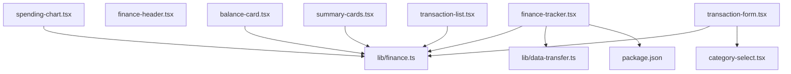

# Component Architecture

<cite>
**Referenced Files in This Document**
- [finance-tracker.tsx](file://components/finance-tracker.tsx)
- [finance-header.tsx](file://components/finance-header.tsx)
- [balance-card.tsx](file://components/balance-card.tsx)
- [summary-cards.tsx](file://components/summary-cards.tsx)
- [transaction-form.tsx](file://components/transaction-form.tsx)
- [spending-chart.tsx](file://components/spending-chart.tsx)
- [transaction-list.tsx](file://components/transaction-list.tsx)
- [category-select.tsx](file://components/category-select.tsx)
- [page.tsx](file://app/page.tsx)
- [finance.ts](file://lib/finance.ts)
- [data-transfer.ts](file://lib/data-transfer.ts)
- [use-mobile.tsx](file://components/ui/use-mobile.tsx)
- [button.tsx](file://components/ui/button.tsx)
- [theme-provider.tsx](file://components/theme-provider.tsx)
- [package.json](file://package.json)
</cite>

## Table of Contents
1. [Introduction](#introduction)
2. [Project Structure](#project-structure)
3. [Core Components](#core-components)
4. [Architecture Overview](#architecture-overview)
5. [Detailed Component Analysis](#detailed-component-analysis)
6. [Dependency Analysis](#dependency-analysis)
7. [Performance Considerations](#performance-considerations)
8. [Troubleshooting Guide](#troubleshooting-guide)
9. [Conclusion](#conclusion)
10. [Appendices](#appendices)

## Introduction
This document explains the component architecture of finTracker, focusing on the FinanceTracker root container and its orchestrated child components. It details how state is managed and shared, how data flows from parent to children, and how animations and responsive design are integrated. It also covers lifecycle management, rendering optimizations, and the modular design that supports maintainability and extensibility.

## Project Structure
The application follows a feature-based component organization under components/, with shared UI primitives under components/ui/, domain logic under lib/, and the Next.js app router pages under app/. The FinanceTracker component is the primary orchestrator rendered by the root page.

**Diagram sources**
- [page.tsx:1-6](file://app/page.tsx#L1-L6)
- [finance-tracker.tsx:1-545](file://components/finance-tracker.tsx#L1-L545)
- [finance-header.tsx:1-129](file://components/finance-header.tsx#L1-L129)
- [balance-card.tsx:1-80](file://components/balance-card.tsx#L1-L80)
- [summary-cards.tsx:1-50](file://components/summary-cards.tsx#L1-L50)
- [spending-chart.tsx:1-96](file://components/spending-chart.tsx#L1-L96)
- [transaction-list.tsx:1-102](file://components/transaction-list.tsx#L1-L102)
- [transaction-form.tsx:1-448](file://components/transaction-form.tsx#L1-L448)
- [category-select.tsx:1-163](file://components/category-select.tsx#L1-L163)
- [finance.ts:1-124](file://lib/finance.ts#L1-L124)
- [data-transfer.ts:1-115](file://lib/data-transfer.ts#L1-L115)
- [use-mobile.tsx:1-20](file://components/ui/use-mobile.tsx#L1-L20)
- [button.tsx:1-61](file://components/ui/button.tsx#L1-L61)
- [theme-provider.tsx:1-12](file://components/theme-provider.tsx#L1-L12)

**Section sources**
- [page.tsx:1-6](file://app/page.tsx#L1-L6)
- [finance-tracker.tsx:1-545](file://components/finance-tracker.tsx#L1-L545)

## Core Components
This section outlines the primary components and their roles within the FinanceTracker ecosystem.

- FinanceTracker (root container)
  - Orchestrates state for transactions, balances, plan, currency, and UI sheets.
  - Computes derived values (totals, chart data, forecasts).
  - Manages persistence via localStorage and import/export utilities.
  - Renders child components and controls modal/sheet visibility.

- FinanceHeader
  - Provides period navigation, history toggle, and settings trigger.
  - Exposes callbacks to change the active month and open settings/history.

- BalanceCard
  - Displays global balance and per-account balances.
  - Allows currency switching via callback.

- SummaryCards
  - Shows income and expense summaries for the active period.

- SpendingChart
  - Visualizes spending breakdown by category and shows a monthly forecast.

- TransactionForm
  - Handles adding/editing transactions, destinations, recurring toggles, and smart paste.
  - Integrates CategorySelect and math accessory bar.

- TransactionList
  - Lists transactions for the period with edit/delete actions.

- CategorySelect
  - Reusable dropdown for selecting categories with icons and animations.

- Shared domain and utilities
  - lib/finance.ts defines types, categories, formatting, and helpers.
  - lib/data-transfer.ts handles backup and restore.

**Section sources**
- [finance-tracker.tsx:57-545](file://components/finance-tracker.tsx#L57-L545)
- [finance-header.tsx:20-129](file://components/finance-header.tsx#L20-L129)
- [balance-card.tsx:11-80](file://components/balance-card.tsx#L11-L80)
- [summary-cards.tsx:10-50](file://components/summary-cards.tsx#L10-L50)
- [spending-chart.tsx:16-96](file://components/spending-chart.tsx#L16-L96)
- [transaction-form.tsx:103-448](file://components/transaction-form.tsx#L103-L448)
- [transaction-list.tsx:14-102](file://components/transaction-list.tsx#L14-L102)
- [category-select.tsx:44-163](file://components/category-select.tsx#L44-L163)
- [finance.ts:1-124](file://lib/finance.ts#L1-L124)
- [data-transfer.ts:1-115](file://lib/data-transfer.ts#L1-L115)

## Architecture Overview
The FinanceTracker component acts as a stateful controller that passes props down to presentational and composite components. It computes derived data and exposes callbacks for mutations. Child components remain largely stateless except where necessary (e.g., local picker state in FinanceHeader, dropdown state in CategorySelect).

**Diagram sources**
- [finance-tracker.tsx:18-23](file://components/finance-tracker.tsx#L18-L23)
- [finance-header.tsx:20-129](file://components/finance-header.tsx#L20-L129)
- [balance-card.tsx:11-80](file://components/balance-card.tsx#L11-L80)
- [summary-cards.tsx:10-50](file://components/summary-cards.tsx#L10-L50)
- [spending-chart.tsx:16-96](file://components/spending-chart.tsx#L16-L96)
- [transaction-list.tsx:14-102](file://components/transaction-list.tsx#L14-L102)
- [transaction-form.tsx:103-448](file://components/transaction-form.tsx#L103-L448)
- [category-select.tsx:44-163](file://components/category-select.tsx#L44-L163)
- [finance.ts:1-124](file://lib/finance.ts#L1-L124)
- [data-transfer.ts:1-115](file://lib/data-transfer.ts#L1-L115)

## Detailed Component Analysis

### FinanceTracker: Root Container and Orchestration
- Responsibilities
  - Manages core state: date, transactions, plan, balances, currency, quick/recurring templates, sheet visibility, editing state.
  - Derives computed values: totals, chart data, forecast, period label, month/plan keys.
  - Persists and hydrates state from localStorage.
  - Implements transaction lifecycle: add, update, delete, transfer.
  - Controls modals/sheets via Framer Motion and AnimatePresence.
  - Integrates settings modal with import/export and template management.

- Prop drilling and state sharing
  - Props flow down to children (e.g., FinanceHeader receives callbacks to change date and toggle history).
  - Local state is kept in FinanceTracker; child components receive callbacks to mutate state.
  - Some state is persisted locally within child components (e.g., FinanceHeader’s pickerOpen, CategorySelect’s open) to minimize unnecessary re-renders in parent.

- Rendering and animations
  - Uses Framer Motion for sheet transitions and dropdowns.
  - Uses AnimatePresence to coordinate exit animations.

- Lifecycle and persistence
  - Hydration flag ensures localStorage reads occur after mount.
  - Effects persist transactions, plan, balances, currency, and templates on changes.

- Data flow
  - Upstream: child components call callbacks to modify FinanceTracker state.
  - Downstream: FinanceTracker computes derived data and passes it to children.

**Diagram sources**
- [finance-tracker.tsx:210-264](file://components/finance-tracker.tsx#L210-L264)
- [transaction-form.tsx:103-123](file://components/transaction-form.tsx#L103-L123)
- [transaction-list.tsx:14-102](file://components/transaction-list.tsx#L14-L102)

**Section sources**
- [finance-tracker.tsx:57-545](file://components/finance-tracker.tsx#L57-L545)

### FinanceHeader: Period Navigation and Actions
- Composition pattern
  - Stateless functional component receiving callbacks via props.
  - Manages local state for the year/month picker overlay.

- Interaction model
  - Calls onDateChange with a new Date when a month is selected.
  - Toggles history visibility and opens settings via callbacks.

**Section sources**
- [finance-header.tsx:20-129](file://components/finance-header.tsx#L20-L129)

### BalanceCard: Financial Snapshot
- Composition pattern
  - Receives balances and currency; exposes onCurrencyChange callback.
  - Uses shared formatting from lib/finance.ts.

- Rendering
  - Shows global balance and per-account balances.
  - Provides currency toggle buttons.

**Section sources**
- [balance-card.tsx:11-80](file://components/balance-card.tsx#L11-L80)
- [finance.ts:93-123](file://lib/finance.ts#L93-L123)

### SummaryCards: Income and Expenses
- Composition pattern
  - Receives totals and currency; renders income/expense cards with icons and formatted amounts.

**Section sources**
- [summary-cards.tsx:10-50](file://components/summary-cards.tsx#L10-L50)

### SpendingChart: Spending Visualization
- Composition pattern
  - Receives chart data, total expense, currency, and forecast value.
  - Uses Recharts for pie visualization and custom bars for category percentages.

- Rendering
  - Shows “No data” message when no expenses exist.
  - Displays forecast text with color-coded value.

**Section sources**
- [spending-chart.tsx:16-96](file://components/spending-chart.tsx#L16-L96)
- [finance.ts:1-37](file://lib/finance.ts#L1-L37)

### TransactionForm: Input and Editing Surface
- Composition pattern
  - Accepts isIncome, amount, name, category, destination, recurring toggle, templates, and callbacks.
  - Integrates CategorySelect for category selection.
  - Provides math accessory bar and smart paste from clipboard.

- Behavior
  - Supports expression evaluation for amount input.
  - Applies quick templates and manages recurring transactions.
  - Handles transfer action for income-only scenarios.

- Accessibility and UX
  - Focus management optimized for mobile keyboards.
  - Escape key support for canceling edits.

**Section sources**
- [transaction-form.tsx:103-448](file://components/transaction-form.tsx#L103-L448)
- [category-select.tsx:44-163](file://components/category-select.tsx#L44-L163)

### TransactionList: Periodic Records
- Composition pattern
  - Receives transactions, period label, and callbacks for edit/delete.
  - Renders each transaction with category emoji, destination badges, and action buttons.

**Section sources**
- [transaction-list.tsx:14-102](file://components/transaction-list.tsx#L14-L102)
- [finance.ts:54-57](file://lib/finance.ts#L54-L57)

### CategorySelect: Reusable Dropdown
- Composition pattern
  - Accepts categories, current value, and onChange.
  - Manages local open state and document event listeners for outside clicks and escape key.
  - Animates dropdown using Framer Motion.

**Section sources**
- [category-select.tsx:44-163](file://components/category-select.tsx#L44-L163)

### Settings and Templates: Modals and Persistence
- SettingsModal
  - Controlled modal with draft values for balances and plan.
  - Integrates import/export and recurring templates display.
  - Uses TemplateManager for quick templates.

- TemplateManager
  - Manages quick templates list with add/update operations.

- Persistence
  - Settings and templates are persisted to localStorage via FinanceTracker effects.

**Section sources**
- [finance-tracker.tsx:547-775](file://components/finance-tracker.tsx#L547-L775)
- [finance-tracker.tsx:777-807](file://components/finance-tracker.tsx#L777-L807)
- [data-transfer.ts:14-115](file://lib/data-transfer.ts#L14-L115)

## Dependency Analysis
- External libraries
  - Framer Motion: Used for sheet and dropdown animations.
  - Recharts: Used for pie charts in SpendingChart.
  - Radix UI and Vaul: Underlying primitives for dialogs and sheets.
  - Tailwind CSS and class variance authority: Styling and variants.

- Internal dependencies
  - lib/finance.ts: Types, constants, formatting, and helpers used across components.
  - lib/data-transfer.ts: Backup and restore utilities invoked from FinanceTracker.

**Diagram sources**
- [finance-tracker.tsx:1-25](file://components/finance-tracker.tsx#L1-L25)
- [spending-chart.tsx:1-6](file://components/spending-chart.tsx#L1-L6)
- [finance.ts:1-124](file://lib/finance.ts#L1-L124)
- [data-transfer.ts:1-115](file://lib/data-transfer.ts#L1-L115)
- [package.json:47-58](file://package.json#L47-L58)

**Section sources**
- [package.json:47-58](file://package.json#L47-L58)
- [finance-tracker.tsx:1-25](file://components/finance-tracker.tsx#L1-L25)

## Performance Considerations
- Derived data computation
  - Totals and chart data are memoized using useMemo to avoid recomputation on every render.
  - Forecast calculation is derived from current period and daily averages.

- Rendering optimization
  - Individual list items in TransactionList are keyed by id, enabling efficient reconciliation.
  - CategorySelect uses AnimatePresence and controlled animations to reduce layout thrash.

- State partitioning
  - UI-only state (e.g., FinanceHeader pickerOpen, CategorySelect open) is kept local to avoid unnecessary parent re-renders.

- Persistence and hydration
  - Effects guard against SSR by checking window availability and hydrating state once on the client.

- Animation and layout
  - Framer Motion is used sparingly for entrance/exit transitions to keep the interface smooth without heavy computations.

[No sources needed since this section provides general guidance]

## Troubleshooting Guide
- Transactions not persisting
  - Verify localStorage availability and that FinanceTracker effects run after hydration.
  - Check monthKey and planKey generation via lib/finance.ts.

- Import/Export failures
  - Confirm backup file format matches expected schema and that FileReader operations succeed.
  - Inspect error callbacks for user feedback.

- Amount parsing errors
  - Expression evaluation and clipboard parsing are guarded; ensure inputs conform to accepted formats.

- Mobile input focus issues
  - TransactionForm uses requestAnimationFrame and timeouts to focus inputs; test on target devices.

**Section sources**
- [finance-tracker.tsx:109-175](file://components/finance-tracker.tsx#L109-L175)
- [data-transfer.ts:56-115](file://lib/data-transfer.ts#L56-L115)
- [transaction-form.tsx:146-167](file://components/transaction-form.tsx#L146-L167)

## Conclusion
FinanceTracker demonstrates a clean, modular component architecture centered around a single orchestrator that manages state, derives data, and coordinates child components. Prop drilling is minimized by passing only necessary callbacks and values, while local state remains close to where it is used. Animations and responsive patterns enhance usability, and persistence ensures continuity across sessions. The design supports easy maintenance and extension, with reusable UI primitives and a clear separation of concerns.

[No sources needed since this section summarizes without analyzing specific files]

## Appendices

### Component Boundaries and Responsibilities
- FinanceTracker
  - State orchestration, derived data, persistence, and modal control.
- FinanceHeader
  - Period navigation and action triggers.
- BalanceCard
  - Balance presentation and currency switching.
- SummaryCards
  - Income/expense summaries.
- SpendingChart
  - Spending visualization and forecast.
- TransactionForm
  - Transaction creation/editing and category selection.
- TransactionList
  - Transaction records and actions.
- CategorySelect
  - Category selection with animations.

**Section sources**
- [finance-tracker.tsx:57-545](file://components/finance-tracker.tsx#L57-L545)
- [finance-header.tsx:20-129](file://components/finance-header.tsx#L20-L129)
- [balance-card.tsx:11-80](file://components/balance-card.tsx#L11-L80)
- [summary-cards.tsx:10-50](file://components/summary-cards.tsx#L10-L50)
- [spending-chart.tsx:16-96](file://components/spending-chart.tsx#L16-L96)
- [transaction-form.tsx:103-448](file://components/transaction-form.tsx#L103-L448)
- [transaction-list.tsx:14-102](file://components/transaction-list.tsx#L14-L102)
- [category-select.tsx:44-163](file://components/category-select.tsx#L44-L163)

### Mobile-First Design Approach
- Breakpoint and detection
  - useIsMobile hook detects small screens to tailor behavior.
- Component adaptations
  - Bottom sheet modal for forms and settings.
  - Compact layouts, touch-friendly buttons, and accessible focus management.
  - CategorySelect dropdown positioned for mobile ergonomics.

**Section sources**
- [use-mobile.tsx:5-19](file://components/ui/use-mobile.tsx#L5-L19)
- [finance-tracker.tsx:442-512](file://components/finance-tracker.tsx#L442-L512)
- [category-select.tsx:96-160](file://components/category-select.tsx#L96-L160)

### Animation Libraries Integration
- Framer Motion
  - Used for sheet transitions, dropdowns, and subtle feedback.
- Recharts
  - Used for responsive pie charts in SpendingChart.

**Section sources**
- [finance-tracker.tsx:4-5](file://components/finance-tracker.tsx#L4-L5)
- [spending-chart.tsx:3-4](file://components/spending-chart.tsx#L3-L4)
- [category-select.tsx:96-105](file://components/category-select.tsx#L96-L105)