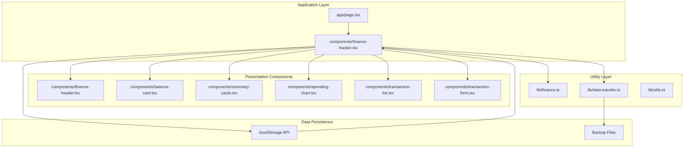
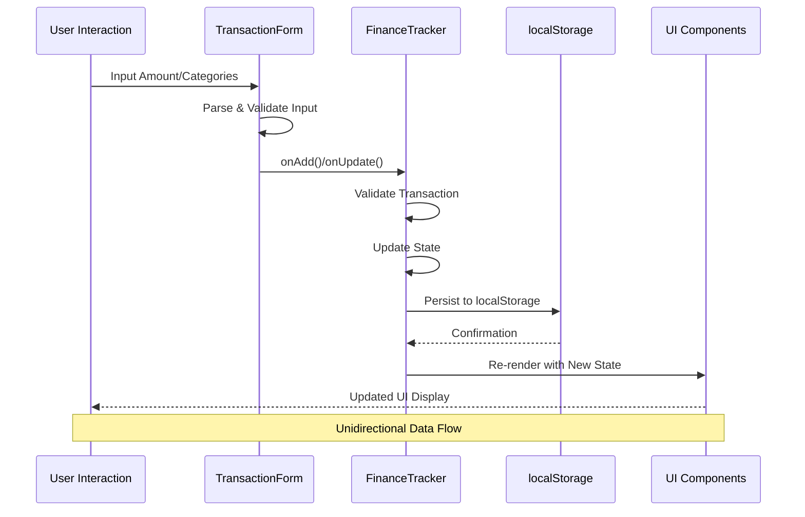
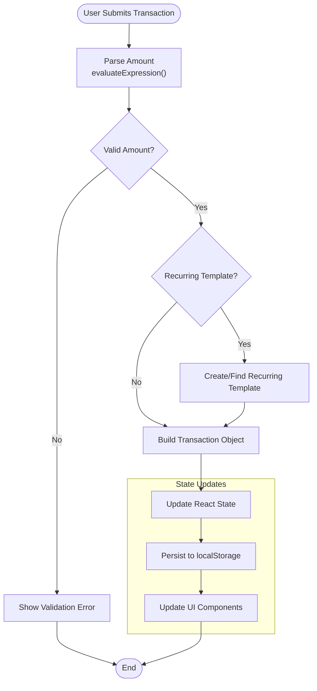
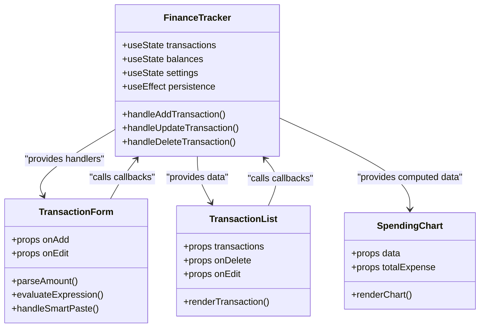
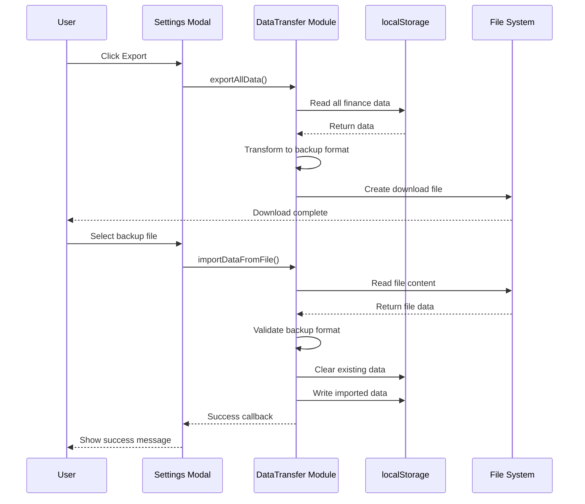
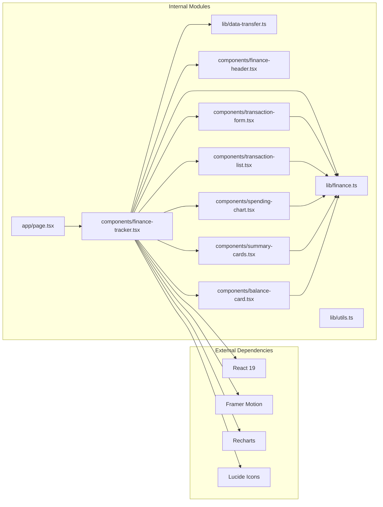

# Data Flow Patterns

<cite>
**Referenced Files in This Document**
- [app/page.tsx](file://app/page.tsx)
- [components/finance-tracker.tsx](file://components/finance-tracker.tsx)
- [components/transaction-form.tsx](file://components/transaction-form.tsx)
- [components/transaction-list.tsx](file://components/transaction-list.tsx)
- [components/spending-chart.tsx](file://components/spending-chart.tsx)
- [components/summary-cards.tsx](file://components/summary-cards.tsx)
- [components/balance-card.tsx](file://components/balance-card.tsx)
- [components/finance-header.tsx](file://components/finance-header.tsx)
- [lib/finance.ts](file://lib/finance.ts)
- [lib/data-transfer.ts](file://lib/data-transfer.ts)
- [lib/utils.ts](file://lib/utils.ts)
- [package.json](file://package.json)
</cite>

## Table of Contents
1. [Introduction](#introduction)
2. [Project Structure](#project-structure)
3. [Core Components](#core-components)
4. [Architecture Overview](#architecture-overview)
5. [Detailed Component Analysis](#detailed-component-analysis)
6. [Dependency Analysis](#dependency-analysis)
7. [Performance Considerations](#performance-considerations)
8. [Troubleshooting Guide](#troubleshooting-guide)
9. [Conclusion](#conclusion)

## Introduction

finTracker implements a sophisticated unidirectional data flow architecture built around React's useState and useEffect hooks, combined with localStorage persistence for offline-first functionality. The application follows a reactive pattern where user interactions trigger state mutations that propagate through the component hierarchy, ultimately persisting to localStorage for data durability.

The system is designed around four primary data domains: transactions, balances, recurring templates, and settings. Each domain follows consistent patterns for data transformation, validation, and persistence while maintaining strict separation of concerns between presentation and state management.

## Project Structure

The application follows a component-based architecture with clear separation between presentation components and stateful containers:

**Diagram sources**
- [app/page.tsx:1-6](file://app/page.tsx#L1-L6)
- [components/finance-tracker.tsx:1-545](file://components/finance-tracker.tsx#L1-L545)

**Section sources**
- [app/page.tsx:1-6](file://app/page.tsx#L1-L6)
- [package.json:1-73](file://package.json#L1-L73)

## Core Components

### FinanceTracker Container Component

The central container component manages the entire application state and orchestrates data flow between all sub-components. It implements a comprehensive state management system with:

- **Transaction Management**: Full CRUD operations with validation and persistence
- **Balance Tracking**: Real-time balance calculations across multiple accounts
- **Recurring Templates**: Automated transaction generation and management
- **Settings Management**: Currency conversion, plan values, and preferences
- **Backup Operations**: Import/export functionality with error handling

The component uses React's `useMemo` for expensive computations and `useEffect` hooks for side effects and persistence operations.

**Section sources**
- [components/finance-tracker.tsx:57-545](file://components/finance-tracker.tsx#L57-L545)

### Transaction Form Component

The form component implements advanced input processing with:

- **Smart Amount Parsing**: Handles various number formats including mathematical expressions
- **Clipboard Integration**: Automatic detection of amounts and categories from copied text
- **Quick Templates**: Predefined transaction patterns for rapid input
- **Real-time Validation**: Immediate feedback on input validity

**Section sources**
- [components/transaction-form.tsx:103-447](file://components/transaction-form.tsx#L103-L447)

### Financial Libraries

The `lib/finance.ts` module provides essential financial data structures and utilities:

- **Transaction Types**: Strongly typed transaction model with validation
- **Category Management**: Hierarchical category system with icons and colors
- **Formatting Functions**: Currency conversion and localization support
- **Key Generation**: Consistent localStorage key naming conventions

**Section sources**
- [lib/finance.ts:1-124](file://lib/finance.ts#L1-L124)

## Architecture Overview

The application implements a unidirectional data flow pattern that ensures predictable state updates and reliable persistence:

**Diagram sources**
- [components/transaction-form.tsx:169-175](file://components/transaction-form.tsx#L169-L175)
- [components/finance-tracker.tsx:210-264](file://components/finance-tracker.tsx#L210-L264)

The architecture follows these key principles:

1. **Single Source of Truth**: All state originates from React component state or localStorage
2. **Immutable Updates**: State mutations use functional updates to preserve referential integrity
3. **Automatic Persistence**: Changes trigger immediate localStorage updates
4. **Computed Properties**: Derived data is calculated on-demand using memoization

## Detailed Component Analysis

### Transaction Lifecycle Management

The transaction lifecycle demonstrates the complete unidirectional data flow from user input to persistent storage:

**Diagram sources**
- [components/transaction-form.tsx:25-35](file://components/transaction-form.tsx#L25-L35)
- [components/finance-tracker.tsx:210-264](file://components/finance-tracker.tsx#L210-L264)

#### Data Transformation Pipeline

The application implements a robust data transformation pipeline:

1. **Raw Input Processing**: Amount parsing handles multiple formats (numbers, expressions, clipboard text)
2. **Category Assignment**: Smart categorization based on merchant keywords and user preferences
3. **Date Formatting**: Standardized date representation for consistent storage
4. **Amount Normalization**: Currency conversion and decimal normalization
5. **Validation**: Comprehensive input validation with user feedback

**Section sources**
- [components/transaction-form.tsx:46-58](file://components/transaction-form.tsx#L46-L58)
- [components/finance-tracker.tsx:45-49](file://components/finance-tracker.tsx#L45-L49)

### Computed Data Patterns

The application employs several computed data patterns for efficient rendering:

#### Financial Calculations
- **Total Income/Expense**: Filtered reductions with O(n) complexity
- **Category Breakdown**: Aggregated spending by category with filtering
- **Forecast Calculation**: Predictive analytics based on current spending patterns

#### Chart Data Preparation
- **Pie Chart Data**: Transformed category totals for visualization
- **Percentage Calculations**: Dynamic percentage computation for UI elements
- **Color Mapping**: Consistent color assignment based on category order

**Section sources**
- [components/finance-tracker.tsx:176-200](file://components/finance-tracker.tsx#L176-L200)
- [components/spending-chart.tsx:16-95](file://components/spending-chart.tsx#L16-L95)

### Event-Driven Architecture

The component hierarchy implements an event-driven pattern where user actions trigger state changes:

**Diagram sources**
- [components/finance-tracker.tsx:57-545](file://components/finance-tracker.tsx#L57-L545)
- [components/transaction-form.tsx:103-447](file://components/transaction-form.tsx#L103-L447)
- [components/transaction-list.tsx:14-101](file://components/transaction-list.tsx#L14-L101)

### Async Data Flow for Backup Operations

The backup system implements asynchronous data flow with proper error handling:

**Diagram sources**
- [lib/data-transfer.ts:14-54](file://lib/data-transfer.ts#L14-L54)
- [lib/data-transfer.ts:56-114](file://lib/data-transfer.ts#L56-L114)

**Section sources**
- [lib/data-transfer.ts:1-115](file://lib/data-transfer.ts#L1-L115)

### Error Propagation and Validation Feedback

The application implements comprehensive error handling throughout the data flow:

#### Input Validation
- **Amount Parsing**: Validates numeric input and mathematical expressions
- **Category Selection**: Ensures valid category selection
- **Destination Validation**: Prevents invalid account transfers

#### Error Recovery
- **Rollback Mechanisms**: State changes are reverted on validation failure
- **Graceful Degradation**: UI continues to function even with partial failures
- **User Feedback**: Clear error messages and validation indicators

**Section sources**
- [components/transaction-form.tsx:169-181](file://components/transaction-form.tsx#L169-L181)
- [components/finance-tracker.tsx:266-307](file://components/finance-tracker.tsx#L266-L307)

## Dependency Analysis

The application maintains clean dependency relationships with minimal coupling:

**Diagram sources**
- [package.json:11-61](file://package.json#L11-L61)
- [components/finance-tracker.tsx:16-23](file://components/finance-tracker.tsx#L16-L23)

**Section sources**
- [package.json:11-61](file://package.json#L11-L61)

## Performance Considerations

### Data Flow Optimizations

The application implements several performance optimizations:

#### Memoization Strategy
- **Computed Properties**: Expensive calculations cached with `useMemo`
- **Dependency Arrays**: Precise effect dependencies prevent unnecessary re-renders
- **Stable References**: Functional updates maintain referential stability

#### State Partitioning
- **Separate Concerns**: Distinct state slices for different data domains
- **Selective Updates**: Only affected components re-render on state changes
- **Batch Updates**: Related state changes grouped for efficiency

#### Rendering Optimizations
- **Conditional Rendering**: Expensive components only render when needed
- **Virtualization**: Large lists use efficient rendering patterns
- **Lazy Loading**: Heavy components loaded on demand

### Data Consistency Patterns

The application maintains consistency across multiple state updates through:

- **Atomic Updates**: Related state changes occur in single update cycles
- **Validation First**: Input validation prevents inconsistent state transitions
- **Rollback Safety**: Failed operations revert to previous consistent state

## Troubleshooting Guide

### Common Data Flow Issues

#### State Not Updating
- **Cause**: Missing dependency in useEffect hook
- **Solution**: Verify dependency arrays include all state variables
- **Prevention**: Use exhaustive-deps lint rule

#### Data Loss During Navigation
- **Cause**: State not persisted to localStorage
- **Solution**: Check useEffect persistence hooks
- **Prevention**: Ensure all state changes trigger persistence

#### Validation Failures
- **Cause**: Input parsing errors or validation logic issues
- **Solution**: Review amount parsing and validation functions
- **Prevention**: Implement comprehensive input sanitization

### Debugging Strategies

#### State Inspection
- Use browser developer tools to inspect localStorage contents
- Monitor React DevTools for component re-render patterns
- Track useEffect execution timing and dependencies

#### Performance Monitoring
- Measure component render times with React Profiler
- Monitor localStorage read/write operations
- Track memory usage for large datasets

**Section sources**
- [components/finance-tracker.tsx:91-174](file://components/finance-tracker.tsx#L91-L174)

## Conclusion

finTracker demonstrates a mature implementation of unidirectional data flow architecture with robust state management, comprehensive validation, and reliable persistence. The application successfully balances user experience with data integrity through careful design of component boundaries, computed properties, and error handling mechanisms.

The system's strength lies in its predictable state updates, automatic persistence, and responsive user feedback. The modular architecture enables easy maintenance and extension while maintaining performance through strategic optimizations and careful dependency management.

Key architectural strengths include:
- **Predictable Data Flow**: Clear unidirectional data movement
- **Robust Validation**: Comprehensive input validation and error handling
- **Automatic Persistence**: Seamless localStorage integration
- **Efficient Rendering**: Strategic memoization and selective updates
- **Cross-Device Sync**: Backup/import functionality for data portability

The implementation serves as an excellent example of modern React patterns applied to financial data management applications.