# Design Patterns

<cite>
**Referenced Files in This Document**
- [theme-provider.tsx](file://components/theme-provider.tsx)
- [finance-tracker.tsx](file://components/finance-tracker.tsx)
- [finance.ts](file://lib/finance.ts)
- [data-transfer.ts](file://lib/data-transfer.ts)
- [transaction-form.tsx](file://components/transaction-form.tsx)
- [spending-chart.tsx](file://components/spending-chart.tsx)
- [chart.tsx](file://components/ui/chart.tsx)
- [use-toast.ts](file://hooks/use-toast.ts)
- [category-select.tsx](file://components/category-select.tsx)
- [transaction-list.tsx](file://components/transaction-list.tsx)
- [balance-card.tsx](file://components/balance-card.tsx)
- [summary-cards.tsx](file://components/summary-cards.tsx)
- [finance-header.tsx](file://components/finance-header.tsx)
- [utils.ts](file://lib/utils.ts)
</cite>

## Table of Contents
1. [Introduction](#introduction)
2. [Project Structure](#project-structure)
3. [Core Components](#core-components)
4. [Architecture Overview](#architecture-overview)
5. [Detailed Component Analysis](#detailed-component-analysis)
6. [Dependency Analysis](#dependency-analysis)
7. [Performance Considerations](#performance-considerations)
8. [Troubleshooting Guide](#troubleshooting-guide)
9. [Conclusion](#conclusion)

## Introduction
This document analyzes the design patterns implemented in finTracker’s architecture. It focuses on how Provider, Observer, Factory, Strategy, Template Method, Command, Singleton, Adapter, Decorator, and Mediator patterns are used to achieve maintainability, extensibility, and performance. The analysis covers state management, persistence, formatting, categorization, UI composition, and third-party integrations.

## Project Structure
The application follows a component-driven structure with a clear separation of concerns:
- UI primitives and wrappers live under components/ui
- Feature components (forms, lists, charts) live under components
- Shared utilities and domain logic live under lib
- Global providers and hooks live under app and hooks

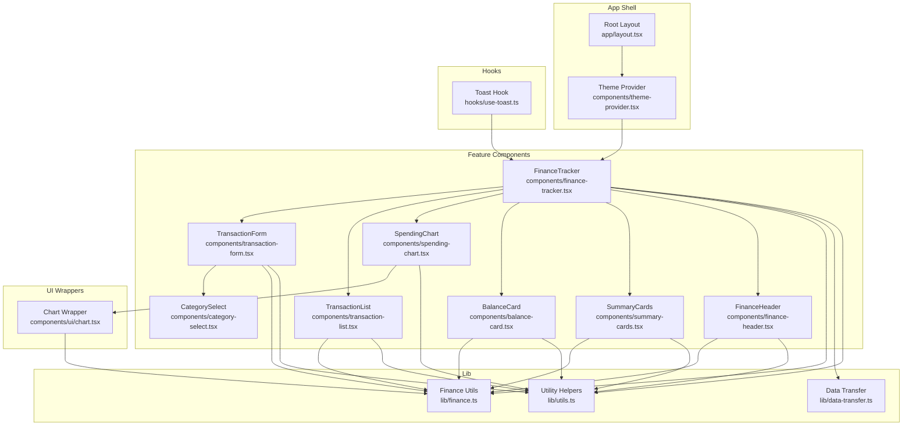

**Diagram sources**
- [layout.tsx:39-52](file://app/layout.tsx#L39-L52)
- [theme-provider.tsx:9-11](file://components/theme-provider.tsx#L9-L11)
- [finance-tracker.tsx:57-545](file://components/finance-tracker.tsx#L57-L545)
- [transaction-form.tsx:103-448](file://components/transaction-form.tsx#L103-L448)
- [transaction-list.tsx:14-101](file://components/transaction-list.tsx#L14-L101)
- [spending-chart.tsx:16-95](file://components/spending-chart.tsx#L16-L95)
- [balance-card.tsx:11-79](file://components/balance-card.tsx#L11-L79)
- [summary-cards.tsx:10-49](file://components/summary-cards.tsx#L10-L49)
- [finance-header.tsx:20-128](file://components/finance-header.tsx#L20-L128)
- [category-select.tsx:44-162](file://components/category-select.tsx#L44-L162)
- [finance.ts:1-124](file://lib/finance.ts#L1-L124)
- [data-transfer.ts:14-114](file://lib/data-transfer.ts#L14-L114)
- [chart.tsx:37-103](file://components/ui/chart.tsx#L37-L103)
- [utils.ts:4-6](file://lib/utils.ts#L4-L6)
- [use-toast.ts:171-189](file://hooks/use-toast.ts#L171-L189)

**Section sources**
- [layout.tsx:39-52](file://app/layout.tsx#L39-L52)
- [theme-provider.tsx:9-11](file://components/theme-provider.tsx#L9-L11)
- [finance-tracker.tsx:57-545](file://components/finance-tracker.tsx#L57-L545)

## Core Components
- Theme Provider: Encapsulates theme state and distributes it to the app via a thin wrapper around a third-party provider.
- FinanceTracker: Central orchestrator managing state, persistence, and UI composition.
- Finance Utilities: Provide Strategy-based formatting, currency conversion, and category management.
- Data Transfer: Implements Observer-like synchronization with localStorage and Command-like import/export handlers.
- UI Wrappers: Chart container and tooltip components demonstrate Adapter and Decorator usage.
- Hooks: Toast system demonstrates Observer and Singleton-like behavior.

**Section sources**
- [theme-provider.tsx:9-11](file://components/theme-provider.tsx#L9-L11)
- [finance-tracker.tsx:57-545](file://components/finance-tracker.tsx#L57-L545)
- [finance.ts:54-124](file://lib/finance.ts#L54-L124)
- [data-transfer.ts:14-114](file://lib/data-transfer.ts#L14-L114)
- [chart.tsx:37-103](file://components/ui/chart.tsx#L37-L103)
- [use-toast.ts:171-189](file://hooks/use-toast.ts#L171-L189)

## Architecture Overview
The system uses React hooks and local storage for state and persistence. Components communicate primarily through props and callbacks, with global providers distributing theme and chart configuration. Third-party libraries are integrated via adapters and wrappers.

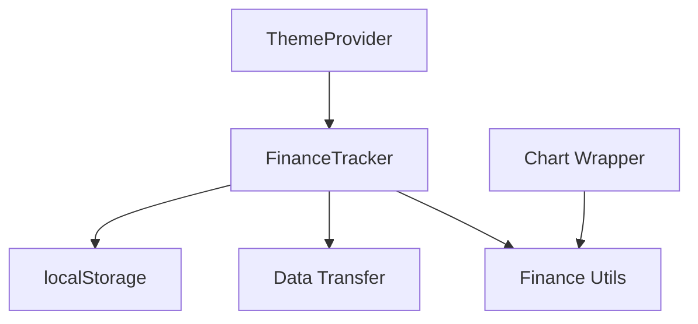

**Diagram sources**
- [finance-tracker.tsx:57-545](file://components/finance-tracker.tsx#L57-L545)
- [theme-provider.tsx:9-11](file://components/theme-provider.tsx#L9-L11)
- [finance.ts:54-124](file://lib/finance.ts#L54-L124)
- [data-transfer.ts:14-114](file://lib/data-transfer.ts#L14-L114)
- [chart.tsx:37-103](file://components/ui/chart.tsx#L37-L103)

## Detailed Component Analysis

### Provider Pattern: Theme Management and State Sharing
- Provider pattern encapsulates global state (theme) and exposes it to descendants via context.
- ThemeProvider wraps a third-party provider and forwards props, acting as a façade for theme distribution.
- FinanceTracker manages multiple pieces of global state (transactions, balances, settings) and passes them down to child components via props and callbacks.

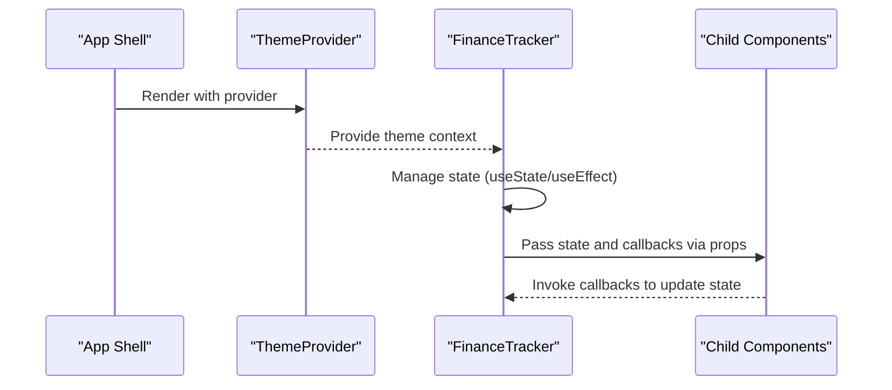

**Diagram sources**
- [theme-provider.tsx:9-11](file://components/theme-provider.tsx#L9-L11)
- [finance-tracker.tsx:57-545](file://components/finance-tracker.tsx#L57-L545)

**Section sources**
- [theme-provider.tsx:9-11](file://components/theme-provider.tsx#L9-L11)
- [finance-tracker.tsx:57-545](file://components/finance-tracker.tsx#L57-L545)

### Observer Pattern: localStorage Synchronization
- Observer-like behavior is implemented through React effects that read/write localStorage on state changes.
- Changes trigger updates across related components without explicit event listeners.
- Import/export handlers act as Command objects that encapsulate operations against localStorage.

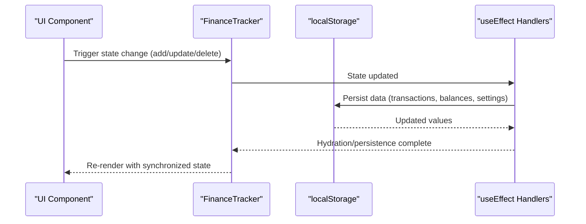

**Diagram sources**
- [finance-tracker.tsx:92-174](file://components/finance-tracker.tsx#L92-L174)
- [data-transfer.ts:14-114](file://lib/data-transfer.ts#L14-L114)

**Section sources**
- [finance-tracker.tsx:92-174](file://components/finance-tracker.tsx#L92-L174)
- [data-transfer.ts:14-114](file://lib/data-transfer.ts#L14-L114)

### Factory Pattern: Component Creation and Data Transformation
- CategorySelect dynamically maps category icon names to Lucide icons, acting as a factory for rendering icons.
- Finance utilities expose factories for formatting and conversion functions (e.g., formatUAH, convertFromUAH).
- TransactionForm constructs quick templates and maps labels to icons, functioning as a factory for UI elements.

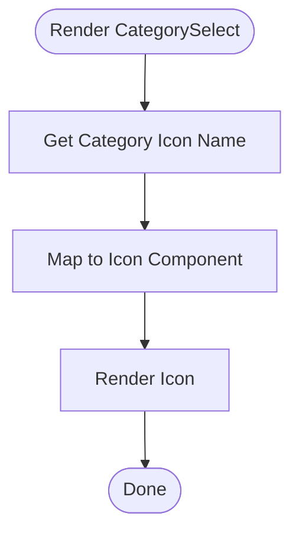

**Diagram sources**
- [category-select.tsx:23-35](file://components/category-select.tsx#L23-L35)

**Section sources**
- [category-select.tsx:23-35](file://components/category-select.tsx#L23-L35)
- [finance.ts:54-124](file://lib/finance.ts#L54-L124)
- [transaction-form.tsx:67-72](file://components/transaction-form.tsx#L67-L72)

### Strategy Pattern: Currency Conversion, Date Formatting, Category Management
- Currency conversion uses a strategy-like mapping of currency codes to rates and symbols.
- Date formatting employs a strategy of month name arrays and short-date formatting.
- Category management defines a fixed taxonomy with emoji and color metadata, enabling consistent presentation.

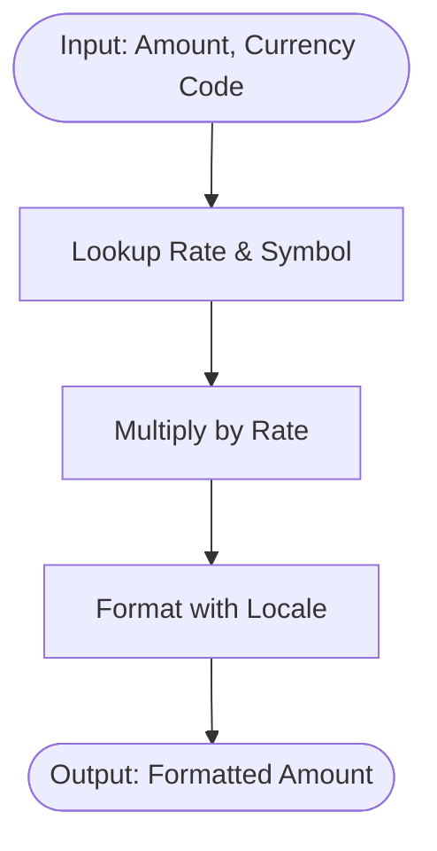

**Diagram sources**
- [finance.ts:93-124](file://lib/finance.ts#L93-L124)

**Section sources**
- [finance.ts:93-124](file://lib/finance.ts#L93-L124)
- [finance.ts:67-91](file://lib/finance.ts#L67-L91)
- [finance.ts:16-35](file://lib/finance.ts#L16-L35)

### Template Method Pattern: Transaction Processing Workflows
- FinanceTracker orchestrates a sequence of steps for adding/updating/deleting transactions, including parsing, validation, persistence, and balance reconciliation.
- The workflow is a template method: the steps are fixed, but the specific actions (e.g., balance adjustments) vary per operation.

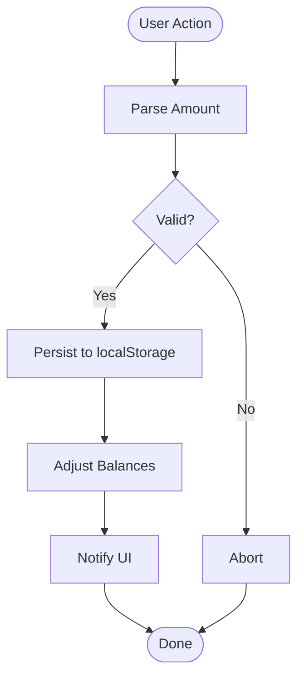

**Diagram sources**
- [finance-tracker.tsx:210-264](file://components/finance-tracker.tsx#L210-L264)
- [finance-tracker.tsx:266-307](file://components/finance-tracker.tsx#L266-L307)
- [finance-tracker.tsx:331-346](file://components/finance-tracker.tsx#L331-L346)

**Section sources**
- [finance-tracker.tsx:210-264](file://components/finance-tracker.tsx#L210-L264)
- [finance-tracker.tsx:266-307](file://components/finance-tracker.tsx#L266-L307)
- [finance-tracker.tsx:331-346](file://components/finance-tracker.tsx#L331-L346)

### Command Pattern: Form Submission Handlers
- TransactionForm encapsulates submission logic as commands: add, update, transfer, and smart paste.
- These commands are invoked via callbacks, isolating side effects and enabling reuse.

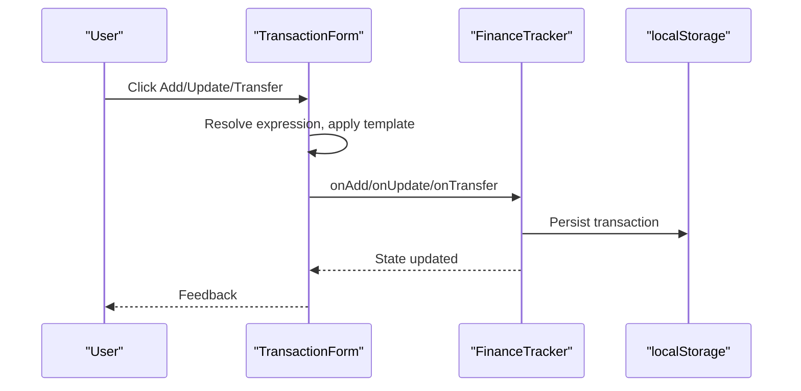

**Diagram sources**
- [transaction-form.tsx:169-175](file://components/transaction-form.tsx#L169-L175)
- [finance-tracker.tsx:210-264](file://components/finance-tracker.tsx#L210-L264)
- [finance-tracker.tsx:266-307](file://components/finance-tracker.tsx#L266-L307)
- [finance-tracker.tsx:348-373](file://components/finance-tracker.tsx#L348-L373)

**Section sources**
- [transaction-form.tsx:169-175](file://components/transaction-form.tsx#L169-L175)
- [finance-tracker.tsx:210-264](file://components/finance-tracker.tsx#L210-L264)
- [finance-tracker.tsx:266-307](file://components/finance-tracker.tsx#L266-L307)
- [finance-tracker.tsx:348-373](file://components/finance-tracker.tsx#L348-L373)

### Singleton Pattern: Utility Functions
- Utility helpers like cn (clsx/tailwind-merge) behave as singletons by exporting a single reusable function.
- Toast hook maintains a singleton-like state machine with a shared reducer and listeners.

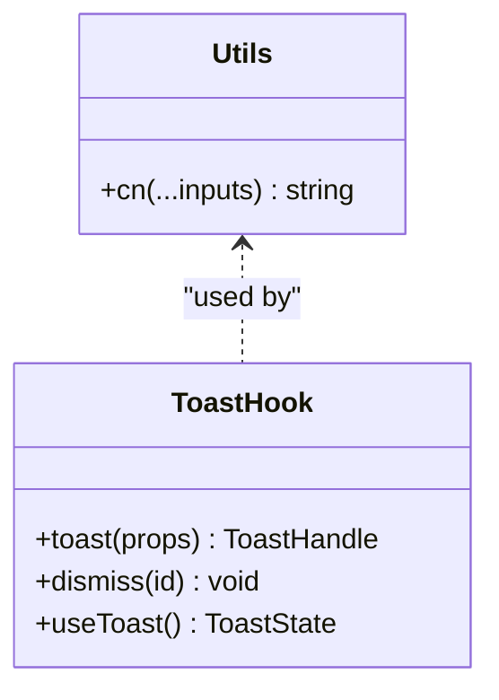

**Diagram sources**
- [utils.ts:4-6](file://lib/utils.ts#L4-L6)
- [use-toast.ts:171-189](file://hooks/use-toast.ts#L171-L189)

**Section sources**
- [utils.ts:4-6](file://lib/utils.ts#L4-L6)
- [use-toast.ts:171-189](file://hooks/use-toast.ts#L171-L189)

### Adapter Pattern: Third-Party Library Integration (Recharts)
- Chart wrapper adapts Recharts primitives to the app’s theming and configuration needs.
- ChartContainer provides a theme-aware container and injects CSS variables for colors.

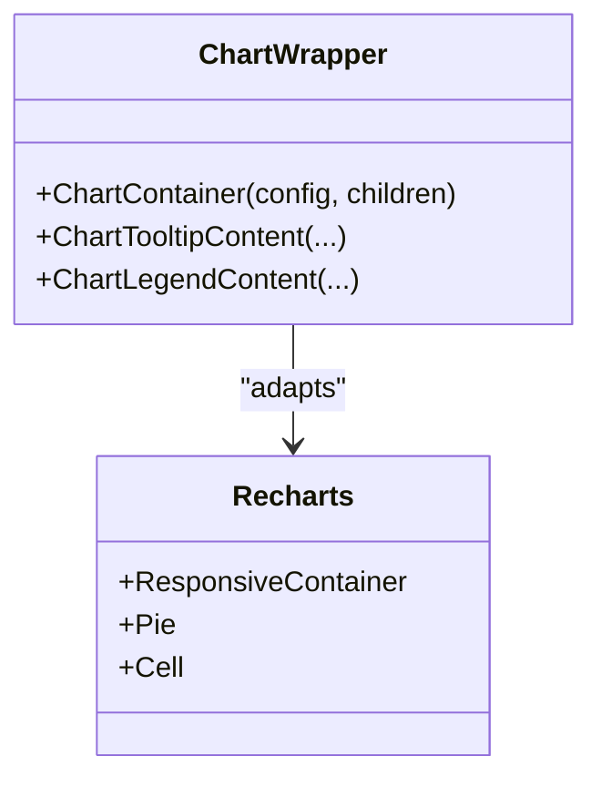

**Diagram sources**
- [chart.tsx:37-103](file://components/ui/chart.tsx#L37-L103)
- [spending-chart.tsx:16-95](file://components/spending-chart.tsx#L16-L95)

**Section sources**
- [chart.tsx:37-103](file://components/ui/chart.tsx#L37-L103)
- [spending-chart.tsx:16-95](file://components/spending-chart.tsx#L16-L95)

### Decorator Pattern: Component Enhancement
- ChartTooltipContent decorates Recharts tooltips with app-specific formatting and theming.
- CategorySelect enhances native interactions with animations and custom styling.

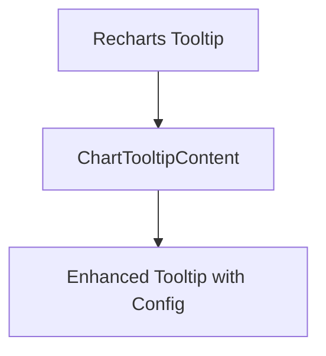

**Diagram sources**
- [chart.tsx:107-249](file://components/ui/chart.tsx#L107-L249)
- [category-select.tsx:96-159](file://components/category-select.tsx#L96-L159)

**Section sources**
- [chart.tsx:107-249](file://components/ui/chart.tsx#L107-L249)
- [category-select.tsx:96-159](file://components/category-select.tsx#L96-L159)

### Mediator Pattern: Component Communication
- FinanceTracker acts as a mediator among child components, coordinating state updates and persistence.
- TransactionForm communicates with FinanceTracker via callbacks, while FinanceTracker updates multiple UI areas.

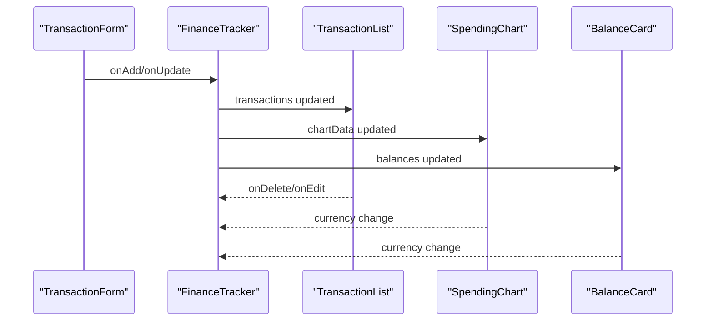

**Diagram sources**
- [finance-tracker.tsx:432-438](file://components/finance-tracker.tsx#L432-L438)
- [finance-tracker.tsx:487-507](file://components/finance-tracker.tsx#L487-L507)
- [transaction-list.tsx:14-101](file://components/transaction-list.tsx#L14-L101)
- [spending-chart.tsx:16-95](file://components/spending-chart.tsx#L16-L95)
- [balance-card.tsx:11-79](file://components/balance-card.tsx#L11-L79)

**Section sources**
- [finance-tracker.tsx:432-438](file://components/finance-tracker.tsx#L432-L438)
- [finance-tracker.tsx:487-507](file://components/finance-tracker.tsx#L487-L507)
- [transaction-list.tsx:14-101](file://components/transaction-list.tsx#L14-L101)
- [spending-chart.tsx:16-95](file://components/spending-chart.tsx#L16-L95)
- [balance-card.tsx:11-79](file://components/balance-card.tsx#L11-L79)

## Dependency Analysis
The following diagram highlights key dependencies and cross-cutting concerns:

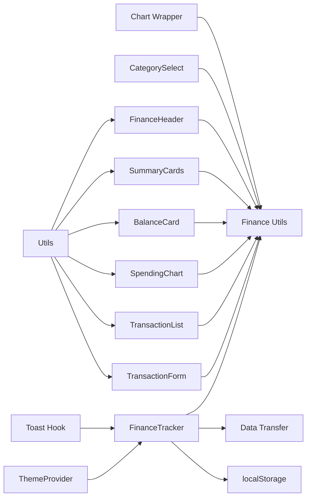

**Diagram sources**
- [finance-tracker.tsx:57-545](file://components/finance-tracker.tsx#L57-L545)
- [finance.ts:54-124](file://lib/finance.ts#L54-L124)
- [data-transfer.ts:14-114](file://lib/data-transfer.ts#L14-L114)
- [transaction-form.tsx:103-448](file://components/transaction-form.tsx#L103-L448)
- [transaction-list.tsx:14-101](file://components/transaction-list.tsx#L14-L101)
- [spending-chart.tsx:16-95](file://components/spending-chart.tsx#L16-L95)
- [balance-card.tsx:11-79](file://components/balance-card.tsx#L11-L79)
- [summary-cards.tsx:10-49](file://components/summary-cards.tsx#L10-L49)
- [finance-header.tsx:20-128](file://components/finance-header.tsx#L20-L128)
- [category-select.tsx:44-162](file://components/category-select.tsx#L44-L162)
- [chart.tsx:37-103](file://components/ui/chart.tsx#L37-L103)
- [utils.ts:4-6](file://lib/utils.ts#L4-L6)
- [use-toast.ts:171-189](file://hooks/use-toast.ts#L171-L189)

**Section sources**
- [finance-tracker.tsx:57-545](file://components/finance-tracker.tsx#L57-L545)
- [finance.ts:54-124](file://lib/finance.ts#L54-L124)
- [data-transfer.ts:14-114](file://lib/data-transfer.ts#L14-L114)
- [chart.tsx:37-103](file://components/ui/chart.tsx#L37-L103)

## Performance Considerations
- Memoization: useMemo is used for derived values (e.g., month keys, period labels) to avoid unnecessary recalculations.
- Persistence throttling: Effects persist to localStorage after state changes; batching occurs naturally via React state updates.
- Rendering: Components are kept small and focused; heavy computations (e.g., chart data) are computed once and reused.
- Observability: Toast hook limits concurrent notifications and defers removal to reduce re-renders.

[No sources needed since this section provides general guidance]

## Troubleshooting Guide
- State not persisting: Verify localStorage availability and that effects run after hydration.
- Import failures: Confirm backup format version and data integrity; errors are surfaced via callback.
- Currency mismatch: Ensure active currency is persisted and passed to formatting utilities.
- Chart theming: Confirm ChartContainer receives a valid config and that CSS variables are injected.

**Section sources**
- [finance-tracker.tsx:92-174](file://components/finance-tracker.tsx#L92-L174)
- [data-transfer.ts:56-114](file://lib/data-transfer.ts#L56-L114)
- [finance.ts:93-124](file://lib/finance.ts#L93-L124)
- [chart.tsx:37-103](file://components/ui/chart.tsx#L37-L103)

## Conclusion
finTracker leverages a combination of Provider, Observer, Factory, Strategy, Template Method, Command, Singleton, Adapter, Decorator, and Mediator patterns to create a modular, maintainable, and extensible financial tracking application. These patterns collectively improve code organization, reduce coupling, and enable efficient state synchronization and UI composition.