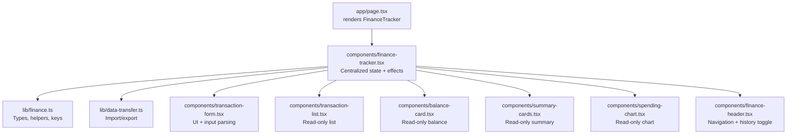
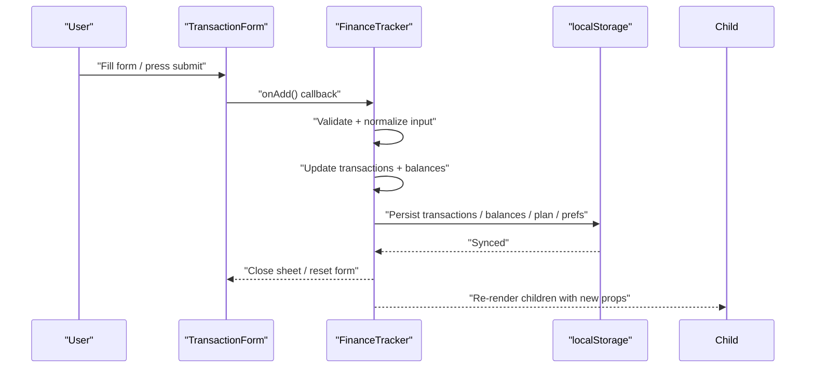
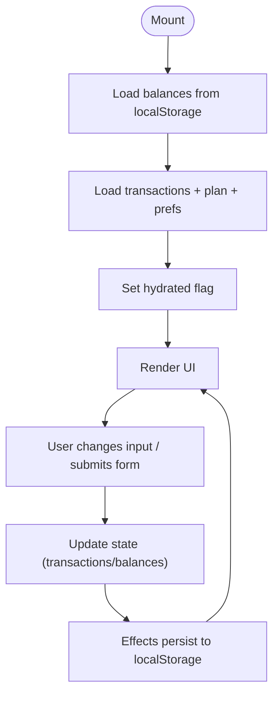
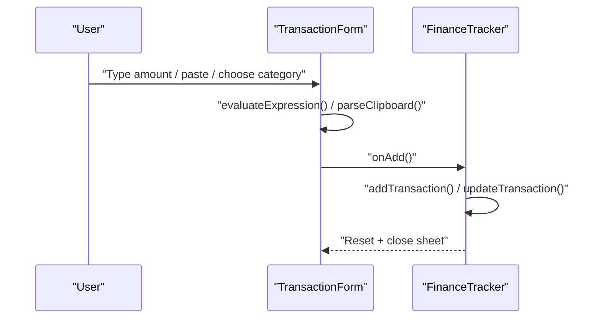
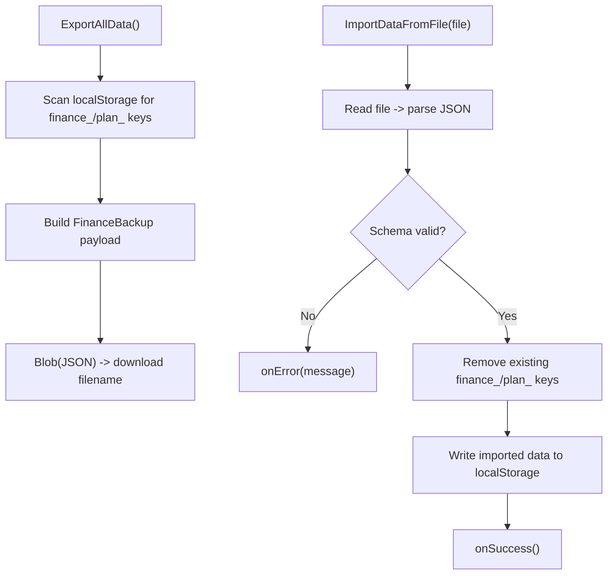
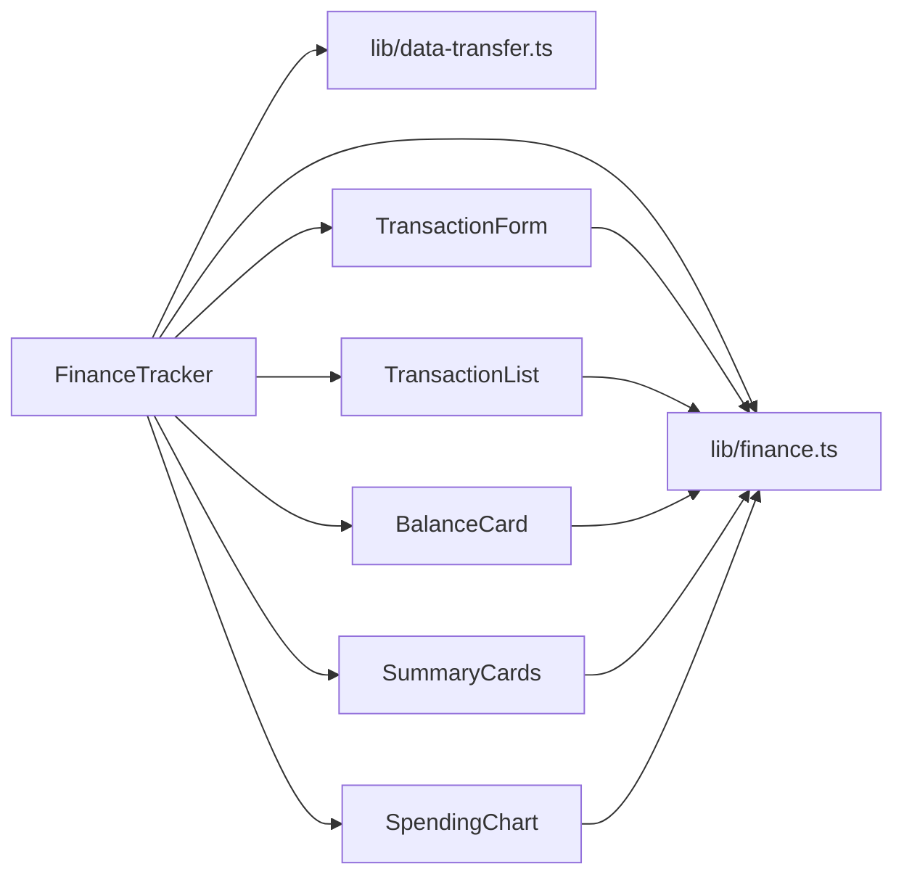

# State Management

<cite>
**Referenced Files in This Document**
- [page.tsx](file://app/page.tsx)
- [finance-tracker.tsx](file://components/finance-tracker.tsx)
- [finance.ts](file://lib/finance.ts)
- [data-transfer.ts](file://lib/data-transfer.ts)
- [transaction-form.tsx](file://components/transaction-form.tsx)
- [transaction-list.tsx](file://components/transaction-list.tsx)
- [balance-card.tsx](file://components/balance-card.tsx)
- [summary-cards.tsx](file://components/summary-cards.tsx)
- [spending-chart.tsx](file://components/spending-chart.tsx)
- [finance-header.tsx](file://components/finance-header.tsx)
- [use-toast.ts](file://hooks/use-toast.ts)
</cite>

## Table of Contents
1. [Introduction](#introduction)
2. [Project Structure](#project-structure)
3. [Core Components](#core-components)
4. [Architecture Overview](#architecture-overview)
5. [Detailed Component Analysis](#detailed-component-analysis)
6. [Dependency Analysis](#dependency-analysis)
7. [Performance Considerations](#performance-considerations)
8. [Troubleshooting Guide](#troubleshooting-guide)
9. [Conclusion](#conclusion)

## Introduction
This document explains finTracker’s state management architecture centered on a single FinanceTracker component that uses React hooks for centralized state. It covers:
- Local state for transactions, balances, user preferences, and UI state
- Automatic localStorage synchronization and hydration
- State flow from user interactions to persistence
- Real-time synchronization across browser tabs and device refreshes
- Normalization, memoization, and performance optimizations
- Migration patterns and error handling strategies

## Project Structure
The application bootstraps from a Next.js page that renders the FinanceTracker component. FinanceTracker orchestrates state and passes derived data and callbacks to child components.

**Diagram sources**
- [page.tsx:1-6](file://app/page.tsx#L1-L6)
- [finance-tracker.tsx:57-545](file://components/finance-tracker.tsx#L57-L545)
- [finance.ts:1-124](file://lib/finance.ts#L1-L124)
- [data-transfer.ts:1-115](file://lib/data-transfer.ts#L1-L115)
- [transaction-form.tsx:103-123](file://components/transaction-form.tsx#L103-L123)
- [transaction-list.tsx:14-101](file://components/transaction-list.tsx#L14-L101)
- [balance-card.tsx:11-79](file://components/balance-card.tsx#L11-L79)
- [summary-cards.tsx:10-49](file://components/summary-cards.tsx#L10-L49)
- [spending-chart.tsx:16-95](file://components/spending-chart.tsx#L16-L95)
- [finance-header.tsx:20-128](file://components/finance-header.tsx#L20-L128)

**Section sources**
- [page.tsx:1-6](file://app/page.tsx#L1-L6)
- [finance-tracker.tsx:57-545](file://components/finance-tracker.tsx#L57-L545)

## Core Components
- Centralized state container: FinanceTracker manages:
  - Transactions per month, plan per month, balances, UI flags, and user preferences
  - Derived computations (totals, chart data, forecast)
  - Persistence and hydration via localStorage
- Child components:
  - TransactionForm: edits and submits transactions
  - TransactionList: displays transactions
  - BalanceCard, SummaryCards, SpendingChart: presentational reads
  - FinanceHeader: navigation and history toggle
- Shared types and helpers: Transaction, categories, formatting, and key generation live in lib/finance.ts
- Import/export: data-transfer.ts defines backup schema and operations

**Section sources**
- [finance-tracker.tsx:57-545](file://components/finance-tracker.tsx#L57-L545)
- [finance.ts:16-52](file://lib/finance.ts#L16-L52)
- [data-transfer.ts:3-12](file://lib/data-transfer.ts#L3-L12)

## Architecture Overview
The state lifecycle follows a predictable flow:
- Hydration: On mount, FinanceTracker loads persisted data from localStorage keyed by month and plan
- User interactions: TransactionForm triggers add/update/delete actions that mutate state and balances
- Persistence: Effects persist state changes immediately after hydration
- Presentation: Child components receive derived props and callbacks

**Diagram sources**
- [finance-tracker.tsx:210-264](file://components/finance-tracker.tsx#L210-L264)
- [finance-tracker.tsx:146-164](file://components/finance-tracker.tsx#L146-L164)
- [transaction-form.tsx:169-175](file://components/transaction-form.tsx#L169-L175)

## Detailed Component Analysis

### FinanceTracker: Centralized State and Effects
- State primitives:
  - Transactions array per active month
  - Plan per active month
  - Balances: card, cash, savings
  - UI flags: editingId, sheetOpen, showHistory, settingsOpen, templatesOpen
  - Form inputs: isIncome, amount, category, destination, name, isRecurring
  - Preferences: recurringTemplates, quickTemplates, currency
- Hydration and persistence:
  - Hydration: Loads balances, transactions, plan, recurring templates, quick templates, and currency on mount
  - Persistence: Separate effects write to localStorage on state changes
- Derived data:
  - Totals, chart data, forecast value computed from transactions
- Actions:
  - Add/update/delete transactions
  - Start/cancel edit
  - Transfer between card and cash
  - Go to month navigation
- Memoization:
  - monthKey, planKey, periodLabel computed via useMemo
  - Forecast computed via useMemo
- UI state:
  - FAB opens bottom sheet; sheetOpen toggles modal visibility

**Diagram sources**
- [finance-tracker.tsx:91-144](file://components/finance-tracker.tsx#L91-L144)
- [finance-tracker.tsx:146-174](file://components/finance-tracker.tsx#L146-L174)
- [finance-tracker.tsx:192-200](file://components/finance-tracker.tsx#L192-L200)

**Section sources**
- [finance-tracker.tsx:57-545](file://components/finance-tracker.tsx#L57-L545)
- [finance-tracker.tsx:85-87](file://components/finance-tracker.tsx#L85-L87)
- [finance-tracker.tsx:192-200](file://components/finance-tracker.tsx#L192-L200)

### TransactionForm: Input Parsing and Submission
- Parses expressions and clipboard amounts
- Applies smart paste heuristics
- Delegates submission to FinanceTracker via onAdd
- Manages focus and preview rendering

**Diagram sources**
- [transaction-form.tsx:25-58](file://components/transaction-form.tsx#L25-L58)
- [transaction-form.tsx:169-175](file://components/transaction-form.tsx#L169-L175)
- [finance-tracker.tsx:210-307](file://components/finance-tracker.tsx#L210-L307)

**Section sources**
- [transaction-form.tsx:103-123](file://components/transaction-form.tsx#L103-L123)
- [transaction-form.tsx:146-181](file://components/transaction-form.tsx#L146-L181)
- [finance-tracker.tsx:210-307](file://components/finance-tracker.tsx#L210-L307)

### TransactionList, BalanceCard, SummaryCards, SpendingChart: Read-Only Consumers
- Receive derived props and callbacks
- No internal state mutation; rely on parent to manage updates

**Section sources**
- [transaction-list.tsx:14-101](file://components/transaction-list.tsx#L14-L101)
- [balance-card.tsx:11-79](file://components/balance-card.tsx#L11-L79)
- [summary-cards.tsx:10-49](file://components/summary-cards.tsx#L10-L49)
- [spending-chart.tsx:16-95](file://components/spending-chart.tsx#L16-L95)

### FinanceHeader: Navigation and History Toggle
- Controls month navigation and history panel visibility
- Uses local state for picker UI

**Section sources**
- [finance-header.tsx:20-128](file://components/finance-header.tsx#L20-L128)

### Data Transfer: Import/Export and Backup Schema
- Export: Scans localStorage for “finance_” and “plan_” keys and writes a structured backup
- Import: Validates schema, clears existing keys, rehydrates data, and signals success/failure

**Diagram sources**
- [data-transfer.ts:14-54](file://lib/data-transfer.ts#L14-L54)
- [data-transfer.ts:56-114](file://lib/data-transfer.ts#L56-L114)

**Section sources**
- [data-transfer.ts:3-12](file://lib/data-transfer.ts#L3-L12)
- [data-transfer.ts:14-54](file://lib/data-transfer.ts#L14-L54)
- [data-transfer.ts:56-114](file://lib/data-transfer.ts#L56-L114)

## Dependency Analysis
- FinanceTracker depends on:
  - lib/finance.ts for types, constants, and key generation
  - lib/data-transfer.ts for backup/import/export
  - Child components for rendering and user input
- Child components depend on:
  - lib/finance.ts for formatting and category metadata
  - FinanceTracker for callbacks and derived props

**Diagram sources**
- [finance-tracker.tsx:6-23](file://components/finance-tracker.tsx#L6-L23)
- [finance.ts:16-52](file://lib/finance.ts#L16-L52)
- [data-transfer.ts:1-115](file://lib/data-transfer.ts#L1-L115)
- [transaction-form.tsx:22-101](file://components/transaction-form.tsx#L22-L101)
- [transaction-list.tsx:3-12](file://components/transaction-list.tsx#L3-L12)
- [balance-card.tsx:1-9](file://components/balance-card.tsx#L1-L9)
- [summary-cards.tsx:1-8](file://components/summary-cards.tsx#L1-L8)
- [spending-chart.tsx:1-6](file://components/spending-chart.tsx#L1-L6)

**Section sources**
- [finance-tracker.tsx:6-23](file://components/finance-tracker.tsx#L6-L23)
- [finance.ts:16-52](file://lib/finance.ts#L16-L52)
- [data-transfer.ts:1-115](file://lib/data-transfer.ts#L1-L115)

## Performance Considerations
- Memoization:
  - useMemo for monthKey, planKey, periodLabel, and forecastValue to avoid recomputation
- Normalization:
  - Transactions normalized as flat arrays keyed by month; balances normalized as a single object
- Rendering:
  - Child components are pure presentational and rely on prop changes; avoid unnecessary re-renders by passing stable references where appropriate
- Storage:
  - Persist only when hydrated to avoid writing before data is ready
- Computation:
  - Totals and chart data derived from transactions; computed once per render cycle and reused across components
- UI responsiveness:
  - Focus management and immediate feedback on input changes

**Section sources**
- [finance-tracker.tsx:85-87](file://components/finance-tracker.tsx#L85-L87)
- [finance-tracker.tsx:192-200](file://components/finance-tracker.tsx#L192-L200)
- [finance-tracker.tsx:146-174](file://components/finance-tracker.tsx#L146-L174)

## Troubleshooting Guide
- localStorage failures:
  - Import/export wrap parsing and I/O in try/catch; errors are surfaced via callbacks
  - HistoryView and SettingsModal gracefully skip malformed entries and clear invalid keys
- Data corruption recovery:
  - Malformed entries are skipped during import and history scans
  - Defaults applied when persisted values are missing or invalid (e.g., currency fallback)
- State validation:
  - Amount parsing validates numeric input and positivity
  - Plan and balances validated before updates
- Real-time synchronization:
  - Current implementation relies on localStorage writes; no explicit cross-tab event listener is implemented in the provided code
- Observability:
  - use-toast demonstrates an observer-like pattern with listeners; while not used for state sync, it illustrates a reusable observer mechanism

**Section sources**
- [data-transfer.ts:64-114](file://lib/data-transfer.ts#L64-L114)
- [finance-tracker.tsx:873-891](file://components/finance-tracker.tsx#L873-L891)
- [finance-tracker.tsx:118-124](file://components/finance-tracker.tsx#L118-L124)
- [transaction-form.tsx:25-35](file://components/transaction-form.tsx#L25-L35)
- [use-toast.ts:129-191](file://hooks/use-toast.ts#L129-L191)

## Conclusion
finTracker employs a clean, centralized state model within FinanceTracker, leveraging React hooks for local state, memoization for performance, and localStorage for persistence and hydration. The system:
- Automatically persists state after hydration
- Provides robust import/export with validation
- Derives UI from normalized, computed state
- Offers room for enhancement around cross-tab synchronization and schema migrations