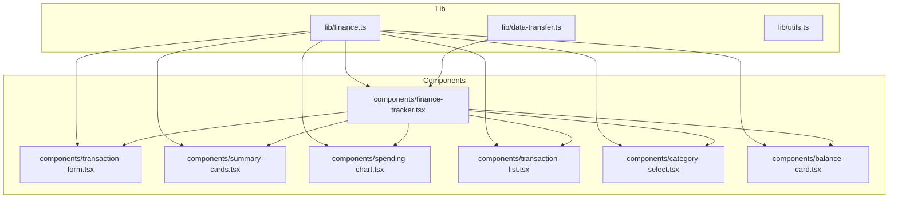
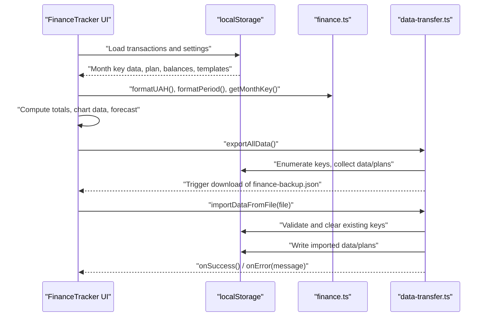
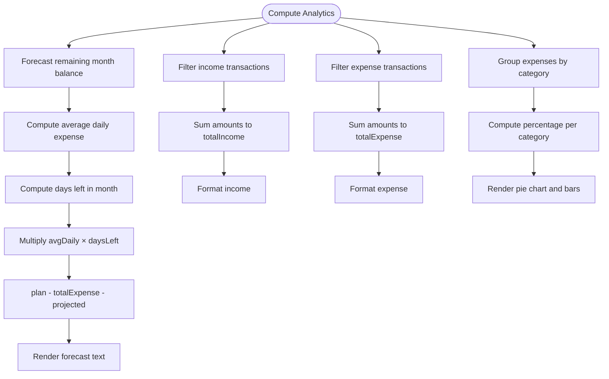
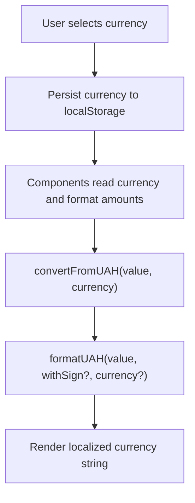
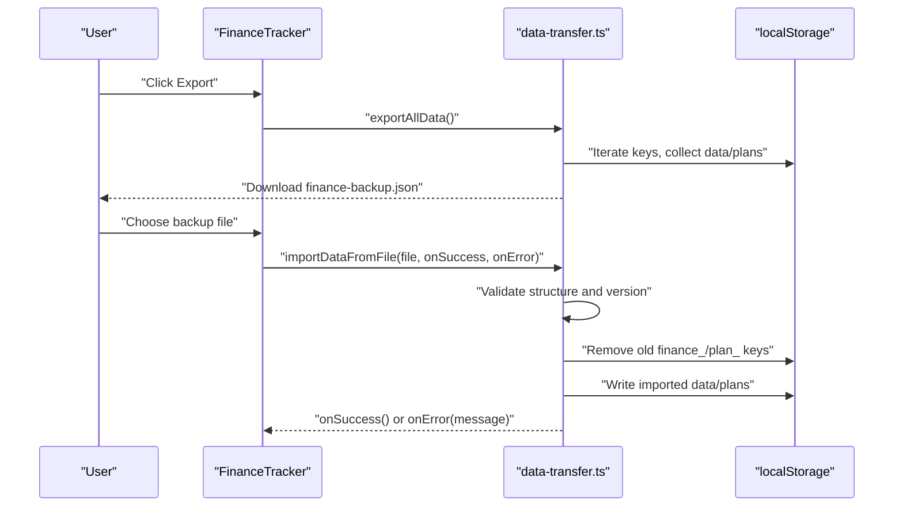
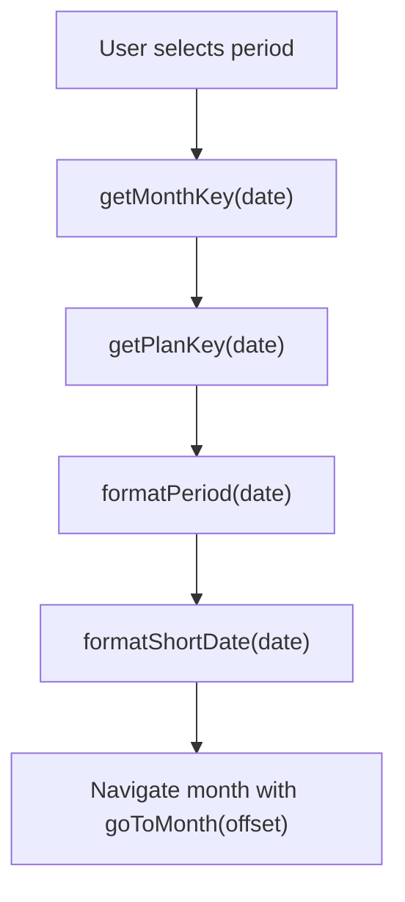
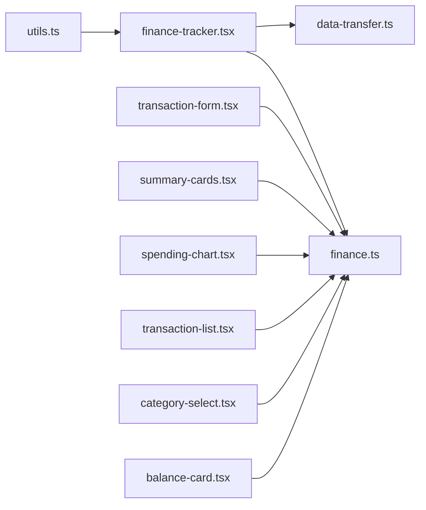

# Business Logic and Data Models

<cite>
**Referenced Files in This Document**
- [finance.ts](file://lib/finance.ts)
- [data-transfer.ts](file://lib/data-transfer.ts)
- [finance-tracker.tsx](file://components/finance-tracker.tsx)
- [transaction-form.tsx](file://components/transaction-form.tsx)
- [summary-cards.tsx](file://components/summary-cards.tsx)
- [spending-chart.tsx](file://components/spending-chart.tsx)
- [transaction-list.tsx](file://components/transaction-list.tsx)
- [category-select.tsx](file://components/category-select.tsx)
- [balance-card.tsx](file://components/balance-card.tsx)
- [utils.ts](file://lib/utils.ts)
- [package.json](file://package.json)
</cite>

## Table of Contents
1. [Introduction](#introduction)
2. [Project Structure](#project-structure)
3. [Core Components](#core-components)
4. [Architecture Overview](#architecture-overview)
5. [Detailed Component Analysis](#detailed-component-analysis)
6. [Dependency Analysis](#dependency-analysis)
7. [Performance Considerations](#performance-considerations)
8. [Troubleshooting Guide](#troubleshooting-guide)
9. [Conclusion](#conclusion)

## Introduction
This document explains finTracker’s business logic and data models with a focus on financial calculations, currency conversion and formatting, analytics, and data transfer for backup/export/import. It documents the Transaction model, Category structure, and backup format specification, along with validation rules, business constraints, and data integrity measures. It also covers date handling and formatting utilities for month navigation and historical data management, and provides guidance on performance and optimization for large datasets.

## Project Structure
The project is a Next.js application with a clear separation between shared business logic (in lib/) and UI components (in components/). The core financial domain is encapsulated in typed utilities and constants, while UI components orchestrate user interactions and persist state to localStorage.



**Diagram sources**
- [finance.ts:1-122](file://lib/finance.ts#L1-L122)
- [data-transfer.ts:1-115](file://lib/data-transfer.ts#L1-L115)
- [finance-tracker.tsx:1-461](file://components/finance-tracker.tsx#L1-L461)
- [transaction-form.tsx:1-401](file://components/transaction-form.tsx#L1-L401)
- [summary-cards.tsx:1-50](file://components/summary-cards.tsx#L1-L50)
- [spending-chart.tsx:1-96](file://components/spending-chart.tsx#L1-L96)
- [transaction-list.tsx:1-92](file://components/transaction-list.tsx#L1-L92)
- [category-select.tsx:1-163](file://components/category-select.tsx#L1-L163)
- [balance-card.tsx:1-80](file://components/balance-card.tsx#L1-L80)

**Section sources**
- [finance.ts:1-122](file://lib/finance.ts#L1-L122)
- [data-transfer.ts:1-115](file://lib/data-transfer.ts#L1-L115)
- [finance-tracker.tsx:1-461](file://components/finance-tracker.tsx#L1-L461)

## Core Components
- Financial constants and types:
  - CategoryInfo with name, emoji, icon name, and color
  - Predefined CATEGORIES for income and expense
  - Transaction type alias and CurrencyCode union
  - Transaction interface with id, amount, category, type, date, optional name, optional recurringId
- Formatting and conversion utilities:
  - getCategoryEmoji(type, name)
  - getMonthKey(date), getPlanKey(date)
  - formatPeriod(date), formatShortDate(date)
  - convertFromUAH(value, currency), formatUAH(value, withSign?, currency?)
- Data transfer:
  - FinanceBackup shape with version, exportedAt, data, plans
  - exportAllData(): exports localStorage to a JSON file
  - importDataFromFile(file, onSuccess, onError): validates and imports backup

**Section sources**
- [finance.ts:1-122](file://lib/finance.ts#L1-L122)
- [data-transfer.ts:1-115](file://lib/data-transfer.ts#L1-L115)

## Architecture Overview
The application follows a React-centric architecture with localStorage as the persistence layer. The FinanceTracker orchestrates state, persists to localStorage, and computes derived analytics. Shared financial utilities are centralized in lib/finance.ts. Backup/export/import is handled by lib/data-transfer.ts.



**Diagram sources**
- [finance-tracker.tsx:107-167](file://components/finance-tracker.tsx#L107-L167)
- [finance.ts:57-122](file://lib/finance.ts#L57-L122)
- [data-transfer.ts:14-115](file://lib/data-transfer.ts#L14-L115)

## Detailed Component Analysis

### Financial Calculations and Analytics
- Totals computation:
  - Total income and total expense computed by filtering and reducing transactions
- Spending breakdown:
  - Chart data built by grouping expense transactions by category and summing amounts
  - Percentages calculated against total expense
- Forecast calculation:
  - Uses current day-of-month vs days in month to estimate remaining daily average expense
  - Forecast value derived from plan minus cumulative expense minus projected remaining expenses
- Formatting:
  - Consistent currency formatting via formatUAH with locale-aware decimal handling and sign rendering



**Diagram sources**
- [finance-tracker.tsx:174-198](file://components/finance-tracker.tsx#L174-L198)
- [spending-chart.tsx:16-95](file://components/spending-chart.tsx#L16-L95)
- [finance.ts:107-122](file://lib/finance.ts#L107-L122)

**Section sources**
- [finance-tracker.tsx:174-198](file://components/finance-tracker.tsx#L174-L198)
- [spending-chart.tsx:16-95](file://components/spending-chart.tsx#L16-L95)
- [finance.ts:107-122](file://lib/finance.ts#L107-L122)

### Currency Conversion and Formatting
- Base currency is UAH; conversion rates are provided for UAH, USD, EUR
- convertFromUAH(value, currency) applies rate to produce target currency value
- formatUAH(value, withSign?, currency?) formats according to Ukrainian locale with appropriate symbol and sign
- Currency selection is persisted and applied across components



**Diagram sources**
- [finance.ts:97-122](file://lib/finance.ts#L97-L122)
- [balance-card.tsx:11-79](file://components/balance-card.tsx#L11-L79)
- [finance-tracker.tsx:117-167](file://components/finance-tracker.tsx#L117-L167)

**Section sources**
- [finance.ts:97-122](file://lib/finance.ts#L97-L122)
- [balance-card.tsx:11-79](file://components/balance-card.tsx#L11-L79)

### Category Management System
- Categories are defined centrally with name, emoji, icon name, and color
- Two category sets: income and expense
- CategorySelect component renders icons and colors, supports keyboard and click interactions
- Emoji resolution uses getCategoryEmoji(type, name) for display consistency

```mermaid
classDiagram
class CategoryInfo {
+string name
+string emoji
+string iconName
+string color
}
class CategoryIconName {
<<enumeration>>
"cart"
"utensils"
"film"
"home"
"gift"
"gamepad"
"user"
"briefcase"
"star"
"laptop"
"pin"
}
class CATEGORIES {
+CategoryInfo[] expense
+CategoryInfo[] income
}
class CategorySelect {
+props categories
+props value
+onChange(next)
+onKeepInputFocus()
}
CategorySelect --> CategoryInfo : "renders"
CATEGORIES --> CategoryInfo : "contains"
```

**Diagram sources**
- [finance.ts:1-37](file://lib/finance.ts#L1-L37)
- [category-select.tsx:23-35](file://components/category-select.tsx#L23-L35)

**Section sources**
- [finance.ts:1-37](file://lib/finance.ts#L1-L37)
- [category-select.tsx:44-163](file://components/category-select.tsx#L44-L163)

### Data Transfer System (Backup, Export, Import)
- Backup format (FinanceBackup):
  - version: integer (1)
  - exportedAt: ISO string timestamp
  - data: map of monthKey to Transaction[]
  - plans: map of planKey to number
- Export:
  - Iterates localStorage, filters keys by prefix, parses and validates arrays
  - Creates backup object and downloads a JSON file
- Import:
  - Validates structure and version
  - Clears existing finance_/plan_ keys
  - Writes imported data and plans back to localStorage
  - Invokes success/error callbacks



**Diagram sources**
- [data-transfer.ts:3-115](file://lib/data-transfer.ts#L3-L115)
- [finance-tracker.tsx:519-525](file://components/finance-tracker.tsx#L519-L525)

**Section sources**
- [data-transfer.ts:3-115](file://lib/data-transfer.ts#L3-L115)
- [finance-tracker.tsx:519-525](file://components/finance-tracker.tsx#L519-L525)

### Date Handling and Formatting Utilities
- Month keys: "finance_{year}_{month}"
- Plan keys: "plan_{year}_{month}"
- Period formatting: human-readable month and year
- Short date formatting: dd/mm/yyyy
- Navigation: goToDate(offset) adjusts the first day of the month and navigates forward/backward



**Diagram sources**
- [finance.ts:57-89](file://lib/finance.ts#L57-L89)
- [finance-tracker.tsx:294-299](file://components/finance-tracker.tsx#L294-L299)

**Section sources**
- [finance.ts:57-89](file://lib/finance.ts#L57-L89)
- [finance-tracker.tsx:294-299](file://components/finance-tracker.tsx#L294-L299)

### Data Models
- Transaction interface:
  - id: number
  - amount: number
  - category: string
  - type: "income" | "expense"
  - date: string (short date format)
  - name?: string
  - recurringId?: string
- CategoryInfo:
  - name: string
  - emoji: string
  - iconName: CategoryIconName
  - color: string
- FinanceBackup:
  - version: 1
  - exportedAt: string (ISO timestamp)
  - data: { [monthKey: string]: Transaction[] }
  - plans: { [planKey: string]: number }

**Section sources**
- [finance.ts:42-50](file://lib/finance.ts#L42-L50)
- [finance.ts:1-37](file://lib/finance.ts#L1-L37)
- [data-transfer.ts:3-12](file://lib/data-transfer.ts#L3-L12)

### Validation Rules and Business Constraints
- Amount parsing:
  - parseAmount(raw) normalizes comma to dot, parses float, rejects NaN or non-finite values
- Expression evaluation:
  - evaluateExpression(raw) allows arithmetic expressions with digits and basic operators
- Clipboard parsing:
  - parseClipboard(text) extracts amount and infers category from merchant keywords
- Transaction creation/update:
  - Rejects empty or invalid amounts
  - Ensures positive numeric amounts
  - Maintains recurring templates keyed by normalized composite
- Import validation:
  - Requires version 1, object shape, and array of transaction-like objects
  - Clears existing keys before writing imported data
- UI constraints:
  - Currency switching updates persisted preference
  - Template amounts stored in base UAH, rendered in selected currency

**Section sources**
- [finance-tracker.tsx:44-48](file://components/finance-tracker.tsx#L44-L48)
- [transaction-form.tsx:21-31](file://components/transaction-form.tsx#L21-L31)
- [transaction-form.tsx:42-54](file://components/transaction-form.tsx#L42-L54)
- [data-transfer.ts:70-104](file://lib/data-transfer.ts#L70-L104)

### Error Handling Strategies
- Import errors:
  - Catches parsing and validation failures, invokes onError with message
- Export robustness:
  - Skips malformed localStorage entries
- UI feedback:
  - Alerts for import failures
  - Graceful fallbacks for missing categories and empty states

**Section sources**
- [data-transfer.ts:107-114](file://lib/data-transfer.ts#L107-L114)
- [finance-tracker.tsx:457-458](file://components/finance-tracker.tsx#L457-L458)

## Dependency Analysis
- Shared dependencies:
  - recharts for visualization
  - lucide-react for icons
  - framer-motion for animations
  - clsx and tailwind-merge for class merging
- Internal dependencies:
  - Components depend on lib/finance.ts for types, formatting, and keys
  - FinanceTracker depends on data-transfer.ts for backup operations



**Diagram sources**
- [finance-tracker.tsx:1-22](file://components/finance-tracker.tsx#L1-L22)
- [finance.ts:1-15](file://lib/finance.ts#L1-L15)
- [data-transfer.ts:1-1](file://lib/data-transfer.ts#L1-L1)
- [utils.ts:1-7](file://lib/utils.ts#L1-L7)

**Section sources**
- [package.json:11-61](file://package.json#L11-L61)
- [finance-tracker.tsx:1-22](file://components/finance-tracker.tsx#L1-L22)

## Performance Considerations
- Local storage usage:
  - All state is persisted to localStorage; consider batching writes and avoiding frequent re-renders
  - Memoize derived computations (totals, chart data, forecast) using useMemo
- Rendering optimizations:
  - Use shallow comparisons and stable references for lists to minimize re-renders
  - Virtualize long lists if needed
- Data volume:
  - Large histories increase localStorage footprint; consider pruning old months or paginating
- Formatting:
  - Locale formatting is efficient; avoid repeated conversions by caching formatted strings when appropriate
- Network-free operation:
  - Backup/export/import runs locally; ensure UI remains responsive during large exports

[No sources needed since this section provides general guidance]

## Troubleshooting Guide
- Import fails:
  - Verify backup file is version 1 and contains valid data/plans structure
  - Ensure file is a .json with application/json MIME type
- Amount parsing issues:
  - Use decimal input mode and avoid unsupported characters
  - Expressions are evaluated strictly; ensure parentheses and operators are balanced
- Missing categories:
  - If a transaction references a category not present in CATEGORIES, emoji defaults to a pin
- Currency mismatch:
  - Template amounts are stored in base UAH; ensure selected currency is set consistently

**Section sources**
- [data-transfer.ts:70-104](file://lib/data-transfer.ts#L70-L104)
- [finance.ts:52-55](file://lib/finance.ts#L52-L55)
- [finance-tracker.tsx:117-122](file://components/finance-tracker.tsx#L117-L122)

## Conclusion
finTracker’s business logic centers on a clean separation of concerns: a compact financial model in lib/finance.ts, robust UI orchestration in components/finance-tracker.tsx, and a straightforward backup/export/import pipeline in lib/data-transfer.ts. The system enforces strong validation, maintains data integrity, and provides real-time financial insights through totals, charts, and forecasts. For large datasets, consider optimizing localStorage usage and rendering performance as outlined above.