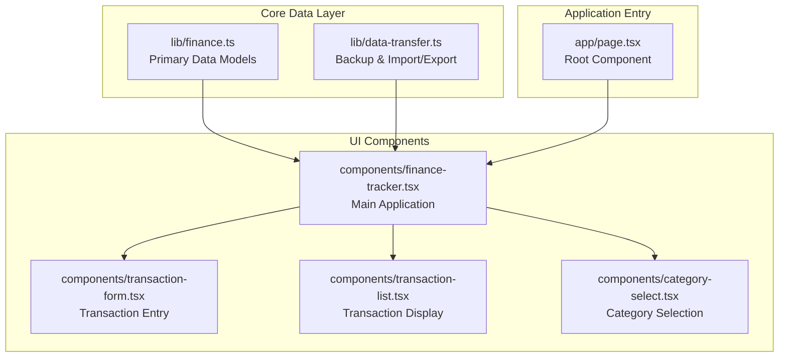
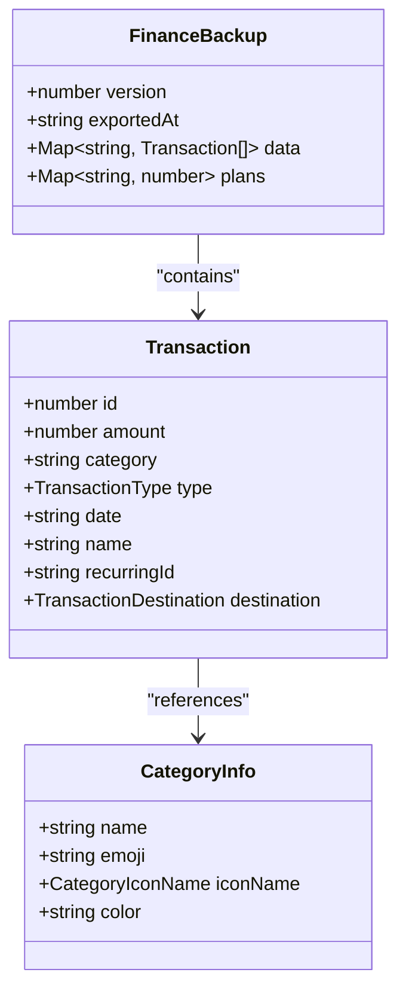
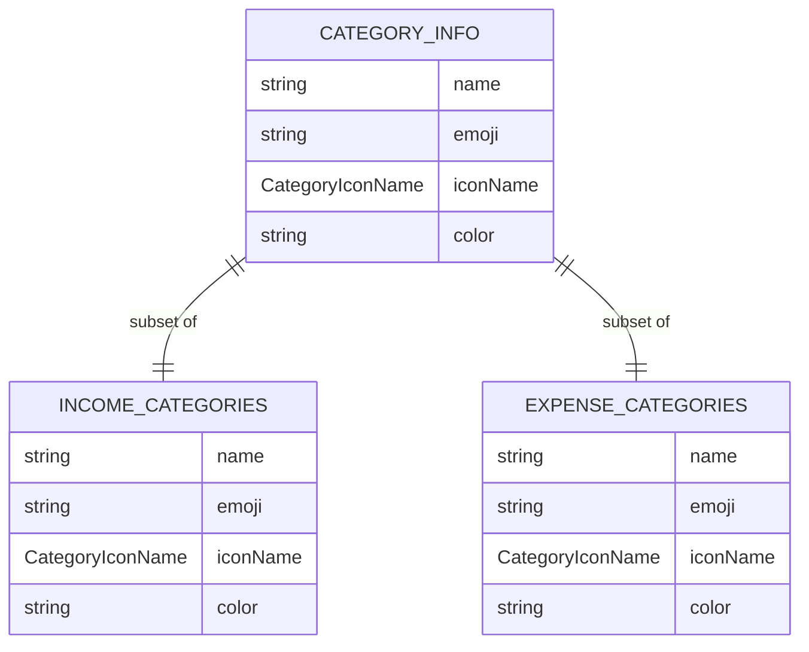
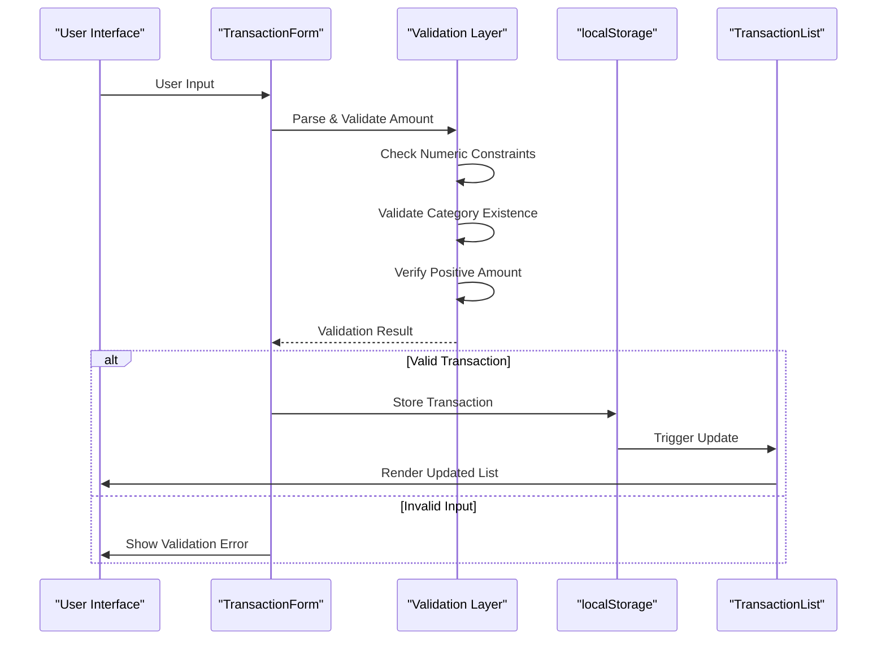
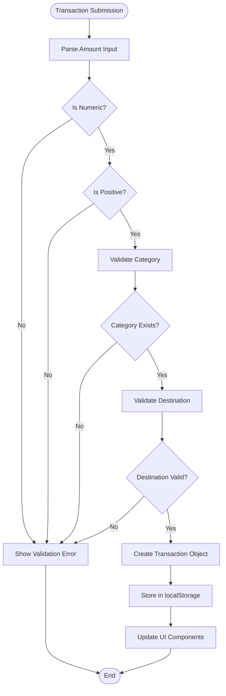
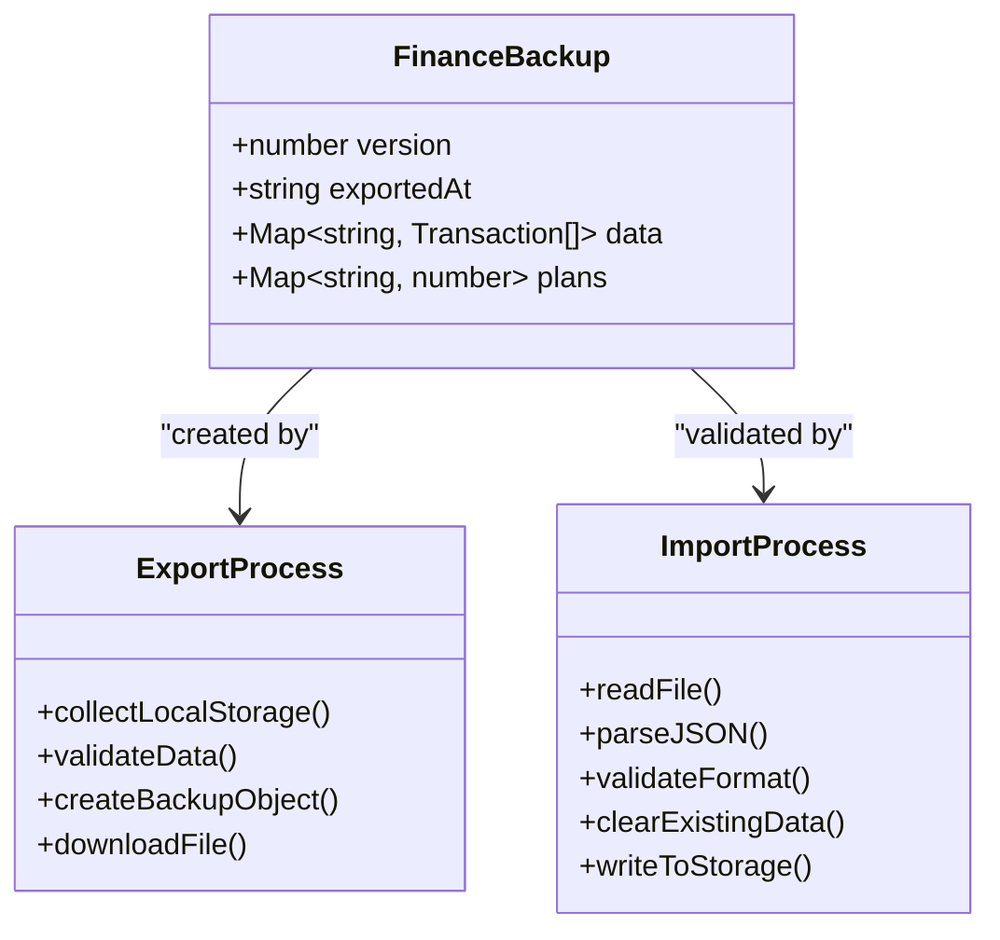
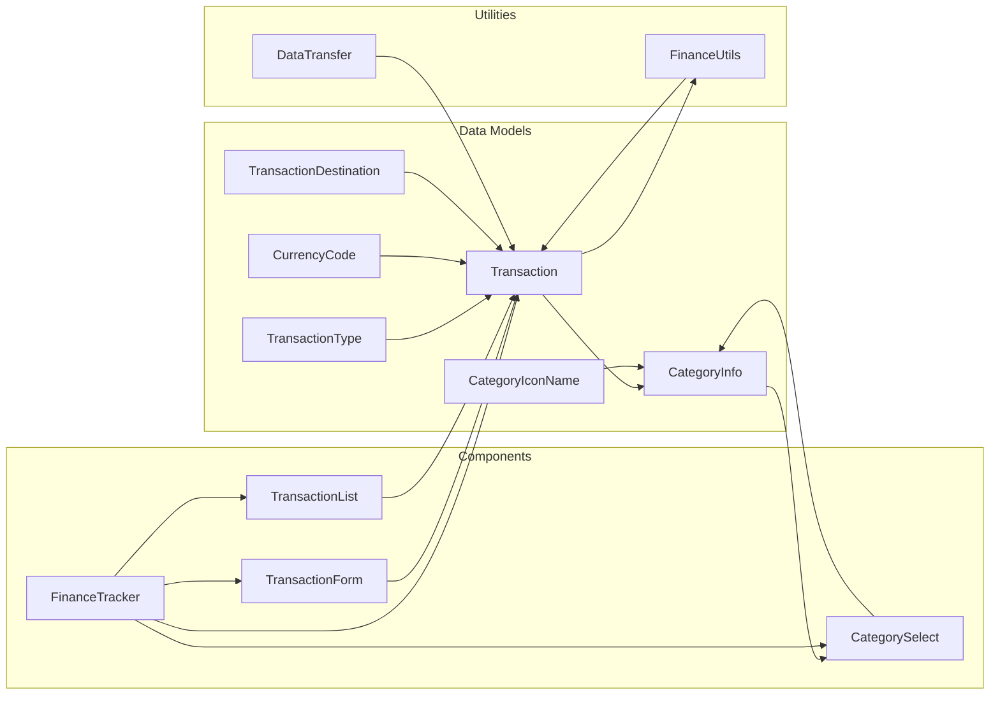

# Data Models and Structures

<cite>
**Referenced Files in This Document**
- [finance.ts](file://lib/finance.ts)
- [data-transfer.ts](file://lib/data-transfer.ts)
- [transaction-form.tsx](file://components/transaction-form.tsx)
- [transaction-list.tsx](file://components/transaction-list.tsx)
- [category-select.tsx](file://components/category-select.tsx)
- [finance-tracker.tsx](file://components/finance-tracker.tsx)
- [page.tsx](file://app/page.tsx)
</cite>

## Table of Contents
1. [Introduction](#introduction)
2. [Project Structure](#project-structure)
3. [Core Components](#core-components)
4. [Architecture Overview](#architecture-overview)
5. [Detailed Component Analysis](#detailed-component-analysis)
6. [Dependency Analysis](#dependency-analysis)
7. [Performance Considerations](#performance-considerations)
8. [Troubleshooting Guide](#troubleshooting-guide)
9. [Conclusion](#conclusion)

## Introduction

finTracker is a personal finance management application built with Next.js and React. The application focuses on providing a streamlined interface for tracking income and expenses with robust data models and validation systems. This documentation covers the core data structures, validation rules, and business logic that ensure data integrity and consistency across all financial records.

The application operates as a client-side only solution, storing all financial data locally in the browser's localStorage. This approach ensures user privacy while maintaining responsive performance characteristics typical of modern web applications.

## Project Structure

The data models and structures are organized across several key modules:



**Diagram sources**
- [finance.ts:1-124](file://lib/finance.ts#L1-L124)
- [data-transfer.ts:1-115](file://lib/data-transfer.ts#L1-L115)
- [finance-tracker.tsx:1-545](file://components/finance-tracker.tsx#L1-L545)

**Section sources**
- [finance.ts:1-124](file://lib/finance.ts#L1-L124)
- [data-transfer.ts:1-115](file://lib/data-transfer.ts#L1-L115)
- [finance-tracker.tsx:1-545](file://components/finance-tracker.tsx#L1-L545)
- [page.tsx:1-6](file://app/page.tsx#L1-L6)

## Core Components

### Transaction Interface

The Transaction interface serves as the fundamental data structure for all financial records in finTracker. It defines the complete contract for how transactions are stored, validated, and processed throughout the application.



**Diagram sources**
- [finance.ts:43-52](file://lib/finance.ts#L43-L52)
- [finance.ts:1-15](file://lib/finance.ts#L1-L15)
- [data-transfer.ts:3-12](file://lib/data-transfer.ts#L3-L12)

The Transaction interface includes the following key properties:

- **id**: Unique identifier for each transaction (automatically generated)
- **amount**: Numeric transaction value with positive constraint
- **category**: String identifier linking to predefined categories
- **type**: Enumerated type distinguishing income vs expense
- **date**: String representation of transaction date
- **name**: Optional descriptive label for the transaction
- **recurringId**: Optional identifier for recurring transaction templates
- **destination**: Optional asset allocation (card, cash, savings)

**Section sources**
- [finance.ts:43-52](file://lib/finance.ts#L43-L52)
- [finance-tracker.tsx:238-247](file://components/finance-tracker.tsx#L238-L247)

### Category Management System

The category system provides structured classification for all financial transactions with predefined categories for both income and expense tracking.



**Diagram sources**
- [finance.ts:16-35](file://lib/finance.ts#L16-L35)

The system includes comprehensive predefined categories:

**Income Categories:**
- Salary (💼, briefcase, green)
- Bonus (⭐, star, orange)
- Freelance (💻, laptop, blue)
- Other (📌, pin, gray)

**Expense Categories:**
- Grocery (🛒, cart, purple)
- Restaurants (🍽️, utensils, orange)
- Entertainment (🎬, film, pink)
- Housing & Utilities (🏠, home, blue)
- Gifts (🎁, gift, green)
- Games (🎮, gamepad, cyan)
- Personal (👤, user, violet)

Each category includes associated metadata for consistent UI presentation and data integrity.

**Section sources**
- [finance.ts:16-35](file://lib/finance.ts#L16-L35)
- [category-select.tsx:23-35](file://components/category-select.tsx#L23-L35)

### Type Definitions

The application defines several specialized type definitions that ensure type safety and consistent data handling:

```mermaid
classDiagram
class TransactionType {
<<enumeration>>
"income"
"expense"
}
class CurrencyCode {
<<enumeration>>
"UAH"
"USD"
"EUR"
}
class CategoryIconName {
<<enumeration>>
"cart"
"utensils"
"film"
"home"
"gift"
"gamepad"
"user"
"briefcase"
"star"
"laptop"
"pin"
}
class TransactionDestination {
<<enumeration>>
"card"
"cash"
"savings"
}
```

**Diagram sources**
- [finance.ts:39-41](file://lib/finance.ts#L39-L41)
- [finance.ts:3-15](file://lib/finance.ts#L3-L15)

These types provide compile-time guarantees and improve code readability throughout the application.

**Section sources**
- [finance.ts:3-15](file://lib/finance.ts#L3-L15)
- [finance.ts:39-41](file://lib/finance.ts#L39-L41)

## Architecture Overview

The data architecture follows a client-side storage pattern with comprehensive validation and transformation layers:



**Diagram sources**
- [transaction-form.tsx:25-35](file://components/transaction-form.tsx#L25-L35)
- [finance-tracker.tsx:210-264](file://components/finance-tracker.tsx#L210-L264)

The architecture ensures data integrity through multiple validation layers and maintains consistency through reactive updates.

**Section sources**
- [finance-tracker.tsx:210-264](file://components/finance-tracker.tsx#L210-L264)
- [transaction-form.tsx:25-35](file://components/transaction-form.tsx#L25-L35)

## Detailed Component Analysis

### Data Validation Rules

The application implements comprehensive validation rules to maintain data integrity:



**Diagram sources**
- [finance-tracker.tsx:210-264](file://components/finance-tracker.tsx#L210-L264)
- [transaction-form.tsx:45-49](file://components/transaction-form.tsx#L45-L49)

**Section sources**
- [finance-tracker.tsx:210-264](file://components/finance-tracker.tsx#L210-L264)
- [transaction-form.tsx:45-49](file://components/transaction-form.tsx#L45-L49)

### Data Transformation Patterns

The application employs several data transformation patterns to ensure consistency:

1. **Amount Normalization**: Converts comma decimal separators to dot format
2. **Category Resolution**: Maps merchant keywords to appropriate categories
3. **Date Formatting**: Standardizes date formats for storage and display
4. **Currency Conversion**: Handles multi-currency support with conversion rates

**Section sources**
- [transaction-form.tsx:25-35](file://components/transaction-form.tsx#L25-L35)
- [finance.ts:93-123](file://lib/finance.ts#L93-L123)

### Backup and Import/Export System

The data transfer module provides comprehensive backup and restore capabilities:



**Diagram sources**
- [data-transfer.ts:3-12](file://lib/data-transfer.ts#L3-L12)
- [data-transfer.ts:14-54](file://lib/data-transfer.ts#L14-L54)
- [data-transfer.ts:56-114](file://lib/data-transfer.ts#L56-L114)

**Section sources**
- [data-transfer.ts:14-54](file://lib/data-transfer.ts#L14-L54)
- [data-transfer.ts:56-114](file://lib/data-transfer.ts#L56-L114)

## Dependency Analysis

The data models have clear dependency relationships that ensure maintainable code architecture:



**Diagram sources**
- [finance.ts:1-124](file://lib/finance.ts#L1-L124)
- [finance-tracker.tsx:1-545](file://components/finance-tracker.tsx#L1-L545)

**Section sources**
- [finance.ts:1-124](file://lib/finance.ts#L1-L124)
- [finance-tracker.tsx:1-545](file://components/finance-tracker.tsx#L1-L545)

## Performance Considerations

The data models are designed with performance optimization in mind:

- **Minimal Memory Footprint**: Simple primitive types reduce memory overhead
- **Efficient LocalStorage Access**: Batch operations minimize storage I/O
- **Lazy Loading**: Categories and icons loaded on-demand
- **Immutable Updates**: React state updates trigger minimal re-renders
- **TypeScript Compilation**: Compile-time type checking prevents runtime errors

## Troubleshooting Guide

Common data integrity issues and their solutions:

### Transaction Validation Errors
- **Cause**: Non-numeric amount input
- **Solution**: Ensure amount contains only digits and decimal separators
- **Prevention**: Use the built-in calculation preview feature

### Category Resolution Issues
- **Cause**: Unknown category name
- **Solution**: Select from predefined category list
- **Prevention**: Use the category selection dropdown component

### Data Corruption Prevention
- **Validation**: All data undergoes strict validation before storage
- **Backup**: Regular automatic backups prevent data loss
- **Error Handling**: Graceful degradation when localStorage is unavailable

**Section sources**
- [finance-tracker.tsx:210-264](file://components/finance-tracker.tsx#L210-L264)
- [data-transfer.ts:56-114](file://lib/data-transfer.ts#L56-L114)

## Conclusion

finTracker's data models provide a robust foundation for personal finance management with strong emphasis on data integrity, validation, and user experience. The modular architecture ensures maintainability while the comprehensive validation system prevents data corruption. The type-safe approach and well-defined interfaces make the codebase easy to extend and modify while maintaining consistency across all financial records.

The application demonstrates best practices in client-side data management, providing a solid foundation for future enhancements and feature additions.