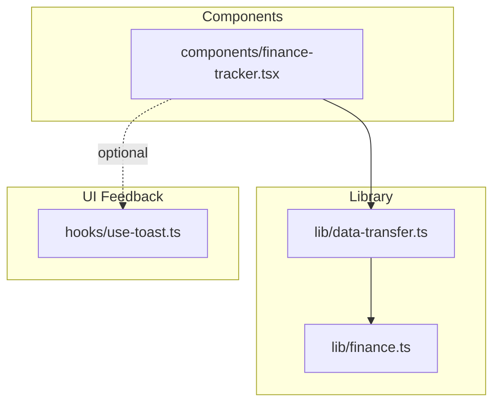
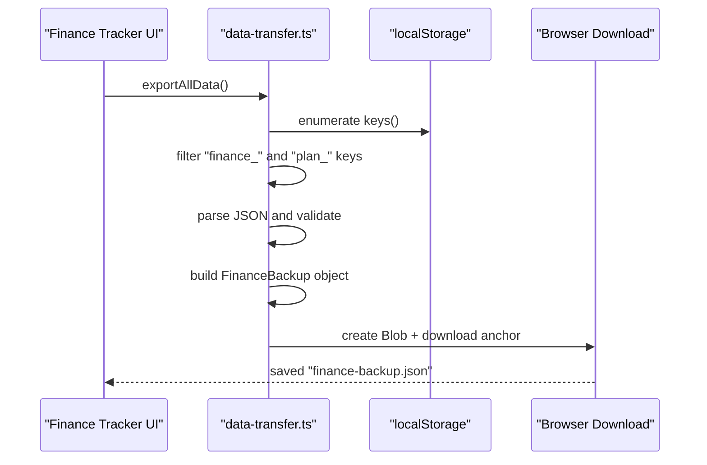
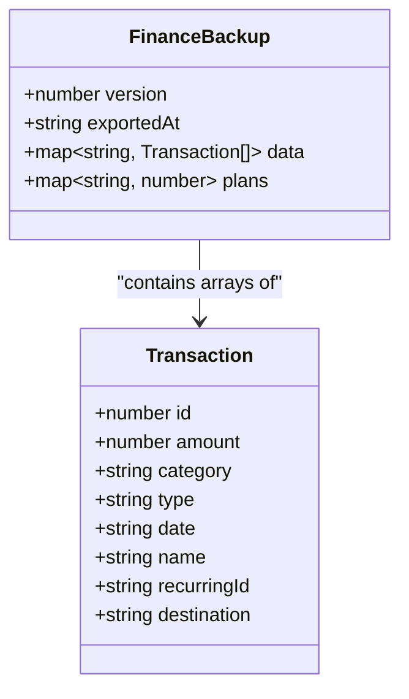
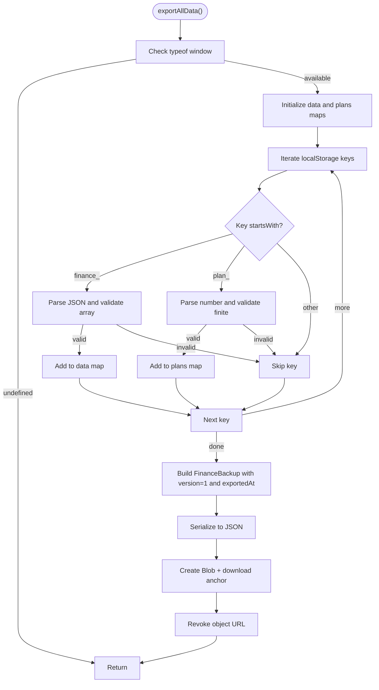
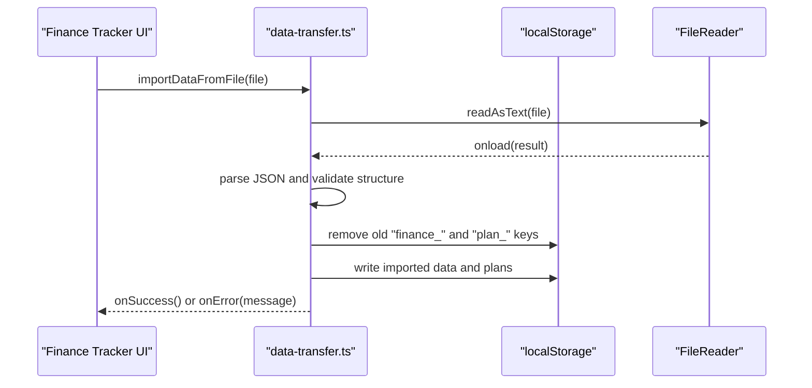
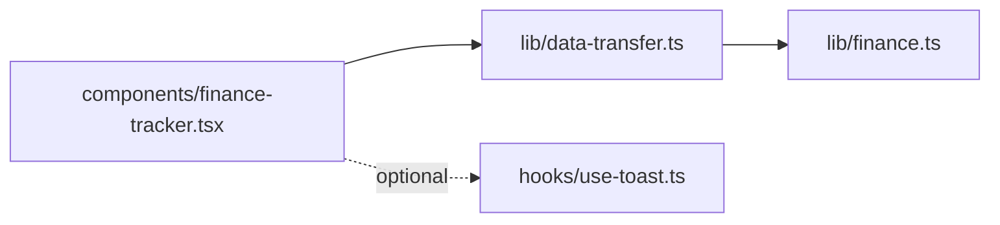

# Backup and Export Functionality

<cite>
**Referenced Files in This Document**
- [data-transfer.ts](file://lib/data-transfer.ts)
- [finance.ts](file://lib/finance.ts)
- [finance-tracker.tsx](file://components/finance-tracker.tsx)
- [use-toast.ts](file://hooks/use-toast.ts)
</cite>

## Table of Contents
1. [Introduction](#introduction)
2. [Project Structure](#project-structure)
3. [Core Components](#core-components)
4. [Architecture Overview](#architecture-overview)
5. [Detailed Component Analysis](#detailed-component-analysis)
6. [Dependency Analysis](#dependency-analysis)
7. [Performance Considerations](#performance-considerations)
8. [Troubleshooting Guide](#troubleshooting-guide)
9. [Security and Privacy Considerations](#security-and-privacy-considerations)
10. [Browser Compatibility](#browser-compatibility)
11. [Conclusion](#conclusion)

## Introduction
This document explains finTracker’s backup and export system. It covers the FinanceBackup data structure, the exportAllData() function implementation, the backup file format specification (version 1), and the import mechanism. It also documents error handling for malformed entries, provides examples of generated backup files, and addresses security and browser compatibility considerations.

## Project Structure
The backup and export functionality spans three primary areas:
- Data model and transfer logic in a dedicated library module
- UI integration in the finance tracker component
- Optional toast-based user feedback via a shared hook

**Diagram sources**
- [data-transfer.ts](file://lib/data-transfer.ts)
- [finance.ts](file://lib/finance.ts)
- [finance-tracker.tsx](file://components/finance-tracker.tsx)
- [use-toast.ts](file://hooks/use-toast.ts)

**Section sources**
- [data-transfer.ts](file://lib/data-transfer.ts)
- [finance.ts](file://lib/finance.ts)
- [finance-tracker.tsx](file://components/finance-tracker.tsx)
- [use-toast.ts](file://hooks/use-toast.ts)

## Core Components
- FinanceBackup type: Defines the versioned backup schema, including exportedAt timestamp, grouped transactions per month, and monthly financial plans.
- exportAllData(): Enumerates localStorage, filters keys by prefix, parses and validates entries, constructs a FinanceBackup object, serializes it to JSON, and triggers a browser download.
- importDataFromFile(): Reads a backup file, validates its structure and version, clears existing data, and writes imported data back to localStorage.

**Section sources**
- [data-transfer.ts:3-12](file://lib/data-transfer.ts#L3-L12)
- [data-transfer.ts:14-54](file://lib/data-transfer.ts#L14-L54)
- [data-transfer.ts:56-114](file://lib/data-transfer.ts#L56-L114)

## Architecture Overview
The export/import pipeline connects UI actions to localStorage and file operations.

**Diagram sources**
- [finance-tracker.tsx:715-732](file://components/finance-tracker.tsx#L715-L732)
- [data-transfer.ts:14-54](file://lib/data-transfer.ts#L14-L54)

## Detailed Component Analysis

### FinanceBackup Data Structure
- Version: Integer version identifier for backward compatibility.
- exportedAt: ISO 8601 timestamp indicating when the backup was created.
- data: Object keyed by month identifiers (e.g., "finance_YYYY_MM"), each mapping to an array of transactions.
- plans: Object keyed by plan identifiers (e.g., "plan_YYYY_MM"), each mapping to a numeric budget value.

**Diagram sources**
- [data-transfer.ts:3-12](file://lib/data-transfer.ts#L3-L12)
- [finance.ts:43-52](file://lib/finance.ts#L43-L52)

**Section sources**
- [data-transfer.ts:3-12](file://lib/data-transfer.ts#L3-L12)
- [finance.ts:43-52](file://lib/finance.ts#L43-L52)

### exportAllData() Implementation
- Environment guard: Returns early if window is unavailable.
- Enumeration: Iterates localStorage keys and filters by prefixes:
  - "finance_": parsed as JSON; must be an array to be included.
  - "plan_": parsed as a number; must be finite to be included.
- Validation: Malformed JSON or invalid types are skipped.
- Construction: Builds a FinanceBackup object with version 1, current timestamp, filtered data, and plans.
- Serialization and download: Converts the object to pretty-printed JSON and triggers a browser download with a filename.

**Diagram sources**
- [data-transfer.ts:14-54](file://lib/data-transfer.ts#L14-L54)

**Section sources**
- [data-transfer.ts:14-54](file://lib/data-transfer.ts#L14-L54)

### Import Workflow
- FileReader reads the uploaded file as text.
- JSON parsing and structural validation:
  - Must be an object, not null.
  - Must have version equal to 1.
  - Must have data and plans as objects.
  - Each data entry must be an array and keyed with "finance_".
- Data replacement:
  - Clears existing "finance_" and "plan_" keys.
  - Writes imported data back to localStorage.

**Diagram sources**
- [data-transfer.ts:56-114](file://lib/data-transfer.ts#L56-L114)
- [finance-tracker.tsx:604-609](file://components/finance-tracker.tsx#L604-L609)

**Section sources**
- [data-transfer.ts:56-114](file://lib/data-transfer.ts#L56-L114)
- [finance-tracker.tsx:604-609](file://components/finance-tracker.tsx#L604-L609)

### Backup File Format Specification (Version 1)
- Root fields:
  - version: integer 1
  - exportedAt: string (ISO 8601 timestamp)
  - data: object
    - Keys: month identifiers like "finance_YYYY_MM"
    - Values: arrays of transaction objects
  - plans: object
    - Keys: plan identifiers like "plan_YYYY_MM"
    - Values: numbers representing budgets/plans
- Transaction object fields:
  - id, amount, category, type, date, optional name, optional recurringId, optional destination

Example structure outline:
{
  "version": 1,
  "exportedAt": "2025-01-20T12:34:56.789Z",
  "data": {
    "finance_2024_12": [
      {
        "id": 1001,
        "amount": 15.50,
        "category": "Grocery",
        "type": "expense",
        "date": "2024-12-15",
        "name": "Milk",
        "destination": "card"
      }
    ],
    "finance_2025_01": [
      {
        "id": 1002,
        "amount": 22.00,
        "category": "Restaurants",
        "type": "expense",
        "date": "2025-01-05",
        "recurringId": "rule_a"
      }
    ]
  },
  "plans": {
    "plan_2024_12": 1500,
    "plan_2025_01": 1600
  }
}

Notes:
- Month keys are derived from dates using a consistent YYYY_MM pattern.
- Plan keys represent monthly budgets and are numeric.

**Section sources**
- [data-transfer.ts:3-12](file://lib/data-transfer.ts#L3-L12)
- [finance.ts:43-52](file://lib/finance.ts#L43-L52)
- [finance.ts:59-65](file://lib/finance.ts#L59-L65)

## Dependency Analysis
- UI depends on data-transfer functions for export/import.
- data-transfer depends on finance types for transaction typing.
- UI optionally integrates with a toast hook for user feedback.

**Diagram sources**
- [finance-tracker.tsx:16](file://components/finance-tracker.tsx#L16)
- [data-transfer.ts:1](file://lib/data-transfer.ts#L1)
- [finance.ts:1](file://lib/finance.ts#L1)
- [use-toast.ts](file://hooks/use-toast.ts)

**Section sources**
- [finance-tracker.tsx:16](file://components/finance-tracker.tsx#L16)
- [data-transfer.ts:1](file://lib/data-transfer.ts#L1)
- [finance.ts:1](file://lib/finance.ts#L1)
- [use-toast.ts](file://hooks/use-toast.ts)

## Performance Considerations
- Export scans all localStorage entries; performance scales linearly with the number of stored keys. For typical personal finance usage, this is negligible.
- JSON parsing occurs per key; malformed entries are skipped, avoiding crashes but adding minor overhead.
- Import clears and rewrites all matching keys; this is efficient but should be considered when large datasets are present.

## Troubleshooting Guide
Common issues and resolutions:
- Invalid backup format: Ensure the file is a JSON object with version 1, and that data/plans are objects. Non-conforming files will be rejected during import.
- Malformed entries during export: Keys starting with "finance_" that are not valid JSON arrays are skipped. Verify the content of these keys.
- Missing or corrupted data: After import, confirm that "finance_" and "plan_" keys were cleared and rewritten as expected.
- File read errors: If the file cannot be read, the import process reports a failure message.

Operational tips:
- Use the provided UI buttons to trigger export/import.
- Keep backups in a secure location and review downloaded files before importing into another environment.

**Section sources**
- [data-transfer.ts:70-78](file://lib/data-transfer.ts#L70-L78)
- [data-transfer.ts:82-87](file://lib/data-transfer.ts#L82-L87)
- [data-transfer.ts:107-109](file://lib/data-transfer.ts#L107-L109)

## Security and Privacy Considerations
- Local storage exposure risk: Backups contain sensitive financial data. Store exported files securely and avoid sharing them publicly.
- Download origin: The download is initiated from the browser; ensure the environment is trusted.
- Data integrity: The import process validates structure and types. Still, verify the source of backup files and avoid importing untrusted content.
- Sensitive attributes: Transactions may include optional fields like names and recurring identifiers. Review exported files to remove sensitive details if necessary.

## Browser Compatibility
- localStorage: Supported in all modern browsers. The export function checks for window availability and returns gracefully if missing.
- FileReader: Used for import; widely supported.
- Blob and URL.createObjectURL: Standard APIs for triggering downloads; supported in modern browsers.
- Download attribute: Ensures the file is saved with a specific name.

## Conclusion
finTracker’s backup and export system provides a straightforward, versioned JSON format for portable financial data. The exportAllData() function safely enumerates, validates, and packages data, while importDataFromFile() enforces strict schema validation and replaces existing data reliably. Users should treat exported files as sensitive and manage them securely.