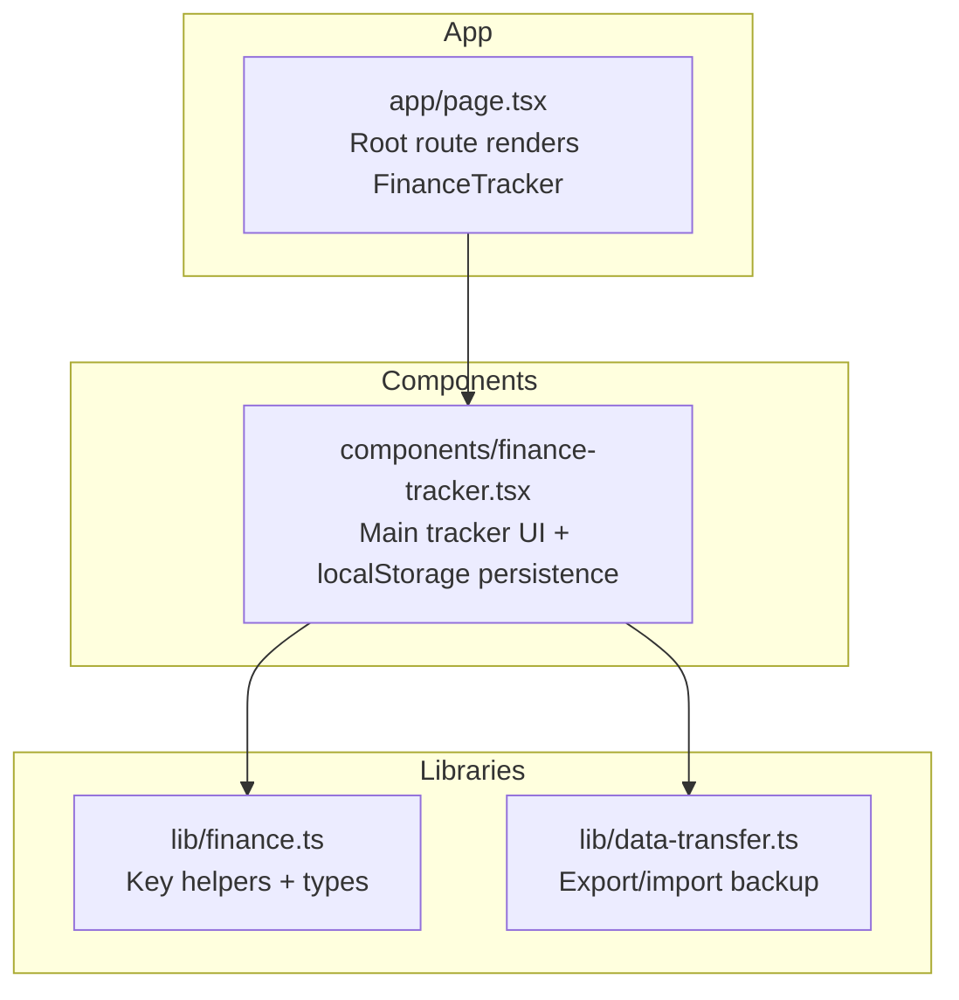
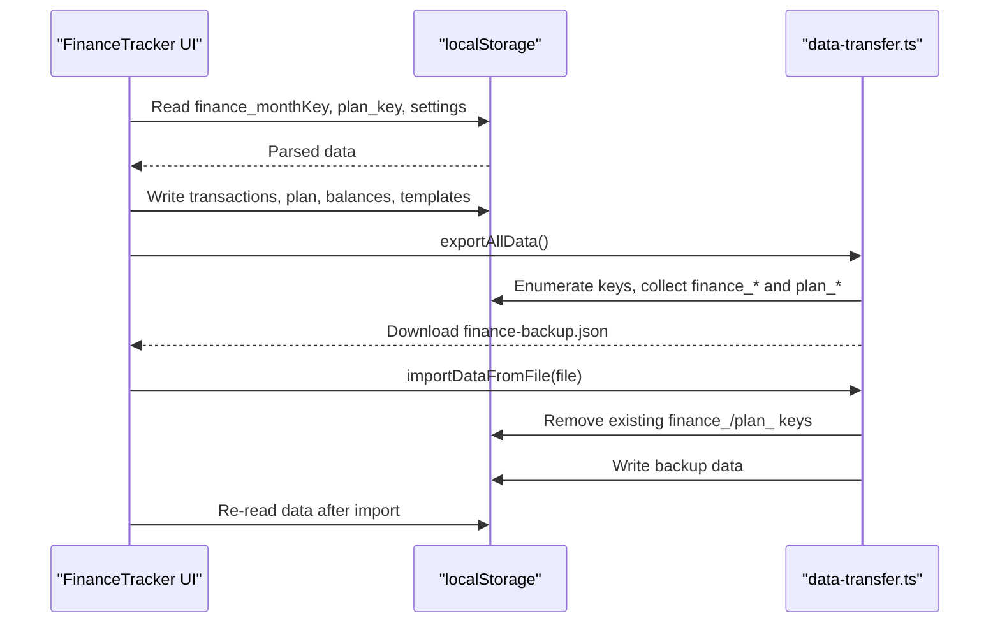
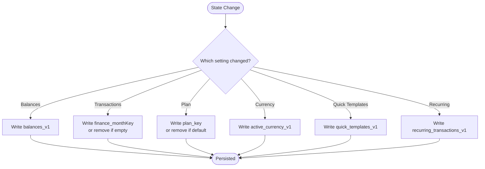
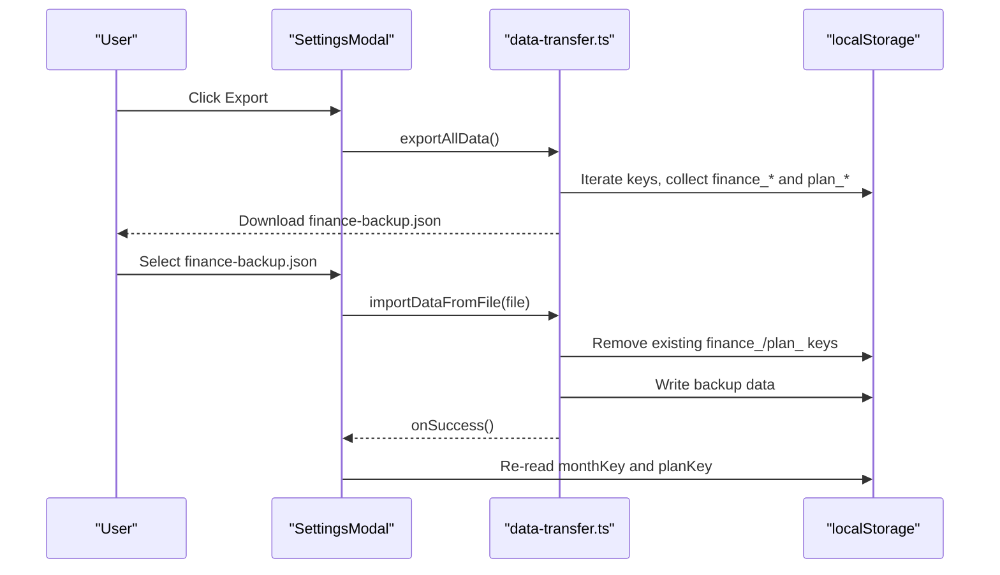
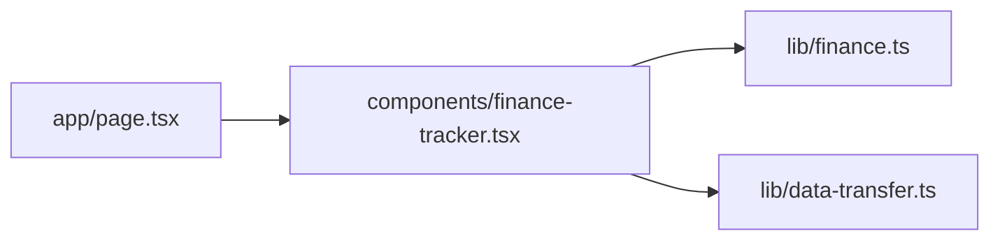

# Cross-Device Synchronization

<cite>
**Referenced Files in This Document**
- [finance-tracker.tsx](file://components/finance-tracker.tsx)
- [finance.ts](file://lib/finance.ts)
- [data-transfer.ts](file://lib/data-transfer.ts)
- [page.tsx](file://app/page.tsx)
</cite>

## Table of Contents
1. [Introduction](#introduction)
2. [Project Structure](#project-structure)
3. [Core Components](#core-components)
4. [Architecture Overview](#architecture-overview)
5. [Detailed Component Analysis](#detailed-component-analysis)
6. [Dependency Analysis](#dependency-analysis)
7. [Performance Considerations](#performance-considerations)
8. [Troubleshooting Guide](#troubleshooting-guide)
9. [Conclusion](#conclusion)

## Introduction
This document explains finTracker’s cross-device synchronization mechanism built on localStorage. It covers how localStorage acts as the offline-first data store, the automatic persistence patterns, how data is organized by key formats, and how the system supports manual backup and restore. It also outlines the lack of real-time synchronization across browser tabs, conflict resolution strategies, and practical guidance for troubleshooting.

## Project Structure
The synchronization logic centers on a single client component that reads/writes localStorage and a small library module that exports/import backups. The app bootstraps the tracker component at the root route.

**Diagram sources**
- [page.tsx:1-6](file://app/page.tsx#L1-L6)
- [finance-tracker.tsx:1-50](file://components/finance-tracker.tsx#L1-L50)
- [finance.ts:59-65](file://lib/finance.ts#L59-L65)
- [data-transfer.ts:14-54](file://lib/data-transfer.ts#L14-L54)

**Section sources**
- [page.tsx:1-6](file://app/page.tsx#L1-L6)
- [finance-tracker.tsx:1-50](file://components/finance-tracker.tsx#L1-L50)
- [finance.ts:59-65](file://lib/finance.ts#L59-L65)
- [data-transfer.ts:14-54](file://lib/data-transfer.ts#L14-L54)

## Core Components
- FinanceTracker component orchestrates:
  - Loading/saving per-month transactions keyed by finance_monthKey
  - Saving monthly financial plan keyed by plan_key
  - Persisting balances, recurring templates, quick templates, and currency
- Key generation helpers:
  - finance_monthKey follows the pattern finance_year_month
  - plan_key follows the pattern plan_year_month
- Backup/restore:
  - Export captures all finance_monthKey entries and plan_key entries into a versioned JSON
  - Import validates and writes backup data back to localStorage

**Section sources**
- [finance-tracker.tsx:85-107](file://components/finance-tracker.tsx#L85-L107)
- [finance-tracker.tsx:109-164](file://components/finance-tracker.tsx#L109-L164)
- [finance.ts:59-65](file://lib/finance.ts#L59-L65)
- [data-transfer.ts:3-12](file://lib/data-transfer.ts#L3-L12)
- [data-transfer.ts:14-54](file://lib/data-transfer.ts#L14-L54)
- [data-transfer.ts:56-114](file://lib/data-transfer.ts#L56-L114)

## Architecture Overview
The system is offline-first and device-local. Data is persisted to localStorage and rehydrated on mount. There is no WebSocket or server-side synchronization; cross-device updates occur by reloading the page after external edits (e.g., importing a backup).

**Diagram sources**
- [finance-tracker.tsx:109-164](file://components/finance-tracker.tsx#L109-L164)
- [finance-tracker.tsx:544-551](file://components/finance-tracker.tsx#L544-L551)
- [data-transfer.ts:14-54](file://lib/data-transfer.ts#L14-L54)
- [data-transfer.ts:56-114](file://lib/data-transfer.ts#L56-L114)

## Detailed Component Analysis

### Data Keys and Organization
- Per-month transactions: Stored under a key derived from the active month, using the helper that produces finance_year_month.
- Monthly plan: Stored under plan_year_month.
- Other settings and ephemeral data:
  - balances_v1
  - recurring_transactions_v1
  - quick_templates_v1
  - active_currency_v1

Examples of key patterns:
- finance_2024_07
- plan_2024_07
- balances_v1
- recurring_transactions_v1
- quick_templates_v1
- active_currency_v1

These keys are used directly with localStorage.setItem/getItem/removeItem in the FinanceTracker component and during export/import.

**Section sources**
- [finance.ts:59-65](file://lib/finance.ts#L59-L65)
- [finance-tracker.tsx:85-89](file://components/finance-tracker.tsx#L85-L89)
- [finance-tracker.tsx:112-113](file://components/finance-tracker.tsx#L112-L113)
- [finance-tracker.tsx:141](file://components/finance-tracker.tsx#L141)
- [finance-tracker.tsx:104-106](file://components/finance-tracker.tsx#L104-L106)
- [finance-tracker.tsx:233](file://components/finance-tracker.tsx#L233)
- [finance-tracker.tsx:172-173](file://components/finance-tracker.tsx#L172-L173)
- [finance-tracker.tsx:167-168](file://components/finance-tracker.tsx#L167-L168)

### Automatic Data Persistence Patterns
- Balances persistence: On state changes, balances are written to balances_v1.
- Transactions persistence: On transaction list changes, the current month’s array is written to finance_monthKey; if empty, the key is removed.
- Plan persistence: On plan changes, plan_key is written or removed if equal to default.
- Settings persistence: Currency, quick templates, and recurring templates are written on change.

**Diagram sources**
- [finance-tracker.tsx:104-106](file://components/finance-tracker.tsx#L104-L106)
- [finance-tracker.tsx:147-154](file://components/finance-tracker.tsx#L147-L154)
- [finance-tracker.tsx:157-164](file://components/finance-tracker.tsx#L157-L164)
- [finance-tracker.tsx:167-169](file://components/finance-tracker.tsx#L167-L169)
- [finance-tracker.tsx:171-174](file://components/finance-tracker.tsx#L171-L174)
- [finance-tracker.tsx:233](file://components/finance-tracker.tsx#L233)

**Section sources**
- [finance-tracker.tsx:104-106](file://components/finance-tracker.tsx#L104-L106)
- [finance-tracker.tsx:147-154](file://components/finance-tracker.tsx#L147-L154)
- [finance-tracker.tsx:157-164](file://components/finance-tracker.tsx#L157-L164)
- [finance-tracker.tsx:167-169](file://components/finance-tracker.tsx#L167-L169)
- [finance-tracker.tsx:171-174](file://components/finance-tracker.tsx#L171-L174)
- [finance-tracker.tsx:233](file://components/finance-tracker.tsx#L233)

### Real-Time Synchronization Across Browser Tabs
- The code does not attach a storage event listener to synchronize changes across tabs.
- Cross-tab updates require a page reload to rehydrate from localStorage.
- Manual backup/restore via export/import enables cross-device synchronization.

Implications:
- Concurrent edits in two tabs risk overwriting each other’s changes.
- To coordinate edits, export from one tab, then import into another.

**Section sources**
- [finance-tracker.tsx:109-164](file://components/finance-tracker.tsx#L109-L164)
- [data-transfer.ts:14-54](file://lib/data-transfer.ts#L14-L54)
- [data-transfer.ts:56-114](file://lib/data-transfer.ts#L56-L114)

### Conflict Resolution Strategies
- Last-write-wins: When importing a backup, existing finance_monthKey and plan_key entries are removed, then replaced with backup data. This means the import operation supersedes local changes made since the last export.
- Recurring templates and quick templates are fully overwritten by import.
- Plan defaults: plan_key is removed when equal to the default value; importing resets to the backup value.

Recommendations:
- Export before importing to preserve local changes.
- For recurring templates, export, edit locally, then import to merge safely.

**Section sources**
- [data-transfer.ts:89-97](file://lib/data-transfer.ts#L89-L97)
- [data-transfer.ts:99-104](file://lib/data-transfer.ts#L99-L104)
- [finance-tracker.tsx:157-164](file://components/finance-tracker.tsx#L157-L164)

### Data Consistency Guarantees
- Strong per-key atomicity: Each localStorage key holds a single serialized value. Writes are immediate and synchronous.
- Eventual consistency across devices: Requires manual export/import or a page reload after external edits.
- No cross-tab real-time updates: No event listener is attached to the storage event.

**Section sources**
- [finance-tracker.tsx:109-164](file://components/finance-tracker.tsx#L109-L164)
- [data-transfer.ts:14-54](file://lib/data-transfer.ts#L14-L54)

### Synchronization Timing
- Persistence timing:
  - Immediate on state changes (balances, transactions, plan, settings).
- Rehydration timing:
  - On mount and when monthKey or planKey change.
- Cross-device timing:
  - Manual: Export from one device, import on another.
  - Automatic reload: After external edits, refresh the page to reflect changes.

**Section sources**
- [finance-tracker.tsx:104-106](file://components/finance-tracker.tsx#L104-L106)
- [finance-tracker.tsx:147-154](file://components/finance-tracker.tsx#L147-L154)
- [finance-tracker.tsx:157-164](file://components/finance-tracker.tsx#L157-L164)
- [finance-tracker.tsx:109-144](file://components/finance-tracker.tsx#L109-L144)

### Backup and Restore Mechanics
- Export:
  - Scans localStorage for keys starting with finance_ and plan_, collects them, and writes a versioned JSON file.
- Import:
  - Validates the backup structure, clears existing finance_/plan_ keys, then writes the backup data.

**Diagram sources**
- [finance-tracker.tsx:544-551](file://components/finance-tracker.tsx#L544-L551)
- [data-transfer.ts:14-54](file://lib/data-transfer.ts#L14-L54)
- [data-transfer.ts:56-114](file://lib/data-transfer.ts#L56-L114)

**Section sources**
- [finance-tracker.tsx:544-551](file://components/finance-tracker.tsx#L544-L551)
- [data-transfer.ts:14-54](file://lib/data-transfer.ts#L14-L54)
- [data-transfer.ts:56-114](file://lib/data-transfer.ts#L56-L114)

## Dependency Analysis
- FinanceTracker depends on:
  - finance.ts for key generation helpers (getMonthKey, getPlanKey)
  - data-transfer.ts for exportAllData and importDataFromFile
- The app root renders FinanceTracker, which manages localStorage hydration and persistence.

**Diagram sources**
- [page.tsx:1-6](file://app/page.tsx#L1-L6)
- [finance-tracker.tsx:12-17](file://components/finance-tracker.tsx#L12-L17)
- [finance.ts:59-65](file://lib/finance.ts#L59-L65)
- [data-transfer.ts:14-54](file://lib/data-transfer.ts#L14-L54)

**Section sources**
- [page.tsx:1-6](file://app/page.tsx#L1-L6)
- [finance-tracker.tsx:12-17](file://components/finance-tracker.tsx#L12-L17)
- [finance.ts:59-65](file://lib/finance.ts#L59-L65)
- [data-transfer.ts:14-54](file://lib/data-transfer.ts#L14-L54)

## Performance Considerations
- localStorage is synchronous and bound by disk I/O; frequent writes can cause layout thrashing if not batched.
- Current implementation writes on each state change; batching is not used.
- Export/Import operations iterate over all localStorage entries; for very large datasets, this can be noticeable.

Recommendations:
- Minimize rapid successive writes by debouncing or coalescing updates.
- Prefer bulk operations when adding many transactions.

[No sources needed since this section provides general guidance]

## Troubleshooting Guide
Common issues and resolutions:
- Transactions not visible after editing:
  - Cause: Not saved to finance_monthKey or removed when empty.
  - Resolution: Ensure transactions exist; if accidentally cleared, re-add or import backup.
- Plan not updating:
  - Cause: plan_key removed when equal to default.
  - Resolution: Set a non-default value; import backup to restore.
- Balances not persisting:
  - Cause: Hydration flag not ready or missing balances_v1.
  - Resolution: Verify hydrated state and ensure balances_v1 exists.
- Cross-tab not reflecting changes:
  - Cause: No storage event listener.
  - Resolution: Refresh the tab or import backup from the source tab.
- Import fails:
  - Cause: Invalid backup format or corrupted file.
  - Resolution: Validate backup version and structure; re-export from a known-good source.

**Section sources**
- [finance-tracker.tsx:147-154](file://components/finance-tracker.tsx#L147-L154)
- [finance-tracker.tsx:157-164](file://components/finance-tracker.tsx#L157-L164)
- [finance-tracker.tsx:104-106](file://components/finance-tracker.tsx#L104-L106)
- [finance-tracker.tsx:109-144](file://components/finance-tracker.tsx#L109-L144)
- [data-transfer.ts:70-78](file://lib/data-transfer.ts#L70-L78)

## Conclusion
finTracker’s synchronization model is device-local and offline-first. It persists data to localStorage with predictable key formats and provides robust manual backup/restore. Real-time cross-tab synchronization is not implemented; users must rely on page reloads or import/export to propagate changes across devices. Understanding the key patterns and persistence timing helps avoid data loss and resolve common sync issues.