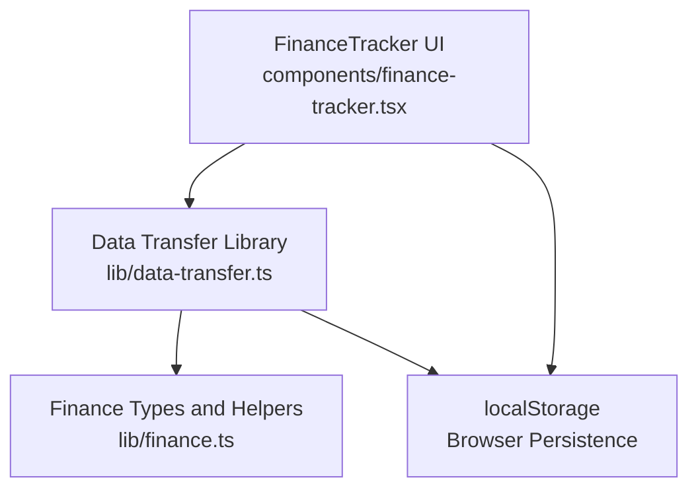
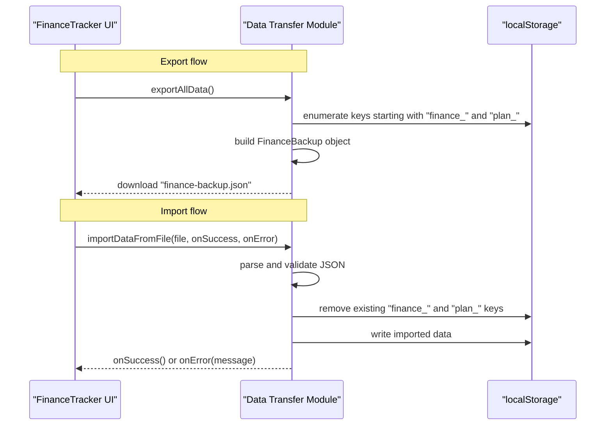
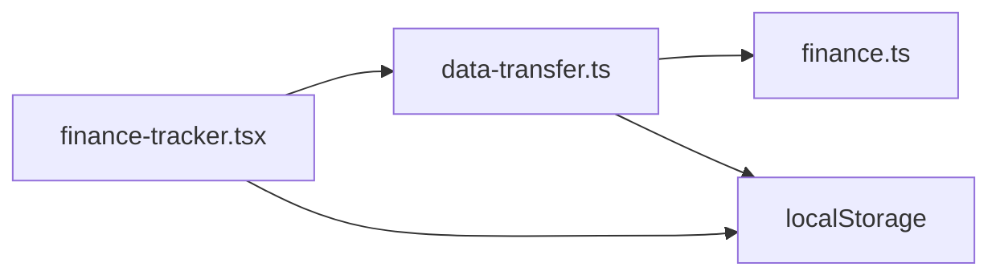

# Data Transfer and Synchronization

<cite>
**Referenced Files in This Document**
- [data-transfer.ts](file://lib/data-transfer.ts)
- [finance.ts](file://lib/finance.ts)
- [finance-tracker.tsx](file://components/finance-tracker.tsx)
</cite>

## Table of Contents
1. [Introduction](#introduction)
2. [Project Structure](#project-structure)
3. [Core Components](#core-components)
4. [Architecture Overview](#architecture-overview)
5. [Detailed Component Analysis](#detailed-component-analysis)
6. [Dependency Analysis](#dependency-analysis)
7. [Performance Considerations](#performance-considerations)
8. [Troubleshooting Guide](#troubleshooting-guide)
9. [Conclusion](#conclusion)
10. [Appendices](#appendices)

## Introduction
This document describes finTracker’s data transfer system with a focus on backup, export, and import functionality. It defines the backup format specification, explains how data is synchronized across devices using localStorage as the primary store, documents import validation and error handling, and outlines export capabilities for portability and restoration. It also covers data migration patterns for backward compatibility and version updates, provides examples of backup file structure and validation scenarios, and addresses security considerations for export/import operations.

## Project Structure
The data transfer system spans two libraries and one UI component:
- Backup and restore logic resides in a dedicated library module.
- The financial model types and helpers live in another library module.
- The UI component integrates the data transfer actions into the user interface and orchestrates user interactions.

**Diagram sources**
- [finance-tracker.tsx:17](file://components/finance-tracker.tsx#L17)
- [data-transfer.ts:1](file://lib/data-transfer.ts#L1)
- [finance.ts:1](file://lib/finance.ts#L1)

**Section sources**
- [finance-tracker.tsx:17](file://components/finance-tracker.tsx#L17)
- [data-transfer.ts:1](file://lib/data-transfer.ts#L1)
- [finance.ts:1](file://lib/finance.ts#L1)

## Core Components
- Backup format definition and validation schema
- Export routine that serializes localStorage into a single JSON file
- Import routine that validates and writes backup data into localStorage
- UI integration for initiating export/import and handling errors

Key responsibilities:
- Define a stable backup schema with version control.
- Serialize and deserialize data to/from localStorage.
- Validate backup files before applying changes.
- Provide user feedback via callbacks for success and failure.

**Section sources**
- [data-transfer.ts:3](file://lib/data-transfer.ts#L3)
- [data-transfer.ts:14](file://lib/data-transfer.ts#L14)
- [data-transfer.ts:56](file://lib/data-transfer.ts#L56)
- [finance-tracker.tsx:590](file://components/finance-tracker.tsx#L590)

## Architecture Overview
The system uses localStorage as the single source of truth for all user data. Export reads all matching keys from localStorage, constructs a backup object, and downloads a JSON file. Import validates the uploaded file against the schema, clears existing data, and writes the imported dataset back to localStorage.

**Diagram sources**
- [data-transfer.ts:14](file://lib/data-transfer.ts#L14)
- [data-transfer.ts:56](file://lib/data-transfer.ts#L56)
- [finance-tracker.tsx:604](file://components/finance-tracker.tsx#L604)

## Detailed Component Analysis

### Backup Format Specification
The backup format is a JSON object with explicit version control and structure:
- version: integer (current version is 1)
- exportedAt: ISO 8601 timestamp indicating when the backup was created
- data: object keyed by month identifiers (e.g., finance_YYYY_MM) mapped to arrays of transactions
- plans: object keyed by plan identifiers (e.g., plan_YYYY_MM) mapped to numeric plan values

Validation schema:
- Root must be an object with non-null version equal to 1, and data/plans as objects.
- Each entry in data must be an array and keyed with a finance_ prefix.
- Plans must be finite numbers.

Example structure outline:
- version: 1
- exportedAt: "YYYY-MM-DDTHH:mm:ss.sssZ"
- data:
  - "finance_YYYY_MM": [{...}, {...}]
  - "finance_YYYY_MM": [{...}]
- plans:
  - "plan_YYYY_MM": 25000
  - "plan_YYYY_MM": 26000

Notes:
- The schema enforces strict typing and structure to prevent accidental corruption.
- Version control allows future migrations when the schema evolves.

**Section sources**
- [data-transfer.ts:3](file://lib/data-transfer.ts#L3)
- [data-transfer.ts:70](file://lib/data-transfer.ts#L70)

### Cross-Device Synchronization Mechanism
Synchronization relies on localStorage as the shared persistence layer:
- Keys are prefixed to separate concerns:
  - Monthly transaction buckets: finance_YYYY_MM
  - Monthly plan values: plan_YYYY_MM
  - Other persisted settings: balances, currency, templates, recurring rules
- Export enumerates all matching keys and writes them into a single backup file.
- Import validates the backup, removes existing matching keys, and writes the imported data.

Implications:
- Works across the same browser on the same device.
- Does not inherently sync across browsers or devices; users must manually exchange the backup file.

**Section sources**
- [finance.ts:59](file://lib/finance.ts#L59)
- [finance.ts:63](file://lib/finance.ts#L63)
- [finance-tracker.tsx:112](file://components/finance-tracker.tsx#L112)
- [finance-tracker.tsx:141](file://components/finance-tracker.tsx#L141)

### Export Functionality
Behavior:
- Iterates through localStorage keys.
- Collects arrays under keys starting with "finance_".
- Collects numeric plan values under keys starting with "plan_".
- Constructs a FinanceBackup object with version, timestamp, collected data, and plans.
- Creates a Blob containing the JSON and triggers a download with filename "finance-backup.json".

Error handling:
- Malformed entries are skipped during enumeration to avoid aborting the export.

Portability:
- The resulting file is a single JSON artifact suitable for archiving and sharing.

**Section sources**
- [data-transfer.ts:14](file://lib/data-transfer.ts#L14)
- [data-transfer.ts:20](file://lib/data-transfer.ts#L20)
- [data-transfer.ts:38](file://lib/data-transfer.ts#L38)
- [data-transfer.ts:45](file://lib/data-transfer.ts#L45)

### Import Validation and Error Handling
Validation steps:
- Ensures the parsed payload is an object, not null, with version equal to 1, and both data and plans as objects.
- Validates each data entry key starts with "finance_" and maps to an array.
- Clears existing "finance_" and "plan_" keys before writing imported data.
- Writes imported data back to localStorage.

Error handling:
- On parsing or validation failures, the import routine invokes the provided error callback with a descriptive message.
- FileReader errors are handled separately and reported to the caller.

User experience:
- The UI wires import actions to callbacks that surface messages to the user.

**Section sources**
- [data-transfer.ts:56](file://lib/data-transfer.ts#L56)
- [data-transfer.ts:63](file://lib/data-transfer.ts#L63)
- [data-transfer.ts:70](file://lib/data-transfer.ts#L70)
- [data-transfer.ts:82](file://lib/data-transfer.ts#L82)
- [data-transfer.ts:89](file://lib/data-transfer.ts#L89)
- [finance-tracker.tsx:604](file://components/finance-tracker.tsx#L604)

### UI Integration for Export/Import
The FinanceTracker component exposes buttons to trigger export and import:
- Export button calls the exportAllData function from the data transfer module.
- Import button opens a hidden file input; selecting a file invokes the import routine with success/error callbacks.
- The UI displays recurring templates and other settings for context.

User flow:
- Click export to download a backup.
- Click import, choose a backup file, and receive success or error feedback.

**Section sources**
- [finance-tracker.tsx:715](file://components/finance-tracker.tsx#L715)
- [finance-tracker.tsx:733](file://components/finance-tracker.tsx#L733)
- [finance-tracker.tsx:604](file://components/finance-tracker.tsx#L604)

### Data Migration Patterns and Backward Compatibility
Current state:
- The backup schema includes a version field set to 1.
- Import validation strictly requires version 1.

Recommended migration strategy:
- Increment the version field when introducing breaking changes.
- Maintain backward compatibility by supporting multiple versions in import validation.
- Provide a migration pass that transforms older structures into the current schema before writing to localStorage.

Benefits:
- Enables safe upgrades without data loss.
- Allows gradual adoption of new features.

**Section sources**
- [data-transfer.ts:4](file://lib/data-transfer.ts#L4)
- [data-transfer.ts:73](file://lib/data-transfer.ts#L73)

### Examples

#### Backup File Structure Example
- version: 1
- exportedAt: "2025-01-15T10:30:00.000Z"
- data:
  - "finance_2024_12": [{ id: 1, amount: 100, category: "Grocery", type: "expense", date: "2024-12-15" }]
  - "finance_2025_01": [{ id: 2, amount: 50, category: "Restaurants", type: "expense", date: "2025-01-05" }]
- plans:
  - "plan_2024_12": 25000
  - "plan_2025_01": 26000

#### Import Validation Scenarios
- Invalid root type: Reject if not an object or null.
- Wrong version: Reject if version is not 1.
- Missing fields: Reject if data or plans are missing or not objects.
- Malformed data entries: Reject if any data key does not start with "finance_" or is not an array.
- FileReader errors: Report failure to read the file.

#### Synchronization Conflict Resolution
- Import replaces all existing "finance_" and "plan_" keys with the imported dataset.
- To preserve local changes, users should export before importing new data.
- For partial merges, manual editing of the backup JSON is recommended.

**Section sources**
- [data-transfer.ts:70](file://lib/data-transfer.ts#L70)
- [data-transfer.ts:82](file://lib/data-transfer.ts#L82)
- [data-transfer.ts:89](file://lib/data-transfer.ts#L89)

## Dependency Analysis
The data transfer module depends on the finance types for transaction shape validation and on the browser environment for localStorage and Blob APIs. The UI component depends on the data transfer module and uses localStorage keys defined in the tracker component.

**Diagram sources**
- [finance-tracker.tsx:17](file://components/finance-tracker.tsx#L17)
- [data-transfer.ts:1](file://lib/data-transfer.ts#L1)
- [finance.ts:1](file://lib/finance.ts#L1)

**Section sources**
- [finance-tracker.tsx:17](file://components/finance-tracker.tsx#L17)
- [data-transfer.ts:1](file://lib/data-transfer.ts#L1)
- [finance.ts:1](file://lib/finance.ts#L1)

## Performance Considerations
- Export scans all localStorage entries; for large datasets, consider batching or limiting the scan range.
- Import clears and rewrites many keys; this is efficient but can block the UI thread on very large backups.
- Prefer exporting during low activity and avoid frequent imports to minimize disruption.

## Troubleshooting Guide
Common issues and resolutions:
- Import fails with “Invalid backup format”:
  - Ensure the file is a version 1 backup and contains the required fields.
  - Verify the data entries are arrays and keyed with the proper prefixes.
- Import reports “Failed to read the file”:
  - Confirm the file is accessible and readable.
- Data disappears after import:
  - This is expected behavior; import replaces existing data. Export before importing to preserve current data.

Operational tips:
- Validate backup files externally by inspecting the JSON structure.
- Keep a recent backup before major updates.

**Section sources**
- [data-transfer.ts:77](file://lib/data-transfer.ts#L77)
- [data-transfer.ts:112](file://lib/data-transfer.ts#L112)

## Conclusion
finTracker’s data transfer system centers on a simple, versioned backup schema and localStorage-backed persistence. Export and import routines provide reliable portability and restoration, while validation ensures data integrity. For cross-device synchronization, users must exchange backup files manually. The versioned schema enables future-proofing through controlled migrations.

## Appendices

### Security Considerations
- Exported backups are unencrypted JSON files containing all user data. Store them securely and delete them after use.
- Avoid importing backups from untrusted sources; validation is basic and does not sanitize external inputs.
- Be cautious when sharing backups; they may contain sensitive financial information.

[No sources needed since this section provides general guidance]