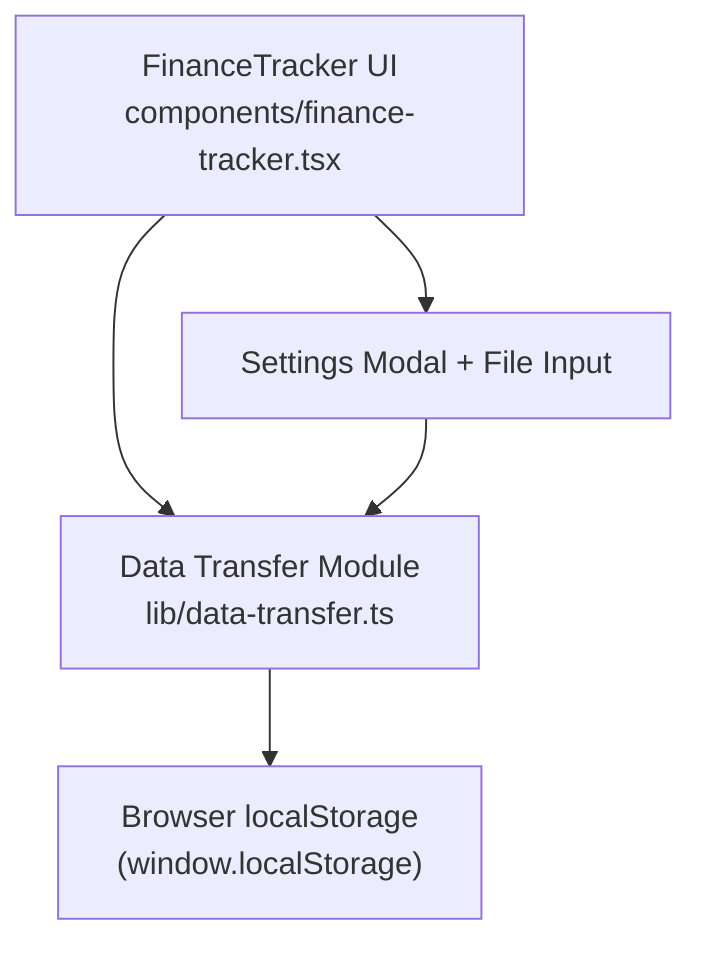
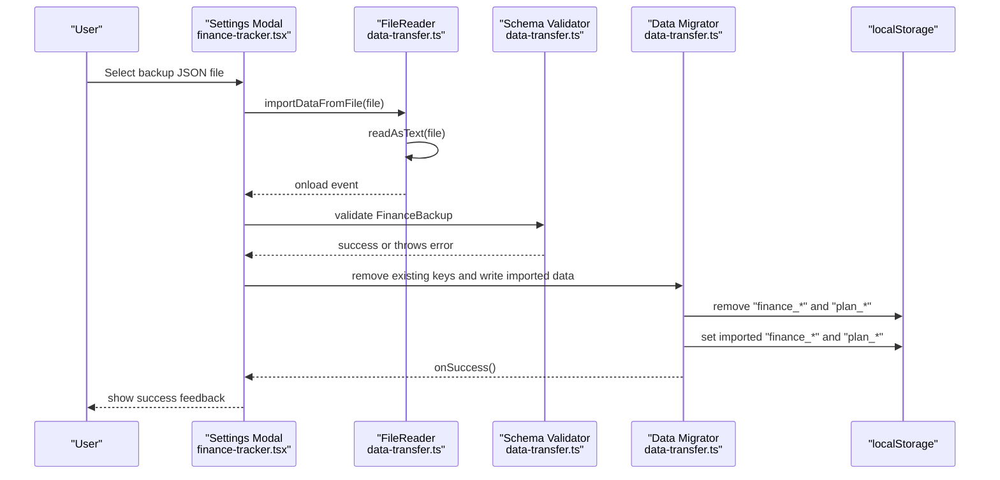
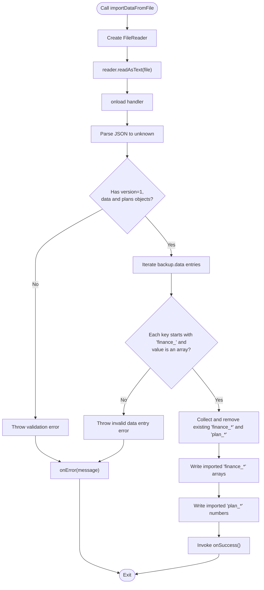
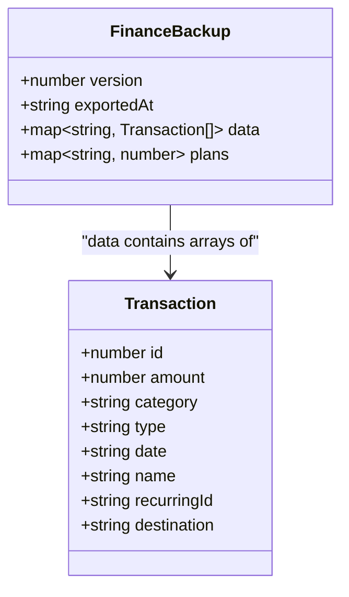
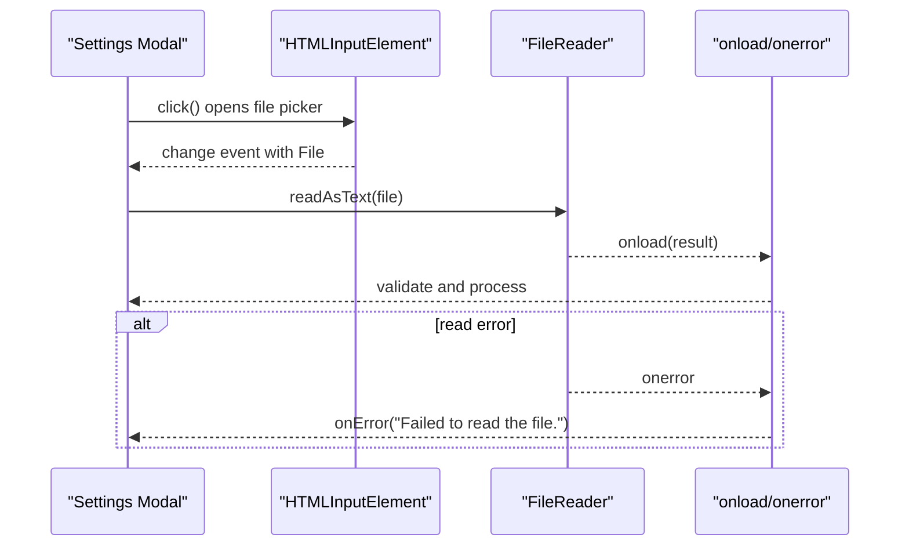
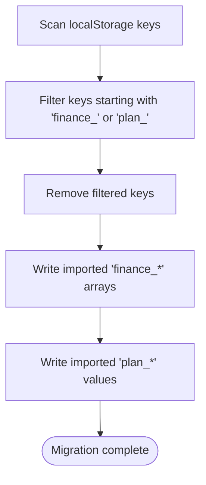
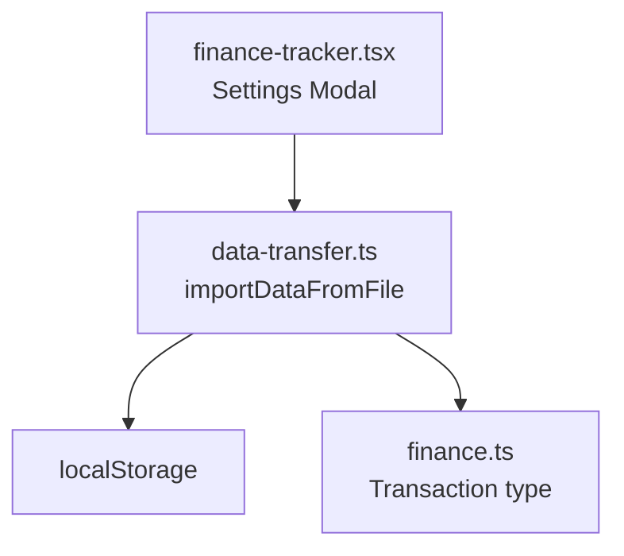

# Import and Validation System

<cite>
**Referenced Files in This Document**
- [data-transfer.ts](file://lib/data-transfer.ts)
- [finance.ts](file://lib/finance.ts)
- [finance-tracker.tsx](file://components/finance-tracker.tsx)
</cite>

## Table of Contents
1. [Introduction](#introduction)
2. [Project Structure](#project-structure)
3. [Core Components](#core-components)
4. [Architecture Overview](#architecture-overview)
5. [Detailed Component Analysis](#detailed-component-analysis)
6. [Dependency Analysis](#dependency-analysis)
7. [Performance Considerations](#performance-considerations)
8. [Troubleshooting Guide](#troubleshooting-guide)
9. [Conclusion](#conclusion)

## Introduction
This document explains finTracker’s import and validation system with a focus on the importDataFromFile() function. It covers how the system integrates with the browser File API and FileReader, the JSON parsing workflow, the validation schema ensuring version compatibility and data integrity, error handling for invalid formats and parsing failures, and the data migration process that cleans existing data and safely inserts imported records. It also includes examples of valid and invalid backup files, common import errors, and validation failure scenarios with specific error messages.

## Project Structure
The import and validation logic resides in a dedicated library module and is wired into the FinanceTracker UI component. The relevant files are:
- lib/data-transfer.ts: Defines the FinanceBackup schema, exports and imports data, and implements importDataFromFile().
- lib/finance.ts: Declares the Transaction type and related helpers used by the backup schema.
- components/finance-tracker.tsx: Integrates the import UI, triggers importDataFromFile(), and handles success/error callbacks.

**Diagram sources**
- [finance-tracker.tsx:56–774:56-774](file://components/finance-tracker.tsx#L56-L774)
- [data-transfer.ts:14–114:14-114](file://lib/data-transfer.ts#L14-L114)

**Section sources**
- [finance-tracker.tsx:56–774:56-774](file://components/finance-tracker.tsx#L56-L774)
- [data-transfer.ts:14–114:14-114](file://lib/data-transfer.ts#L14-L114)

## Core Components
- FinanceBackup schema: Defines the expected structure for backup files, including version, export timestamp, grouped transaction data, and monthly plan values.
- importDataFromFile(file, onSuccess, onError): Reads a selected JSON file, validates its structure and version, clears existing data, and writes imported data into localStorage.
- Export flow: Collects data from localStorage, builds a FinanceBackup object, and creates a downloadable JSON file.

Key responsibilities:
- File API integration: Uses HTMLInputElement to capture a File and FileReader.readAsText() to asynchronously load the file content.
- JSON parsing workflow: Parses the file content into an unknown type and narrows it to the FinanceBackup shape.
- Validation schema: Enforces version compatibility, object shapes, and key naming conventions.
- Data migration: Removes existing “finance_*” and “plan_*” keys, then writes imported data and plans.
- Error handling: Centralizes error reporting via the onError callback with precise messages.

**Section sources**
- [data-transfer.ts:3–12:3-12](file://lib/data-transfer.ts#L3-L12)
- [data-transfer.ts:56–114:56-114](file://lib/data-transfer.ts#L56-L114)
- [finance.ts:43–52:43-52](file://lib/finance.ts#L43-L52)

## Architecture Overview
The import pipeline is event-driven and asynchronous. The UI triggers the import, FileReader performs the read, the validator checks schema compliance, and the migrator updates localStorage.

**Diagram sources**
- [finance-tracker.tsx:603–609:603-609](file://components/finance-tracker.tsx#L603-L609)
- [data-transfer.ts:61–114:61-114](file://lib/data-transfer.ts#L61-L114)

## Detailed Component Analysis

### importDataFromFile(file, onSuccess, onError)
This function orchestrates the entire import process:
- FileReader asynchronous processing: Creates a FileReader, sets onload and onerror handlers, and reads the file as text.
- JSON parsing workflow: Parses the text into an unknown value and validates it against the FinanceBackup schema.
- Comprehensive validation:
  - Ensures the parsed object is not null and has version 1.
  - Confirms data and plans are objects.
  - Validates each data entry key starts with “finance_” and maps to an array.
- Data migration:
  - Discovers and removes existing “finance_*” and “plan_*” keys.
  - Writes imported transaction arrays and plan values back to localStorage.
- Error handling:
  - Catches thrown errors and invokes onError with a message.
  - Handles FileReader read errors via onerror.

**Diagram sources**
- [data-transfer.ts:61–114:61-114](file://lib/data-transfer.ts#L61-L114)

**Section sources**
- [data-transfer.ts:56–114:56-114](file://lib/data-transfer.ts#L56-L114)

### FinanceBackup Schema and Validation
The schema defines the expected structure of backup files:
- version: Must equal 1.
- exportedAt: ISO string timestamp.
- data: Object mapping month keys (e.g., “finance_YYYY_MM”) to arrays of transactions.
- plans: Object mapping plan keys (e.g., “plan_YYYY_MM”) to numeric plan values.

Validation performed by importDataFromFile():
- Type checks for object presence and version equality.
- Ensures data and plans are objects.
- Iterates over data entries to verify key prefixes and array types.

**Diagram sources**
- [data-transfer.ts:3–12:3-12](file://lib/data-transfer.ts#L3-L12)
- [finance.ts:43–52:43-52](file://lib/finance.ts#L43-L52)

**Section sources**
- [data-transfer.ts:3–12:3-12](file://lib/data-transfer.ts#L3-L12)
- [finance.ts:43–52:43-52](file://lib/finance.ts#L43-L52)

### File API Integration and FileReader Asynchronous Processing
- The UI triggers import via a hidden file input and a click handler.
- The FileReader reads the file asynchronously and fires onload with the result.
- The onload handler parses and validates the content; onerror reports read failures.

**Diagram sources**
- [finance-tracker.tsx:603–609:603-609](file://components/finance-tracker.tsx#L603-L609)
- [data-transfer.ts:61–114:61-114](file://lib/data-transfer.ts#L61-L114)

**Section sources**
- [finance-tracker.tsx:603–609:603-609](file://components/finance-tracker.tsx#L603-L609)
- [data-transfer.ts:61–114:61-114](file://lib/data-transfer.ts#L61-L114)

### Data Migration Process
- Existing data cleanup: Scans localStorage for keys starting with “finance_” or “plan_”, collects them, and removes each key.
- Safe data insertion: Writes each imported “finance_*” array and “plan_*” value back to localStorage.

**Diagram sources**
- [data-transfer.ts:89–104:89-104](file://lib/data-transfer.ts#L89-L104)

**Section sources**
- [data-transfer.ts:89–104:89-104](file://lib/data-transfer.ts#L89-L104)

### Example Backup Files

- Valid backup file (example structure):
  - version equals 1
  - exportedAt is an ISO string
  - data keys follow the “finance_YYYY_MM” pattern and map to arrays of transaction objects
  - plans keys follow the “plan_YYYY_MM” pattern and map to numbers

- Invalid backup file examples:
  - Missing or incorrect version (e.g., version not equal to 1)
  - data or plans are not objects
  - A data entry key does not start with “finance_”
  - A data entry value is not an array
  - Malformed JSON or unreadable file content

**Section sources**
- [data-transfer.ts:3–12:3-12](file://lib/data-transfer.ts#L3-L12)
- [data-transfer.ts:70–87:70-87](file://lib/data-transfer.ts#L70-L87)

## Dependency Analysis
- importDataFromFile depends on:
  - FileReader for asynchronous file reading.
  - JSON.parse for deserialization.
  - localStorage for data persistence.
  - FinanceBackup type definition for validation.
- UI integration:
  - The Settings Modal wires the file input to importDataFromFile and passes success/error callbacks.

**Diagram sources**
- [finance-tracker.tsx:56–774:56-774](file://components/finance-tracker.tsx#L56-L774)
- [data-transfer.ts:14–114:14-114](file://lib/data-transfer.ts#L14-L114)
- [finance.ts:43–52:43-52](file://lib/finance.ts#L43-L52)

**Section sources**
- [finance-tracker.tsx:56–774:56-774](file://components/finance-tracker.tsx#L56-L774)
- [data-transfer.ts:14–114:14-114](file://lib/data-transfer.ts#L14-L114)
- [finance.ts:43–52:43-52](file://lib/finance.ts#L43-L52)

## Performance Considerations
- FileReader is asynchronous and avoids blocking the UI thread.
- The migration scans localStorage linearly; the number of keys determines cost. Typical usage involves a small number of monthly buckets, so performance impact is minimal.
- JSON serialization/deserialization occurs once per import operation.

## Troubleshooting Guide
Common import errors and resolutions:
- “Invalid backup format. Expected a version 1 finance-backup.json file.”:
  - Cause: The backup file’s version is not 1 or the structure lacks required fields.
  - Resolution: Use a backup file generated by the same application version or regenerate the backup.
- “Invalid data entry: "<key>"”:
  - Cause: A data entry key does not start with “finance_” or its value is not an array.
  - Resolution: Fix the backup file to conform to the schema.
- “Could not read file.”:
  - Cause: FileReader could not extract a string result.
  - Resolution: Verify the file is accessible and not corrupted.
- “Failed to read the file.”:
  - Cause: FileReader encountered an error during read.
  - Resolution: Retry with a valid JSON file.
- “Failed to import file.”:
  - Cause: Generic catch-all for unexpected errors during validation or migration.
  - Resolution: Inspect the backup file’s structure and content.

Validation failure scenarios with specific error messages:
- Version mismatch: Ensure version equals 1.
- Non-object data/plans: Ensure data and plans are objects.
- Incorrect key naming: Keys must start with “finance_” for transaction arrays and “plan_” for plan values.
- Non-array values: Values under “data” must be arrays.

**Section sources**
- [data-transfer.ts:70–109:70-109](file://lib/data-transfer.ts#L70-L109)

## Conclusion
The import and validation system centers on a robust schema, asynchronous file handling, and a clean migration strategy. By validating version compatibility, enforcing key naming conventions, and performing targeted cleanup and insertion, it ensures safe and reliable data restoration. Users benefit from clear error messaging and a straightforward workflow to restore their financial data from backups.