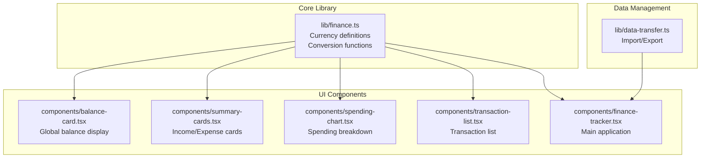
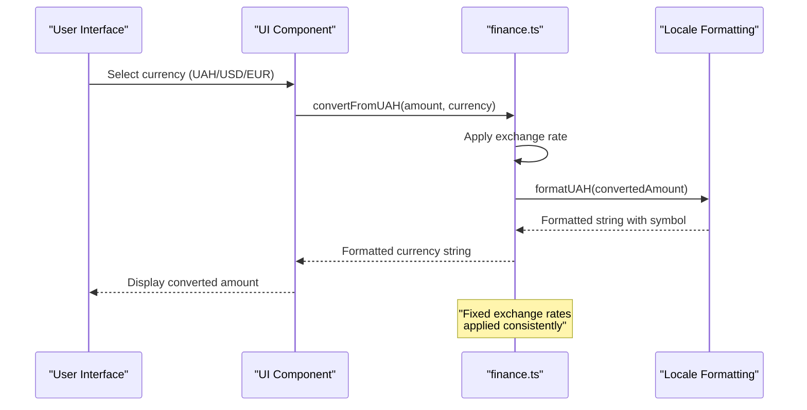
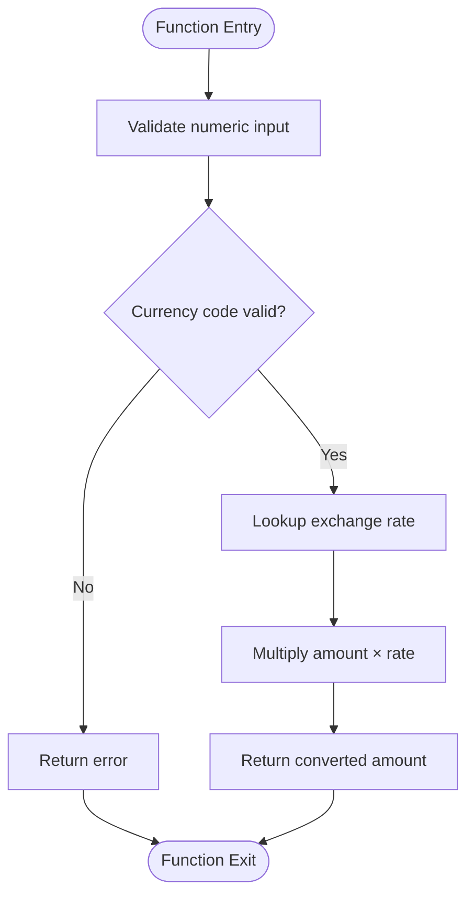
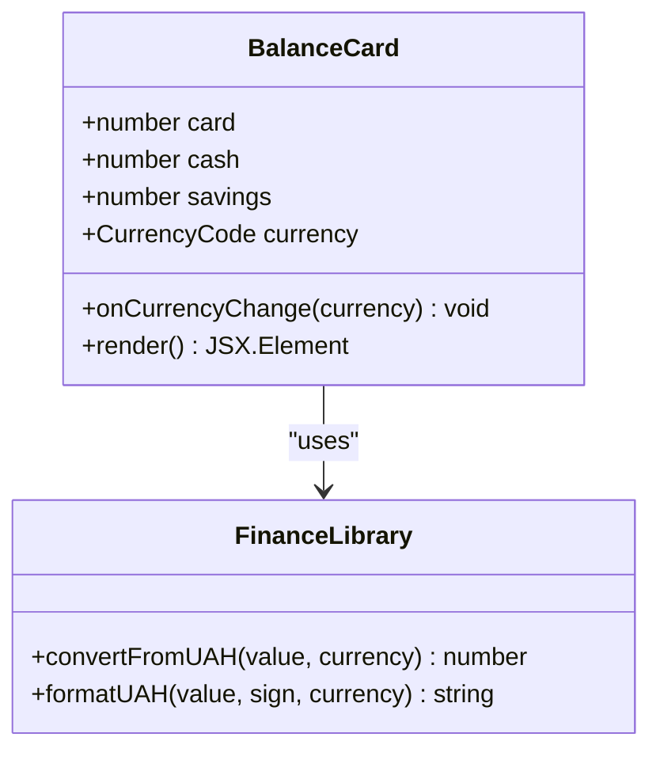
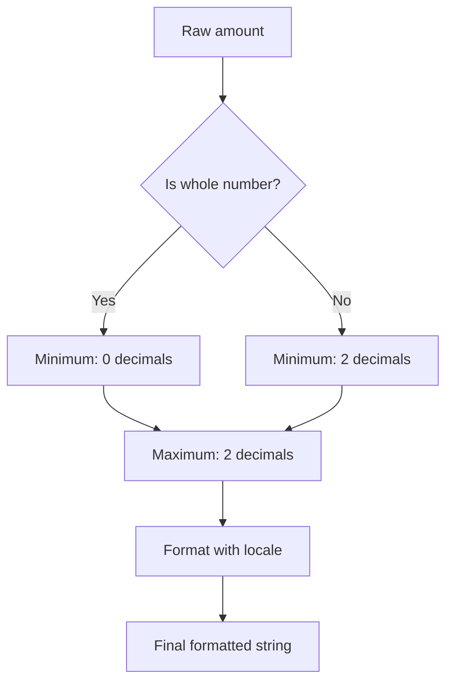
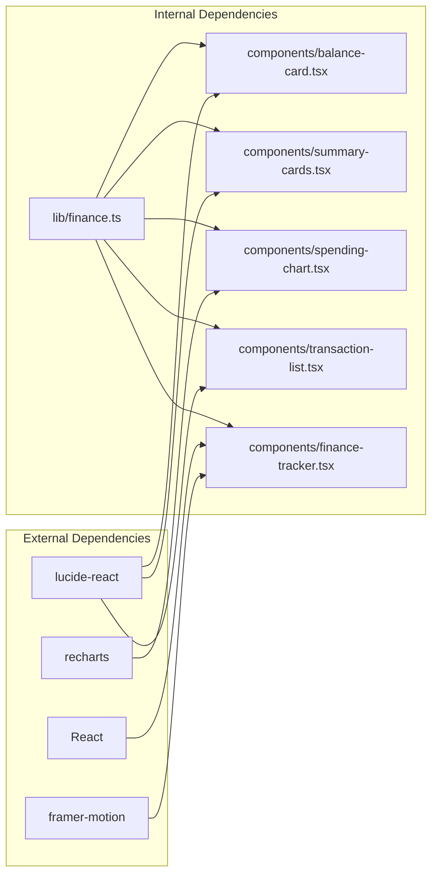

# Currency Conversion System

<cite>
**Referenced Files in This Document**
- [finance.ts](file://lib/finance.ts)
- [balance-card.tsx](file://components/balance-card.tsx)
- [summary-cards.tsx](file://components/summary-cards.tsx)
- [finance-tracker.tsx](file://components/finance-tracker.tsx)
- [spending-chart.tsx](file://components/spending-chart.tsx)
- [transaction-list.tsx](file://components/transaction-list.tsx)
- [data-transfer.ts](file://lib/data-transfer.ts)
</cite>

## Table of Contents
1. [Introduction](#introduction)
2. [Project Structure](#project-structure)
3. [Core Components](#core-components)
4. [Architecture Overview](#architecture-overview)
5. [Detailed Component Analysis](#detailed-component-analysis)
6. [Dependency Analysis](#dependency-analysis)
7. [Performance Considerations](#performance-considerations)
8. [Troubleshooting Guide](#troubleshooting-guide)
9. [Conclusion](#conclusion)

## Introduction
This document provides comprehensive documentation for finTracker's currency conversion system. The system supports three currencies (UAH, USD, EUR) with fixed exchange rates and provides consistent formatting for financial displays. It enables users to view balances, incomes, expenses, and forecasts in their preferred currency while maintaining internal storage in Ukrainian Hryvnia (UAH).

## Project Structure
The currency conversion system is implemented primarily in the finance library and consumed by various UI components throughout the application.

**Diagram sources**
- [finance.ts:39-123](file://lib/finance.ts#L39-L123)
- [balance-card.tsx:1-80](file://components/balance-card.tsx#L1-L80)
- [summary-cards.tsx:1-50](file://components/summary-cards.tsx#L1-L50)
- [spending-chart.tsx:1-96](file://components/spending-chart.tsx#L1-L96)
- [transaction-list.tsx:1-102](file://components/transaction-list.tsx#L1-L102)
- [finance-tracker.tsx:1-545](file://components/finance-tracker.tsx#L1-L545)
- [data-transfer.ts:1-115](file://lib/data-transfer.ts#L1-L115)

**Section sources**
- [finance.ts:1-124](file://lib/finance.ts#L1-L124)
- [finance-tracker.tsx:1-545](file://components/finance-tracker.tsx#L1-L545)

## Core Components
The currency conversion system consists of three primary components:

### Currency Code Enumeration
The system defines a strict union type for supported currencies:
- UAH (Ukrainian Hryvnia) - Base currency
- USD (US Dollar)
- EUR (Euro)

### Fixed Exchange Rates
The system uses predefined exchange rates relative to UAH:
- UAH: 1.0000 (Base rate)
- USD: 0.0250
- EUR: 0.0230

These rates are applied consistently across all conversions.

### Symbol Mapping System
Each currency has a corresponding Unicode symbol:
- UAH: ₴
- USD: $
- EUR: €

**Section sources**
- [finance.ts:39-103](file://lib/finance.ts#L39-L103)

## Architecture Overview
The currency conversion system follows a centralized architecture pattern where conversion logic is encapsulated in a single module and consumed by multiple UI components.

**Diagram sources**
- [finance.ts:93-123](file://lib/finance.ts#L93-L123)
- [balance-card.tsx:30-31](file://components/balance-card.tsx#L30-L31)
- [summary-cards.tsx:27-28](file://components/summary-cards.tsx#L27-L28)

## Detailed Component Analysis

### Core Conversion Functions

#### convertFromUAH Function
The primary conversion function performs currency conversion using fixed exchange rates:

**Diagram sources**
- [finance.ts:105-107](file://lib/finance.ts#L105-L107)

#### formatUAH Function
The formatting function handles:
- Mathematical precision (minimum 0, maximum 2 decimal places)
- Sign handling (+/- prefixes)
- Localized formatting for Ukrainian locale
- Currency symbol insertion

**Section sources**
- [finance.ts:109-123](file://lib/finance.ts#L109-L123)

### UI Component Integration

#### Balance Card Component
Displays global balance, card balance, cash balance, and savings with currency switching capability.

**Diagram sources**
- [balance-card.tsx:1-80](file://components/balance-card.tsx#L1-L80)
- [finance.ts:109-123](file://lib/finance.ts#L109-L123)

#### Summary Cards Component
Shows total income and expenses with directional formatting and currency conversion.

**Section sources**
- [summary-cards.tsx:1-50](file://components/summary-cards.tsx#L1-L50)
- [finance-tracker.tsx:418-428](file://components/finance-tracker.tsx#L418-L428)

### Mathematical Precision and Rounding Behavior

The system implements careful precision handling:

**Diagram sources**
- [finance.ts:115-118](file://lib/finance.ts#L115-L118)

**Section sources**
- [finance.ts:114-123](file://lib/finance.ts#L114-L123)

## Dependency Analysis

**Diagram sources**
- [finance-tracker.tsx:1-24](file://components/finance-tracker.tsx#L1-L24)
- [spending-chart.tsx:1-6](file://components/spending-chart.tsx#L1-L6)
- [transaction-list.tsx:1-5](file://components/transaction-list.tsx#L1-L5)

**Section sources**
- [finance-tracker.tsx:1-545](file://components/finance-tracker.tsx#L1-L545)

## Performance Considerations
- **Constant-time operations**: All currency conversions are O(1) operations
- **Minimal memory overhead**: Exchange rates and symbols are stored as constants
- **Efficient formatting**: Uses built-in locale formatting for optimal performance
- **Component memoization**: UI components leverage React's memoization patterns
- **Storage efficiency**: Currency preferences are persisted locally without conversion overhead

## Troubleshooting Guide

### Common Issues and Solutions

#### Currency Switching Not Working
- Verify currency state persistence in localStorage
- Check that currency values are one of: "UAH", "USD", "EUR"
- Ensure formatUAH function receives valid currency parameter

#### Incorrect Exchange Rate Display
- Confirm exchange rates haven't been accidentally modified
- Verify that UAH amounts are being passed to convertFromUAH
- Check locale formatting settings for Ukrainian locale

#### Precision Display Problems
- Ensure input amounts are valid numbers
- Verify that formatUAH function is called with correct parameters
- Check browser locale settings for Ukrainian formatting

**Section sources**
- [finance.ts:93-123](file://lib/finance.ts#L93-L123)
- [finance-tracker.tsx:119-125](file://components/finance-tracker.tsx#L119-L125)

## Conclusion
finTracker's currency conversion system provides a robust, efficient solution for multi-currency financial tracking. The fixed exchange rate approach ensures consistency and predictability in financial calculations, while the centralized implementation maintains code quality and reduces maintenance overhead. The system successfully integrates with all financial UI components, providing users with flexible currency selection and accurate financial displays.

The architecture supports future enhancements such as dynamic exchange rate updates, additional currency support, and advanced formatting options while maintaining backward compatibility and system stability.