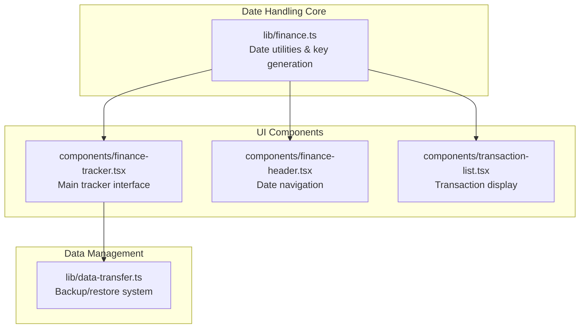
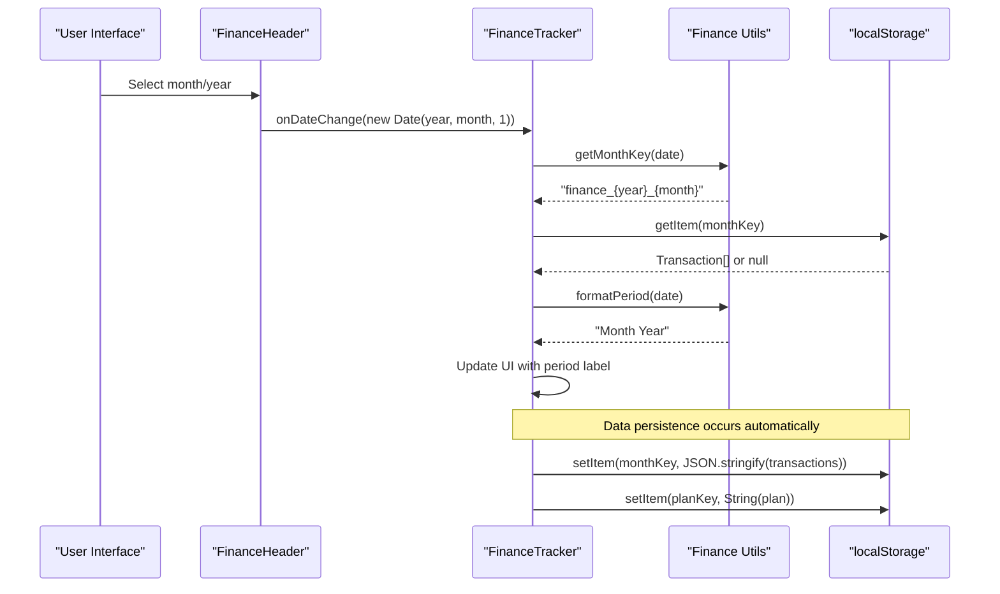
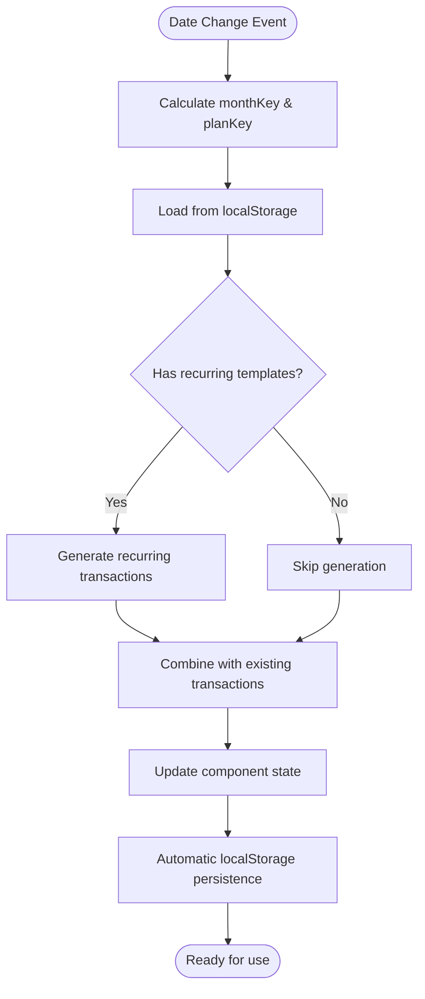
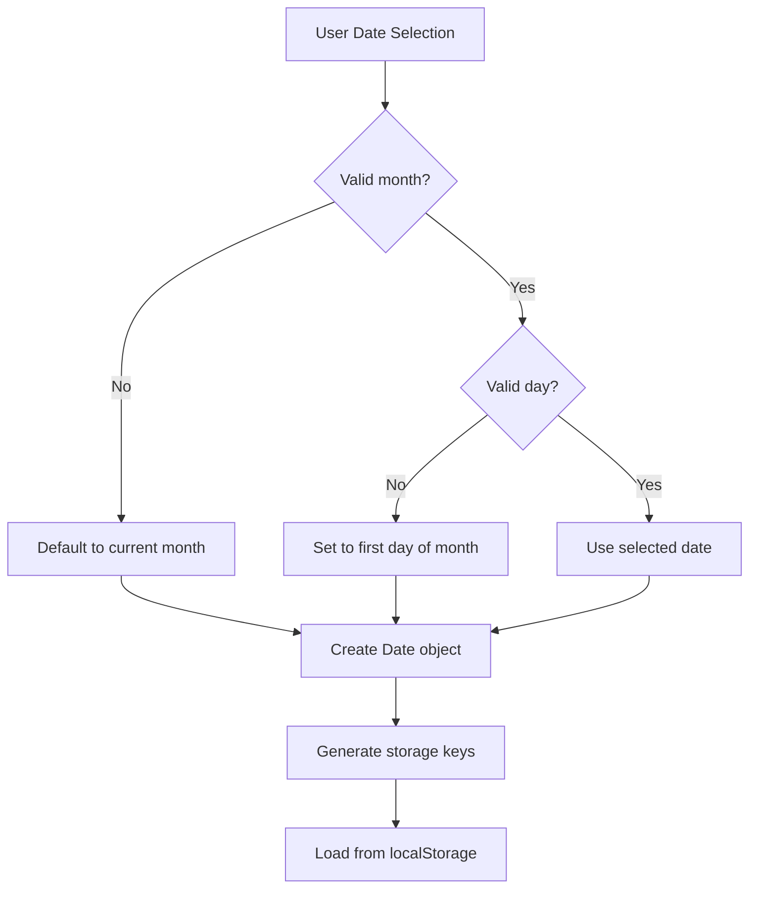
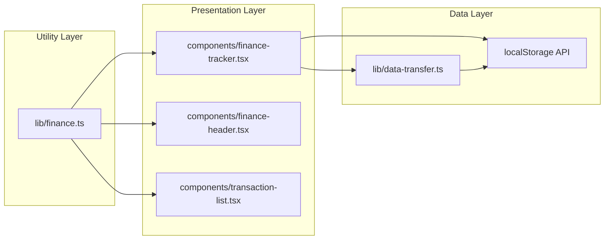

# Date Handling and Period Management

<cite>
**Referenced Files in This Document**
- [lib/finance.ts](file://lib/finance.ts)
- [components/finance-tracker.tsx](file://components/finance-tracker.tsx)
- [components/finance-header.tsx](file://components/finance-header.tsx)
- [components/transaction-list.tsx](file://components/transaction-list.tsx)
- [lib/data-transfer.ts](file://lib/data-transfer.ts)
</cite>

## Table of Contents
1. [Introduction](#introduction)
2. [Project Structure](#project-structure)
3. [Core Components](#core-components)
4. [Architecture Overview](#architecture-overview)
5. [Detailed Component Analysis](#detailed-component-analysis)
6. [Dependency Analysis](#dependency-analysis)
7. [Performance Considerations](#performance-considerations)
8. [Troubleshooting Guide](#troubleshooting-guide)
9. [Conclusion](#conclusion)

## Introduction

finTracker implements a sophisticated date handling system for financial period management that organizes monthly financial data using localStorage as the persistent storage layer. The system centers around three key date manipulation functions: `getMonthKey` and `getPlanKey` for generating storage keys, and `formatPeriod` for creating human-readable month-year strings. This documentation explores how the application manages financial periods, handles date-based data organization, and maintains consistency across browser sessions.

## Project Structure

The date handling system spans multiple components within the financial tracking application:



**Diagram sources**
- [lib/finance.ts:59-91](file://lib/finance.ts#L59-L91)
- [components/finance-tracker.tsx:85-87](file://components/finance-tracker.tsx#L85-L87)
- [components/finance-header.tsx:20-36](file://components/finance-header.tsx#L20-L36)

**Section sources**
- [lib/finance.ts:1-124](file://lib/finance.ts#L1-L124)
- [components/finance-tracker.tsx:1-1000](file://components/finance-tracker.tsx#L1-L1000)

## Core Components

The date handling system consists of three primary functions that work together to manage financial period data:

### Storage Key Generation Functions

The system generates two distinct key types for data organization:

**Monthly Financial Data Keys**: `finance_{year}_{month}` format
- Example: `finance_2024_03` for March 2024
- Used to store transaction arrays for specific months

**Monthly Plan Keys**: `plan_{year}_{month}` format  
- Example: `plan_2024_03` for March 2024 plan data
- Used to store monthly budget/forecast targets

### Period Formatting Functions

**Human-readable Period Strings**: Full month name + year
- Example: "March 2024" for March 2024
- Used in UI headers and labels

**Compact Date Display**: dd/mm/yyyy format
- Example: "15/03/2024" for March 15, 2024
- Used in transaction lists and forms

**Section sources**
- [lib/finance.ts:59-91](file://lib/finance.ts#L59-L91)

## Architecture Overview

The date handling system integrates seamlessly with the application's localStorage-based persistence layer:



**Diagram sources**
- [components/finance-header.tsx:33-36](file://components/finance-header.tsx#L33-L36)
- [components/finance-tracker.tsx:85-87](file://components/finance-tracker.tsx#L85-L87)
- [lib/finance.ts:59-84](file://lib/finance.ts#L59-L84)

The architecture ensures that:
- Date selection drives automatic data loading
- Storage keys remain consistent across sessions
- UI updates reflect current financial period
- Data persistence maintains historical records

## Detailed Component Analysis

### Date Utility Functions

The core date manipulation functions provide the foundation for all financial period operations:

```mermaid
classDiagram
class DateUtils {
+getMonthKey(date : Date) string
+getPlanKey(date : Date) string
+formatPeriod(date : Date) string
+formatShortDate(date : Date) string
}
class StorageKeys {
+finance_{year}_{month} : Transaction[]
+plan_{year}_{month} : number
}
class PeriodStrings {
+Month Year : string
+dd/mm/yyyy : string
}
DateUtils --> StorageKeys : "generates"
DateUtils --> PeriodStrings : "formats"
```

**Diagram sources**
- [lib/finance.ts:59-91](file://lib/finance.ts#L59-L91)

#### Key Implementation Details

**getMonthKey Function**: Creates unique identifiers for monthly transaction storage
- Uses zero-based month indexing with +1 adjustment
- Ensures two-digit month formatting with padStart
- Provides consistent key structure for localStorage operations

**getPlanKey Function**: Generates corresponding plan/target storage keys
- Mirrors the month key structure for plan data
- Enables separate persistence of budget/forecast values

**formatPeriod Function**: Produces human-readable month-year labels
- Utilizes predefined month name array for localization
- Returns full month name concatenated with four-digit year

**formatShortDate Function**: Implements compact dd/mm/yyyy date display
- Zero-padded day and month formatting
- Four-digit year representation
- Consistent date format across all transaction displays

### Financial Period Management Integration

The FinanceTracker component orchestrates date-based data management:



**Diagram sources**
- [components/finance-tracker.tsx:109-144](file://components/finance-tracker.tsx#L109-L144)
- [components/finance-tracker.tsx:146-164](file://components/finance-tracker.tsx#L146-L164)

**Section sources**
- [components/finance-tracker.tsx:85-164](file://components/finance-tracker.tsx#L85-L164)

### Date-Based Data Organization Patterns

The application implements several key patterns for organizing financial data by date:

**Monthly Isolation**: Each month maintains separate transaction arrays
- Prevents cross-month data contamination
- Enables independent budget planning per period
- Supports historical data retention without interference

**Key-Value Pair Structure**: localStorage stores organized key-value pairs
- Finance data stored under `finance_{year}_{month}` keys
- Plan data stored under `plan_{year}_{month}` keys
- Automatic cleanup when data becomes empty

**Historical Tracking**: Comprehensive month history maintained
- Export/import system preserves complete financial history
- Ability to review and manage past financial periods
- Support for data migration and backup scenarios

**Section sources**
- [lib/data-transfer.ts:24-35](file://lib/data-transfer.ts#L24-L35)
- [components/finance-tracker.tsx:882-900](file://components/finance-tracker.tsx#L882-L900)

### Date Validation and Boundary Handling

The system implements robust date validation and boundary management:



**Diagram sources**
- [components/finance-header.tsx:33-36](file://components/finance-header.tsx#L33-L36)
- [components/finance-tracker.tsx:384-389](file://components/finance-tracker.tsx#L384-L389)

**Section sources**
- [components/finance-header.tsx:33-36](file://components/finance-header.tsx#L33-L36)
- [components/finance-tracker.tsx:192-200](file://components/finance-tracker.tsx#L192-L200)

## Dependency Analysis

The date handling system demonstrates clean separation of concerns with minimal coupling:



**Diagram sources**
- [lib/finance.ts:59-91](file://lib/finance.ts#L59-L91)
- [components/finance-tracker.tsx:16-16](file://components/finance-tracker.tsx#L16-L16)
- [lib/data-transfer.ts:14-54](file://lib/data-transfer.ts#L14-L54)

**Section sources**
- [lib/finance.ts:59-91](file://lib/finance.ts#L59-L91)
- [components/finance-tracker.tsx:16-16](file://components/finance-tracker.tsx#L16-L16)

## Performance Considerations

The date handling system is designed for optimal performance:

**Efficient Key Generation**: O(1) operations for key creation and parsing
- Minimal string manipulation operations
- Direct array access for month name resolution
- Single pass date formatting with built-in padding

**Memory Optimization**: Lazy loading of monthly data
- Data loaded only when month changes
- Automatic cleanup when transactions are empty
- Efficient localStorage key iteration for backup operations

**UI Responsiveness**: Memoized calculations prevent unnecessary re-renders
- useMemo hooks for derived values
- Stable key generation prevents component re-mounting
- Batched localStorage operations during bulk updates

## Troubleshooting Guide

Common date handling issues and their solutions:

**Issue: Incorrect Month Display**
- Verify month index calculation uses `getMonth() + 1`
- Check padStart formatting for single-digit months
- Ensure consistent date object construction

**Issue: Data Not Loading for Selected Month**
- Confirm localStorage key format matches `finance_{year}_{month}`
- Verify date object initialization uses `new Date(year, month, 1)`
- Check for localStorage quota limitations

**Issue: Date Validation Failures**
- Implement proper bounds checking for month values (0-11)
- Validate day values against month length using `new Date(year, month+1, 0).getDate()`
- Handle leap year calculations automatically through Date API

**Issue: Backup/Restore Problems**
- Verify FinanceBackup schema includes both data and plans sections
- Ensure key prefixes (`finance_`, `plan_`) match generation functions
- Check JSON serialization/deserialization for complex date objects

**Section sources**
- [lib/finance.ts:59-91](file://lib/finance.ts#L59-L91)
- [lib/data-transfer.ts:82-87](file://lib/data-transfer.ts#L82-L87)

## Conclusion

finTracker's date handling system provides a robust foundation for financial period management through carefully designed utility functions and integration patterns. The system successfully balances simplicity with functionality, enabling users to efficiently manage financial data across multiple months while maintaining data integrity and performance. The clear separation between date utilities, UI components, and data management layers ensures maintainability and extensibility for future enhancements.

The implementation demonstrates best practices in client-side financial data management, including proper key generation, efficient data organization, comprehensive backup capabilities, and user-friendly date formatting. This foundation supports both individual financial tracking needs and potential expansion to support more complex financial modeling scenarios.