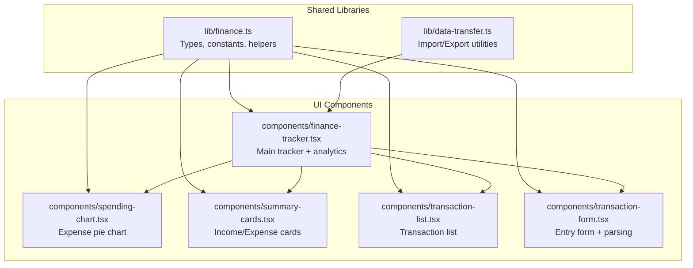
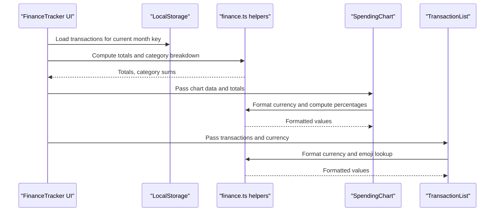
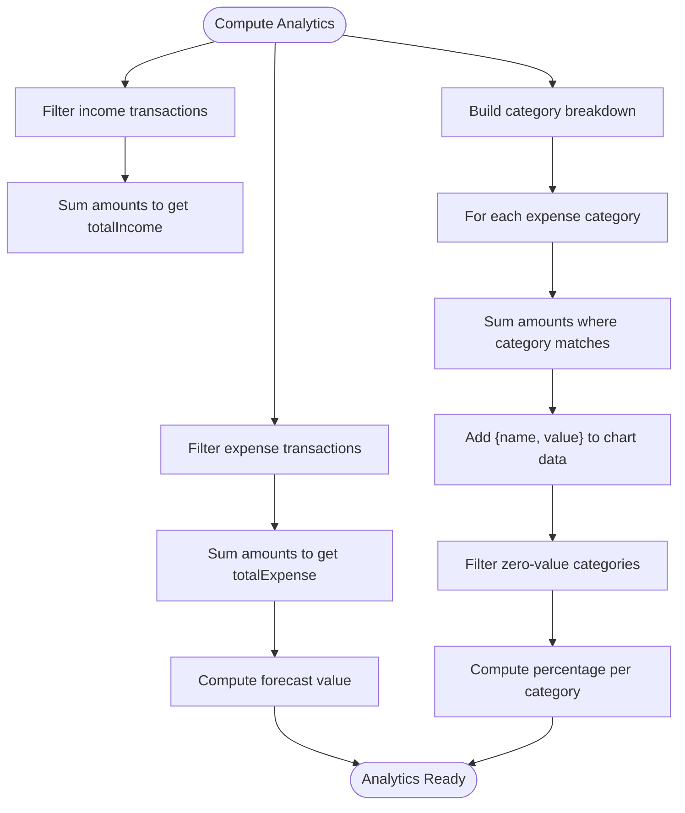
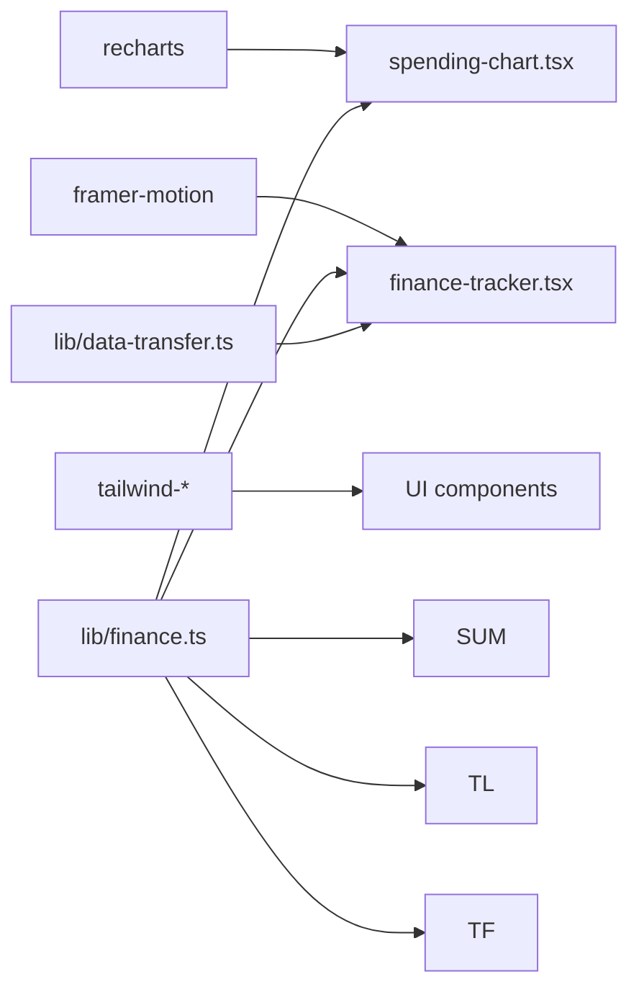

# Financial Analytics and Aggregation

<cite>
**Referenced Files in This Document**
- [finance.ts](file://lib/finance.ts)
- [data-transfer.ts](file://lib/data-transfer.ts)
- [finance-tracker.tsx](file://components/finance-tracker.tsx)
- [spending-chart.tsx](file://components/spending-chart.tsx)
- [summary-cards.tsx](file://components/summary-cards.tsx)
- [transaction-list.tsx](file://components/transaction-list.tsx)
- [transaction-form.tsx](file://components/transaction-form.tsx)
- [package.json](file://package.json)
</cite>

## Table of Contents
1. [Introduction](#introduction)
2. [Project Structure](#project-structure)
3. [Core Components](#core-components)
4. [Architecture Overview](#architecture-overview)
5. [Detailed Component Analysis](#detailed-component-analysis)
6. [Dependency Analysis](#dependency-analysis)
7. [Performance Considerations](#performance-considerations)
8. [Troubleshooting Guide](#troubleshooting-guide)
9. [Conclusion](#conclusion)

## Introduction
This document describes finTracker's financial analytics engine, focusing on category-based financial analysis, income vs expense tracking, spending breakdown by category, and monthly financial summaries. It explains the mathematical operations for totals, percentages, and financial ratios, documents aggregation patterns for trend analysis, and covers the data structures used for financial calculations. It also provides examples of analytics computations and discusses performance considerations for real-time analytics and large datasets, along with UI integration for displaying financial insights and charts.

## Project Structure
The financial analytics engine is implemented primarily in TypeScript/React components and shared libraries:
- Shared financial data types and utilities live in `lib/finance.ts`
- Data import/export utilities are in `lib/data-transfer.ts`
- The main financial tracker UI and analytics logic are in `components/finance-tracker.tsx`
- Supporting UI components for charts and summaries are in `components/spending-chart.tsx`, `components/summary-cards.tsx`, `components/transaction-list.tsx`, and `components/transaction-form.tsx`
- Dependencies are managed in `package.json`, including Recharts for visualization

**Diagram sources**
- [finance.ts:1-124](file://lib/finance.ts#L1-L124)
- [data-transfer.ts:1-115](file://lib/data-transfer.ts#L1-L115)
- [finance-tracker.tsx:1-545](file://components/finance-tracker.tsx#L1-L545)
- [spending-chart.tsx:1-96](file://components/spending-chart.tsx#L1-L96)
- [summary-cards.tsx:1-50](file://components/summary-cards.tsx#L1-L50)
- [transaction-list.tsx:1-102](file://components/transaction-list.tsx#L1-L102)
- [transaction-form.tsx:1-461](file://components/transaction-form.tsx#L1-L461)

**Section sources**
- [finance.ts:1-124](file://lib/finance.ts#L1-L124)
- [data-transfer.ts:1-115](file://lib/data-transfer.ts#L1-L115)
- [finance-tracker.tsx:1-545](file://components/finance-tracker.tsx#L1-L545)
- [spending-chart.tsx:1-96](file://components/spending-chart.tsx#L1-L96)
- [summary-cards.tsx:1-50](file://components/summary-cards.tsx#L1-L50)
- [transaction-list.tsx:1-102](file://components/transaction-list.tsx#L1-L102)
- [transaction-form.tsx:1-461](file://components/transaction-form.tsx#L1-L461)
- [package.json:1-73](file://package.json#L1-L73)

## Core Components
- Financial data types and constants:
  - Category definitions for income and expense, including names, emojis, icons, and colors
  - Transaction type, currency code, and destination types
  - Transaction shape with id, amount, category, type, date, optional metadata
  - Helper functions for category emoji lookup, month/plan key generation, period formatting, short date formatting, currency conversion, and localized formatting
- Analytics computation:
  - Total income and total expense per period
  - Expense distribution by category for pie chart visualization
  - Forecast value based on current daily average and remaining days in the month
- Data persistence:
  - Local storage keys for transactions, plans, balances, recurring templates, quick templates, and currency
  - Import/export of all financial data with validation

**Section sources**
- [finance.ts:1-124](file://lib/finance.ts#L1-L124)
- [finance-tracker.tsx:176-200](file://components/finance-tracker.tsx#L176-L200)
- [data-transfer.ts:1-115](file://lib/data-transfer.ts#L1-L115)

## Architecture Overview
The analytics pipeline follows a reactive data flow:
- UI components compute analytics from in-memory transaction lists
- Local storage persists transactions and plans keyed by month
- Charts consume computed data structures for rendering
- Import/export utilities serialize/deserialize the persisted data

**Diagram sources**
- [finance-tracker.tsx:109-144](file://components/finance-tracker.tsx#L109-L144)
- [finance-tracker.tsx:176-200](file://components/finance-tracker.tsx#L176-L200)
- [spending-chart.tsx:16-95](file://components/spending-chart.tsx#L16-L95)
- [transaction-list.tsx:14-101](file://components/transaction-list.tsx#L14-L101)
- [finance.ts:54-124](file://lib/finance.ts#L54-L124)

## Detailed Component Analysis

### Financial Data Types and Helpers
- Category hierarchy:
  - Income categories: Salary, Bonus, Freelance, Other
  - Expense categories: Grocery, Restaurants, Entertainment, Housing & Utilities, Gifts, Games, Personal
  - Each category includes name, emoji, icon name, and color for UI
- Transaction model:
  - Fields: id, amount, category, type ("income"|"expense"), date (short format), optional name, recurringId, destination ("card"|"cash"|"savings")
- Keys and formatting:
  - Month key: "finance_{year}_{month}"
  - Plan key: "plan_{year}_{month}"
  - Period formatter: "Month Year"
  - Short date formatter: "dd/mm/yyyy"
- Currency and conversion:
  - Supported currencies: UAH, USD, EUR
  - Conversion rates to base UAH
  - Localized formatting with currency symbol and sign handling

**Section sources**
- [finance.ts:1-35](file://lib/finance.ts#L1-L35)
- [finance.ts:43-52](file://lib/finance.ts#L43-L52)
- [finance.ts:59-91](file://lib/finance.ts#L59-L91)
- [finance.ts:93-124](file://lib/finance.ts#L93-L124)

### Analytics Computation Engine
- Totals:
  - Total income: sum of all transactions where type is "income"
  - Total expense: sum of all transactions where type is "expense"
- Category breakdown:
  - For each expense category, sum amounts where category matches
  - Filter out zero-value categories for chart display
- Percentages:
  - For each category, percentage = (categorySum / totalExpense) * 100
- Forecast value:
  - Current month only: compute average daily expense so far
  - Days left in the month: daysInMonth - currentDay
  - Forecast = plannedIncome - totalExpense - avgDaily * daysLeft
- Trend analysis:
  - Historical view loads all months from local storage
  - Computes per-month income and expense totals
  - Sorts by year/month descending for display

**Diagram sources**
- [finance-tracker.tsx:176-200](file://components/finance-tracker.tsx#L176-L200)
- [finance-tracker.tsx:183-190](file://components/finance-tracker.tsx#L183-L190)
- [spending-chart.tsx:50-69](file://components/spending-chart.tsx#L50-L69)

**Section sources**
- [finance-tracker.tsx:176-200](file://components/finance-tracker.tsx#L176-L200)
- [finance-tracker.tsx:183-190](file://components/finance-tracker.tsx#L183-L190)
- [spending-chart.tsx:50-69](file://components/spending-chart.tsx#L50-L69)

### Data Structures for Financial Calculations
- CategoryInfo: name, emoji, iconName, color
- Transaction: id, amount, category, type, date, optional name/recurringId/destination
- ChartDatum: name, value (used for pie chart)
- FinanceBackup: versioned structure for import/export with data map and plans map

**Section sources**
- [finance.ts:1-35](file://lib/finance.ts#L1-L35)
- [finance.ts:43-52](file://lib/finance.ts#L43-L52)
- [finance.ts:16-35](file://lib/finance.ts#L16-L35)
- [data-transfer.ts:3-12](file://lib/data-transfer.ts#L3-L12)

### Transaction Entry and Editing
- Amount parsing:
  - Supports decimal normalization and basic arithmetic expressions
  - Clipboard smart parsing detects amounts and merchant keywords to auto-fill category
- Balance adjustments:
  - Adding income updates balances based on destination
  - Editing reverses old balance changes before applying new ones
  - Deleting reverses balance changes for the deleted transaction
- Transfer mode:
  - Transfers between card/cash/savings recorded as income transactions for tracking

**Section sources**
- [finance-tracker.tsx:210-264](file://components/finance-tracker.tsx#L210-L264)
- [finance-tracker.tsx:266-307](file://components/finance-tracker.tsx#L266-L307)
- [finance-tracker.tsx:331-346](file://components/finance-tracker.tsx#L331-L346)
- [finance-tracker.tsx:348-373](file://components/finance-tracker.tsx#L348-L373)
- [transaction-form.tsx:24-57](file://components/transaction-form.tsx#L24-L57)

### UI Components for Analytics Display
- Summary cards:
  - Displays total income and total expense with currency formatting and directional coloring
- Spending chart:
  - Renders a pie chart of expense categories with percentage bars and category colors
  - Shows forecast value with color-coded indicator
- Transaction list:
  - Lists transactions with direction indicators, category emojis, and optional destination badges
- History view:
  - Lists past months with computed income/expense totals and delete actions

**Section sources**
- [summary-cards.tsx:10-47](file://components/summary-cards.tsx#L10-L47)
- [spending-chart.tsx:16-95](file://components/spending-chart.tsx#L16-L95)
- [transaction-list.tsx:14-101](file://components/transaction-list.tsx#L14-L101)
- [finance-tracker.tsx:868-999](file://components/finance-tracker.tsx#L868-L999)

### Import/Export and Backup
- Export:
  - Iterates localStorage, collects "finance_" and "plan_" keys, serializes to JSON
- Import:
  - Validates version and structure, clears existing keys, writes imported data
  - Triggers UI reload to reflect imported transactions and plans

**Section sources**
- [data-transfer.ts:14-54](file://lib/data-transfer.ts#L14-L54)
- [data-transfer.ts:56-114](file://lib/data-transfer.ts#L56-L114)
- [finance-tracker.tsx:535-542](file://components/finance-tracker.tsx#L535-L542)

## Dependency Analysis
- External libraries:
  - Recharts for responsive pie charts and data visualization
  - Framer Motion for animations
  - Tailwind CSS and related utilities for styling
- Internal dependencies:
  - finance.ts provides types, constants, and helpers used across components
  - data-transfer.ts depends on finance.ts types for serialization
  - UI components depend on finance.ts for formatting and category data

**Diagram sources**
- [package.json:57-57](file://package.json#L57-L57)
- [finance.ts:1-124](file://lib/finance.ts#L1-L124)
- [data-transfer.ts:1-115](file://lib/data-transfer.ts#L1-L115)
- [finance-tracker.tsx:1-545](file://components/finance-tracker.tsx#L1-L545)
- [spending-chart.tsx:1-96](file://components/spending-chart.tsx#L1-L96)
- [summary-cards.tsx:1-50](file://components/summary-cards.tsx#L1-L50)
- [transaction-list.tsx:1-102](file://components/transaction-list.tsx#L1-L102)
- [transaction-form.tsx:1-461](file://components/transaction-form.tsx#L1-L461)

**Section sources**
- [package.json:11-61](file://package.json#L11-L61)
- [finance.ts:1-124](file://lib/finance.ts#L1-L124)
- [data-transfer.ts:1-115](file://lib/data-transfer.ts#L1-L115)
- [finance-tracker.tsx:1-545](file://components/finance-tracker.tsx#L1-L545)
- [spending-chart.tsx:1-96](file://components/spending-chart.tsx#L1-L96)
- [summary-cards.tsx:1-50](file://components/summary-cards.tsx#L1-L50)
- [transaction-list.tsx:1-102](file://components/transaction-list.tsx#L1-L102)
- [transaction-form.tsx:1-461](file://components/transaction-form.tsx#L1-L461)

## Performance Considerations
- Real-time analytics:
  - Totals and category breakdown are computed via filter/reduce on the current month's transactions
  - For large datasets, consider memoizing computations and using efficient aggregations
- Rendering:
  - Pie chart re-renders when data changes; ensure data arrays are stable to minimize re-renders
  - Use shallow comparisons for props to avoid unnecessary updates
- Storage:
  - Local storage operations are synchronous; batch writes and avoid frequent reads/writes during rapid edits
- Formatting:
  - Currency formatting uses locale-aware APIs; cache formatted strings when possible
- Forecast computation:
  - Avoid recomputing forecast on every render; use useMemo with stable dependencies

[No sources needed since this section provides general guidance]

## Troubleshooting Guide
- Import/Export errors:
  - Verify backup file version and structure; invalid formats will trigger error messages
  - Ensure all data entries are arrays of transaction-like objects
- Transaction editing/deletion:
  - Balance adjustments rely on reversing previous changes; confirm destinations and types match expectations
- Clipboard parsing:
  - Smart paste requires valid numeric amounts and recognized merchant keywords; otherwise falls back to amount-only parsing
- Currency display:
  - Selected currency affects formatting; ensure conversion rates are set for desired currency

**Section sources**
- [data-transfer.ts:70-114](file://lib/data-transfer.ts#L70-L114)
- [finance-tracker.tsx:266-307](file://components/finance-tracker.tsx#L266-L307)
- [finance-tracker.tsx:331-346](file://components/finance-tracker.tsx#L331-L346)
- [transaction-form.tsx:45-57](file://components/transaction-form.tsx#L45-L57)

## Conclusion
finTracker's financial analytics engine centers on straightforward, reactive computations over local storage-backed transactions. The system provides immediate insights through summary cards, category breakdowns, and forecasts, while maintaining flexibility for historical analysis and data portability via import/export. By leveraging memoization, stable data structures, and efficient aggregations, the engine can scale to larger datasets and support real-time user interactions.