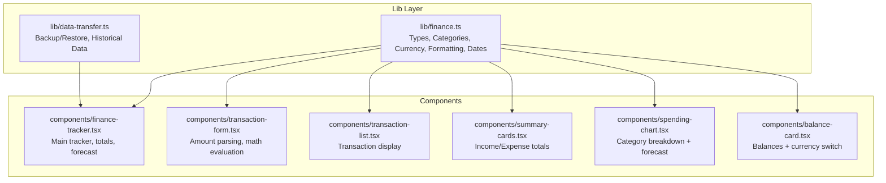
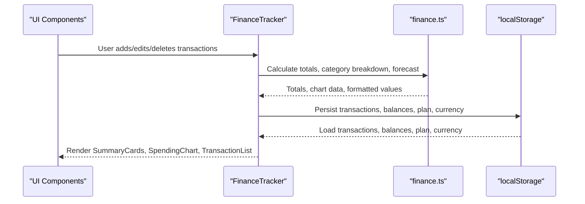
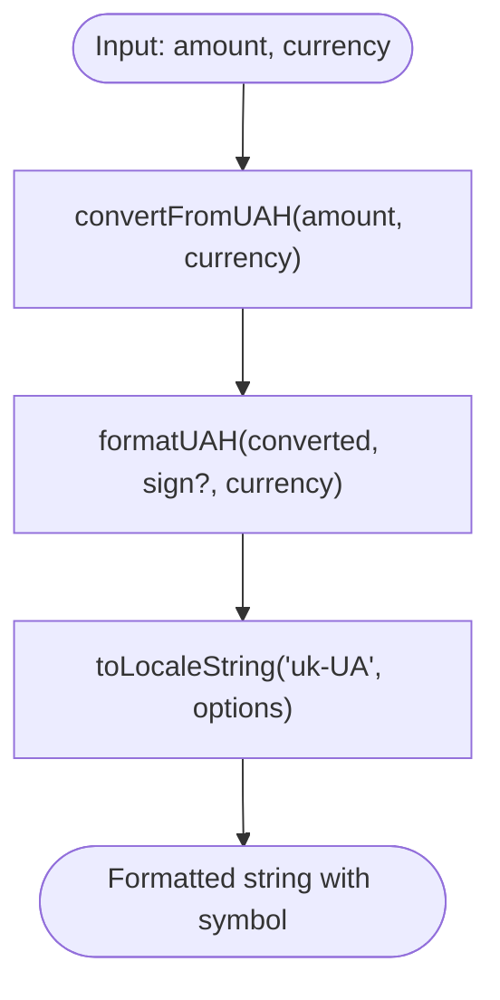
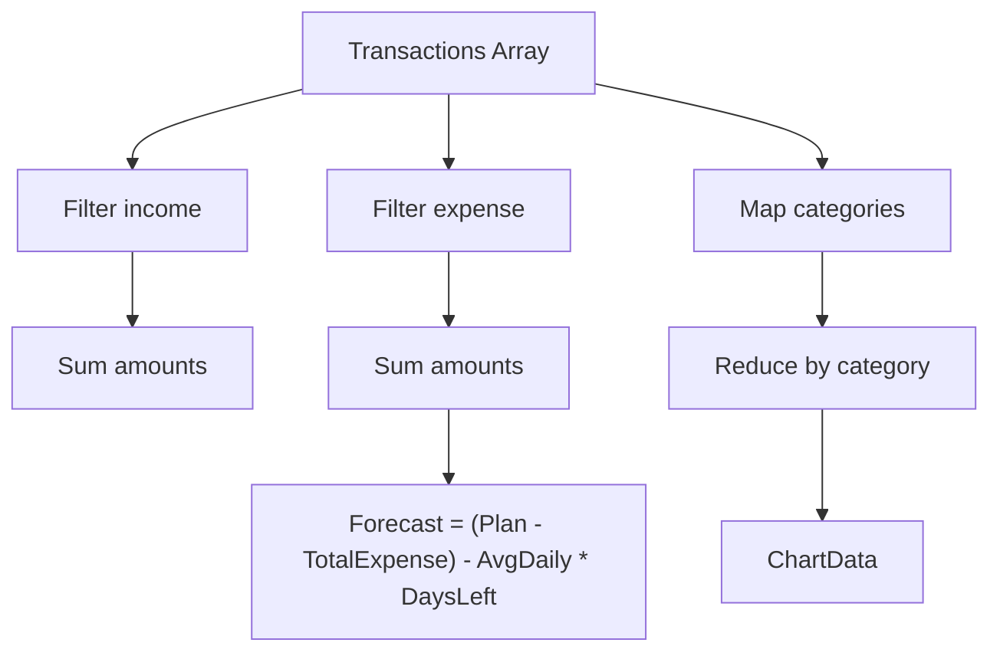
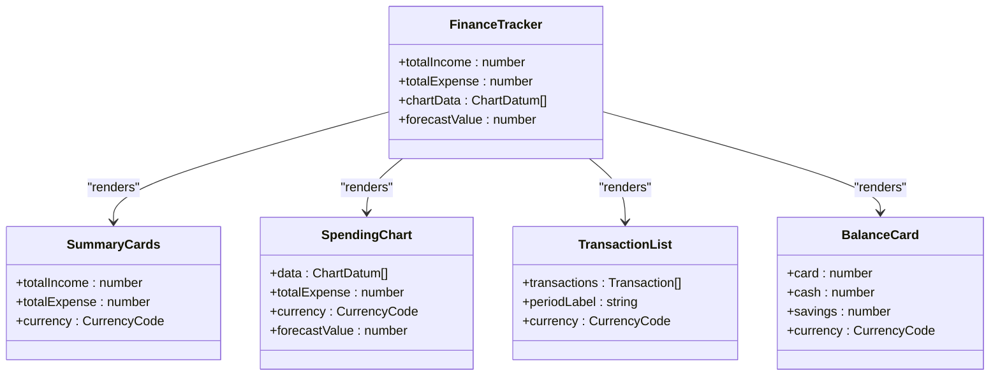
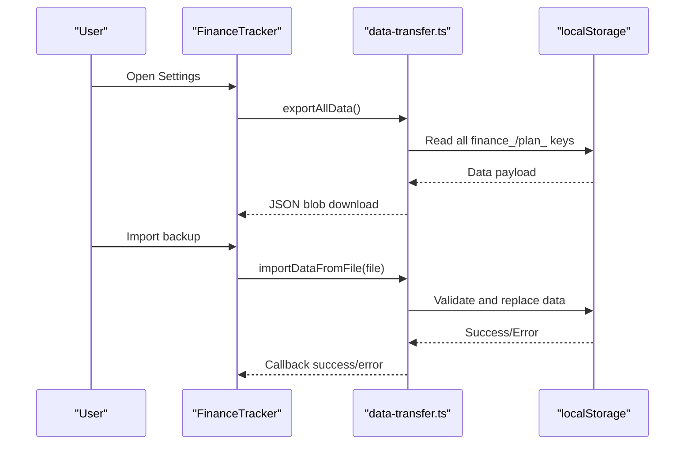
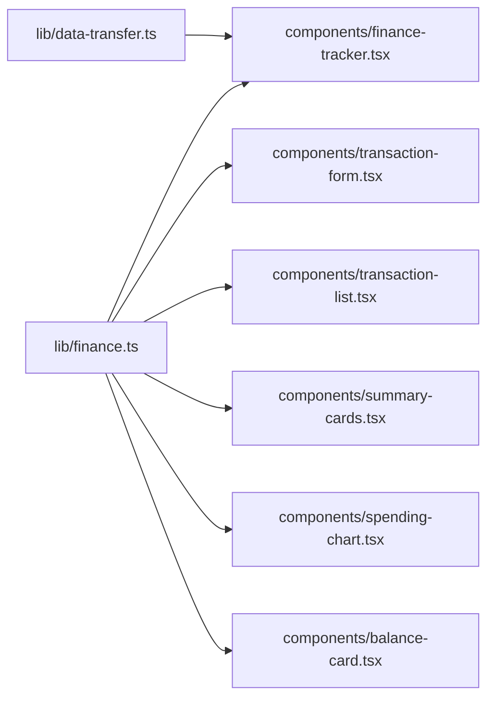

# Financial Calculations and Analytics

<cite>
**Referenced Files in This Document**
- [finance.ts](file://lib/finance.ts)
- [finance-tracker.tsx](file://components/finance-tracker.tsx)
- [transaction-form.tsx](file://components/transaction-form.tsx)
- [transaction-list.tsx](file://components/transaction-list.tsx)
- [summary-cards.tsx](file://components/summary-cards.tsx)
- [spending-chart.tsx](file://components/spending-chart.tsx)
- [balance-card.tsx](file://components/balance-card.tsx)
- [data-transfer.ts](file://lib/data-transfer.ts)
</cite>

## Table of Contents
1. [Introduction](#introduction)
2. [Project Structure](#project-structure)
3. [Core Components](#core-components)
4. [Architecture Overview](#architecture-overview)
5. [Detailed Component Analysis](#detailed-component-analysis)
6. [Dependency Analysis](#dependency-analysis)
7. [Performance Considerations](#performance-considerations)
8. [Troubleshooting Guide](#troubleshooting-guide)
9. [Conclusion](#conclusion)

## Introduction
This document provides comprehensive documentation for finTracker's financial calculation engine. It covers the currency conversion system (UAH, USD, EUR), formatting utilities for monetary values, category-based financial analytics (income vs expense tracking, spending breakdown by category, and percentage calculations), date handling for month navigation and historical data management, and mathematical operations for financial summaries, totals, and forecasts. It also includes examples of currency conversion calculations, financial ratio computations, and data aggregation patterns, along with precision handling and performance considerations for real-time analytics.

## Project Structure
The financial calculation engine is primarily implemented in the `lib/finance.ts` module and consumed by several UI components under `components/`. Data persistence and historical management are handled by `lib/data-transfer.ts`.

**Diagram sources**
- [finance.ts:1-124](file://lib/finance.ts#L1-L124)
- [finance-tracker.tsx:1-545](file://components/finance-tracker.tsx#L1-L545)
- [transaction-form.tsx:1-448](file://components/transaction-form.tsx#L1-L448)
- [transaction-list.tsx:1-102](file://components/transaction-list.tsx#L1-L102)
- [summary-cards.tsx:1-49](file://components/summary-cards.tsx#L1-L49)
- [spending-chart.tsx:1-95](file://components/spending-chart.tsx#L1-L95)
- [balance-card.tsx:1-79](file://components/balance-card.tsx#L1-L79)
- [data-transfer.ts:1-115](file://lib/data-transfer.ts#L1-L115)

**Section sources**
- [finance.ts:1-124](file://lib/finance.ts#L1-L124)
- [finance-tracker.tsx:1-545](file://components/finance-tracker.tsx#L1-L545)
- [data-transfer.ts:1-115](file://lib/data-transfer.ts#L1-L115)

## Core Components

### Currency Conversion System
- Supported currencies: UAH, USD, EUR
- Base unit: Ukrainian Hryvnia (UAH)
- Exchange rates are defined as fixed multipliers relative to UAH
- Symbols: ₴ (UAH), $ (USD), € (EUR)
- Conversion function converts from UAH to target currency using predefined rates
- Formatting function displays amounts with locale-aware formatting and currency symbol

Key constants and functions:
- Currency code type union
- Currency rate mapping
- Currency symbol mapping
- Conversion function
- Monetary formatting function with sign and symbol

**Section sources**
- [finance.ts:39-123](file://lib/finance.ts#L39-L123)

### Formatting Utilities
- Localized formatting using Ukrainian locale
- Dynamic fraction digits based on whether the value is a whole number
- Maximum two decimals for currency display
- Optional plus/minus sign formatting
- Category emoji lookup for visual indicators

**Section sources**
- [finance.ts:54-57](file://lib/finance.ts#L54-L57)
- [finance.ts:109-123](file://lib/finance.ts#L109-L123)

### Category-Based Financial Analytics
- Categories for income and expenses with names, emojis, icons, and colors
- Color palette for consistent visual representation
- Aggregation of expenses by category for pie charts and spending breakdown
- Percentage calculations derived from category totals and total expenses

**Section sources**
- [finance.ts:1-37](file://lib/finance.ts#L1-L37)
- [finance.ts:37-37](file://lib/finance.ts#L37-L37)
- [spending-chart.tsx:16-81](file://components/spending-chart.tsx#L16-L81)

### Date Handling System
- Month key generation for localStorage organization
- Plan key generation for monthly budgets
- Period formatting for display (e.g., "January 2025")
- Short date formatting for transaction records
- Navigation helpers for moving between months

**Section sources**
- [finance.ts:59-91](file://lib/finance.ts#L59-L91)

### Mathematical Operations for Financial Summaries
- Total income calculation by filtering and summing income transactions
- Total expense calculation by filtering and summing expense transactions
- Spending breakdown by category using reduce operations
- Forecast computation based on current day-of-month, days in month, and average daily expenses

**Section sources**
- [finance-tracker.tsx:176-200](file://components/finance-tracker.tsx#L176-L200)
- [finance-tracker.tsx:183-190](file://components/finance-tracker.tsx#L183-L190)

## Architecture Overview

**Diagram sources**
- [finance-tracker.tsx:176-200](file://components/finance-tracker.tsx#L176-L200)
- [finance.ts:109-123](file://lib/finance.ts#L109-L123)
- [data-transfer.ts:14-54](file://lib/data-transfer.ts#L14-L54)

## Detailed Component Analysis

### Currency Conversion and Formatting Engine
The core engine resides in `lib/finance.ts` and provides:
- Strongly typed currency codes and exchange rates
- Conversion from UAH to target currency
- Locale-aware formatting with dynamic fraction digits
- Sign-aware formatting for positive/negative values
- Category metadata for UI integration

**Diagram sources**
- [finance.ts:105-123](file://lib/finance.ts#L105-L123)

**Section sources**
- [finance.ts:93-123](file://lib/finance.ts#L93-L123)

### Financial Analytics Pipeline
The main tracker computes:
- Totals: income and expense sums
- Category breakdown: per-category expense totals
- Forecast: projected remaining balance based on average daily spending

**Diagram sources**
- [finance-tracker.tsx:176-200](file://components/finance-tracker.tsx#L176-L200)
- [finance-tracker.tsx:183-190](file://components/finance-tracker.tsx#L183-L190)

**Section sources**
- [finance-tracker.tsx:176-200](file://components/finance-tracker.tsx#L176-L200)
- [finance-tracker.tsx:183-190](file://components/finance-tracker.tsx#L183-L190)

### UI Integration Points
- Summary cards display income and expense totals using the formatting engine
- Spending chart renders category breakdown with percentages and forecast
- Transaction list shows individual entries with localized amounts and category emojis
- Balance card supports currency switching and displays balances

**Diagram sources**
- [finance-tracker.tsx:418-438](file://components/finance-tracker.tsx#L418-L438)
- [summary-cards.tsx:4-8](file://components/summary-cards.tsx#L4-L8)
- [spending-chart.tsx:9-14](file://components/spending-chart.tsx#L9-L14)
- [transaction-list.tsx:6-12](file://components/transaction-list.tsx#L6-L12)
- [balance-card.tsx:1-79](file://components/balance-card.tsx#L1-L79)

**Section sources**
- [summary-cards.tsx:10-49](file://components/summary-cards.tsx#L10-L49)
- [spending-chart.tsx:16-95](file://components/spending-chart.tsx#L16-L95)
- [transaction-list.tsx:14-102](file://components/transaction-list.tsx#L14-L102)
- [balance-card.tsx:32-79](file://components/balance-card.tsx#L32-L79)

### Data Persistence and Historical Management
- Backup/restore of all financial data and plans
- Export includes versioning and timestamp
- Import validates backup format and replaces existing data
- Historical view aggregates past months' income and expenses

**Diagram sources**
- [data-transfer.ts:14-54](file://lib/data-transfer.ts#L14-L54)
- [data-transfer.ts:56-114](file://lib/data-transfer.ts#L56-L114)
- [finance-tracker.tsx:535-542](file://components/finance-tracker.tsx#L535-L542)

**Section sources**
- [data-transfer.ts:1-115](file://lib/data-transfer.ts#L1-L115)
- [finance-tracker.tsx:859-991](file://components/finance-tracker.tsx#L859-L991)

## Dependency Analysis

**Diagram sources**
- [finance.ts:1-124](file://lib/finance.ts#L1-L124)
- [finance-tracker.tsx:1-545](file://components/finance-tracker.tsx#L1-L545)
- [transaction-form.tsx:1-448](file://components/transaction-form.tsx#L1-L448)
- [transaction-list.tsx:1-102](file://components/transaction-list.tsx#L1-L102)
- [summary-cards.tsx:1-49](file://components/summary-cards.tsx#L1-L49)
- [spending-chart.tsx:1-95](file://components/spending-chart.tsx#L1-L95)
- [balance-card.tsx:1-79](file://components/balance-card.tsx#L1-L79)
- [data-transfer.ts:1-115](file://lib/data-transfer.ts#L1-L115)

**Section sources**
- [finance.ts:1-124](file://lib/finance.ts#L1-L124)
- [finance-tracker.tsx:1-545](file://components/finance-tracker.tsx#L1-L545)

## Performance Considerations
- Efficient aggregation using single-pass filters and reduce operations
- Memoization of forecast calculations to avoid recomputation on unrelated state changes
- Minimal DOM updates by rendering only changed segments (React state updates)
- Local storage operations batched during import/export to reduce overhead
- Formatting performed once per render cycle with locale caching by browser

[No sources needed since this section provides general guidance]

## Troubleshooting Guide
Common issues and resolutions:
- Invalid backup format: Ensure the backup file has the correct version and structure before importing
- Malformed transaction entries: Import process skips malformed entries; verify transaction arrays
- Currency mismatch: Currency selection persists across sessions; verify local storage key presence
- Forecast anomalies: Forecast depends on current day-of-month and days in month; verify date calculations

**Section sources**
- [data-transfer.ts:64-114](file://lib/data-transfer.ts#L64-L114)
- [finance-tracker.tsx:119-124](file://components/finance-tracker.tsx#L119-L124)

## Conclusion
finTracker's financial calculation engine provides a robust foundation for multi-currency support, localized formatting, category-based analytics, and historical data management. The modular design in `lib/finance.ts` enables consistent behavior across UI components, while efficient aggregation and memoization ensure responsive real-time analytics. The currency conversion system uses a fixed-rate model suitable for budgeting scenarios, and the formatting utilities deliver precise, localized monetary displays. Together, these components form a scalable and maintainable financial analytics platform.