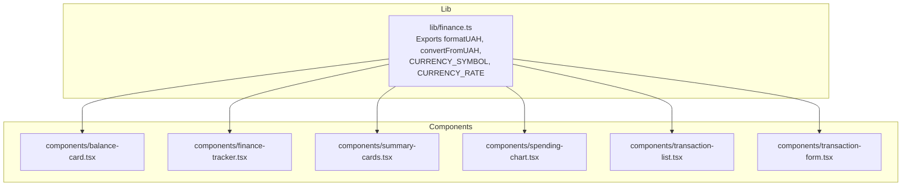
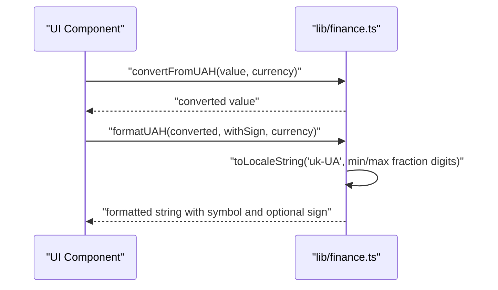
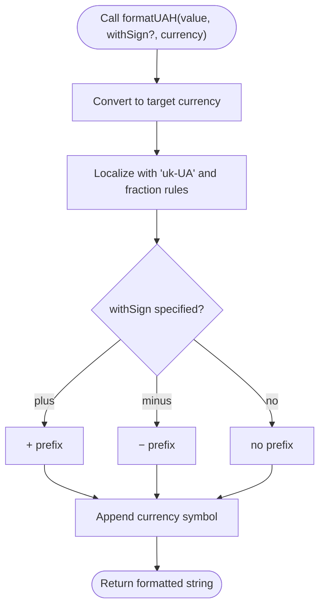
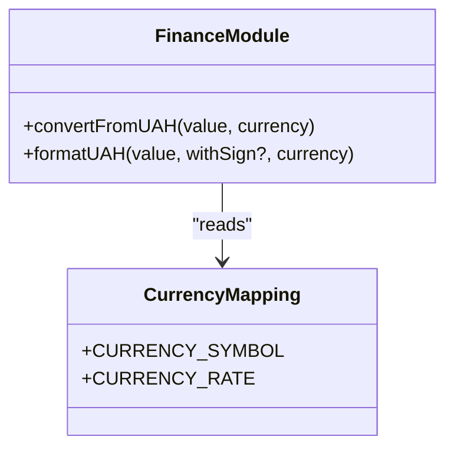
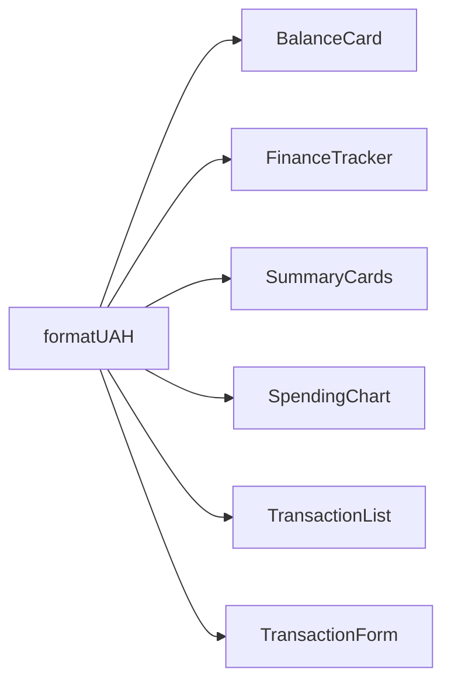
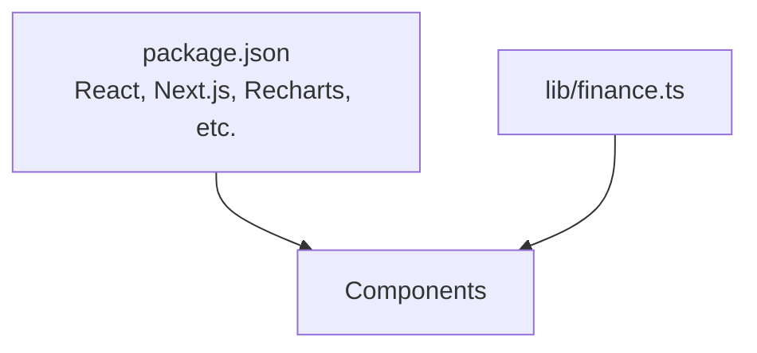

# Monetary Formatting and Display

<cite>
**Referenced Files in This Document**
- [finance.ts](file://lib/finance.ts)
- [balance-card.tsx](file://components/balance-card.tsx)
- [finance-tracker.tsx](file://components/finance-tracker.tsx)
- [summary-cards.tsx](file://components/summary-cards.tsx)
- [spending-chart.tsx](file://components/spending-chart.tsx)
- [transaction-list.tsx](file://components/transaction-list.tsx)
- [transaction-form.tsx](file://components/transaction-form.tsx)
- [package.json](file://package.json)
</cite>

## Table of Contents
1. [Introduction](#introduction)
2. [Project Structure](#project-structure)
3. [Core Components](#core-components)
4. [Architecture Overview](#architecture-overview)
5. [Detailed Component Analysis](#detailed-component-analysis)
6. [Dependency Analysis](#dependency-analysis)
7. [Performance Considerations](#performance-considerations)
8. [Troubleshooting Guide](#troubleshooting-guide)
9. [Conclusion](#conclusion)

## Introduction
This document explains finTracker’s monetary formatting system with a focus on the formatUAH function. It covers localized number formatting for the Ukrainian locale, automatic handling of fractional digits for whole versus decimal amounts, optional sign display (+/-), currency symbol integration, and consistent display across views. It also outlines locale-specific formatting rules, demonstrates typical outputs for common and edge cases, and discusses internationalization considerations and customization options for other locales.

## Project Structure
The monetary formatting logic is centralized in a single library module and consumed by multiple UI components across the application.

**Diagram sources**
- [finance.ts:93-123](file://lib/finance.ts#L93-L123)
- [balance-card.tsx:1-80](file://components/balance-card.tsx#L1-L80)
- [finance-tracker.tsx:940-991](file://components/finance-tracker.tsx#L940-L991)
- [summary-cards.tsx:1-50](file://components/summary-cards.tsx#L1-L50)
- [spending-chart.tsx:1-96](file://components/spending-chart.tsx#L1-L96)
- [transaction-list.tsx:50-102](file://components/transaction-list.tsx#L50-L102)
- [transaction-form.tsx:140-339](file://components/transaction-form.tsx#L140-L339)

**Section sources**
- [finance.ts:93-123](file://lib/finance.ts#L93-L123)
- [balance-card.tsx:1-80](file://components/balance-card.tsx#L1-L80)
- [finance-tracker.tsx:940-991](file://components/finance-tracker.tsx#L940-L991)
- [summary-cards.tsx:1-50](file://components/summary-cards.tsx#L1-L50)
- [spending-chart.tsx:1-96](file://components/spending-chart.tsx#L1-L96)
- [transaction-list.tsx:50-102](file://components/transaction-list.tsx#L50-L102)
- [transaction-form.tsx:140-339](file://components/transaction-form.tsx#L140-L339)

## Core Components
- formatUAH(value, withSign?, currency?): Central formatter for monetary values with Ukrainian locale support, automatic fraction digit handling, optional sign, and currency symbol.
- convertFromUAH(value, currency): Converts a base amount (stored internally in UAH) to the target currency using fixed rates.
- CURRENCY_SYMBOL and CURRENCY_RATE: Mappings for currency codes to symbols and conversion multipliers.

Key behaviors:
- Locale-aware formatting using the Ukrainian ("uk-UA") locale.
- Fraction digits:
  - Whole numbers: show no fractional part.
  - Decimals: show exactly two fractional digits.
- Sign display:
  - withSign unspecified: no prefix.
  - withSign "plus": prefix "+".
  - withSign "minus": prefix "-".
- Currency symbol appended after the formatted number.

**Section sources**
- [finance.ts:93-123](file://lib/finance.ts#L93-L123)

## Architecture Overview
The formatting pipeline is consistent across all components. Values are converted from the internal base (UAH) to the selected currency, then localized and formatted according to Ukrainian rules, and finally decorated with a currency symbol and optional sign.

**Diagram sources**
- [finance.ts:105-123](file://lib/finance.ts#L105-L123)

## Detailed Component Analysis

### formatUAH Implementation
- Input: numeric amount, optional sign mode, target currency code.
- Conversion: converts to target currency using fixed rates.
- Localization: uses Ukrainian locale with dynamic fraction digits.
- Decoration: appends currency symbol; optionally adds "+" or "-" prefix.

**Diagram sources**
- [finance.ts:109-123](file://lib/finance.ts#L109-L123)

**Section sources**
- [finance.ts:109-123](file://lib/finance.ts#L109-L123)

### Currency Conversion and Symbols
- Base unit: UAH (internal storage).
- Rates: fixed multipliers per currency.
- Symbols: Ukrainian Hryvnia (₴), US Dollar ($), Euro (€).

**Diagram sources**
- [finance.ts:93-107](file://lib/finance.ts#L93-L107)

**Section sources**
- [finance.ts:93-107](file://lib/finance.ts#L93-L107)

### Usage Across Views
- Balance card: displays global, card, cash, and savings totals with currency switching.
- Finance tracker: shows monthly income and expenses with explicit sign modes.
- Summary cards: renders total income and expenses with sign-aware formatting.
- Spending chart: shows category totals and forecasts with consistent currency display.
- Transaction list: formats individual transaction amounts with sign derived from direction.
- Transaction form: previews calculated expressions in the current currency.

**Diagram sources**
- [finance.ts:109-123](file://lib/finance.ts#L109-L123)
- [balance-card.tsx:30-49](file://components/balance-card.tsx#L30-L49)
- [finance-tracker.tsx:945-949](file://components/finance-tracker.tsx#L945-L949)
- [summary-cards.tsx:27-44](file://components/summary-cards.tsx#L27-L44)
- [spending-chart.tsx:66-91](file://components/spending-chart.tsx#L66-L91)
- [transaction-list.tsx:55-56](file://components/transaction-list.tsx#L55-L56)
- [transaction-form.tsx:148-149](file://components/transaction-form.tsx#L148-L149)

**Section sources**
- [balance-card.tsx:30-49](file://components/balance-card.tsx#L30-L49)
- [finance-tracker.tsx:945-949](file://components/finance-tracker.tsx#L945-L949)
- [summary-cards.tsx:27-44](file://components/summary-cards.tsx#L27-L44)
- [spending-chart.tsx:66-91](file://components/spending-chart.tsx#L66-L91)
- [transaction-list.tsx:55-56](file://components/transaction-list.tsx#L55-L56)
- [transaction-form.tsx:148-149](file://components/transaction-form.tsx#L148-L149)

## Dependency Analysis
- Internal dependencies:
  - All components depend on formatUAH and related currency helpers from lib/finance.ts.
- External dependencies:
  - React and Next.js power the UI rendering and localization behavior.
  - The browser’s built-in Intl API supplies locale-aware number formatting.

**Diagram sources**
- [package.json:11-61](file://package.json#L11-L61)
- [finance.ts:109-123](file://lib/finance.ts#L109-L123)

**Section sources**
- [package.json:11-61](file://package.json#L11-L61)
- [finance.ts:109-123](file://lib/finance.ts#L109-L123)

## Performance Considerations
- Avoid unnecessary re-conversions: cache converted values when rendering lists of transactions or charts.
- Batch updates: when currency changes, update the selected currency state once and re-render affected components.
- Memoization: consider memoizing formatted strings if the same values are displayed frequently.

## Troubleshooting Guide
Common issues and resolutions:
- Unexpected trailing zeros: ensure the value passed to formatUAH is not coerced to a string prematurely; pass a number so fraction rules apply.
- Incorrect sign: verify the intended sign mode and confirm Math.abs is used when appropriate (e.g., in summary cards).
- Wrong currency symbol: confirm the selected currency code matches one of the supported codes and that the symbol mapping is correct.
- Locale formatting mismatch: the "uk-UA" locale governs grouping and decimal separators; if different behavior is expected, adjust locale or implement a custom formatter.

**Section sources**
- [finance.ts:109-123](file://lib/finance.ts#L109-L123)

## Conclusion
The formatUAH function provides a robust, centralized mechanism for monetary formatting tailored to Ukrainian locale conventions. Its integration across multiple UI components ensures consistent display of balances, incomes, expenses, and transaction amounts. The design supports flexible sign presentation and currency switching while maintaining readability and correctness for both whole and fractional amounts.