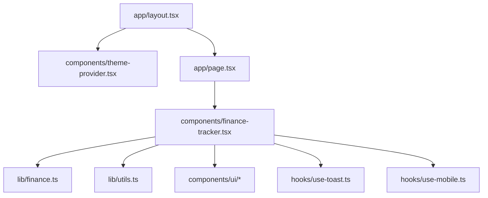
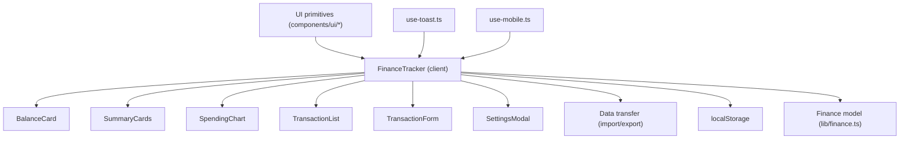
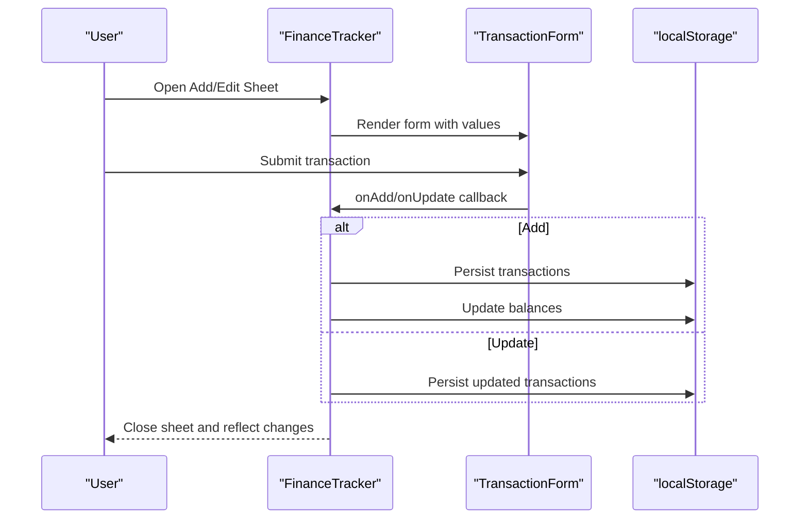
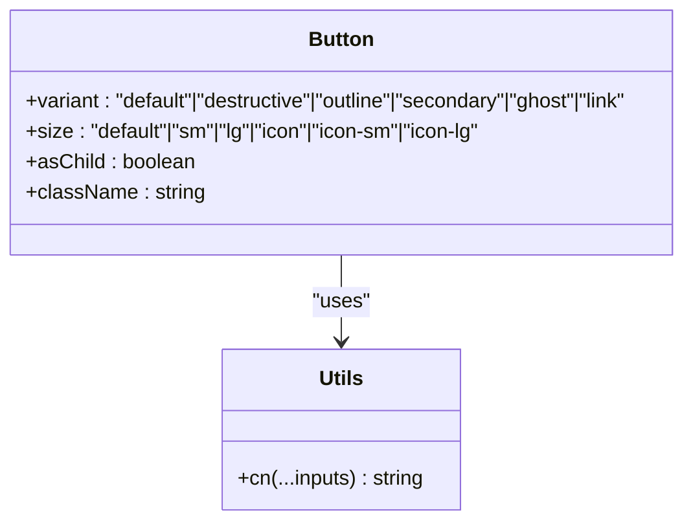
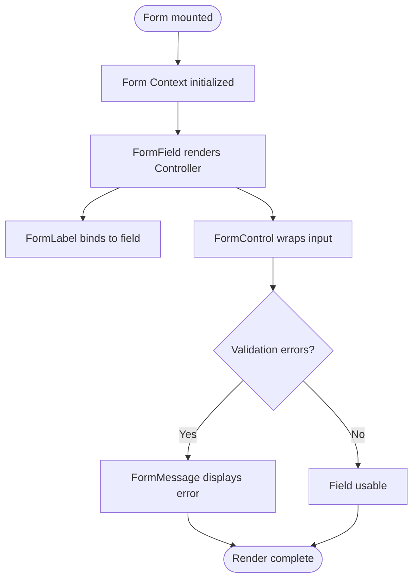
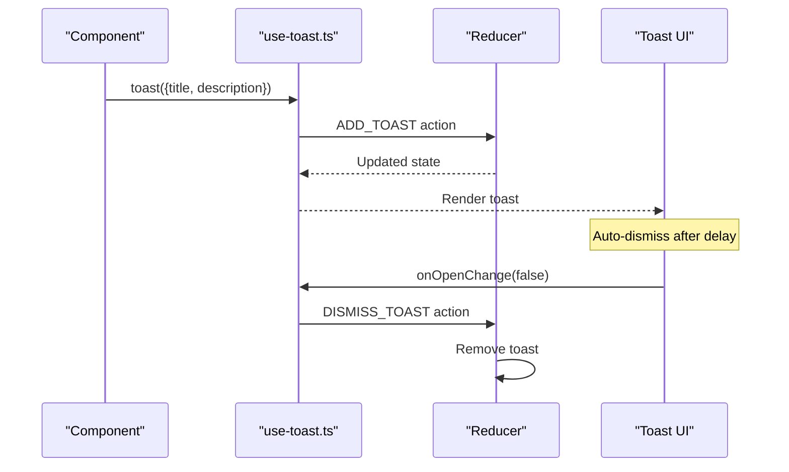
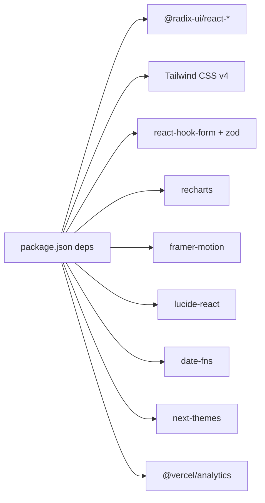

# Contributing and Development Guidelines

<cite>
**Referenced Files in This Document**
- [package.json](file://package.json)
- [tsconfig.json](file://tsconfig.json)
- [next.config.mjs](file://next.config.mjs)
- [postcss.config.mjs](file://postcss.config.mjs)
- [next-env.d.ts](file://next-env.d.ts)
- [app/layout.tsx](file://app/layout.tsx)
- [app/page.tsx](file://app/page.tsx)
- [components/theme-provider.tsx](file://components/theme-provider.tsx)
- [lib/utils.ts](file://lib/utils.ts)
- [lib/finance.ts](file://lib/finance.ts)
- [components/finance-tracker.tsx](file://components/finance-tracker.tsx)
- [components/ui/button.tsx](file://components/ui/button.tsx)
- [components/ui/form.tsx](file://components/ui/form.tsx)
- [hooks/use-toast.ts](file://hooks/use-toast.ts)
- [hooks/use-mobile.ts](file://hooks/use-mobile.ts)
</cite>

## Table of Contents
1. [Introduction](#introduction)
2. [Project Structure](#project-structure)
3. [Core Components](#core-components)
4. [Architecture Overview](#architecture-overview)
5. [Detailed Component Analysis](#detailed-component-analysis)
6. [Dependency Analysis](#dependency-analysis)
7. [Performance Considerations](#performance-considerations)
8. [Troubleshooting Guide](#troubleshooting-guide)
9. [Contribution Workflow](#contribution-workflow)
10. [Testing and Quality Standards](#testing-and-quality-standards)
11. [Development Environment Setup](#development-environment-setup)
12. [Debugging Procedures](#debugging-procedures)
13. [Release Process and Versioning](#release-process-and-versioning)
14. [Skill Requirements and Onboarding](#skill-requirements-and-onboarding)
15. [Extending Functionality and Backward Compatibility](#extending-functionality-and-backward-compatibility)
16. [Conclusion](#conclusion)

## Introduction
This document provides comprehensive contributing and development guidelines for finTracker. It covers code style conventions, TypeScript configuration, development standards, component development patterns, naming conventions, architectural principles, contribution workflow, testing and quality expectations, environment setup, debugging, troubleshooting, release process, versioning, and onboarding for new contributors.

## Project Structure
The project follows a Next.js App Router structure with a clear separation of concerns:
- app/: Application shell, metadata, fonts, and global styles
- components/: Reusable UI components and feature-specific components
- hooks/: Custom React hooks
- lib/: Shared utilities and domain logic
- public/: Static assets
- styles/: Global CSS

**Diagram sources**
- [app/layout.tsx:1-53](file://app/layout.tsx#L1-L53)
- [app/page.tsx:1-6](file://app/page.tsx#L1-L6)
- [components/finance-tracker.tsx:1-520](file://components/finance-tracker.tsx#L1-L520)
- [lib/finance.ts:1-124](file://lib/finance.ts#L1-L124)
- [lib/utils.ts:1-7](file://lib/utils.ts#L1-L7)
- [components/theme-provider.tsx:1-12](file://components/theme-provider.tsx#L1-L12)
- [hooks/use-toast.ts:1-192](file://hooks/use-toast.ts#L1-L192)
- [hooks/use-mobile.ts:1-20](file://hooks/use-mobile.ts#L1-L20)

**Section sources**
- [app/layout.tsx:1-53](file://app/layout.tsx#L1-L53)
- [app/page.tsx:1-6](file://app/page.tsx#L1-L6)
- [components/finance-tracker.tsx:1-520](file://components/finance-tracker.tsx#L1-L520)

## Core Components
- Theme provider: Wraps the app with theme support for light/dark modes.
- Finance tracker: Central component orchestrating state, persistence, and UI composition.
- UI primitives: Consistent design system built on Radix UI and Tailwind CSS.
- Hooks: Reusable logic for mobile detection and toast notifications.

Key conventions:
- Strict TypeScript configuration with noEmit and strict mode enabled.
- Path aliases (@/*) configured for clean imports.
- Tailwind CSS v4 with class merging utilities for responsive design.
- Next.js App Router with server/client directives and metadata.

**Section sources**
- [components/theme-provider.tsx:1-12](file://components/theme-provider.tsx#L1-L12)
- [lib/utils.ts:1-7](file://lib/utils.ts#L1-L7)
- [tsconfig.json:1-42](file://tsconfig.json#L1-L42)
- [next.config.mjs:1-12](file://next.config.mjs#L1-L12)
- [postcss.config.mjs:1-9](file://postcss.config.mjs#L1-L9)

## Architecture Overview
The application is a single-page React application using Next.js App Router. The central FinanceTracker component manages local state, persists data to localStorage, and composes smaller components for UI and UX.

**Diagram sources**
- [components/finance-tracker.tsx:57-520](file://components/finance-tracker.tsx#L57-L520)
- [lib/finance.ts:1-124](file://lib/finance.ts#L1-L124)
- [hooks/use-toast.ts:1-192](file://hooks/use-toast.ts#L1-L192)
- [hooks/use-mobile.ts:1-20](file://hooks/use-mobile.ts#L1-L20)

## Detailed Component Analysis

### FinanceTracker Component
Central orchestrator managing:
- Local state for transactions, balances, plan, and UI flags
- Persistence via localStorage keys per month and plan
- Recurring templates and quick templates
- Currency conversion and formatting
- Bottom sheet modal for adding/editing transactions
- Settings modal for balances, plan, templates, and import/export

**Diagram sources**
- [components/finance-tracker.tsx:209-281](file://components/finance-tracker.tsx#L209-L281)
- [components/finance-tracker.tsx:146-174](file://components/finance-tracker.tsx#L146-L174)

**Section sources**
- [components/finance-tracker.tsx:57-520](file://components/finance-tracker.tsx#L57-L520)
- [lib/finance.ts:1-124](file://lib/finance.ts#L1-L124)

### UI Button Primitive
Reusable button component with variant and size variants, supporting radix-ui slot pattern and class merging.

**Diagram sources**
- [components/ui/button.tsx:1-61](file://components/ui/button.tsx#L1-L61)
- [lib/utils.ts:1-7](file://lib/utils.ts#L1-L7)

**Section sources**
- [components/ui/button.tsx:1-61](file://components/ui/button.tsx#L1-L61)
- [lib/utils.ts:1-7](file://lib/utils.ts#L1-L7)

### Form System
Radix UI-based form system with react-hook-form integration, providing controlled field behavior, validation, and accessibility attributes.

**Diagram sources**
- [components/ui/form.tsx:1-168](file://components/ui/form.tsx#L1-L168)

**Section sources**
- [components/ui/form.tsx:1-168](file://components/ui/form.tsx#L1-L168)

### Toast Hook
Centralized toast notification system with queue limits and auto-dismiss timers.

**Diagram sources**
- [hooks/use-toast.ts:142-169](file://hooks/use-toast.ts#L142-L169)
- [hooks/use-toast.ts:74-127](file://hooks/use-toast.ts#L74-L127)

**Section sources**
- [hooks/use-toast.ts:1-192](file://hooks/use-toast.ts#L1-L192)

### Mobile Detection Hook
Responsive hook detecting mobile breakpoints for adaptive UI.

**Section sources**
- [hooks/use-mobile.ts:1-20](file://hooks/use-mobile.ts#L1-L20)

## Dependency Analysis
External libraries and their roles:
- UI primitives: @radix-ui/react-* ecosystem
- Styling: Tailwind CSS v4, class-variance-authority, clsx, tailwind-merge
- Forms: react-hook-form, @hookform/resolvers, zod
- Charts: recharts
- Animations: framer-motion
- Icons: lucide-react
- Date/time: date-fns
- Analytics: @vercel/analytics
- Theming: next-themes

**Diagram sources**
- [package.json:11-61](file://package.json#L11-L61)

**Section sources**
- [package.json:11-73](file://package.json#L11-L73)

## Performance Considerations
- Prefer memoization for derived data (e.g., chart data) to avoid recomputation.
- Use localStorage efficiently by batching writes and avoiding unnecessary updates.
- Keep UI transitions minimal; leverage motion only where it adds value.
- Optimize rendering by splitting large components and using lazy loading where appropriate.
- Minimize heavy computations in render paths; move to callbacks or effects.

## Troubleshooting Guide
Common development issues and resolutions:
- TypeScript errors during build: Review tsconfig strictness and plugin configuration.
- Tailwind classes not applied: Verify Tailwind CSS v4 configuration and class merging.
- Next.js type generation: Ensure next-env.d.ts is present and included.
- Local storage persistence: Confirm keys and JSON parsing logic in FinanceTracker.
- Form validation: Check react-hook-form resolver and zod schema alignment.

**Section sources**
- [tsconfig.json:1-42](file://tsconfig.json#L1-L42)
- [next-env.d.ts:1-7](file://next-env.d.ts#L1-L7)
- [components/finance-tracker.tsx:109-174](file://components/finance-tracker.tsx#L109-L174)
- [components/ui/form.tsx:1-168](file://components/ui/form.tsx#L1-L168)

## Contribution Workflow
Issue reporting:
- Search existing issues before filing.
- Provide reproduction steps, expected vs. actual behavior, and environment details.

Feature requests:
- Describe the problem being solved and proposed solution.
- Include mockups or wireframes if helpful.

Pull request process:
- Fork the repository and branch from main.
- Keep commits focused and include tests where applicable.
- Reference related issues in commit messages.
- Ensure lint passes and builds successfully.
- Request reviews from maintainers; address feedback promptly.

## Testing and Quality Standards
Quality expectations:
- Write unit tests for pure functions and hooks.
- Snapshot or component tests for UI primitives.
- End-to-end tests for critical user flows (add/update/delete transactions).
- Lint checks and TypeScript strictness must pass.

Testing requirements:
- Run linter and type checks locally before submitting PRs.
- Maintain test coverage for new features and bug fixes.

## Development Environment Setup
Prerequisites:
- Node.js LTS and npm
- Git

Steps:
1. Clone the repository
2. Install dependencies: npm ci
3. Start development server: npm run dev
4. Open http://localhost:3000

Configuration highlights:
- TypeScript strict mode enabled with no emit
- Next.js TypeScript ignoreBuildErrors configured
- Tailwind CSS v4 PostCSS plugin configured

**Section sources**
- [package.json:5-10](file://package.json#L5-L10)
- [next.config.mjs:1-12](file://next.config.mjs#L1-L12)
- [tsconfig.json:1-42](file://tsconfig.json#L1-L42)
- [postcss.config.mjs:1-9](file://postcss.config.mjs#L1-L9)

## Debugging Procedures
- Use browser DevTools to inspect component tree and state.
- Enable React DevTools for component inspection.
- Leverage console logs strategically; remove before committing.
- Use Next.js dev server logs for runtime errors.
- For form issues, log react-hook-form watch/useFormState values.

## Release Process and Versioning
Versioning strategy:
- Follow semantic versioning (MAJOR.MINOR.PATCH)
- Increment MAJOR for breaking changes, MINOR for features, PATCH for fixes

Release process:
- Update changelog entries with changes, bug fixes, and breaking changes
- Tag releases and publish to package registries if applicable
- Announce releases with highlights and migration notes

## Skill Requirements and Onboarding
Required skills:
- React and Next.js fundamentals
- TypeScript proficiency
- Tailwind CSS and responsive design
- State management patterns (useState/useEffect/useContext)
- Basic understanding of localStorage and browser APIs

Onboarding steps:
- Review project structure and component hierarchy
- Run the development server and explore UI
- Understand the FinanceTracker state lifecycle
- Make small UI tweaks and submit PRs

## Extending Functionality and Backward Compatibility
Guidelines for extensions:
- Maintain backward compatibility for persisted keys and data shapes
- Introduce new keys for new features; migrate gracefully
- Keep UI components modular and reusable
- Add new categories and colors thoughtfully
- Preserve localStorage migration paths when evolving data models

Backward compatibility tips:
- Version keys for major data structures (e.g., balances_v1)
- Provide fallbacks for missing or malformed data
- Avoid removing or renaming persisted keys