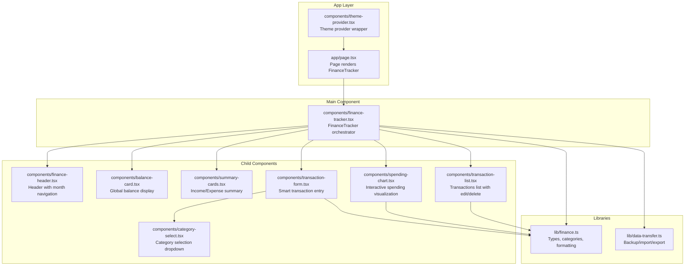
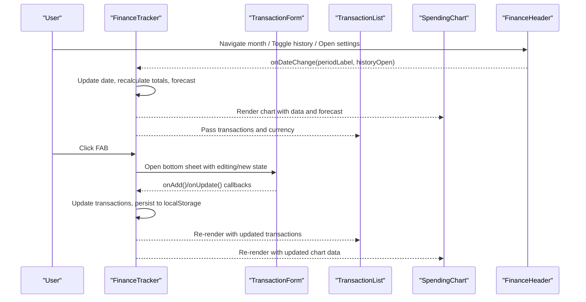
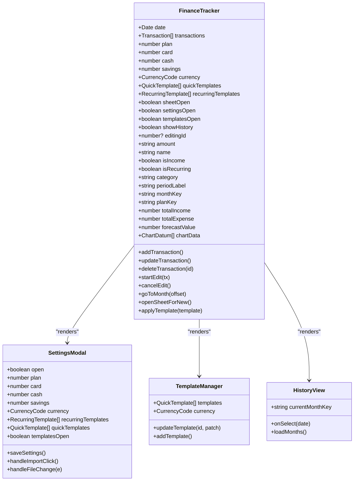
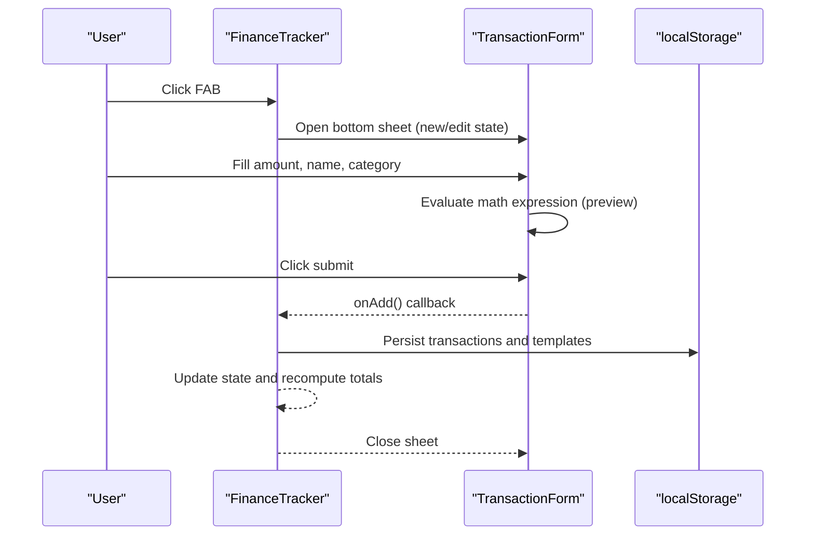
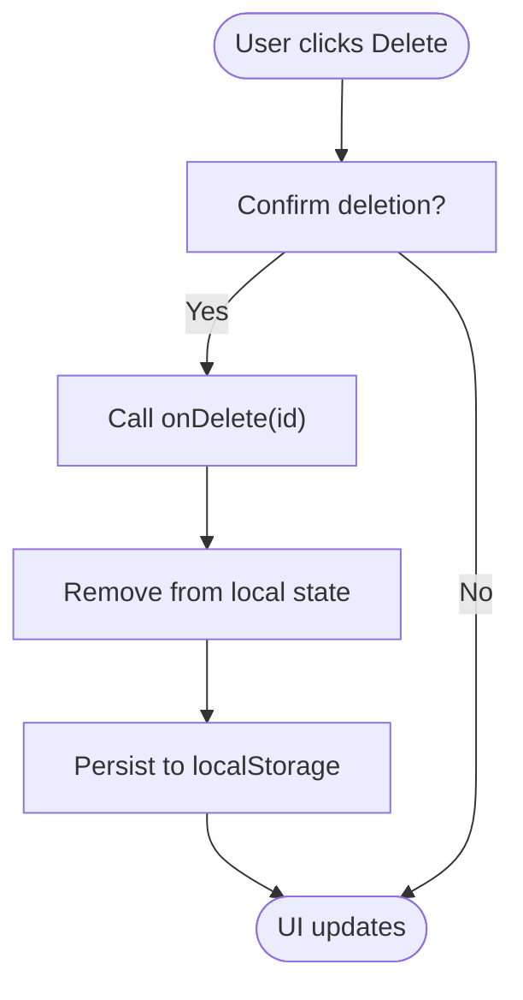
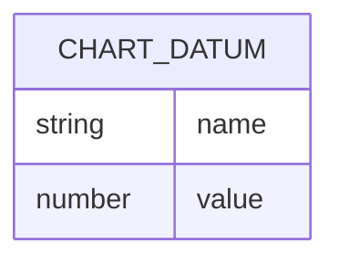
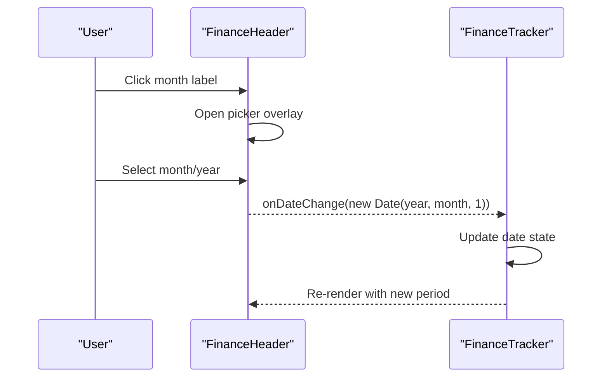
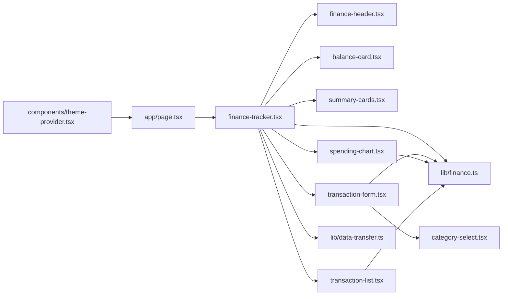

# Core Components

<cite>
**Referenced Files in This Document**
- [finance-tracker.tsx](file://components/finance-tracker.tsx)
- [transaction-form.tsx](file://components/transaction-form.tsx)
- [transaction-list.tsx](file://components/transaction-list.tsx)
- [spending-chart.tsx](file://components/spending-chart.tsx)
- [finance-header.tsx](file://components/finance-header.tsx)
- [category-select.tsx](file://components/category-select.tsx)
- [balance-card.tsx](file://components/balance-card.tsx)
- [summary-cards.tsx](file://components/summary-cards.tsx)
- [finance.ts](file://lib/finance.ts)
- [data-transfer.ts](file://lib/data-transfer.ts)
- [page.tsx](file://app/page.tsx)
- [theme-provider.tsx](file://components/theme-provider.tsx)
- [package.json](file://package.json)
</cite>

## Table of Contents
1. [Introduction](#introduction)
2. [Project Structure](#project-structure)
3. [Core Components](#core-components)
4. [Architecture Overview](#architecture-overview)
5. [Detailed Component Analysis](#detailed-component-analysis)
6. [Dependency Analysis](#dependency-analysis)
7. [Performance Considerations](#performance-considerations)
8. [Troubleshooting Guide](#troubleshooting-guide)
9. [Conclusion](#conclusion)

## Introduction
This document provides comprehensive documentation for finTracker’s core components. It focuses on the main FinanceTracker component as the central orchestrator managing state and coordinating child components, along with detailed coverage of TransactionForm, TransactionList, SpendingChart, and FinanceHeader. It explains component props, state management, event handling, integration patterns, usage examples, customization options, and best practices. It also describes how components compose to deliver the complete user experience.

## Project Structure
The application follows a component-driven architecture with a single-page entry point. The FinanceTracker component orchestrates child components and manages persistent state using localStorage. Supporting libraries provide shared types, formatting utilities, and data transfer functions.

**Diagram sources**
- [page.tsx:1-6](file://app/page.tsx#L1-L6)
- [finance-tracker.tsx:1-461](file://components/finance-tracker.tsx#L1-L461)
- [finance-header.tsx:1-129](file://components/finance-header.tsx#L1-L129)
- [balance-card.tsx:1-80](file://components/balance-card.tsx#L1-L80)
- [summary-cards.tsx:1-50](file://components/summary-cards.tsx#L1-L50)
- [spending-chart.tsx:1-96](file://components/spending-chart.tsx#L1-L96)
- [transaction-list.tsx:1-92](file://components/transaction-list.tsx#L1-L92)
- [transaction-form.tsx:1-401](file://components/transaction-form.tsx#L1-L401)
- [category-select.tsx:1-163](file://components/category-select.tsx#L1-L163)
- [finance.ts:1-122](file://lib/finance.ts#L1-L122)
- [data-transfer.ts:1-115](file://lib/data-transfer.ts#L1-L115)

**Section sources**
- [page.tsx:1-6](file://app/page.tsx#L1-L6)
- [finance-tracker.tsx:1-461](file://components/finance-tracker.tsx#L1-L461)
- [finance.ts:1-122](file://lib/finance.ts#L1-L122)
- [data-transfer.ts:1-115](file://lib/data-transfer.ts#L1-L115)

## Core Components
This section introduces the primary components and their roles within the application.

- FinanceTracker: Central orchestrator managing state, persistence, and coordination of child components. Handles transactions, balances, charts, settings, and history.
- TransactionForm: Smart transaction entry with clipboard parsing, math evaluation, quick templates, and recurring transaction support.
- TransactionList: Displays, edits, and deletes transactions with category and amount formatting.
- SpendingChart: Interactive pie chart visualization of expenses with percentage bars and forecast calculation.
- FinanceHeader: Month navigation, settings access, and history toggling.

**Section sources**
- [finance-tracker.tsx:56-461](file://components/finance-tracker.tsx#L56-L461)
- [transaction-form.tsx:77-113](file://components/transaction-form.tsx#L77-L113)
- [transaction-list.tsx:6-12](file://components/transaction-list.tsx#L6-L12)
- [spending-chart.tsx:9-14](file://components/spending-chart.tsx#L9-L14)
- [finance-header.tsx:11-18](file://components/finance-header.tsx#L11-L18)

## Architecture Overview
FinanceTracker acts as the root container, maintaining application-wide state and delegating UI responsibilities to specialized components. It persists data to localStorage keyed by month and plan, and coordinates modal sheets and settings panels.

**Diagram sources**
- [finance-tracker.tsx:294-309](file://components/finance-tracker.tsx#L294-L309)
- [finance-tracker.tsx:406-423](file://components/finance-tracker.tsx#L406-L423)
- [transaction-form.tsx:159-165](file://components/transaction-form.tsx#L159-L165)
- [finance-header.tsx:33-36](file://components/finance-header.tsx#L33-L36)

## Detailed Component Analysis

### FinanceTracker Component
FinanceTracker is the central orchestrator. It manages:
- State: active date, transactions, plan, balances, currency, templates, and UI flags (sheet open, editing ID, settings/history visibility).
- Persistence: localStorage keys for monthly transactions, plan, balances, currency, recurring templates, and quick templates.
- Computation: total income/expense, chart data aggregation, monthly forecast.
- Child coordination: passes props to header, balance cards, summary cards, chart, history view, and transaction list.
- Modal and sheet: bottom sheet for transaction creation/editing, settings panel with import/export and template manager.

Key responsibilities and patterns:
- Hydration and persistence: loads/saves state on mount and updates.
- Event handlers: add/update/delete transactions, month navigation, opening modals.
- Derived computations: chart data, totals, forecast value.
- Clipboard and templates: integrates with TransactionForm via quick templates and recurring rules.

Props and state management:
- Props: none (client component).
- State: date, transactions, plan, balances, currency, templates, flags.
- Effects: load/save to localStorage, compute derived values.

Integration patterns:
- Uses CategorySelect for category selection inside TransactionForm.
- Uses FinanceHeader for month navigation and settings.
- Uses SpendingChart for visualization.
- Uses TransactionList for transaction display and actions.
- Uses SettingsModal and TemplateManager for settings and template management.

Best practices:
- Keep state minimal and derived where possible.
- Persist critical state to localStorage with typed keys.
- Use memoization for expensive computations.
- Encapsulate modals and sheets behind controlled flags.

**Section sources**
- [finance-tracker.tsx:56-461](file://components/finance-tracker.tsx#L56-L461)
- [finance-tracker.tsx:463-691](file://components/finance-tracker.tsx#L463-L691)
- [finance-tracker.tsx:693-773](file://components/finance-tracker.tsx#L693-L773)
- [finance-tracker.tsx:775-800](file://components/finance-tracker.tsx#L775-L800)

#### Class Diagram: FinanceTracker Orchestration

**Diagram sources**
- [finance-tracker.tsx:56-461](file://components/finance-tracker.tsx#L56-L461)
- [finance-tracker.tsx:463-691](file://components/finance-tracker.tsx#L463-L691)
- [finance-tracker.tsx:693-773](file://components/finance-tracker.tsx#L693-L773)
- [finance-tracker.tsx:775-800](file://components/finance-tracker.tsx#L775-L800)

### TransactionForm Component
TransactionForm provides smart transaction entry with:
- Type toggle (income/expense).
- Name field (optional).
- Amount input with math evaluation and calculation preview.
- Category selection via CategorySelect.
- Recurring toggle to create recurring templates.
- Quick templates and smart paste from clipboard.
- Submit and edit modes.

Smart features:
- Math evaluation: evaluates arithmetic expressions entered in the amount field.
- Clipboard parsing: extracts amount and category from clipboard text.
- Quick templates: pre-defined templates for fast entry.
- Focus management: keeps amount input focused across interactions.

Props:
- isIncome, setIsIncome
- amount, setAmount
- name, setName
- isRecurring, setIsRecurring
- currency
- quickTemplates
- onApplyTemplate
- category, setCategory
- onAdd, onCancelEdit, isEditing

Event handling:
- Keyboard shortcuts (Enter to submit, Escape to cancel edit).
- Clipboard read permission handling.
- Category change triggers focus adjustments.

Customization:
- Supports custom quick templates and icons.
- Currency-aware formatting in previews.

**Section sources**
- [transaction-form.tsx:77-113](file://components/transaction-form.tsx#L77-L113)
- [transaction-form.tsx:136-171](file://components/transaction-form.tsx#L136-L171)
- [transaction-form.tsx:173-190](file://components/transaction-form.tsx#L173-L190)
- [transaction-form.tsx:192-194](file://components/transaction-form.tsx#L192-L194)

#### Sequence Diagram: Transaction Creation/Edit Flow

**Diagram sources**
- [finance-tracker.tsx:301-309](file://components/finance-tracker.tsx#L301-L309)
- [finance-tracker.tsx:406-423](file://components/finance-tracker.tsx#L406-L423)
- [transaction-form.tsx:159-165](file://components/transaction-form.tsx#L159-L165)
- [finance-tracker.tsx:144-162](file://components/finance-tracker.tsx#L144-L162)

### TransactionList Component
TransactionList displays transactions for the current period with:
- Signed amount formatting (income vs expense).
- Category emoji and date display.
- Edit and delete actions.

Props:
- transactions: Transaction[]
- periodLabel: string
- onDelete: (id: number) => void
- onEdit: (tx: Transaction) => void
- currency: CurrencyCode

Behavior:
- Renders empty state when no transactions.
- Provides edit and delete buttons for each transaction.
- Uses category emoji and currency formatting.

**Section sources**
- [transaction-list.tsx:6-12](file://components/transaction-list.tsx#L6-L12)
- [transaction-list.tsx:14-91](file://components/transaction-list.tsx#L14-L91)

#### Flowchart: Transaction Deletion

**Diagram sources**
- [finance-tracker.tsx:289-292](file://components/finance-tracker.tsx#L289-L292)
- [transaction-list.tsx:76-83](file://components/transaction-list.tsx#L76-L83)

### SpendingChart Component
SpendingChart visualizes expenses as a pie chart with:
- Responsive pie chart using Recharts.
- Category color mapping and emoji.
- Percentage bars for each category.
- Forecast message based on current spending trends.

Props:
- data: ChartDatum[] (name, value)
- totalExpense: number
- currency: CurrencyCode
- forecastValue: number

Behavior:
- Renders empty state when no data.
- Computes percentages and applies category colors.
- Displays forecast text with color-coded sign.

**Section sources**
- [spending-chart.tsx:9-14](file://components/spending-chart.tsx#L9-L14)
- [spending-chart.tsx:16-95](file://components/spending-chart.tsx#L16-L95)

#### Data Model: Chart Data

**Diagram sources**
- [spending-chart.tsx:7-14](file://components/spending-chart.tsx#L7-L14)

### FinanceHeader Component
FinanceHeader provides:
- Application title.
- Month/year display with dropdown picker.
- History toggle button.
- Settings button.

Props:
- periodLabel: string
- currentDate: Date
- onDateChange: (date: Date) => void
- historyOpen: boolean
- onToggleHistory: () => void
- onOpenSettings: () => void

Behavior:
- Opens year/month picker overlay.
- Navigates to selected month/year.
- Toggles history view and opens settings.

**Section sources**
- [finance-header.tsx:11-18](file://components/finance-header.tsx#L11-L18)
- [finance-header.tsx:20-128](file://components/finance-header.tsx#L20-L128)

#### Sequence Diagram: Month Navigation

**Diagram sources**
- [finance-header.tsx:33-36](file://components/finance-header.tsx#L33-L36)
- [finance-tracker.tsx:294-299](file://components/finance-tracker.tsx#L294-L299)

### Supporting Components and Libraries

#### CategorySelect
CategorySelect is a reusable dropdown for selecting categories with:
- Animated listbox with icons and colors.
- Keyboard and click-outside dismissal.
- Focus management to keep amount input focused.

Props:
- categories: CategoryInfo[]
- value: string
- onChange: (next: string) => void
- onKeepInputFocus?: () => void

**Section sources**
- [category-select.tsx:37-42](file://components/category-select.tsx#L37-L42)
- [category-select.tsx:44-162](file://components/category-select.tsx#L44-L162)

#### BalanceCard
BalanceCard displays:
- Global balance (card + cash).
- Card and cash breakdown.
- Savings separately.
- Currency selector.

Props:
- card: number
- cash: number
- savings: number
- currency: CurrencyCode
- onCurrencyChange: (currency: CurrencyCode) => void

**Section sources**
- [balance-card.tsx:3-9](file://components/balance-card.tsx#L3-L9)
- [balance-card.tsx:11-79](file://components/balance-card.tsx#L11-L79)

#### SummaryCards
SummaryCards shows:
- Income and Expenses with directional icons and colors.

Props:
- totalIncome: number
- totalExpense: number
- currency: CurrencyCode

**Section sources**
- [summary-cards.tsx:4-8](file://components/summary-cards.tsx#L4-L8)
- [summary-cards.tsx:10-49](file://components/summary-cards.tsx#L10-L49)

#### Finance Library
The finance library defines:
- Categories for income and expense with emojis, icons, and colors.
- Transaction type and currency code.
- Utility functions for formatting, date keys, and currency conversion.

**Section sources**
- [finance.ts:16-50](file://lib/finance.ts#L16-L50)
- [finance.ts:107-121](file://lib/finance.ts#L107-L121)

#### Data Transfer
Data transfer utilities enable:
- Exporting all data to a JSON backup.
- Importing backups from files with validation.

**Section sources**
- [data-transfer.ts:3-12](file://lib/data-transfer.ts#L3-L12)
- [data-transfer.ts:14-54](file://lib/data-transfer.ts#L14-L54)
- [data-transfer.ts:56-114](file://lib/data-transfer.ts#L56-L114)

## Dependency Analysis
The core components depend on shared types and utilities, while FinanceTracker coordinates them. Dependencies are primarily internal, with external libraries for UI animations, icons, and charts.

**Diagram sources**
- [finance-tracker.tsx:17-22](file://components/finance-tracker.tsx#L17-L22)
- [transaction-form.tsx:18-19](file://components/transaction-form.tsx#L18-L19)
- [spending-chart.tsx:3-5](file://components/spending-chart.tsx#L3-L5)
- [transaction-list.tsx:3-4](file://components/transaction-list.tsx#L3-L4)
- [finance.ts:1-122](file://lib/finance.ts#L1-L122)
- [data-transfer.ts:1-115](file://lib/data-transfer.ts#L1-L115)
- [page.tsx:1-5](file://app/page.tsx#L1-L5)
- [theme-provider.tsx:1-12](file://components/theme-provider.tsx#L1-L12)

**Section sources**
- [finance-tracker.tsx:17-22](file://components/finance-tracker.tsx#L17-L22)
- [transaction-form.tsx:18-19](file://components/transaction-form.tsx#L18-L19)
- [spending-chart.tsx:3-5](file://components/spending-chart.tsx#L3-L5)
- [transaction-list.tsx:3-4](file://components/transaction-list.tsx#L3-L4)
- [finance.ts:1-122](file://lib/finance.ts#L1-L122)
- [data-transfer.ts:1-115](file://lib/data-transfer.ts#L1-L115)
- [page.tsx:1-5](file://app/page.tsx#L1-L5)
- [theme-provider.tsx:1-12](file://components/theme-provider.tsx#L1-L12)

## Performance Considerations
- Memoization: Use useMemo for derived values like chart data and forecast to avoid recomputation on every render.
- Local storage I/O: Batch writes and avoid frequent updates during rapid user input.
- Rendering lists: Keep TransactionList efficient by minimizing re-renders of unchanged items.
- Animations: Framer Motion is used for smooth transitions; ensure only necessary nodes animate.
- Chart rendering: Recharts handles responsive containers; avoid unnecessary reinitialization.

## Troubleshooting Guide
Common issues and resolutions:
- Clipboard permissions: Smart paste requires clipboard read permission; handle failures gracefully.
- Invalid amount input: TransactionForm validates numeric expressions; ensure only valid expressions are accepted.
- Local storage quota exceeded: Large datasets may exceed quota; consider pruning old months or exporting backups.
- Settings import errors: Validate backup format and handle malformed JSON with clear error messages.
- Category selection focus: Use onKeepInputFocus to maintain focus after category selection.

**Section sources**
- [transaction-form.tsx:173-190](file://components/transaction-form.tsx#L173-L190)
- [data-transfer.ts:107-109](file://lib/data-transfer.ts#L107-L109)
- [finance-tracker.tsx:144-162](file://components/finance-tracker.tsx#L144-L162)

## Conclusion
FinanceTracker orchestrates a cohesive financial tracking experience through well-defined child components. Its state management, persistence, and integration patterns provide a robust foundation for transaction entry, visualization, and settings. By leveraging shared utilities and thoughtful UI composition, the system delivers a responsive and customizable interface suitable for daily budgeting and expense tracking.