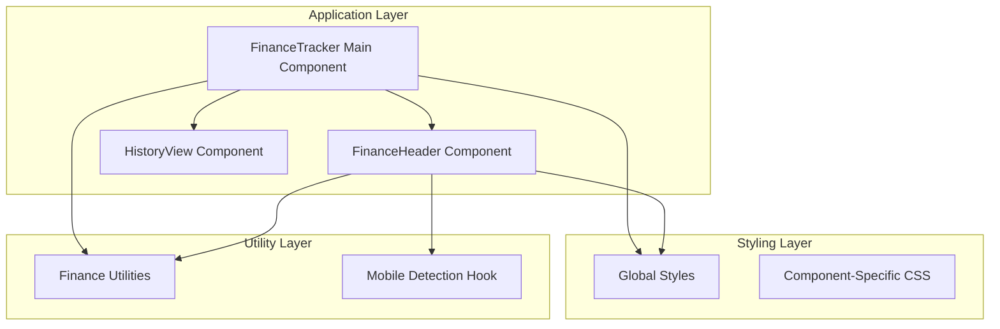
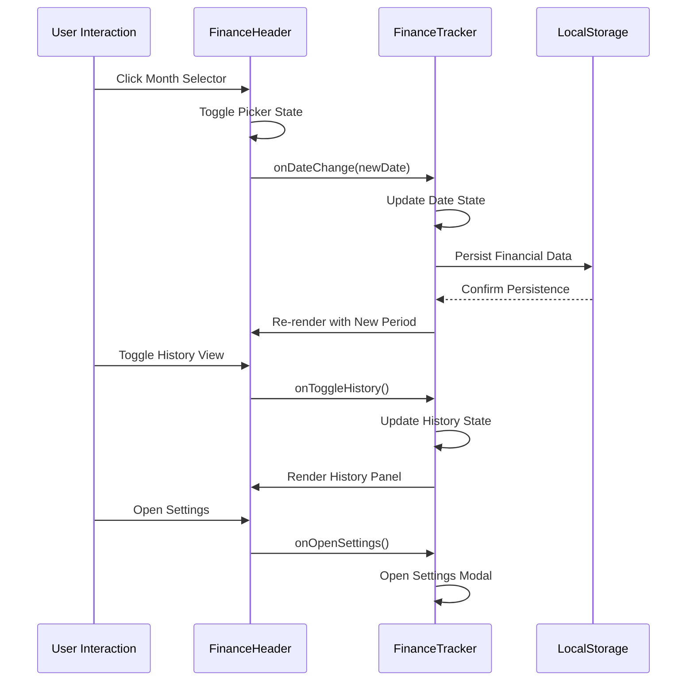
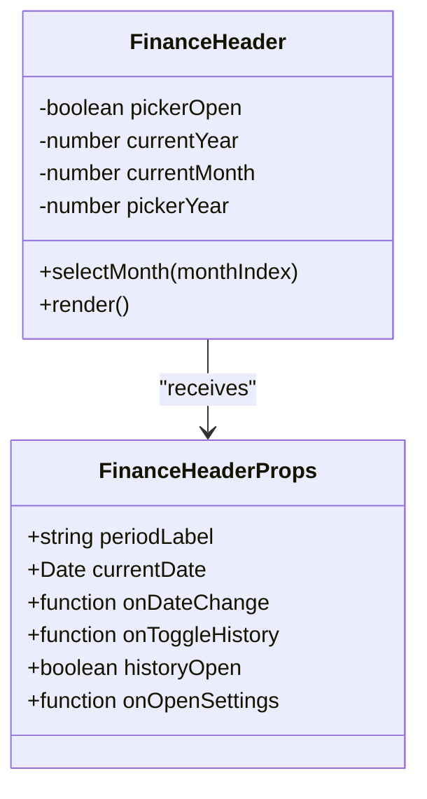
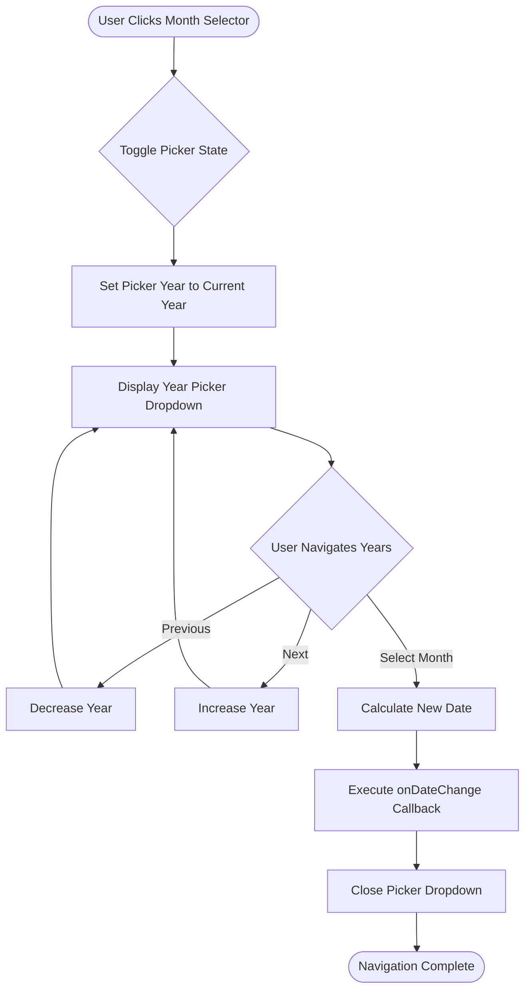
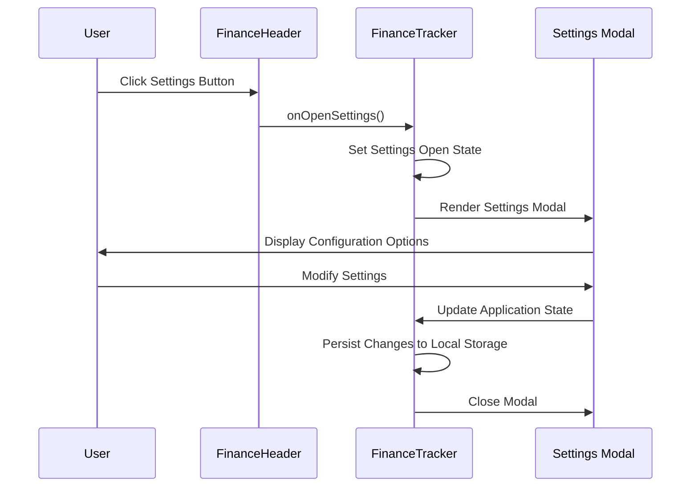
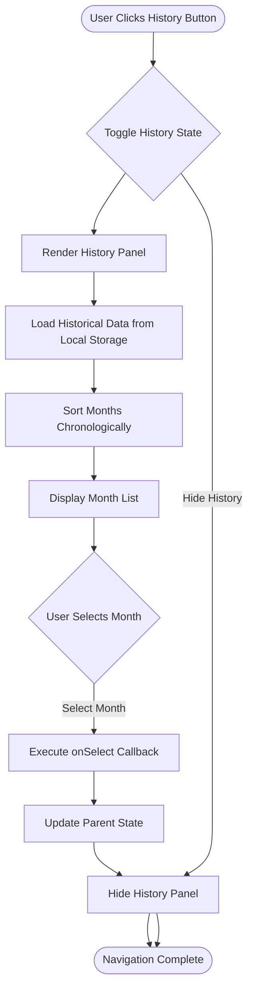
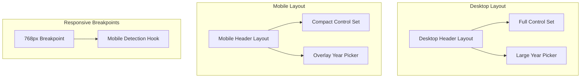
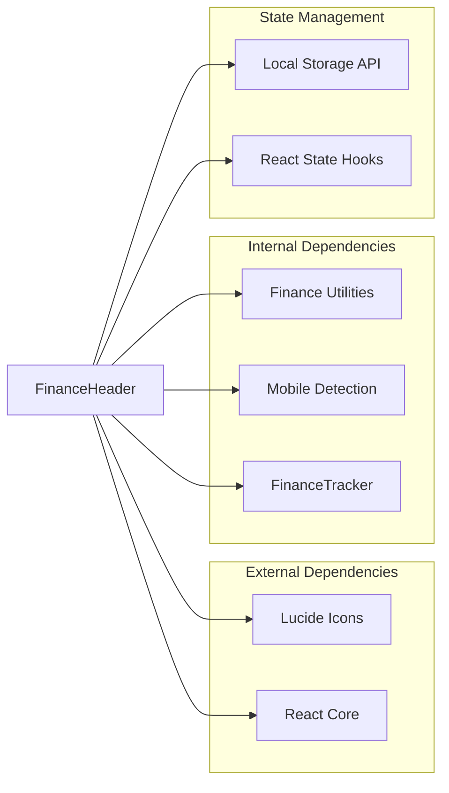

# Finance Header Component

<cite>
**Referenced Files in This Document**
- [finance-header.tsx](file://components/finance-header.tsx)
- [finance-tracker.tsx](file://components/finance-tracker.tsx)
- [finance.ts](file://lib/finance.ts)
- [use-mobile.ts](file://hooks/use-mobile.ts)
- [use-mobile.tsx](file://components/ui/use-mobile.tsx)
- [globals.css](file://app/globals.css)
- [globals.css](file://styles/globals.css)
</cite>

## Table of Contents
1. [Introduction](#introduction)
2. [Project Structure](#project-structure)
3. [Core Components](#core-components)
4. [Architecture Overview](#architecture-overview)
5. [Detailed Component Analysis](#detailed-component-analysis)
6. [Dependency Analysis](#dependency-analysis)
7. [Performance Considerations](#performance-considerations)
8. [Troubleshooting Guide](#troubleshooting-guide)
9. [Conclusion](#conclusion)

## Introduction
The Finance Header component serves as the primary navigation and control interface for the FinanceTracker application. It provides month/year selection capabilities, settings access, and history navigation functionality while maintaining seamless integration with the parent FinanceTracker component. This component ensures users can efficiently navigate through financial periods, access configuration options, and browse historical data with intuitive controls designed for both desktop and mobile experiences.

## Project Structure
The Finance Header component is part of a modular React application architecture with clear separation of concerns:

**Diagram sources**
- [finance-header.tsx:1-129](file://components/finance-header.tsx#L1-L129)
- [finance-tracker.tsx:57-545](file://components/finance-tracker.tsx#L57-L545)

**Section sources**
- [finance-header.tsx:1-129](file://components/finance-header.tsx#L1-L129)
- [finance-tracker.tsx:57-545](file://components/finance-tracker.tsx#L57-L545)

## Core Components
The Finance Header component consists of three primary functional areas:

### Navigation Controls
- Month/Year Picker with animated dropdown interface
- Previous/Next navigation buttons for temporal movement
- Current period display with dynamic formatting

### Settings Integration
- Settings panel access with persistent state management
- Configuration access patterns for application-wide settings
- Theme and preference management integration

### History Management
- Toggle control for browsing historical financial data
- Integration with local storage for data persistence
- Historical period selection with visual feedback

**Section sources**
- [finance-header.tsx:11-27](file://components/finance-header.tsx#L11-L27)
- [finance-header.tsx:38-127](file://components/finance-header.tsx#L38-L127)

## Architecture Overview
The Finance Header operates within a unidirectional data flow architecture that maintains strict separation between presentation and state management:

**Diagram sources**
- [finance-header.tsx:33-36](file://components/finance-header.tsx#L33-L36)
- [finance-tracker.tsx:409-416](file://components/finance-tracker.tsx#L409-L416)

The component maintains a clean separation of concerns where it receives state and callback functions from the parent component, handles user interactions, and triggers appropriate state updates through well-defined interfaces.

**Section sources**
- [finance-header.tsx:20-27](file://components/finance-header.tsx#L20-L27)
- [finance-tracker.tsx:409-416](file://components/finance-tracker.tsx#L409-L416)

## Detailed Component Analysis

### Component Structure and Props Interface
The Finance Header component follows a functional, props-driven architecture with explicit type safety:

**Diagram sources**
- [finance-header.tsx:11-18](file://components/finance-header.tsx#L11-L18)
- [finance-header.tsx:20-36](file://components/finance-header.tsx#L20-L36)

### Month/Year Selection Mechanism
The component implements an intelligent month picker with year navigation capabilities:

**Diagram sources**
- [finance-header.tsx:44-54](file://components/finance-header.tsx#L44-L54)
- [finance-header.tsx:61-77](file://components/finance-header.tsx#L61-L77)
- [finance-header.tsx:84-96](file://components/finance-header.tsx#L84-L96)

The month selection process utilizes the `selectMonth` function which calculates the new date using the selected year and month index, then triggers the parent component's state update through the `onDateChange` callback.

**Section sources**
- [finance-header.tsx:33-36](file://components/finance-header.tsx#L33-L36)
- [finance-header.tsx:84-96](file://components/finance-header.tsx#L84-L96)

### Settings Panel Integration
The settings integration follows a modal-based approach with persistent state management:

**Diagram sources**
- [finance-header.tsx:117-124](file://components/finance-header.tsx#L117-L124)
- [finance-tracker.tsx:514-542](file://components/finance-tracker.tsx#L514-L542)

The settings panel provides comprehensive configuration access including financial planning parameters, currency preferences, and recurring transaction management.

**Section sources**
- [finance-header.tsx:17-18](file://components/finance-header.tsx#L17-L18)
- [finance-tracker.tsx:514-542](file://components/finance-tracker.tsx#L514-L542)

### History View Integration
The history view functionality enables users to browse and select previous financial periods:

**Diagram sources**
- [finance-header.tsx:104-116](file://components/finance-header.tsx#L104-L116)
- [finance-tracker.tsx:859-990](file://components/finance-tracker.tsx#L859-L990)

The history view component loads all stored financial data from local storage, calculates income and expense totals for each period, and presents them in a user-friendly interface with visual indicators for the current period.

**Section sources**
- [finance-header.tsx:15-16](file://components/finance-header.tsx#L15-L16)
- [finance-tracker.tsx:859-990](file://components/finance-tracker.tsx#L859-L990)

### Responsive Design Implementation
The component implements a comprehensive responsive design strategy:

**Diagram sources**
- [use-mobile.ts:3](file://hooks/use-mobile.ts#L3)
- [use-mobile.tsx:3](file://components/ui/use-mobile.tsx#L3)

The responsive implementation uses a 768px breakpoint to switch between desktop and mobile layouts, with touch-friendly controls optimized for mobile interaction patterns.

**Section sources**
- [use-mobile.ts:3](file://hooks/use-mobile.ts#L3)
- [use-mobile.tsx:3](file://components/ui/use-mobile.tsx#L3)

### Accessibility Features
The component incorporates comprehensive accessibility features:

- **Keyboard Navigation**: All interactive elements support keyboard activation with proper focus management
- **Screen Reader Compatibility**: Comprehensive ARIA labels and roles for assistive technologies
- **Color Contrast**: High contrast color schemes meeting WCAG guidelines
- **Focus Indicators**: Visible focus rings for keyboard navigation
- **Semantic HTML**: Proper heading hierarchy and landmark roles

Key accessibility implementations include:
- ARIA labels for all interactive elements
- `aria-pressed` state for toggle buttons
- Proper button semantics with `type="button"`
- Focus management for modal interactions

**Section sources**
- [finance-header.tsx:50](file://components/finance-header.tsx#L50)
- [finance-header.tsx:107](file://components/finance-header.tsx#L107)
- [finance-header.tsx:119](file://components/finance-header.tsx#L119)

## Dependency Analysis
The Finance Header component maintains minimal external dependencies while integrating with several internal systems:

**Diagram sources**
- [finance-header.tsx:3](file://components/finance-header.tsx#L3)
- [finance-header.tsx:4](file://components/finance-header.tsx#L4)

The component's dependency graph shows a clean architecture with clear boundaries between presentation, state management, and utility functions.

**Section sources**
- [finance-header.tsx:3-4](file://components/finance-header.tsx#L3-L4)
- [finance-tracker.tsx:6-23](file://components/finance-tracker.tsx#L6-L23)

## Performance Considerations
The Finance Header component is optimized for performance through several mechanisms:

### State Management Efficiency
- **Minimal Re-renders**: Uses React state hooks efficiently to minimize unnecessary re-renders
- **Callback Memoization**: Parent component handles callback memoization to prevent prop drift
- **Conditional Rendering**: History panel only renders when needed

### Memory Optimization
- **Lazy Loading**: History data loaded on-demand rather than during initial render
- **Efficient Data Structures**: Uses simple arrays and objects for optimal memory usage
- **Cleanup Functions**: Proper cleanup of event listeners and effects

### Rendering Performance
- **CSS Transitions**: Leverages hardware-accelerated CSS transitions for smooth animations
- **Touch Actions**: Optimized touch handling for mobile devices
- **Backdrop Optimization**: Efficient overlay rendering with proper z-index management

## Troubleshooting Guide

### Common Issues and Solutions

#### Navigation Not Working
**Problem**: Month/year selection doesn't update the application state
**Solution**: Verify that the `onDateChange` callback is properly passed from the parent component and that the callback function signature matches the expected `(date: Date) => void`

#### History Panel Not Displaying
**Problem**: History toggle button appears but panel doesn't show
**Solution**: Check that the `historyOpen` prop is correctly managed in the parent component and that the `onToggleHistory` callback properly updates the state

#### Settings Panel Access Issues
**Problem**: Settings button click doesn't open the modal
**Solution**: Ensure the `onOpenSettings` callback is properly implemented in the parent component and that the settings state management is functioning correctly

#### Mobile Responsiveness Problems
**Problem**: Controls appear too small or difficult to tap on mobile devices
**Solution**: Verify the mobile detection hook is working correctly and that touch-friendly sizing is applied

**Section sources**
- [finance-header.tsx:14-17](file://components/finance-header.tsx#L14-L17)
- [finance-tracker.tsx:409-416](file://components/finance-tracker.tsx#L409-L416)

## Conclusion
The Finance Header component exemplifies modern React development practices with its clean separation of concerns, comprehensive accessibility features, and efficient state management. The component successfully balances functionality with performance while providing an excellent user experience across all device types. Its integration with the FinanceTracker parent component demonstrates effective component composition patterns that enable maintainable and scalable application architecture.

The component's thoughtful design considerations, including responsive behavior, accessibility compliance, and performance optimization, make it a robust foundation for financial application navigation needs. The clear API surface and well-defined integration patterns facilitate easy customization and extension for future feature additions.