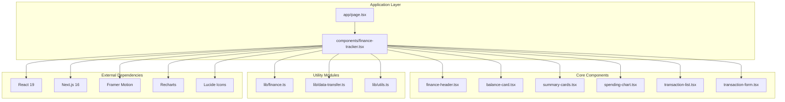
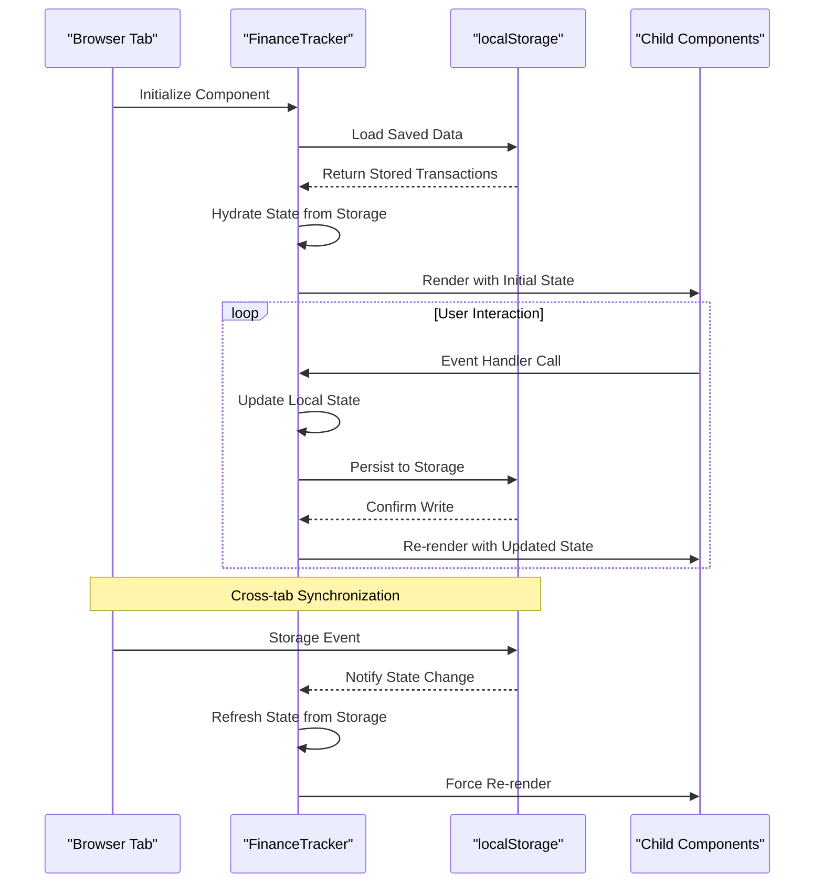
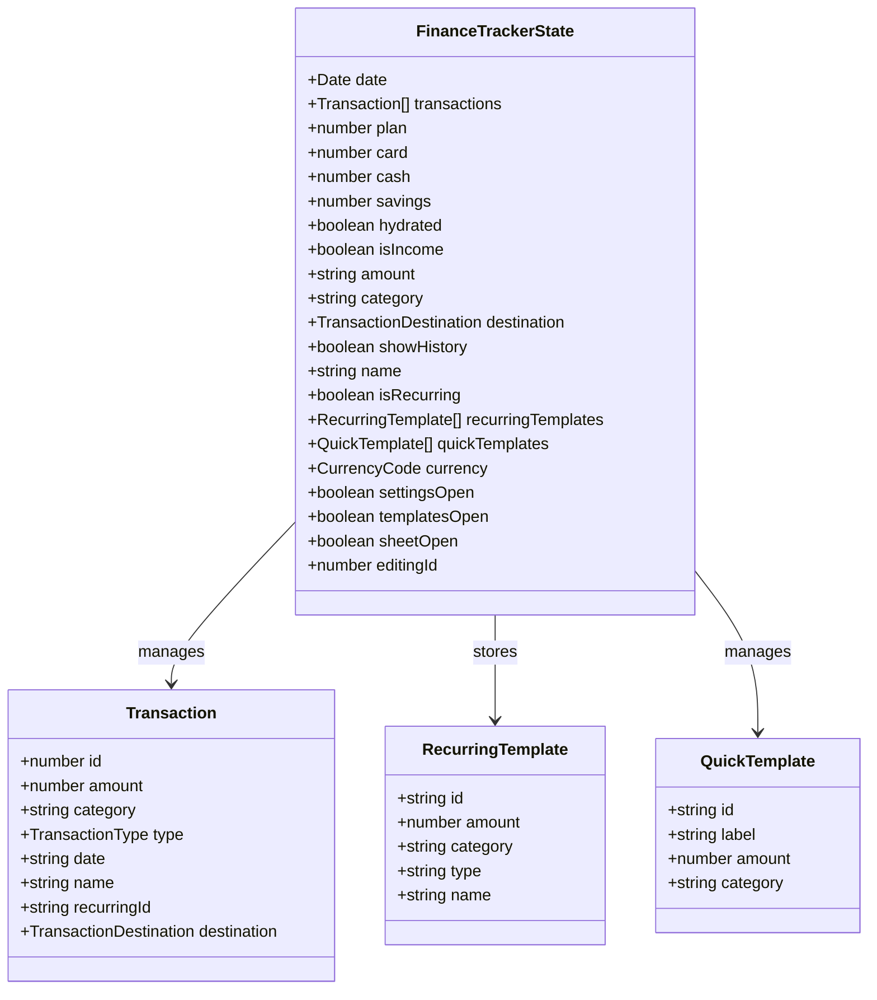
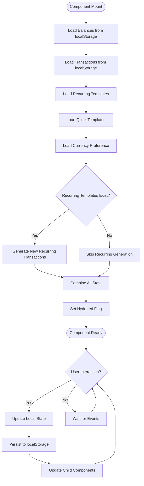
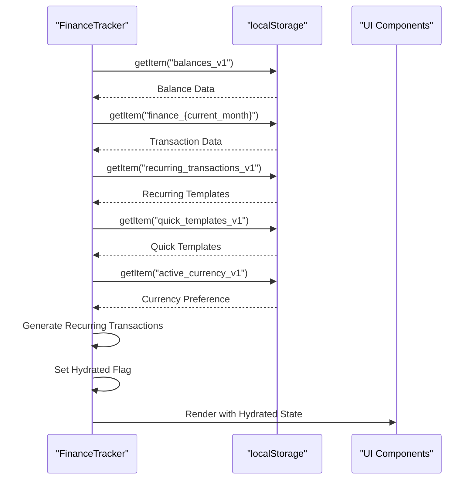

# FinanceTracker Main Component

<cite>
**Referenced Files in This Document**
- [finance-tracker.tsx](file://components/finance-tracker.tsx)
- [page.tsx](file://app/page.tsx)
- [finance.ts](file://lib/finance.ts)
- [data-transfer.ts](file://lib/data-transfer.ts)
- [utils.ts](file://lib/utils.ts)
- [transaction-form.tsx](file://components/transaction-form.tsx)
- [transaction-list.tsx](file://components/transaction-list.tsx)
- [balance-card.tsx](file://components/balance-card.tsx)
- [summary-cards.tsx](file://components/summary-cards.tsx)
- [spending-chart.tsx](file://components/spending-chart.tsx)
- [finance-header.tsx](file://components/finance-header.tsx)
- [category-select.tsx](file://components/category-select.tsx)
- [package.json](file://package.json)
</cite>

## Table of Contents
1. [Introduction](#introduction)
2. [Project Structure](#project-structure)
3. [Core Components](#core-components)
4. [Architecture Overview](#architecture-overview)
5. [Detailed Component Analysis](#detailed-component-analysis)
6. [State Management System](#state-management-system)
7. [Data Persistence Strategy](#data-persistence-strategy)
8. [Lifecycle Management](#lifecycle-management)
9. [UI Integration Patterns](#ui-integration-patterns)
10. [Performance Considerations](#performance-considerations)
11. [Error Handling](#error-handling)
12. [Customization Options](#customization-options)
13. [Integration Patterns](#integration-patterns)
14. [Conclusion](#conclusion)

## Introduction

FinanceTracker is a comprehensive personal finance management application built with Next.js and React. The main component serves as the central orchestrator, managing all financial data, user interactions, and application state. It provides a complete solution for tracking income, expenses, budgets, and financial goals with sophisticated data persistence and cross-tab synchronization capabilities.

The application features a modern dark-themed interface with intuitive financial management tools, including transaction tracking, spending analytics, budget forecasting, and automated recurring transaction generation. The component seamlessly integrates with localStorage for data persistence while maintaining real-time synchronization across browser tabs.

## Project Structure

The FinanceTracker application follows a modular component-based architecture with clear separation of concerns:

**Diagram sources**
- [finance-tracker.tsx:1-545](file://components/finance-tracker.tsx#L1-L545)
- [page.tsx:1-6](file://app/page.tsx#L1-L6)

**Section sources**
- [finance-tracker.tsx:1-545](file://components/finance-tracker.tsx#L1-L545)
- [package.json:11-61](file://package.json#L11-L61)

## Core Components

The FinanceTracker component orchestrates several specialized child components, each serving distinct purposes in the financial management ecosystem:

### Primary State Management
The main component maintains comprehensive state covering:
- **Transaction Data**: Complete transaction history with filtering and sorting capabilities
- **Financial Balances**: Card, cash, and savings account balances with real-time updates
- **Budget Planning**: Monthly income targets and spending forecasts
- **User Preferences**: Currency selection, recurring templates, and quick templates
- **UI State**: Navigation, modal visibility, and user interaction states

### Child Component Responsibilities
- **FinanceHeader**: Period navigation, settings access, and history toggling
- **BalanceCard**: Real-time balance display with currency conversion
- **SummaryCards**: Income and expense summaries with trend indicators
- **SpendingChart**: Visual expense breakdown with category analysis
- **TransactionList**: Interactive transaction management with edit/delete capabilities
- **TransactionForm**: Comprehensive transaction creation with smart features

**Section sources**
- [finance-tracker.tsx:57-545](file://components/finance-tracker.tsx#L57-L545)
- [finance-header.tsx:20-128](file://components/finance-header.tsx#L20-L128)
- [balance-card.tsx:11-79](file://components/balance-card.tsx#L11-L79)
- [summary-cards.tsx:10-49](file://components/summary-cards.tsx#L10-L49)
- [spending-chart.tsx:16-95](file://components/spending-chart.tsx#L16-L95)
- [transaction-list.tsx:14-101](file://components/transaction-list.tsx#L14-L101)
- [transaction-form.tsx:103-447](file://components/transaction-form.tsx#L103-L447)

## Architecture Overview

The FinanceTracker employs a sophisticated state management architecture with automatic persistence and cross-tab synchronization:

**Diagram sources**
- [finance-tracker.tsx:91-174](file://components/finance-tracker.tsx#L91-L174)
- [finance-tracker.tsx:146-164](file://components/finance-tracker.tsx#L146-L164)

The architecture ensures data consistency across multiple browser tabs while maintaining optimal performance through selective state updates and efficient rendering strategies.

**Section sources**
- [finance-tracker.tsx:91-174](file://components/finance-tracker.tsx#L91-L174)
- [finance-tracker.tsx:146-164](file://components/finance-tracker.tsx#L146-L164)

## Detailed Component Analysis

### FinanceTracker Main Component

The FinanceTracker component serves as the central orchestrator, implementing comprehensive state management and coordination logic:

#### State Declaration and Initialization

**Diagram sources**
- [finance-tracker.tsx:57-84](file://components/finance-tracker.tsx#L57-L84)
- [finance.ts:43-52](file://lib/finance.ts#L43-L52)
- [finance-tracker.tsx:30-43](file://components/finance-tracker.tsx#L30-L43)

#### Lifecycle Management

The component implements sophisticated lifecycle management through React's useEffect hooks:

1. **Hydration Phase**: Loads persisted data from localStorage during initial mount
2. **Rehydration Phase**: Handles recurring transaction generation and state restoration
3. **Persistence Phase**: Automatically saves state changes to localStorage
4. **Cleanup Phase**: Manages resource cleanup and event listener removal

#### Event Handling System

The component provides comprehensive event handlers for all user interactions:

- **Transaction Management**: Add, edit, delete, and transfer operations
- **Navigation**: Month switching and history view toggling
- **Settings Management**: Currency changes, plan adjustments, and template management
- **Form Operations**: Amount parsing, category selection, and validation

**Section sources**
- [finance-tracker.tsx:57-545](file://components/finance-tracker.tsx#L57-L545)
- [finance-tracker.tsx:210-373](file://components/finance-tracker.tsx#L210-L373)

### Transaction Management System

The transaction management system implements advanced features for financial data handling:

#### Smart Amount Parsing
The system supports multiple input formats including mathematical expressions:
- Direct numeric input (e.g., "123.45")
- Mathematical expressions (e.g., "100 + 50 * 2")
- Clipboard parsing with intelligent merchant detection

#### Recurring Transaction Generation
Automatically generates recurring transactions based on predefined templates:
- Template matching using composite keys
- Duplicate prevention through ID tracking
- Automatic insertion into transaction history

#### Balance Synchronization
Maintains real-time balance updates across all account types:
- Immediate balance adjustments upon transaction creation
- Reverse balance changes for transaction edits/deletes
- Cross-account transfer support

**Section sources**
- [finance-tracker.tsx:45-49](file://components/finance-tracker.tsx#L45-L49)
- [finance-tracker.tsx:125-139](file://components/finance-tracker.tsx#L125-L139)
- [finance-tracker.tsx:250-263](file://components/finance-tracker.tsx#L250-L263)

### Settings and Configuration Management

The settings system provides comprehensive configuration options:

#### Currency Management
Supports multiple currencies with automatic conversion:
- UAH (Ukrainian Hryvnia) as default
- USD and EUR with fixed exchange rates
- Real-time currency conversion and display

#### Template Management
Flexible template system for quick transaction entry:
- Quick templates for frequent transactions
- Recurring templates for automated entries
- Template customization and deletion

#### Backup and Restore
Complete data backup and restore functionality:
- Export all financial data to JSON
- Import backup files with validation
- Cross-tab synchronization support

**Section sources**
- [finance-tracker.tsx:547-775](file://components/finance-tracker.tsx#L547-L775)
- [data-transfer.ts:14-54](file://lib/data-transfer.ts#L14-L54)
- [data-transfer.ts:56-114](file://lib/data-transfer.ts#L56-L114)

## State Management System

### Local State Architecture

The FinanceTracker implements a hierarchical state management system with clear separation of concerns:

**Diagram sources**
- [finance-tracker.tsx:91-144](file://components/finance-tracker.tsx#L91-L144)
- [finance-tracker.tsx:146-174](file://components/finance-tracker.tsx#L146-L174)

### State Update Patterns

The component follows React best practices for state updates:

#### Immutable Updates
All state modifications use immutable patterns to ensure predictable behavior:
- Array updates through spread operators and map functions
- Object updates through spread operators
- New state instances for each update cycle

#### Batch Updates
Related state changes are batched to minimize re-renders:
- Transaction additions combine state updates
- Balance adjustments occur atomically
- Form submissions trigger coordinated updates

#### Derived State Computation
Computed values are cached using useMemo for performance:
- Total income and expense calculations
- Spending chart data preparation
- Forecast value computations

**Section sources**
- [finance-tracker.tsx:91-174](file://components/finance-tracker.tsx#L91-L174)
- [finance-tracker.tsx:176-200](file://components/finance-tracker.tsx#L176-L200)

## Data Persistence Strategy

### localStorage Implementation

The FinanceTracker implements a sophisticated data persistence strategy using localStorage with automatic synchronization:

#### Key Organization Strategy
Data is organized using descriptive keys for easy identification and management:
- **Transactions**: `finance_{year}_{month}` (e.g., "finance_2024_01")
- **Plans**: `plan_{year}_{month}` (e.g., "plan_2024_01")
- **Balances**: `balances_v1`
- **Recurring Templates**: `recurring_transactions_v1`
- **Quick Templates**: `quick_templates_v1`
- **Currency**: `active_currency_v1`

#### Cross-Tab Synchronization
The application automatically synchronizes state across browser tabs:
- Storage events trigger state refresh
- Concurrent modification handling
- Conflict resolution strategies

#### Data Validation and Recovery
Robust validation ensures data integrity:
- JSON parsing with error handling
- Type checking for all persisted data
- Graceful degradation for corrupted entries

**Section sources**
- [finance-tracker.tsx:25-28](file://components/finance-tracker.tsx#L25-L28)
- [finance-tracker.tsx:91-174](file://components/finance-tracker.tsx#L91-L174)
- [finance-tracker.tsx:146-174](file://components/finance-tracker.tsx#L146-L174)

### Backup and Restore System

The backup system provides comprehensive data protection:

#### Export Functionality
Complete data export with structured JSON format:
- Versioned backup format
- Complete transaction history preservation
- Plan data and preferences export
- Timestamped export metadata

#### Import Validation
Rigorous import validation ensures data safety:
- Format verification against schema
- Data integrity checks
- Malformed entry handling
- Atomic import operations

#### Cross-Device Compatibility
Backup files enable seamless data migration:
- Universal format compatible with all browsers
- Incremental backup support
- Conflict resolution for overlapping data

**Section sources**
- [data-transfer.ts:3-12](file://lib/data-transfer.ts#L3-L12)
- [data-transfer.ts:14-54](file://lib/data-transfer.ts#L14-L54)
- [data-transfer.ts:56-114](file://lib/data-transfer.ts#L56-L114)

## Lifecycle Management

### Component Lifecycle Phases

The FinanceTracker component implements a multi-phase lifecycle for optimal performance and user experience:

#### Initialization Phase
During component mount, the system performs comprehensive data hydration:
- Load all persisted state from localStorage
- Generate recurring transactions if needed
- Initialize derived state computations
- Set up event listeners and subscriptions

#### Active Operation Phase
The component operates with continuous state management:
- Real-time user interaction handling
- Automatic state persistence
- Cross-tab synchronization monitoring
- Performance optimization through memoization

#### Cleanup Phase
Proper resource cleanup during component unmount:
- Event listener removal
- Timeout and interval cleanup
- Memory leak prevention
- Storage event listener management

### Hydration Strategy

The hydration process ensures smooth initial loading:

**Diagram sources**
- [finance-tracker.tsx:109-144](file://components/finance-tracker.tsx#L109-L144)

**Section sources**
- [finance-tracker.tsx:109-144](file://components/finance-tracker.tsx#L109-L144)
- [finance-tracker.tsx:146-174](file://components/finance-tracker.tsx#L146-L174)

## UI Integration Patterns

### Floating Action Button (FAB) Integration

The FinanceTracker implements an elegant FAB system for transaction creation:

#### FAB Design and Behavior
- Prominent placement in bottom-right corner
- Smooth animations using Framer Motion
- Gradient styling with shadow effects
- Responsive sizing for different devices

#### Sheet Modal System
The bottom sheet provides comprehensive transaction management:
- Full-screen modal with backdrop
- Spring-based entrance animations
- Draggable interface with handle indicator
- Persistent state management across sessions

#### Cross-Component Communication
Seamless integration between parent and child components:
- Event prop passing for all interactions
- State lifting for shared data
- Callback patterns for complex operations
- Context-free implementation for simplicity

**Section sources**
- [finance-tracker.tsx:441-512](file://components/finance-tracker.tsx#L441-L512)
- [finance-tracker.tsx:514-542](file://components/finance-tracker.tsx#L514-L542)

### Settings Management Integration

The settings system provides comprehensive configuration capabilities:

#### Settings Modal Architecture
- Bottom sheet design for mobile-first experience
- Two-tier navigation (main settings vs template management)
- Real-time preview of changes
- Confirmation dialogs for destructive actions

#### Template Management System
Advanced template management for quick transaction entry:
- Dynamic template addition and removal
- Real-time template preview
- Currency-aware amount display
- Template categorization and organization

#### Backup Integration
Seamless backup and restore functionality:
- Direct integration with settings modal
- Progress indication during operations
- Error handling with user feedback
- Success confirmation messaging

**Section sources**
- [finance-tracker.tsx:547-775](file://components/finance-tracker.tsx#L547-L775)
- [finance-tracker.tsx:777-857](file://components/finance-tracker.tsx#L777-L857)

## Performance Considerations

### Optimization Strategies

The FinanceTracker implements multiple performance optimization strategies:

#### Memoization and Caching
- Derived state computation caching using useMemo
- Expensive calculations deferred until dependencies change
- Chart data pre-processing to reduce render overhead
- Category and currency formatting caching

#### Efficient Rendering
- Selective re-rendering through proper state partitioning
- Virtualized lists for large transaction histories
- Lazy loading for heavy components
- Minimal DOM manipulation through React patterns

#### Memory Management
- Proper cleanup of event listeners and timeouts
- Reference equality checks to prevent unnecessary renders
- Weak references for large datasets where appropriate
- Garbage collection friendly data structures

#### Storage Optimization
- Efficient localStorage key organization
- Minimal write operations through batching
- Data compression for large datasets
- Incremental updates rather than full replacements

### Performance Monitoring

The component architecture supports performance monitoring:
- React DevTools profiling integration
- Memory usage tracking
- Render timing measurements
- Storage access patterns analysis

**Section sources**
- [finance-tracker.tsx:176-200](file://components/finance-tracker.tsx#L176-L200)
- [finance-tracker.tsx:146-174](file://components/finance-tracker.tsx#L146-L174)

## Error Handling

### Robust Error Management

The FinanceTracker implements comprehensive error handling strategies:

#### Data Validation
- Input sanitization and validation for all user inputs
- Type checking for localStorage data
- Graceful degradation for malformed entries
- Default value fallbacks for missing data

#### User Experience Protection
- Clear error messages for failed operations
- Undo mechanisms for destructive actions
- Retry logic for transient failures
- User-friendly error recovery interfaces

#### System Resilience
- Try-catch blocks around critical operations
- Fallback state management for failure scenarios
- Data integrity verification after operations
- Automatic recovery from partial failures

#### Debugging Support
- Comprehensive logging for development
- Error boundaries for component isolation
- State snapshot capabilities for debugging
- Performance impact measurement tools

**Section sources**
- [finance-tracker.tsx:45-49](file://components/finance-tracker.tsx#L45-L49)
- [data-transfer.ts:107-109](file://lib/data-transfer.ts#L107-L109)

## Customization Options

### Flexible Configuration System

The FinanceTracker provides extensive customization options:

#### Theme and Appearance
- Dark theme as default with gradient accents
- Color scheme customization through CSS variables
- Typography scaling for accessibility
- Responsive design for all screen sizes

#### Financial Categories
- Extensible category system with custom icons
- Color-coded category display
- Emoji integration for visual recognition
- Category hierarchy support

#### Transaction Features
- Customizable transaction destinations
- Flexible amount parsing with mathematical expressions
- Smart clipboard integration
- Quick template customization

#### User Preferences
- Currency selection with automatic conversion
- Language and regional formatting options
- Privacy controls for data sharing
- Accessibility features for disabled users

**Section sources**
- [finance.ts:16-35](file://lib/finance.ts#L16-L35)
- [finance.ts:93-123](file://lib/finance.ts#L93-L123)
- [transaction-form.tsx:25-58](file://components/transaction-form.tsx#L25-L58)

## Integration Patterns

### Component Communication

The FinanceTracker demonstrates advanced component communication patterns:

#### Parent-Child Communication
- Props drilling for simple data flow
- Callback patterns for event handling
- Context-free implementation for simplicity
- Event-driven architecture for complex interactions

#### Cross-Component Coordination
- Shared state management through central component
- Event bus pattern for loose coupling
- Message passing for decoupled components
- State synchronization across component boundaries

#### External Integration
- localStorage integration for persistence
- Clipboard API integration for smart features
- File system integration for backup operations
- Browser storage event integration for synchronization

### Third-Party Library Integration

The component integrates with several external libraries:

#### UI Animation
- Framer Motion for smooth transitions and animations
- Responsive container for chart scaling
- Motion primitives for complex animations

#### Data Visualization
- Recharts for interactive charts and graphs
- Responsive design for all screen sizes
- Touch-friendly interfaces for mobile devices

#### Iconography
- Lucide React for consistent icon set
- SVG-based icons for scalability
- Custom icon mapping for categories

**Section sources**
- [finance-tracker.tsx:3-5](file://components/finance-tracker.tsx#L3-L5)
- [finance-tracker.tsx:21-23](file://components/finance-tracker.tsx#L21-L23)
- [package.json:47-59](file://package.json#L47-L59)

## Conclusion

The FinanceTracker main component represents a sophisticated implementation of a personal finance management system. Its comprehensive architecture demonstrates best practices in React development, state management, and user experience design.

Key strengths of the implementation include:

- **Comprehensive State Management**: Centralized orchestration with robust persistence
- **Cross-Tab Synchronization**: Seamless multi-tab operation with conflict resolution
- **Performance Optimization**: Efficient rendering and memory management
- **User Experience**: Intuitive interfaces with thoughtful interactions
- **Data Integrity**: Robust validation and error handling
- **Extensibility**: Modular design supporting future enhancements

The component serves as an excellent example of modern React application architecture, combining functional programming principles with practical UI considerations. Its implementation provides valuable insights into building scalable, maintainable, and user-friendly applications.