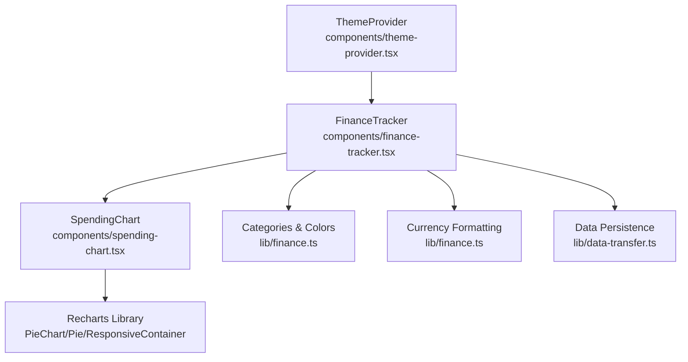
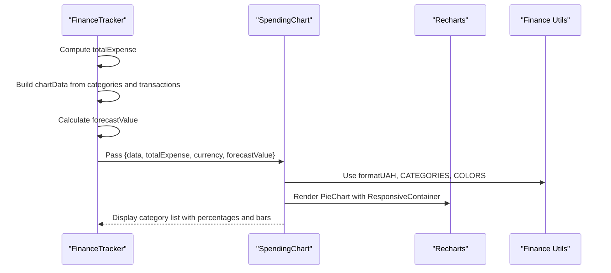
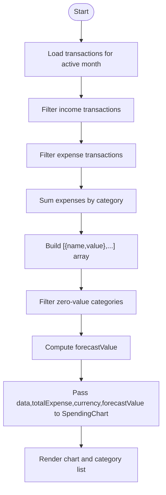
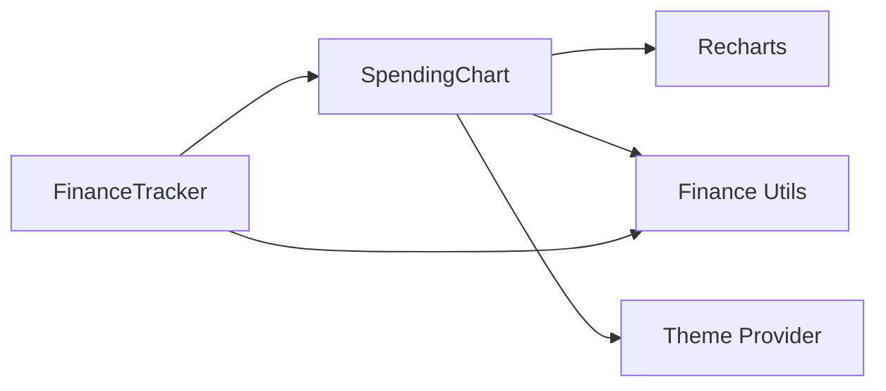

# Spending Chart Component

<cite>
**Referenced Files in This Document**
- [spending-chart.tsx](file://components/spending-chart.tsx)
- [finance-tracker.tsx](file://components/finance-tracker.tsx)
- [finance.ts](file://lib/finance.ts)
- [chart.tsx](file://components/ui/chart.tsx)
- [theme-provider.tsx](file://components/theme-provider.tsx)
- [data-transfer.ts](file://lib/data-transfer.ts)
- [utils.ts](file://lib/utils.ts)
</cite>

## Table of Contents
1. [Introduction](#introduction)
2. [Project Structure](#project-structure)
3. [Core Components](#core-components)
4. [Architecture Overview](#architecture-overview)
5. [Detailed Component Analysis](#detailed-component-analysis)
6. [Dependency Analysis](#dependency-analysis)
7. [Performance Considerations](#performance-considerations)
8. [Troubleshooting Guide](#troubleshooting-guide)
9. [Conclusion](#conclusion)
10. [Appendices](#appendices)

## Introduction
This document provides comprehensive documentation for the SpendingChart component, which renders an interactive pie chart visualization of category-wise expenses. It explains how raw transaction data is transformed into chart-ready formats, how the chart integrates with the Recharts library, and how forecasting and remaining budget calculations are computed and presented. It also covers customization options, accessibility features, performance considerations, and integration with the application’s theme system.

## Project Structure
The SpendingChart component is part of the Finance Tracker application and resides alongside other UI components and shared utilities. The chart is embedded within the FinanceTracker page and receives precomputed data from its parent.

**Diagram sources**
- [finance-tracker.tsx:428](file://components/finance-tracker.tsx#L428)
- [spending-chart.tsx:3](file://components/spending-chart.tsx#L3)
- [finance.ts:16](file://lib/finance.ts#L16)
- [finance.ts:93](file://lib/finance.ts#L93)
- [theme-provider.tsx:9](file://components/theme-provider.tsx#L9)
- [data-transfer.ts:14](file://lib/data-transfer.ts#L14)

**Section sources**
- [finance-tracker.tsx:428](file://components/finance-tracker.tsx#L428)
- [spending-chart.tsx:3](file://components/spending-chart.tsx#L3)
- [finance.ts:16](file://lib/finance.ts#L16)
- [finance.ts:93](file://lib/finance.ts#L93)
- [theme-provider.tsx:9](file://components/theme-provider.tsx#L9)
- [data-transfer.ts:14](file://lib/data-transfer.ts#L14)

## Core Components
- SpendingChart: Renders a responsive pie chart with category segments and a side list showing category totals and percentages. It also displays a forecast projection of remaining budget for the month.
- FinanceTracker: Parent component that computes chart data, total expenses, and forecast value, then passes them to SpendingChart.
- Finance utilities: Provide categories, colors, currency conversion/formatting, and helpers for date-based keys.
- UI Chart wrapper: Provides a reusable chart container, theme-aware styling, and tooltip/legend components for advanced Recharts usage.

**Section sources**
- [spending-chart.tsx:16](file://components/spending-chart.tsx#L16)
- [finance-tracker.tsx:183](file://components/finance-tracker.tsx#L183)
- [finance-tracker.tsx:192](file://components/finance-tracker.tsx#L192)
- [finance.ts:16](file://lib/finance.ts#L16)
- [finance.ts:93](file://lib/finance.ts#L93)
- [chart.tsx:37](file://components/ui/chart.tsx#L37)

## Architecture Overview
The SpendingChart consumes props from FinanceTracker:
- data: Array of { name, value } representing category totals
- totalExpense: Sum of all expenses for the period
- currency: Active currency for formatting
- forecastValue: Forecasted remaining budget for the month

The component renders:
- A responsive pie chart using Recharts
- A side list with category totals, emoji, color-coded indicators, and percentage bars
- A forecast message indicating projected remaining funds

**Diagram sources**
- [finance-tracker.tsx:176](file://components/finance-tracker.tsx#L176)
- [finance-tracker.tsx:183](file://components/finance-tracker.tsx#L183)
- [finance-tracker.tsx:192](file://components/finance-tracker.tsx#L192)
- [spending-chart.tsx:16](file://components/spending-chart.tsx#L16)
- [finance.ts:93](file://lib/finance.ts#L93)
- [finance.ts:16](file://lib/finance.ts#L16)

## Detailed Component Analysis

### SpendingChart Component
Responsibilities:
- Transform category totals into a chart-friendly dataset
- Render a responsive pie chart with configurable radii and padding
- Render a side list with category totals, emoji, color indicators, and percentage bars
- Display forecast text with positive/negative styling based on sign
- Integrate with theme-aware styling and accessibility attributes

Key implementation patterns:
- Uses Recharts primitives: ResponsiveContainer, PieChart, Pie, Cell
- Iterates over data to render cells with predefined colors
- Computes percentage per category based on totalExpense
- Uses category metadata for color and emoji
- Applies Tailwind classes for styling and gradient backgrounds

Accessibility features:
- Uses aria-hidden for decorative icons and bars
- Uses aria-labels on interactive elements
- Uses semantic labels for screen readers

Customization options:
- Colors: Derived from COLORS array and category color overrides
- Labels: Category names and emoji via CATEGORIES
- Tooltips: Not enabled in this component; can be integrated via the UI chart wrapper
- Responsive design: ResponsiveContainer adapts to container size

Forecasting:
- forecastValue is computed in FinanceTracker and passed down
- Positive values are styled with a green class; negative with red

**Section sources**
- [spending-chart.tsx:16](file://components/spending-chart.tsx#L16)
- [spending-chart.tsx:33](file://components/spending-chart.tsx#L33)
- [spending-chart.tsx:42](file://components/spending-chart.tsx#L42)
- [spending-chart.tsx:50](file://components/spending-chart.tsx#L50)
- [spending-chart.tsx:88](file://components/spending-chart.tsx#L88)

### Data Transformation Pipeline
The parent FinanceTracker builds chart data from raw transactions:
- Sums expenses by category using CATEGORIES.expense
- Filters out zero-value categories
- Passes the resulting array to SpendingChart

Forecast calculation:
- Uses current date to compute days elapsed and remaining in the month
- Computes average daily expense and projects remaining budget against the plan

**Diagram sources**
- [finance-tracker.tsx:176](file://components/finance-tracker.tsx#L176)
- [finance-tracker.tsx:183](file://components/finance-tracker.tsx#L183)
- [finance-tracker.tsx:192](file://components/finance-tracker.tsx#L192)

**Section sources**
- [finance-tracker.tsx:176](file://components/finance-tracker.tsx#L176)
- [finance-tracker.tsx:183](file://components/finance-tracker.tsx#L183)
- [finance-tracker.tsx:192](file://components/finance-tracker.tsx#L192)

### Chart Customization Options
- Colors: Predefined palette in COLORS; category color overrides via CATEGORIES
- Labels: Category names and emojis; currency formatting via formatUAH
- Tooltips: Not enabled in SpendingChart; can be added using the UI chart wrapper’s ChartTooltipContent
- Responsive design: ResponsiveContainer ensures the chart resizes with its container
- Theme integration: The UI chart wrapper supports theme-aware color variables

Integration with UI chart wrapper:
- The UI chart wrapper provides ChartContainer, ChartTooltipContent, ChartLegendContent, and ChartStyle for advanced customization and theming
- These can be used to add tooltips, legends, and theme-aware styling to charts

**Section sources**
- [finance.ts:37](file://lib/finance.ts#L37)
- [finance.ts:16](file://lib/finance.ts#L16)
- [finance.ts:93](file://lib/finance.ts#L93)
- [chart.tsx:37](file://components/ui/chart.tsx#L37)
- [chart.tsx:107](file://components/ui/chart.tsx#L107)
- [chart.tsx:253](file://components/ui/chart.tsx#L253)

### Accessibility Features
- Decorative elements use aria-hidden to prevent screen reader noise
- Interactive buttons include aria-labels for context
- Semantic labels and structure support screen readers
- Color contrast maintained via theme-aware styling

**Section sources**
- [spending-chart.tsx:23](file://components/spending-chart.tsx#L23)
- [spending-chart.tsx:75](file://components/spending-chart.tsx#L75)
- [spending-chart.tsx:446](file://components/finance-tracker.tsx#L446)

### Chart Interactions, Hover Effects, and Highlighting
- The current SpendingChart does not enable Recharts tooltips or interactive selection
- To add hover effects and highlighting, integrate ChartTooltipContent from the UI chart wrapper
- Tooltip content can be customized with formatter functions and label formatters

**Section sources**
- [chart.tsx:107](file://components/ui/chart.tsx#L107)
- [chart.tsx:195](file://components/ui/chart.tsx#L195)

### Relationship Between Chart Data and Parent Financial Calculations
- totalExpense drives percentage calculations in the side list
- forecastValue is computed in FinanceTracker and passed down to indicate projected remaining funds
- Currency formatting is handled centrally via formatUAH

**Section sources**
- [spending-chart.tsx:51](file://components/spending-chart.tsx#L51)
- [finance-tracker.tsx:176](file://components/finance-tracker.tsx#L176)
- [finance-tracker.tsx:192](file://components/finance-tracker.tsx#L192)
- [finance.ts:93](file://lib/finance.ts#L93)

## Dependency Analysis
The SpendingChart depends on:
- Recharts for rendering the pie chart
- Finance utilities for categories, colors, and currency formatting
- Theme provider for theme-aware styling
- Parent component for computed data and forecast value

**Diagram sources**
- [spending-chart.tsx:3](file://components/spending-chart.tsx#L3)
- [finance.ts:16](file://lib/finance.ts#L16)
- [finance.ts:93](file://lib/finance.ts#L93)
- [theme-provider.tsx:9](file://components/theme-provider.tsx#L9)
- [finance-tracker.tsx:428](file://components/finance-tracker.tsx#L428)

**Section sources**
- [spending-chart.tsx:3](file://components/spending-chart.tsx#L3)
- [finance.ts:16](file://lib/finance.ts#L16)
- [finance.ts:93](file://lib/finance.ts#L93)
- [theme-provider.tsx:9](file://components/theme-provider.tsx#L9)
- [finance-tracker.tsx:428](file://components/finance-tracker.tsx#L428)

## Performance Considerations
- Data computation: The parent component computes chartData and forecastValue using filters and reductions; memoization is already applied for forecastValue
- Rendering: The chart uses a fixed number of categories; performance remains efficient
- Large datasets: For larger datasets, consider:
  - Lazy-loading chart data until the component mounts
  - Virtualizing long category lists
  - Debouncing forecast recalculation during rapid date changes
  - Using React.memo for the SpendingChart to avoid unnecessary re-renders when props are unchanged

[No sources needed since this section provides general guidance]

## Troubleshooting Guide
Common issues and resolutions:
- Empty chart: Ensure data contains non-zero values; the component displays a message when no data is present
- Incorrect percentages: Verify totalExpense is computed correctly and greater than zero
- Color mismatches: Confirm category names match CATEGORIES.expense entries
- Forecast errors: Check that the current date and plan values are set correctly

**Section sources**
- [spending-chart.tsx:83](file://components/spending-chart.tsx#L83)
- [finance-tracker.tsx:176](file://components/finance-tracker.tsx#L176)
- [finance-tracker.tsx:192](file://components/finance-tracker.tsx#L192)

## Conclusion
The SpendingChart component provides a clean, accessible, and responsive visualization of category-wise expenses. It integrates seamlessly with the FinanceTracker’s data pipeline and offers straightforward customization paths for colors, labels, and tooltips. With minor enhancements—such as enabling tooltips and adding performance optimizations—it can scale effectively for larger datasets while maintaining excellent user experience.

## Appendices

### Customizing Chart Types and Adding New Visualizations
- To add bar charts or line charts, use the UI chart wrapper’s ChartContainer and integrate with Recharts primitives
- Use ChartTooltipContent and ChartLegendContent for advanced interactivity and labeling
- Apply theme-aware colors via the ChartStyle mechanism

**Section sources**
- [chart.tsx:37](file://components/ui/chart.tsx#L37)
- [chart.tsx:107](file://components/ui/chart.tsx#L107)
- [chart.tsx:253](file://components/ui/chart.tsx#L253)

### Integrating with the Application Theme System
- The ThemeProvider wraps the application to support light/dark themes
- The UI chart wrapper applies theme-aware CSS variables for chart colors
- SpendingChart inherits theme-aware styling through Tailwind classes and gradient backgrounds

**Section sources**
- [theme-provider.tsx:9](file://components/theme-provider.tsx#L9)
- [chart.tsx:72](file://components/ui/chart.tsx#L72)
- [spending-chart.tsx:21](file://components/spending-chart.tsx#L21)

### Data Persistence and Backup Integration
- Finance data is persisted to localStorage with month-based keys
- Backup and restore functionality supports importing/exporting financial data
- SpendingChart relies on parent-provided data derived from persisted transactions

**Section sources**
- [data-transfer.ts:14](file://lib/data-transfer.ts#L14)
- [data-transfer.ts:56](file://lib/data-transfer.ts#L56)
- [finance-tracker.tsx:110](file://components/finance-tracker.tsx#L110)