# Transaction Form Component

<cite>
**Referenced Files in This Document**
- [transaction-form.tsx](file://components/transaction-form.tsx)
- [finance-tracker.tsx](file://components/finance-tracker.tsx)
- [category-select.tsx](file://components/category-select.tsx)
- [finance.ts](file://lib/finance.ts)
- [data-transfer.ts](file://lib/data-transfer.ts)
- [utils.ts](file://lib/utils.ts)
- [use-mobile.ts](file://hooks/use-mobile.ts)
</cite>

## Table of Contents
1. [Introduction](#introduction)
2. [Project Structure](#project-structure)
3. [Core Components](#core-components)
4. [Architecture Overview](#architecture-overview)
5. [Detailed Component Analysis](#detailed-component-analysis)
6. [Dependency Analysis](#dependency-analysis)
7. [Performance Considerations](#performance-considerations)
8. [Troubleshooting Guide](#troubleshooting-guide)
9. [Conclusion](#conclusion)

## Introduction
The TransactionForm component is the primary interface for capturing financial transactions in the Finance Tracker application. It provides a streamlined, intelligent form for entering expenses and income with advanced features including smart amount parsing, category selection with emoji and color coding, quick template application, recurring transaction support, and clipboard integration for rapid data entry.

The component operates in dual-mode: adding new transactions and editing existing ones, with sophisticated validation and user experience optimizations for both desktop and mobile environments.

## Project Structure
The TransactionForm integrates deeply with the FinanceTracker application ecosystem, leveraging shared utilities and data structures:

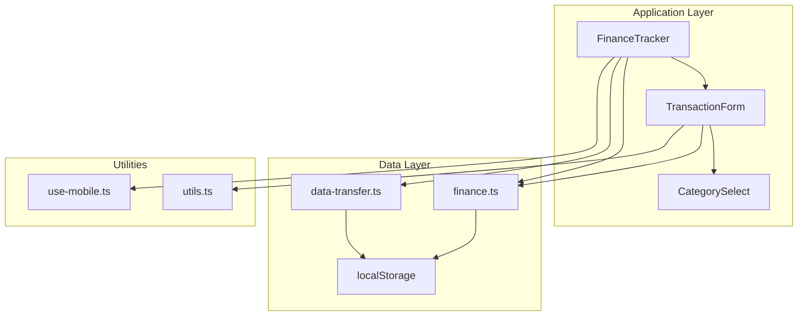

**Diagram sources**
- [finance-tracker.tsx:487-507](file://components/finance-tracker.tsx#L487-L507)
- [transaction-form.tsx:22-23](file://components/transaction-form.tsx#L22-L23)

**Section sources**
- [finance-tracker.tsx:487-507](file://components/finance-tracker.tsx#L487-L507)
- [transaction-form.tsx:103-123](file://components/transaction-form.tsx#L103-L123)

## Core Components
The TransactionForm component consists of several interconnected subsystems that work together to provide a seamless transaction entry experience:

### Primary Features
- **Dual-mode Operation**: Supports both new transaction creation and existing transaction editing
- **Intelligent Amount Parsing**: Handles various numeric formats and currency normalization
- **Category Management**: Emoji and color-coded category selection with keyboard navigation
- **Quick Templates**: Predefined transaction patterns for rapid entry
- **Recurring Transactions**: Automatic generation of future transactions
- **Clipboard Integration**: Smart parsing of transaction data from clipboard
- **Destination Tracking**: Card, cash, and savings account management

### Component Architecture
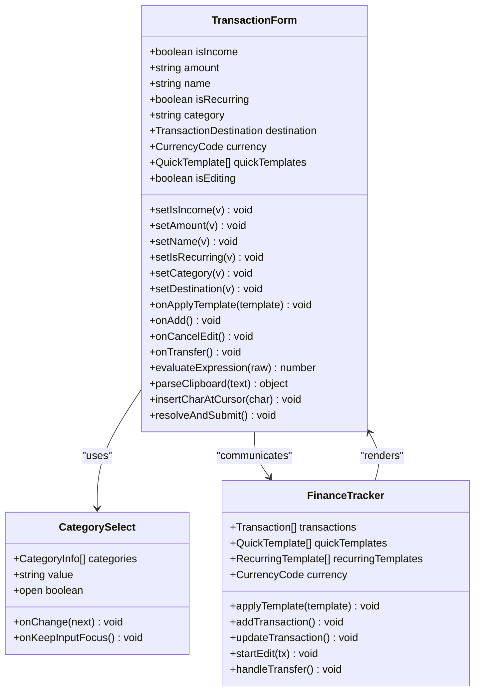

**Diagram sources**
- [transaction-form.tsx:81-101](file://components/transaction-form.tsx#L81-L101)
- [category-select.tsx:37-42](file://components/category-select.tsx#L37-L42)
- [finance-tracker.tsx:57-77](file://components/finance-tracker.tsx#L57-L77)

**Section sources**
- [transaction-form.tsx:81-101](file://components/transaction-form.tsx#L81-L101)
- [category-select.tsx:37-42](file://components/category-select.tsx#L37-L42)
- [finance-tracker.tsx:57-77](file://components/finance-tracker.tsx#L57-L77)

## Architecture Overview
The TransactionForm operates within a comprehensive financial tracking architecture that emphasizes user experience and data persistence:

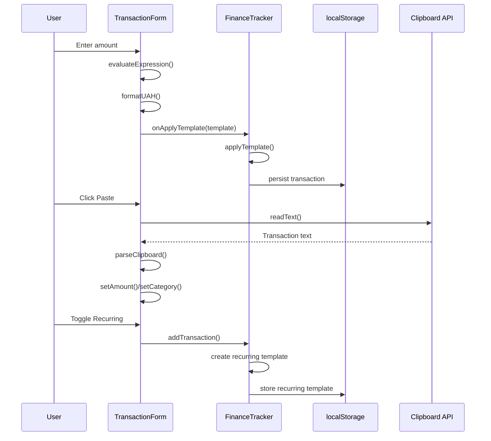

**Diagram sources**
- [transaction-form.tsx:169-175](file://components/transaction-form.tsx#L169-L175)
- [finance-tracker.tsx:202-208](file://components/finance-tracker.tsx#L202-L208)
- [transaction-form.tsx:183-200](file://components/transaction-form.tsx#L183-L200)

**Section sources**
- [transaction-form.tsx:169-175](file://components/transaction-form.tsx#L169-L175)
- [finance-tracker.tsx:202-208](file://components/finance-tracker.tsx#L202-L208)
- [transaction-form.tsx:183-200](file://components/transaction-form.tsx#L183-L200)

## Detailed Component Analysis

### Props Interface and State Management
The TransactionForm accepts a comprehensive set of props that define its behavior and state:

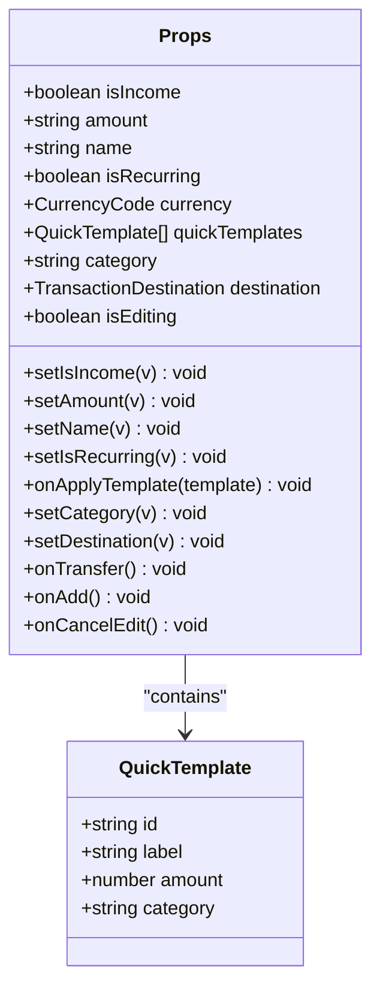

**Diagram sources**
- [transaction-form.tsx:81-101](file://components/transaction-form.tsx#L81-L101)

The component manages several internal states:
- **Amount parsing preview**: Real-time calculation preview
- **Focus management**: Intelligent cursor positioning
- **Template rendering**: Dynamic template display
- **Keyboard shortcuts**: Enter to submit, Escape to cancel

**Section sources**
- [transaction-form.tsx:81-101](file://components/transaction-form.tsx#L81-L101)
- [transaction-form.tsx:124-131](file://components/transaction-form.tsx#L124-L131)

### Intelligent Amount Parsing System
The amount parsing system handles multiple numeric formats and currency normalization:

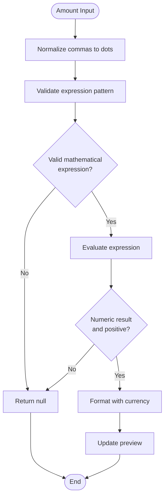

**Diagram sources**
- [transaction-form.tsx:25-35](file://components/transaction-form.tsx#L25-L35)
- [transaction-form.tsx:146-150](file://components/transaction-form.tsx#L146-L150)

The parsing system supports:
- **Mixed decimal separators**: Handles both comma and dot notation
- **Mathematical expressions**: Basic arithmetic operations (+, -, *, /, parentheses)
- **Currency detection**: Automatic recognition of UAH, USD, EUR symbols
- **Real-time feedback**: Live calculation preview with currency formatting

**Section sources**
- [transaction-form.tsx:25-35](file://components/transaction-form.tsx#L25-L35)
- [transaction-form.tsx:146-150](file://components/transaction-form.tsx#L146-L150)

### Category Selection Dropdown
The CategorySelect component provides an intuitive dropdown interface with visual indicators:

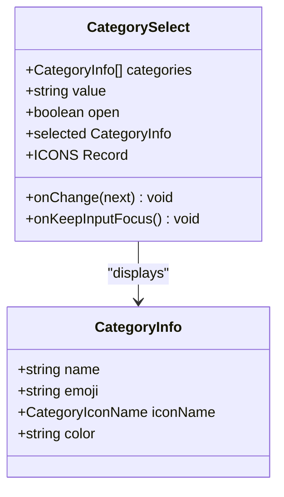

**Diagram sources**
- [category-select.tsx:44-49](file://components/category-select.tsx#L44-L49)
- [finance.ts:16-35](file://lib/finance.ts#L16-L35)

Features include:
- **Visual category representation**: Emoji and color-coded icons
- **Keyboard navigation**: Arrow keys and Enter for selection
- **Accessibility**: Proper ARIA attributes and screen reader support
- **Animation**: Smooth expand/collapse transitions

**Section sources**
- [category-select.tsx:44-49](file://components/category-select.tsx#L44-L49)
- [finance.ts:16-35](file://lib/finance.ts#L16-L35)

### Quick Template System
The template system enables rapid transaction entry through predefined patterns:

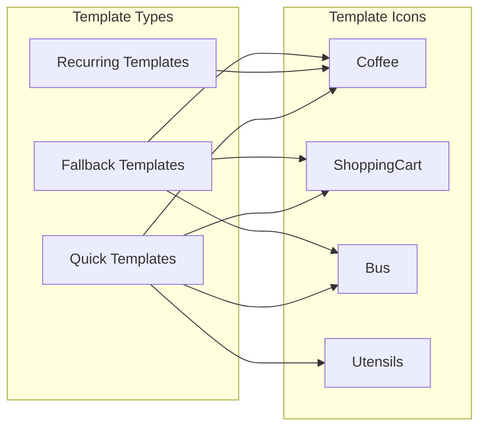

**Diagram sources**
- [transaction-form.tsx:60-72](file://components/transaction-form.tsx#L60-L72)
- [transaction-form.tsx:202-204](file://components/transaction-form.tsx#L202-L204)

Template management includes:
- **Customizable templates**: Users can modify and add templates
- **Icon mapping**: Visual representation of template categories
- **Fallback system**: Default templates when none are configured
- **Dynamic rendering**: Templates adapt to available space

**Section sources**
- [transaction-form.tsx:60-72](file://components/transaction-form.tsx#L60-L72)
- [transaction-form.tsx:202-204](file://components/transaction-form.tsx#L202-L204)

### Clipboard Integration
The clipboard integration provides smart transaction parsing:

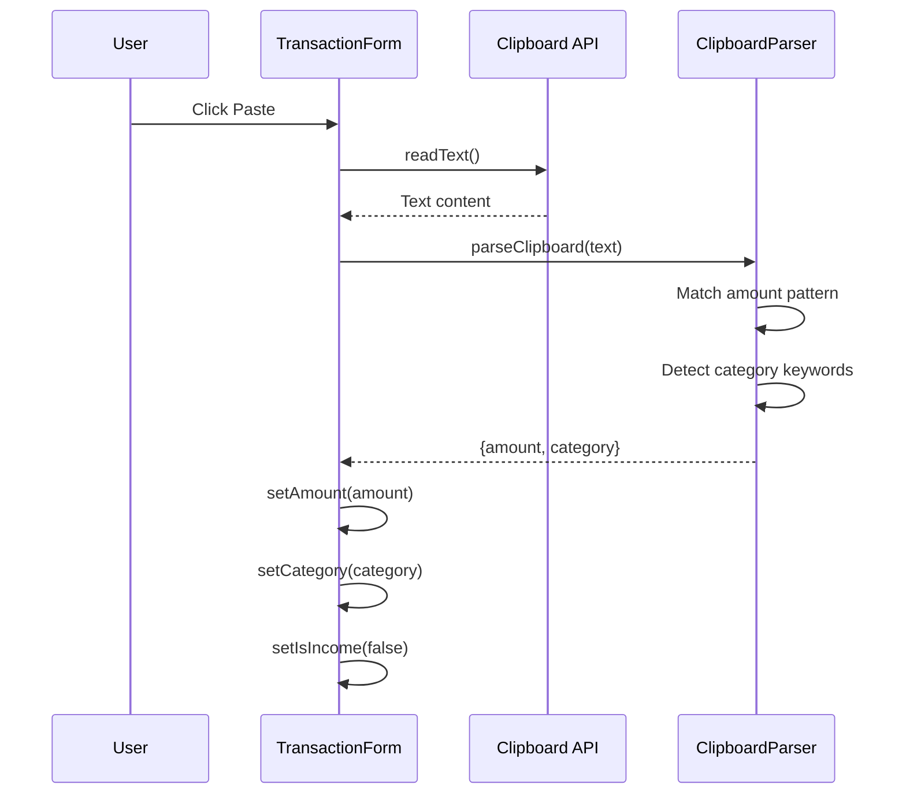

**Diagram sources**
- [transaction-form.tsx:183-200](file://components/transaction-form.tsx#L183-L200)

The parser recognizes:
- **Amount patterns**: UAH, USD, EUR currency symbols with numeric values
- **Merchant keywords**: Automatic category detection from text
- **Fallback parsing**: Simple numeric extraction when complex parsing fails

**Section sources**
- [transaction-form.tsx:183-200](file://components/transaction-form.tsx#L183-L200)

### Recurring Transaction Functionality
Recurring transactions are managed through template matching and automatic generation:

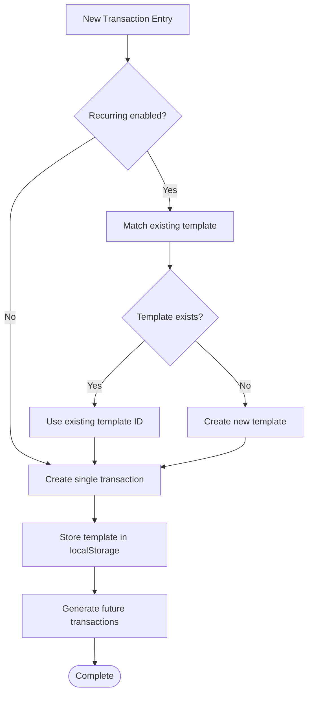

**Diagram sources**
- [finance-tracker.tsx:210-237](file://components/finance-tracker.tsx#L210-L237)

**Section sources**
- [finance-tracker.tsx:210-237](file://components/finance-tracker.tsx#L210-L237)

### Mobile-Optimized Input Handling
The component includes extensive mobile-specific optimizations:

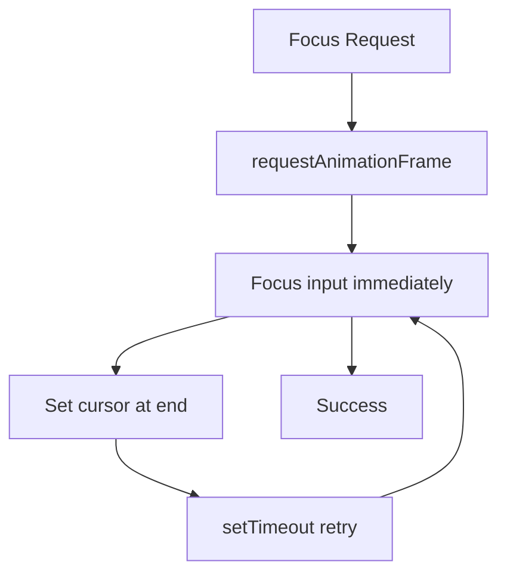

**Diagram sources**
- [transaction-form.tsx:152-167](file://components/transaction-form.tsx#L152-L167)

Mobile features include:
- **Aggressive focus management**: Ensures input field receives focus on mobile
- **Decimal input mode**: Optimized numeric keypad appearance
- **Touch-friendly controls**: Large buttons with adequate spacing
- **Safe area awareness**: Proper padding for modern mobile devices

**Section sources**
- [transaction-form.tsx:152-167](file://components/transaction-form.tsx#L152-L167)

## Dependency Analysis
The TransactionForm component has well-defined dependencies that support its functionality:

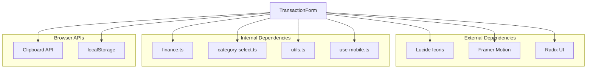

**Diagram sources**
- [transaction-form.tsx:3-23](file://components/transaction-form.tsx#L3-L23)
- [finance-tracker.tsx:6-23](file://components/finance-tracker.tsx#L6-L23)

**Section sources**
- [transaction-form.tsx:3-23](file://components/transaction-form.tsx#L3-L23)
- [finance-tracker.tsx:6-23](file://components/finance-tracker.tsx#L6-L23)

## Performance Considerations
The component is designed with several performance optimizations:

### Rendering Optimizations
- **Memoized calculations**: Expression evaluation cached until input changes
- **Conditional rendering**: Templates only render when needed
- **Efficient state updates**: Minimal re-renders through controlled updates

### Memory Management
- **Cleanup functions**: Proper cleanup of event listeners and timeouts
- **Focused input management**: Prevents unnecessary focus changes
- **Animation optimization**: Uses requestAnimationFrame for smooth animations

### Accessibility Features
- **Keyboard navigation**: Full keyboard support for all interactive elements
- **Screen reader support**: Proper ARIA attributes and labels
- **Focus management**: Logical tab order and focus trapping
- **High contrast**: Sufficient color contrast for readability

## Troubleshooting Guide

### Common Validation Issues
**Amount parsing failures**: Occur when input contains invalid mathematical expressions or non-numeric characters. The system validates expressions against a strict pattern and rejects anything outside accepted mathematical operations.

**Category selection problems**: Ensure categories are properly defined in the CATEGORIES constant and match the expected format.

**Template application errors**: Verify template IDs are unique and template data structures match the expected format.

### Clipboard Integration Problems
**Permission issues**: Clipboard access requires secure contexts (HTTPS) and user gesture. The component gracefully handles clipboard unavailability.

**Parsing failures**: The parser expects specific patterns for currency symbols and amounts. Non-standard formats may not be recognized.

### Mobile-Specific Issues
**Focus problems**: Some mobile browsers have inconsistent focus behavior. The component uses multiple strategies to ensure reliable focus management.

**Keyboard overlap**: On mobile devices, the numeric keypad may overlap with the input field. The component adjusts focus and cursor position to maintain usability.

**Touch target sizing**: Buttons are sized appropriately for touch interaction, but may need adjustment on very small screens.

**Section sources**
- [transaction-form.tsx:183-200](file://components/transaction-form.tsx#L183-L200)
- [transaction-form.tsx:152-167](file://components/transaction-form.tsx#L152-L167)

## Conclusion
The TransactionForm component represents a sophisticated solution for financial transaction entry, combining intelligent parsing, intuitive UI patterns, and robust data management. Its dual-mode operation seamlessly supports both new entries and editing workflows, while the integrated template and recurring transaction systems provide significant productivity benefits.

The component's architecture demonstrates excellent separation of concerns, with clear boundaries between presentation, business logic, and data persistence. The extensive accessibility features and mobile optimizations ensure broad usability across different platforms and user needs.

Key strengths include the intelligent amount parsing system, comprehensive category management with visual indicators, efficient template system, and thoughtful integration with the broader FinanceTracker ecosystem. The component serves as a foundation for extensible financial tracking functionality that can accommodate future enhancements while maintaining its core user experience principles.