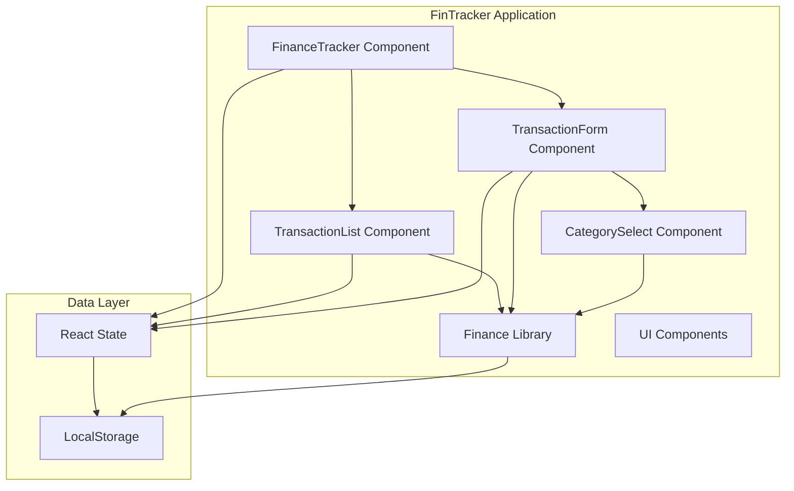
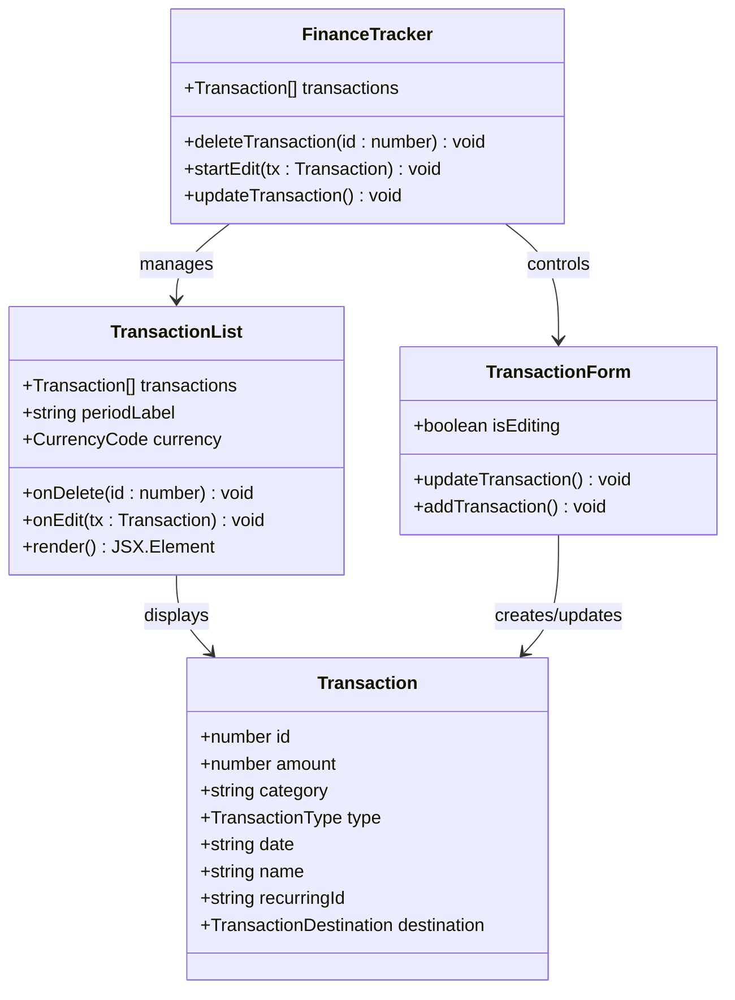
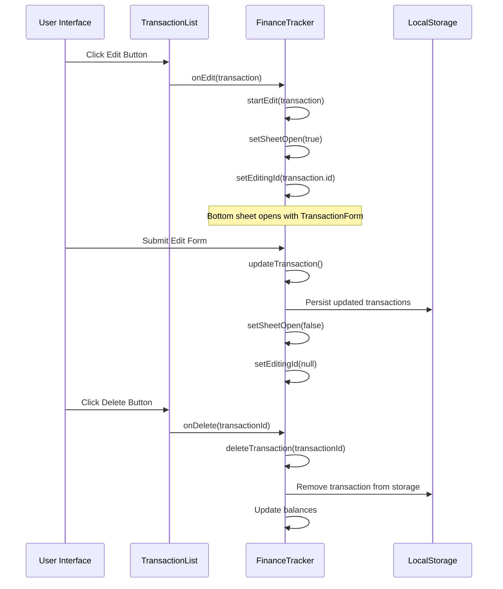
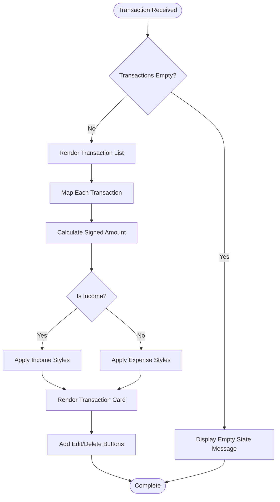
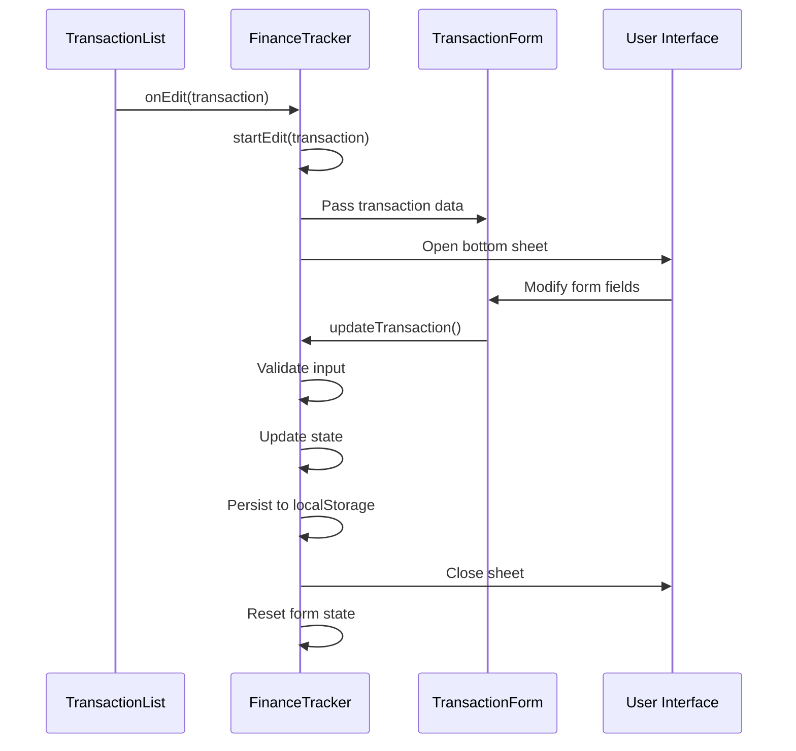
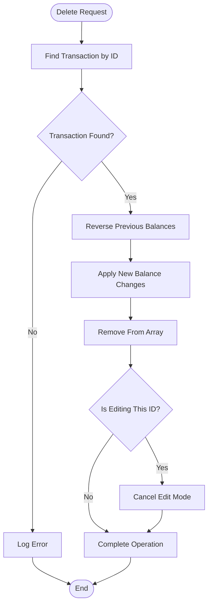
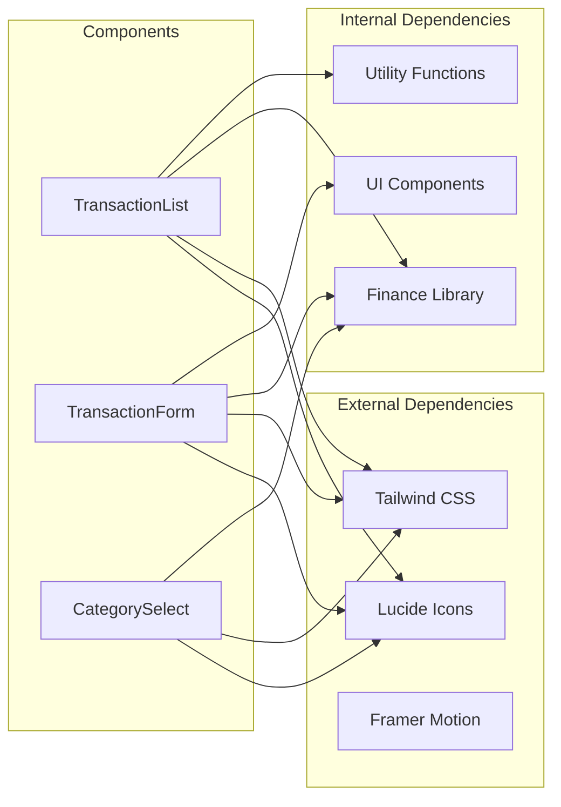
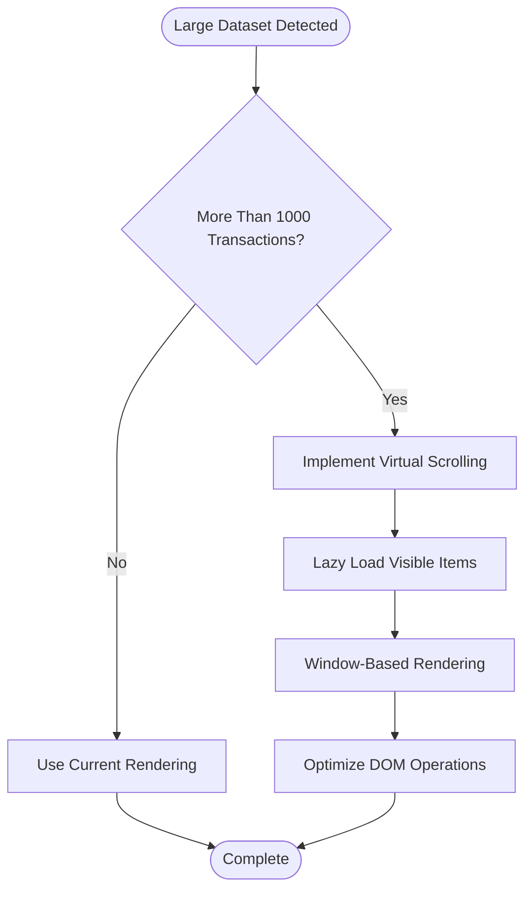
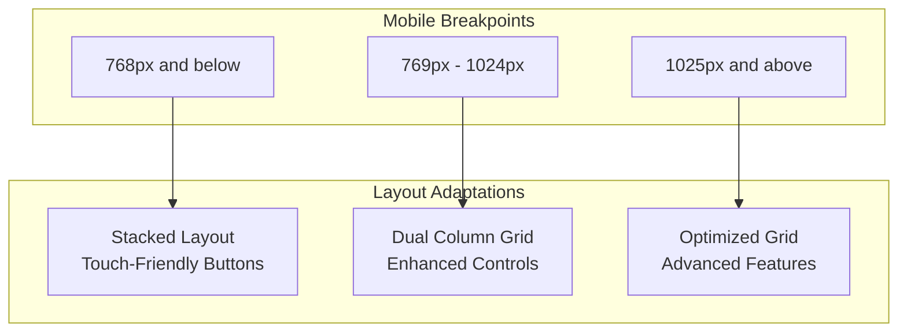
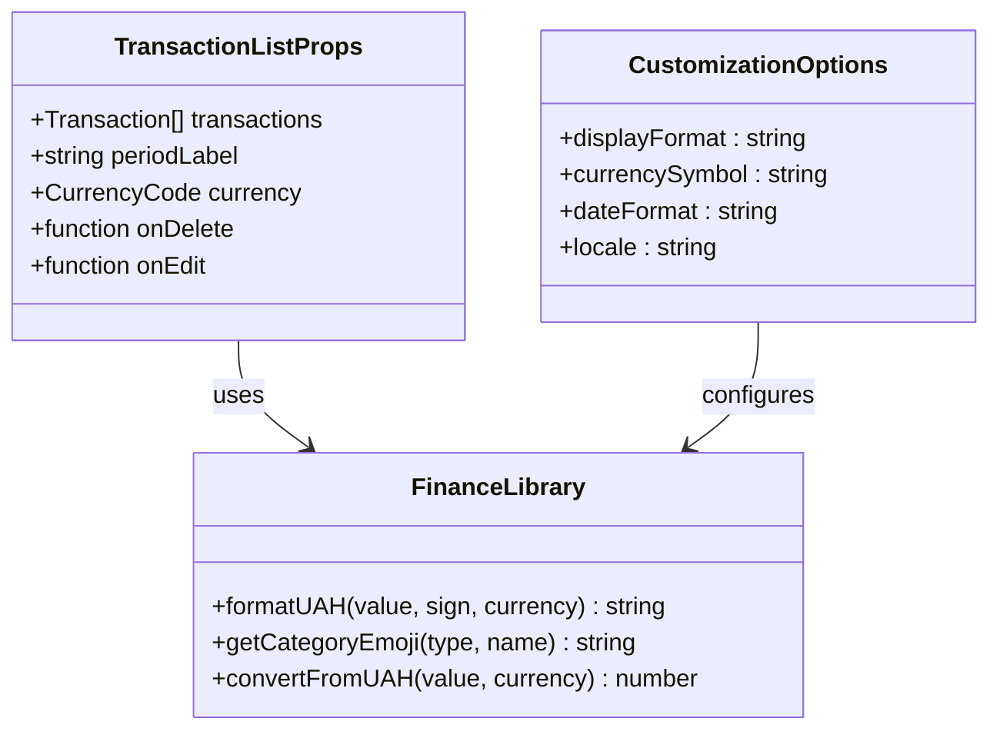

# Transaction List Component

<cite>
**Referenced Files in This Document**
- [transaction-list.tsx](file://components/transaction-list.tsx)
- [finance-tracker.tsx](file://components/finance-tracker.tsx)
- [finance.ts](file://lib/finance.ts)
- [transaction-form.tsx](file://components/transaction-form.tsx)
- [category-select.tsx](file://components/category-select.tsx)
- [use-mobile.tsx](file://components/ui/use-mobile.tsx)
- [globals.css](file://app/globals.css)
</cite>

## Table of Contents
1. [Introduction](#introduction)
2. [Project Structure](#project-structure)
3. [Core Components](#core-components)
4. [Architecture Overview](#architecture-overview)
5. [Detailed Component Analysis](#detailed-component-analysis)
6. [Dependency Analysis](#dependency-analysis)
7. [Performance Considerations](#performance-considerations)
8. [Accessibility Features](#accessibility-features)
9. [Responsive Design Implementation](#responsive-design-implementation)
10. [Customization Guide](#customization-guide)
11. [Troubleshooting Guide](#troubleshooting-guide)
12. [Conclusion](#conclusion)

## Introduction

The TransactionList component is a core financial management interface responsible for displaying, editing, and deleting transaction records in the FinTracker application. This component serves as the primary user interface for viewing monthly financial activities while providing intuitive controls for transaction modification and removal.

The component operates within a comprehensive financial tracking ecosystem that includes transaction categorization, currency conversion, balance management, and data persistence. It presents transaction data in an organized, visually distinct format with clear indicators for income and expense types, supporting both desktop and mobile interaction patterns.

## Project Structure

The TransactionList component integrates seamlessly with the broader FinTracker architecture, working in conjunction with state management, form handling, and data persistence systems.



**Diagram sources**
- [finance-tracker.tsx:57-545](file://components/finance-tracker.tsx#L57-L545)
- [transaction-list.tsx:14-101](file://components/transaction-list.tsx#L14-L101)
- [finance.ts:43-52](file://lib/finance.ts#L43-L52)

**Section sources**
- [finance-tracker.tsx:57-545](file://components/finance-tracker.tsx#L57-L545)
- [transaction-list.tsx:14-101](file://components/transaction-list.tsx#L14-L101)

## Core Components

The TransactionList component serves as the primary display mechanism for financial transactions, featuring a clean card-based layout that emphasizes readability and usability.

### Component Architecture



**Diagram sources**
- [transaction-list.tsx:6-12](file://components/transaction-list.tsx#L6-L12)
- [finance.ts:43-52](file://lib/finance.ts#L43-L52)
- [finance-tracker.tsx:320-329](file://components/finance-tracker.tsx#L320-L329)

### Transaction Rendering Structure

The component renders each transaction as a self-contained card with the following structure:

| Element | Purpose | Accessibility Features |
|---------|---------|----------------------|
| Icon Container | Visual indicator for transaction type (income/expense) | Uses semantic icons with aria-hidden=true |
| Amount Display | Formatted currency value with sign indication | Color-coded for positive/negative amounts |
| Description Area | Category, date, and optional destination information | Truncated text for overflow protection |
| Action Buttons | Edit and Delete controls | Proper aria-labels and keyboard navigation |

**Section sources**
- [transaction-list.tsx:14-101](file://components/transaction-list.tsx#L14-L101)
- [finance.ts:109-123](file://lib/finance.ts#L109-L123)

## Architecture Overview

The TransactionList component participates in a unidirectional data flow pattern where the parent FinanceTracker component manages state and passes down handlers for transaction operations.



**Diagram sources**
- [finance-tracker.tsx:320-346](file://components/finance-tracker.tsx#L320-L346)
- [transaction-list.tsx:77-93](file://components/transaction-list.tsx#L77-L93)

**Section sources**
- [finance-tracker.tsx:320-346](file://components/finance-tracker.tsx#L320-L346)
- [transaction-list.tsx:77-93](file://components/transaction-list.tsx#L77-L93)

## Detailed Component Analysis

### Transaction Display Logic

The component implements sophisticated rendering logic to present transaction data in an intuitive format:



**Diagram sources**
- [transaction-list.tsx:27-96](file://components/transaction-list.tsx#L27-L96)

### Edit Mode Functionality

The edit mode implementation provides a seamless transition between viewing and modifying transaction data:



**Diagram sources**
- [finance-tracker.tsx:320-307](file://components/finance-tracker.tsx#L320-L307)
- [transaction-form.tsx:103-123](file://components/transaction-form.tsx#L103-L123)

### Delete Confirmation Process

The delete operation follows a careful sequence to maintain data integrity:



**Diagram sources**
- [finance-tracker.tsx:331-346](file://components/finance-tracker.tsx#L331-L346)

**Section sources**
- [transaction-list.tsx:77-93](file://components/transaction-list.tsx#L77-L93)
- [finance-tracker.tsx:320-346](file://components/finance-tracker.tsx#L320-L346)

### Filtering and Sorting Capabilities

The current implementation focuses on presentation rather than built-in filtering/sorting. However, the component structure supports extension for these features:

| Feature | Current Status | Extension Points |
|---------|---------------|------------------|
| Date Filtering | Not Implemented | Add date range props to TransactionList |
| Category Filter | Not Implemented | Add category selection UI |
| Amount Range | Not Implemented | Add numeric range filters |
| Sort Order | Not Implemented | Add sort direction prop |
| Type Filter | Not Implemented | Add income/expense toggle |

**Section sources**
- [transaction-list.tsx:14-101](file://components/transaction-list.tsx#L14-L101)

## Dependency Analysis

The TransactionList component maintains loose coupling with external dependencies while leveraging internal utilities:



**Diagram sources**
- [transaction-list.tsx:3-4](file://components/transaction-list.tsx#L3-L4)
- [finance-tracker.tsx:6-16](file://components/finance-tracker.tsx#L6-L16)

**Section sources**
- [transaction-list.tsx:3-4](file://components/transaction-list.tsx#L3-L4)
- [finance-tracker.tsx:6-16](file://components/finance-tracker.tsx#L6-L16)

## Performance Considerations

### Rendering Optimization

The component employs several strategies to maintain optimal performance:

- **Minimal Re-renders**: Uses stable keys based on transaction IDs
- **Efficient Styling**: Leverages Tailwind utility classes for fast rendering
- **Conditional Rendering**: Empty state optimization prevents unnecessary DOM nodes
- **Memory Management**: Proper cleanup of event listeners and timeouts

### Large Dataset Handling

For applications handling extensive transaction histories:



**Section sources**
- [transaction-list.tsx:27-96](file://components/transaction-list.tsx#L27-L96)

## Accessibility Features

The component implements comprehensive accessibility features:

### Keyboard Navigation
- **Tab Navigation**: Full tab order through all interactive elements
- **Enter/Space**: Activation of buttons and menu items
- **Escape**: Closes dropdowns and modals
- **Arrow Keys**: Navigation within category selectors

### Screen Reader Support
- **ARIA Labels**: Descriptive labels for all interactive elements
- **Role Attributes**: Proper ARIA roles for semantic meaning
- **Live Regions**: Dynamic content updates announced
- **Focus Management**: Automatic focus restoration

### Visual Accessibility
- **Color Contrast**: Sufficient contrast ratios for text and backgrounds
- **Focus Indicators**: Visible focus rings for keyboard navigation
- **Reduced Motion**: Respects user preferences for motion reduction
- **High Contrast**: Compatible with high contrast mode

**Section sources**
- [transaction-list.tsx:80-92](file://components/transaction-list.tsx#L80-L92)
- [category-select.tsx:73-93](file://components/category-select.tsx#L73-L93)

## Responsive Design Implementation

### Mobile-First Approach

The component follows a mobile-first responsive design strategy:



**Diagram sources**
- [use-mobile.tsx:3-18](file://components/ui/use-mobile.tsx#L3-L18)

### Touch Interaction Patterns

The interface incorporates optimized touch interactions:

| Interaction | Mobile Behavior | Desktop Behavior |
|-------------|----------------|------------------|
| Button Press | Larger tap targets (≥44px) | Standard click targets |
| Swipe Gestures | Horizontal scrolling for templates | Mouse wheel for overflow |
| Long Press | Context menu activation | Right-click menu |
| Drag Operations | Touch-friendly drag handles | Mouse drag handles |
| Scroll Behavior | Momentum scrolling | Smooth mouse wheel |

**Section sources**
- [use-mobile.tsx:3-18](file://components/ui/use-mobile.tsx#L3-L18)
- [globals.css:121-126](file://app/globals.css#L121-L126)

## Customization Guide

### Display Format Customization

The component supports flexible display customization through props and utility functions:



**Diagram sources**
- [transaction-list.tsx:6-12](file://components/transaction-list.tsx#L6-L12)
- [finance.ts:109-123](file://lib/finance.ts#L109-L123)

### Adding New Columns

To extend the transaction display with additional columns:

1. **Modify Transaction Type**: Extend the Transaction interface in finance.ts
2. **Update Rendering Logic**: Add new column cells in transaction-list.tsx
3. **Implement Sorting**: Add sort handlers for new data fields
4. **Update Styling**: Add appropriate CSS classes for new columns
5. **Maintain Accessibility**: Ensure new columns have proper ARIA attributes

### Additional Filtering Options

Potential filtering enhancements:

```typescript
// Example extension points for filtering
interface TransactionFilter {
  dateRange?: { start: Date; end: Date };
  categories?: string[];
  amountRange?: { min: number; max: number };
  types?: TransactionType[];
  destinations?: TransactionDestination[];
  searchTerm?: string;
}

interface TransactionSort {
  field: 'date' | 'amount' | 'category' | 'type';
  direction: 'asc' | 'desc';
}
```

**Section sources**
- [finance.ts:43-52](file://lib/finance.ts#L43-L52)
- [transaction-list.tsx:14-101](file://components/transaction-list.tsx#L14-L101)

## Troubleshooting Guide

### Common Issues and Solutions

| Issue | Symptoms | Solution |
|-------|----------|----------|
| Edit Form Not Opening | Clicking edit button has no effect | Verify onEdit handler is passed correctly |
| Transaction Not Updating | Changes not reflected after edit | Check state management in FinanceTracker |
| Delete Confirmation Loop | Multiple delete prompts appear | Ensure proper state cleanup in deleteTransaction |
| Currency Display Errors | Incorrect currency formatting | Verify currency prop is passed correctly |
| Mobile Touch Issues | Buttons not responding on mobile | Check touch-action CSS properties |

### Debugging Strategies

1. **Console Logging**: Add logs in key lifecycle methods
2. **State Inspection**: Monitor transaction array changes
3. **Network Monitoring**: Track localStorage operations
4. **Performance Profiling**: Use React DevTools profiler
5. **Accessibility Testing**: Validate with screen readers

**Section sources**
- [finance-tracker.tsx:331-346](file://components/finance-tracker.tsx#L331-L346)
- [transaction-list.tsx:77-93](file://components/transaction-list.tsx#L77-L93)

## Conclusion

The TransactionList component provides a robust foundation for financial transaction management within the FinTracker application. Its clean architecture, comprehensive accessibility features, and responsive design make it suitable for both casual users and power users managing complex financial portfolios.

The component's strength lies in its simplicity and effectiveness, focusing on the core task of transaction display while delegating complex operations to specialized components. The integration with the broader FinTracker ecosystem ensures data consistency, user experience continuity, and extensibility for future enhancements.

Future development opportunities include implementing advanced filtering and sorting capabilities, adding virtual scrolling for large datasets, and expanding customization options for different user preferences and use cases.