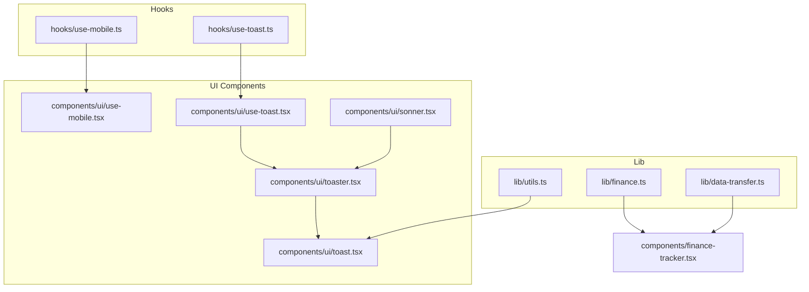
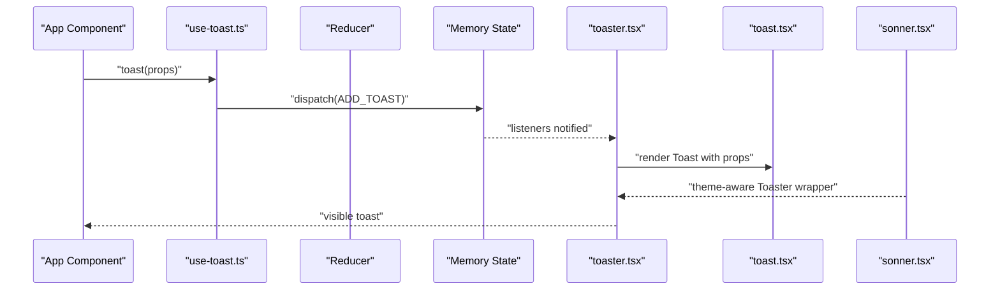
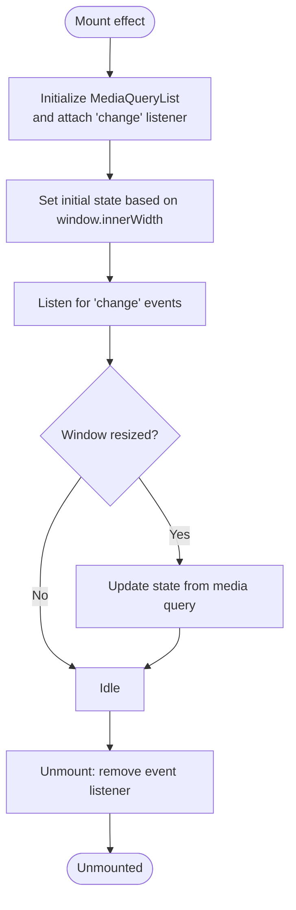
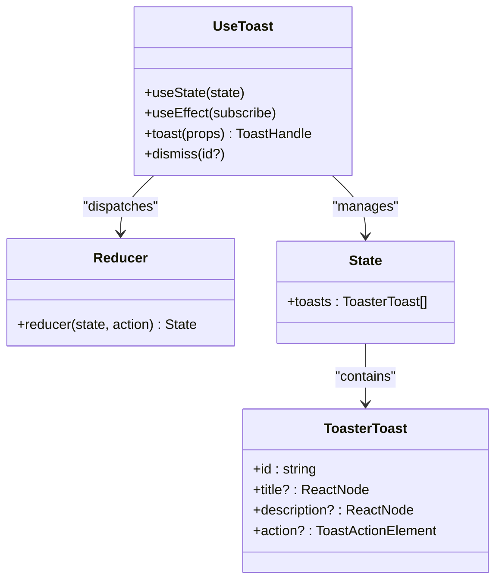
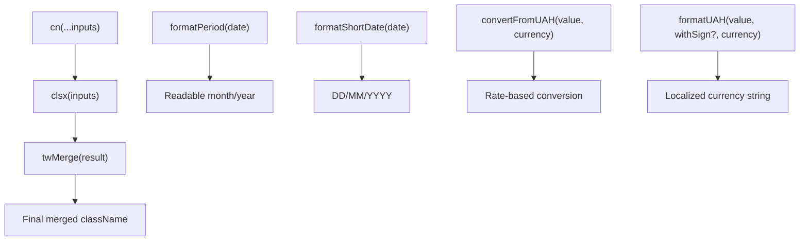
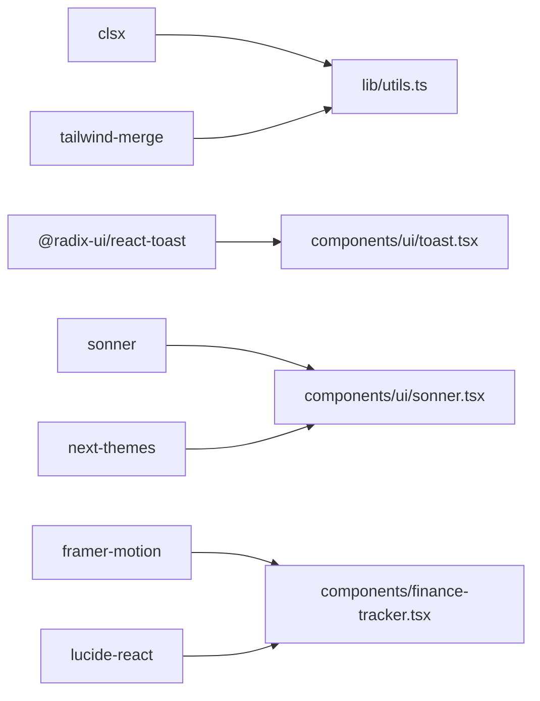

# Custom Hooks and Utilities

<cite>
**Referenced Files in This Document**
- [use-mobile.ts](file://hooks/use-mobile.ts)
- [use-mobile.tsx](file://components/ui/use-mobile.tsx)
- [use-toast.ts](file://hooks/use-toast.ts)
- [use-toast.tsx](file://components/ui/use-toast.tsx)
- [toaster.tsx](file://components/ui/toaster.tsx)
- [sonner.tsx](file://components/ui/sonner.tsx)
- [toast.tsx](file://components/ui/toast.tsx)
- [utils.ts](file://lib/utils.ts)
- [finance.ts](file://lib/finance.ts)
- [data-transfer.ts](file://lib/data-transfer.ts)
- [package.json](file://package.json)
- [finance-tracker.tsx](file://components/finance-tracker.tsx)
- [sidebar.tsx](file://components/ui/sidebar.tsx)
</cite>

## Table of Contents
1. [Introduction](#introduction)
2. [Project Structure](#project-structure)
3. [Core Components](#core-components)
4. [Architecture Overview](#architecture-overview)
5. [Detailed Component Analysis](#detailed-component-analysis)
6. [Dependency Analysis](#dependency-analysis)
7. [Performance Considerations](#performance-considerations)
8. [Troubleshooting Guide](#troubleshooting-guide)
9. [Conclusion](#conclusion)
10. [Appendices](#appendices)

## Introduction
This document provides comprehensive documentation for finTracker’s custom hooks and utility functions. It focuses on:
- Responsive design detection via the use-is-mobile hook
- Notification system integration with Sonner and toast management via the use-toast hook
- Utility functions for class name merging and common helper functions
- Type definitions for financial data and formatting helpers
- Implementation patterns, usage scenarios, error handling, and performance considerations
- Best practices for hook development, testing strategies, and consistency across the application

## Project Structure
The relevant modules are organized into three primary areas:
- hooks: Custom React hooks for cross-cutting concerns
- components/ui: UI primitives and integration components for notifications and responsive behavior
- lib: Shared utilities for types, formatting, and data transfer

**Diagram sources**
- [use-mobile.ts:1-20](file://hooks/use-mobile.ts#L1-L20)
- [use-mobile.tsx:1-20](file://components/ui/use-mobile.tsx#L1-L20)
- [use-toast.ts:1-192](file://hooks/use-toast.ts#L1-L192)
- [use-toast.tsx:1-192](file://components/ui/use-toast.tsx#L1-L192)
- [toaster.tsx:1-36](file://components/ui/toaster.tsx#L1-L36)
- [sonner.tsx:1-26](file://components/ui/sonner.tsx#L1-L26)
- [toast.tsx:1-25](file://components/ui/toast.tsx#L1-L25)
- [utils.ts:1-7](file://lib/utils.ts#L1-L7)
- [finance.ts:1-122](file://lib/finance.ts#L1-L122)
- [data-transfer.ts:1-115](file://lib/data-transfer.ts#L1-L115)
- [finance-tracker.tsx:1-907](file://components/finance-tracker.tsx#L1-L907)

**Section sources**
- [use-mobile.ts:1-20](file://hooks/use-mobile.ts#L1-L20)
- [use-mobile.tsx:1-20](file://components/ui/use-mobile.tsx#L1-L20)
- [use-toast.ts:1-192](file://hooks/use-toast.ts#L1-L192)
- [use-toast.tsx:1-192](file://components/ui/use-toast.tsx#L1-L192)
- [toaster.tsx:1-36](file://components/ui/toaster.tsx#L1-L36)
- [sonner.tsx:1-26](file://components/ui/sonner.tsx#L1-L26)
- [toast.tsx:1-25](file://components/ui/toast.tsx#L1-L25)
- [utils.ts:1-7](file://lib/utils.ts#L1-L7)
- [finance.ts:1-122](file://lib/finance.ts#L1-L122)
- [data-transfer.ts:1-115](file://lib/data-transfer.ts#L1-L115)
- [finance-tracker.tsx:1-907](file://components/finance-tracker.tsx#L1-L907)

## Core Components
This section documents the two primary custom hooks and supporting utilities.

- use-is-mobile hook
  - Purpose: Detects whether the current viewport width is below a mobile breakpoint and updates reactively on resize.
  - Implementation highlights:
    - Uses MediaQueryList to listen for media change events
    - Initializes state based on current window width
    - Cleans up event listeners on unmount
  - Returns a boolean indicating mobile state

- use-toast hook and toast manager
  - Purpose: Provides a toast notification system integrated with Radix UI and Sonner, with a custom reducer managing state and lifecycle.
  - Implementation highlights:
    - Centralized state with a reducer handling add/update/dismiss/remove actions
    - Unique ID generation per toast
    - Automatic removal timers keyed by toast ID
    - Memory-based state shared across consumers
  - Exports:
    - useToast: hook that subscribes to global toast state and exposes toast creation/update/dismissal
    - toast: convenience function to enqueue a new toast

- Utility functions
  - cn: Merges Tailwind CSS classes using clsx and tailwind-merge to avoid conflicts
  - Finance helpers: Types, constants, and formatting functions for categories, periods, dates, and currency conversion/formatting
  - Data transfer helpers: Export/import of localStorage-backed finance data to/from JSON

**Section sources**
- [use-mobile.ts:1-20](file://hooks/use-mobile.ts#L1-L20)
- [use-mobile.tsx:1-20](file://components/ui/use-mobile.tsx#L1-L20)
- [use-toast.ts:1-192](file://hooks/use-toast.ts#L1-L192)
- [use-toast.tsx:1-192](file://components/ui/use-toast.tsx#L1-L192)
- [toaster.tsx:1-36](file://components/ui/toaster.tsx#L1-L36)
- [sonner.tsx:1-26](file://components/ui/sonner.tsx#L1-L26)
- [toast.tsx:1-25](file://components/ui/toast.tsx#L1-L25)
- [utils.ts:1-7](file://lib/utils.ts#L1-L7)
- [finance.ts:1-122](file://lib/finance.ts#L1-L122)
- [data-transfer.ts:1-115](file://lib/data-transfer.ts#L1-L115)

## Architecture Overview
The toast system integrates UI primitives, a custom hook, and a Sonner-based renderer. The responsive hook is used across UI components to adapt behavior for mobile.

**Diagram sources**
- [use-toast.ts:133-169](file://hooks/use-toast.ts#L133-L169)
- [toaster.tsx:13-35](file://components/ui/toaster.tsx#L13-L35)
- [toast.tsx:1-25](file://components/ui/toast.tsx#L1-L25)
- [sonner.tsx:6-23](file://components/ui/sonner.tsx#L6-L23)

**Section sources**
- [use-toast.ts:1-192](file://hooks/use-toast.ts#L1-L192)
- [toaster.tsx:1-36](file://components/ui/toaster.tsx#L1-L36)
- [toast.tsx:1-25](file://components/ui/toast.tsx#L1-L25)
- [sonner.tsx:1-26](file://components/ui/sonner.tsx#L1-L26)

## Detailed Component Analysis

### use-is-mobile Hook
- Responsibilities
  - Detect mobile viewport and update on resize
  - Provide a boolean flag for responsive UI decisions
- Implementation pattern
  - Uses window.matchMedia for efficient media queries
  - Subscribes to change events and cleans up on unmount
  - Initializes state based on current window width
- Usage scenarios
  - Conditional rendering of mobile-specific layouts
  - Adjusting component sizes or interactions for smaller screens
  - Integrating with sidebar or navigation toggles

**Diagram sources**
- [use-mobile.ts:8-16](file://hooks/use-mobile.ts#L8-L16)
- [use-mobile.tsx:8-16](file://components/ui/use-mobile.tsx#L8-L16)

**Section sources**
- [use-mobile.ts:1-20](file://hooks/use-mobile.ts#L1-L20)
- [use-mobile.tsx:1-20](file://components/ui/use-mobile.tsx#L1-L20)

### use-toast Hook and Toast Manager
- Responsibilities
  - Manage a single toast queue with controlled concurrency
  - Provide functions to enqueue, update, and dismiss toasts
  - Integrate with Radix UI toast primitives and Sonner for theming
- Implementation pattern
  - Central reducer manages state transitions
  - Unique IDs generated per toast
  - Timers schedule automatic dismissal and removal
  - Global listeners notify subscribed components
- Integration points
  - Toaster renders the current toast list
  - Sonner provides theme-aware rendering and styling
  - Radix toast primitives define structure and behavior

**Diagram sources**
- [use-toast.ts:52-127](file://hooks/use-toast.ts#L52-L127)
- [use-toast.ts:171-189](file://hooks/use-toast.ts#L171-L189)

**Section sources**
- [use-toast.ts:1-192](file://hooks/use-toast.ts#L1-L192)
- [use-toast.tsx:1-192](file://components/ui/use-toast.tsx#L1-L192)
- [toaster.tsx:1-36](file://components/ui/toaster.tsx#L1-L36)
- [sonner.tsx:1-26](file://components/ui/sonner.tsx#L1-L26)
- [toast.tsx:1-25](file://components/ui/toast.tsx#L1-L25)

### Utility Functions and Type Definitions
- cn (class merging)
  - Purpose: Merge and deduplicate Tailwind classes using clsx and tailwind-merge
  - Usage: Consistently combine conditional classes across components
- Finance types and helpers
  - Categories, icons, colors, and transaction types
  - Formatting helpers for periods, short dates, and currency
  - Conversion helpers for multiple currencies
- Data transfer helpers
  - Export all localStorage-backed finance data to JSON
  - Import backup JSON into localStorage with validation

**Diagram sources**
- [utils.ts:4-6](file://lib/utils.ts#L4-L6)
- [finance.ts:57-89](file://lib/finance.ts#L57-L89)
- [finance.ts:103-121](file://lib/finance.ts#L103-L121)

**Section sources**
- [utils.ts:1-7](file://lib/utils.ts#L1-L7)
- [finance.ts:1-122](file://lib/finance.ts#L1-L122)
- [data-transfer.ts:1-115](file://lib/data-transfer.ts#L1-L115)

## Dependency Analysis
External libraries and their roles:
- clsx and tailwind-merge: Class name merging and conflict resolution
- @radix-ui/react-toast: Primitive toast provider and viewport
- sonner: Theme-aware toast renderer with animations
- next-themes: Theme provider for Sonner integration
- framer-motion: Animations for sheets and overlays
- lucide-react: Icons used across UI components

**Diagram sources**
- [package.json:43-59](file://package.json#L43-L59)
- [utils.ts:1-2](file://lib/utils.ts#L1-L2)
- [toast.tsx:1-25](file://components/ui/toast.tsx#L1-L25)
- [sonner.tsx:1-26](file://components/ui/sonner.tsx#L1-L26)
- [finance-tracker.tsx:1-907](file://components/finance-tracker.tsx#L1-L907)

**Section sources**
- [package.json:1-73](file://package.json#L1-L73)

## Performance Considerations
- use-is-mobile
  - Uses MediaQueryList to avoid frequent reflows
  - Event listener cleanup prevents memory leaks
  - Initial state derived from window width avoids extra render
- use-toast
  - Single reducer and shared memory state minimize re-renders
  - Toast removal timers are keyed by ID to prevent redundant timeouts
  - Limit enforced to one toast reduces DOM overhead
- Utility functions
  - cn merges classes efficiently; prefer it for dynamic class composition
- Finance helpers
  - Memoization via useMemo in consumers reduces recomputation
  - Avoid unnecessary localStorage reads/writes by batching updates

[No sources needed since this section provides general guidance]

## Troubleshooting Guide
- Toast does not appear
  - Ensure Toaster is mounted in the app shell and subscribed via useToast
  - Verify Sonner theme integration is present
- Toast disappears immediately
  - Confirm onOpenChange triggers dismiss and that timers are not prematurely cleared
- Multiple toasts stacking
  - The system enforces a single-toast limit; consider removing the limit if needed
- Mobile detection not updating
  - Confirm MediaQueryList listener is attached and cleaned up on unmount
  - Check that the breakpoint aligns with your design system
- Import/Export errors
  - Validate backup JSON format and version
  - Ensure localStorage keys match expected prefixes

**Section sources**
- [toaster.tsx:13-35](file://components/ui/toaster.tsx#L13-L35)
- [sonner.tsx:6-23](file://components/ui/sonner.tsx#L6-L23)
- [use-toast.ts:58-72](file://hooks/use-toast.ts#L58-L72)
- [use-mobile.ts:8-16](file://hooks/use-mobile.ts#L8-L16)
- [data-transfer.ts:60-114](file://lib/data-transfer.ts#L60-L114)

## Conclusion
finTracker’s custom hooks and utilities provide a robust foundation for responsive UI and reliable toast notifications. The use-is-mobile hook enables adaptive layouts, while the use-toast hook delivers a scalable notification system integrated with Sonner. Utility functions streamline class composition and financial data handling, and type definitions ensure consistency across modules. Following the best practices outlined here will help maintain performance, reliability, and developer ergonomics as the application evolves.

[No sources needed since this section summarizes without analyzing specific files]

## Appendices

### Usage Scenarios and Examples
- Responsive UI adaptation
  - Use use-is-mobile to conditionally render compact layouts or toggle drawers
  - Example integration points: sidebar, navigation menus, and content cards
- Toast notifications
  - Enqueue toasts with concise messages and optional actions
  - Dismiss programmatically or rely on automatic timers
  - Example integration points: form submissions, settings updates, and import/export feedback
- Financial formatting
  - Use formatPeriod and formatShortDate for consistent date displays
  - Use formatUAH for localized currency strings across components
- Data persistence
  - Use exportAllData and importDataFromFile to back up and restore user data

**Section sources**
- [use-mobile.tsx:1-20](file://components/ui/use-mobile.tsx#L1-L20)
- [sidebar.tsx:1-200](file://components/ui/sidebar.tsx#L1-L200)
- [use-toast.ts:142-169](file://hooks/use-toast.ts#L142-L169)
- [finance.ts:57-89](file://lib/finance.ts#L57-L89)
- [finance.ts:107-121](file://lib/finance.ts#L107-L121)
- [data-transfer.ts:14-54](file://lib/data-transfer.ts#L14-L54)
- [data-transfer.ts:56-114](file://lib/data-transfer.ts#L56-L114)

### Best Practices for Hook Development
- Keep hooks focused on a single responsibility
- Encapsulate side effects within useEffect and clean them up
- Provide clear return values and helper functions
- Avoid leaking global state; use local state where appropriate
- Test hook behavior with mocked window APIs and event listeners
- Document expected inputs, outputs, and side effects

[No sources needed since this section provides general guidance]

### Testing Strategies
- use-is-mobile
  - Mock window.matchMedia and window.innerWidth
  - Simulate resize events and verify state updates
- use-toast
  - Mock timers and dispatch actions
  - Verify reducer transitions and listener notifications
  - Test toast lifecycle: add, update, dismiss, remove
- Utilities
  - Unit test cn merging behavior with various inputs
  - Validate finance formatting and conversion functions with edge cases

[No sources needed since this section provides general guidance]

### Guidelines for Creating New Hooks and Extending Functionality
- Reuse existing patterns from use-is-mobile and use-toast
- Centralize shared logic in lib utilities when applicable
- Maintain consistent naming and return shapes
- Provide clear TypeScript definitions for props and return values
- Add integration tests for UI components that consume the hooks

[No sources needed since this section provides general guidance]