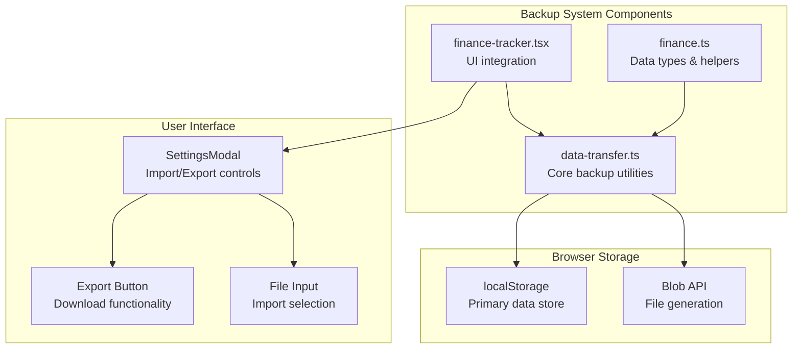
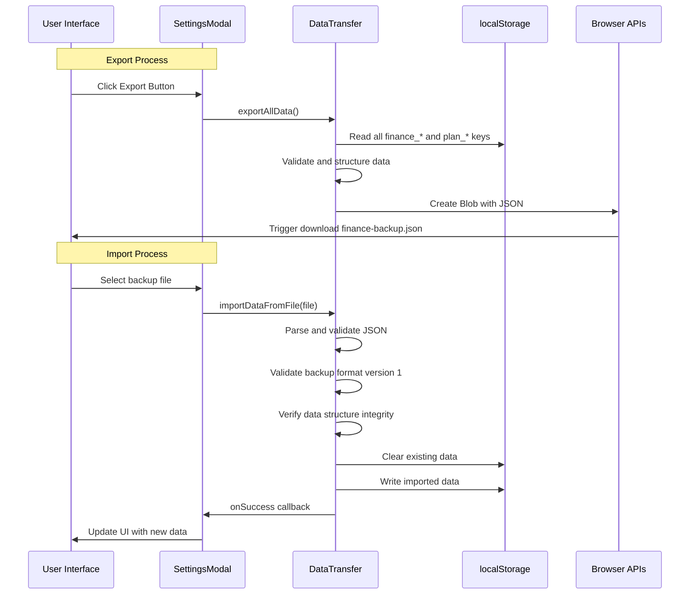
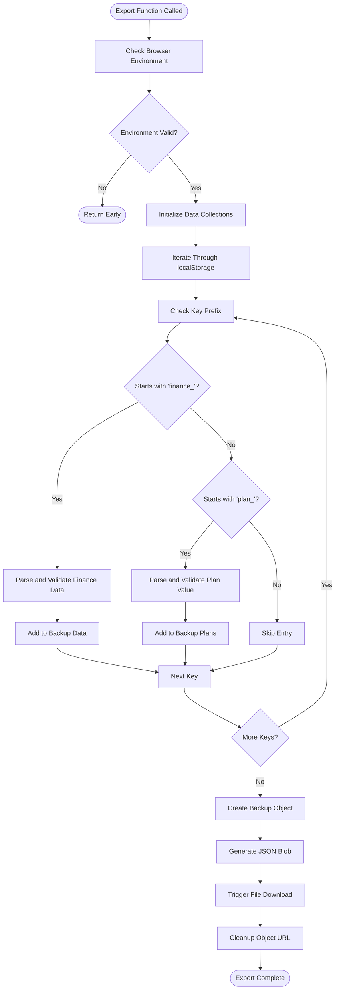
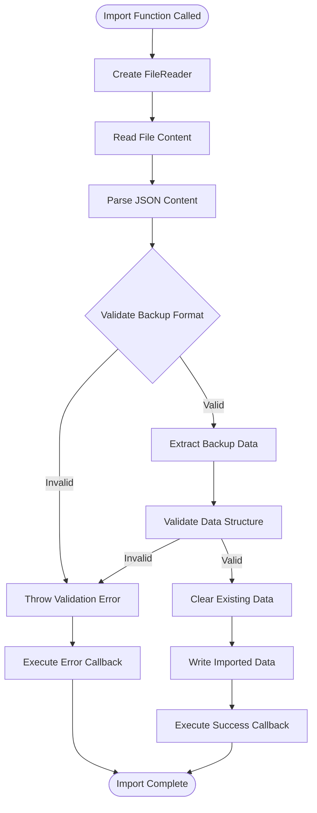
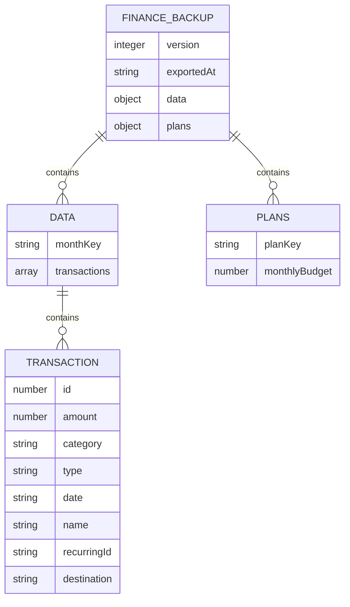
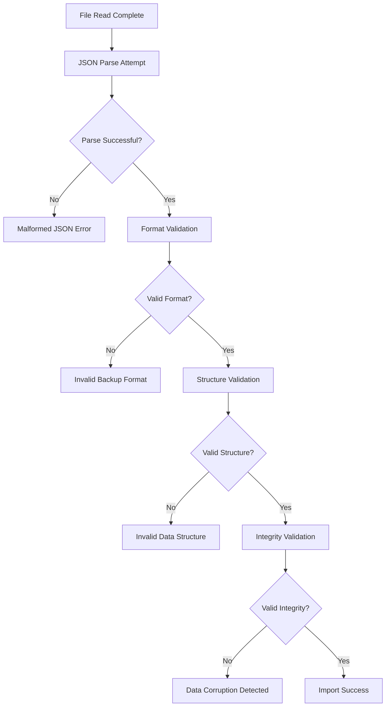

# Backup and Export System

<cite>
**Referenced Files in This Document**
- [data-transfer.ts](file://lib/data-transfer.ts)
- [finance.ts](file://lib/finance.ts)
- [finance-tracker.tsx](file://components/finance-tracker.tsx)
</cite>

## Table of Contents
1. [Introduction](#introduction)
2. [Project Structure](#project-structure)
3. [Core Components](#core-components)
4. [Architecture Overview](#architecture-overview)
5. [Detailed Component Analysis](#detailed-component-analysis)
6. [Backup File Format Specification](#backup-file-format-specification)
7. [Validation and Error Handling](#validation-and-error-handling)
8. [Security Considerations](#security-considerations)
9. [Troubleshooting Guide](#troubleshooting-guide)
10. [Conclusion](#conclusion)

## Introduction

The finTracker backup and export system provides comprehensive data portability and cross-device synchronization capabilities. This system enables users to export their financial data, settings, and configurations to portable JSON backup files, and import them seamlessly across devices or share them securely with trusted parties.

The system operates entirely client-side using browser localStorage as the primary data store, ensuring user privacy while maintaining robust data integrity through comprehensive validation and error handling mechanisms.

## Project Structure

The backup and export functionality is implemented through a focused set of components and utilities:

**Diagram sources**
- [data-transfer.ts:1-115](file://lib/data-transfer.ts#L1-L115)
- [finance-tracker.tsx:17-775](file://components/finance-tracker.tsx#L17-L775)
- [finance.ts:1-124](file://lib/finance.ts#L1-L124)

**Section sources**
- [data-transfer.ts:1-115](file://lib/data-transfer.ts#L1-L115)
- [finance-tracker.tsx:1-991](file://components/finance-tracker.tsx#L1-L991)

## Core Components

The backup system consists of three primary components working in concert:

### Data Transfer Module (`lib/data-transfer.ts`)
- **Export Function**: `exportAllData()` - Generates comprehensive backup files
- **Import Function**: `importDataFromFile()` - Validates and imports backup data
- **Data Types**: `FinanceBackup` interface defining the backup file structure

### Finance Tracker Integration (`components/finance-tracker.tsx`)
- **Settings Modal**: Provides user interface for backup operations
- **Button Controls**: Export and Import action buttons
- **File Input**: Handles file selection and processing

### Data Type Definitions (`lib/finance.ts`)
- **Transaction Type**: Defines the structure of financial transaction data
- **Key Generation**: Utility functions for localStorage key management
- **Category Information**: Supporting data structures for financial categorization

**Section sources**
- [data-transfer.ts:1-115](file://lib/data-transfer.ts#L1-L115)
- [finance-tracker.tsx:17-775](file://components/finance-tracker.tsx#L17-L775)
- [finance.ts:1-124](file://lib/finance.ts#L1-L124)

## Architecture Overview

The backup system follows a client-side architecture with automatic data persistence:

**Diagram sources**
- [data-transfer.ts:14-54](file://lib/data-transfer.ts#L14-L54)
- [data-transfer.ts:56-114](file://lib/data-transfer.ts#L56-L114)
- [finance-tracker.tsx:603-609](file://components/finance-tracker.tsx#L603-L609)

## Detailed Component Analysis

### Data Transfer Module Implementation

The core backup functionality is implemented in the `lib/data-transfer.ts` module, providing two primary functions for data portability:

#### Export Function (`exportAllData`)
The export function systematically collects all financial data from localStorage and packages it into a structured backup file:

**Diagram sources**
- [data-transfer.ts:14-54](file://lib/data-transfer.ts#L14-L54)

#### Import Function (`importDataFromFile`)
The import function provides comprehensive validation and safe data replacement:

**Diagram sources**
- [data-transfer.ts:56-114](file://lib/data-transfer.ts#L56-L114)

**Section sources**
- [data-transfer.ts:1-115](file://lib/data-transfer.ts#L1-L115)

### Settings Modal Integration

The backup functionality is seamlessly integrated into the SettingsModal component, providing intuitive user controls:

#### UI Controls and Event Handling
The SettingsModal provides dual functionality through dedicated button controls:
- **Export Button**: Triggers `exportAllData()` function for creating backup files
- **Import Button**: Opens file selection dialog for backup restoration
- **File Input**: Hidden element handling file selection and validation

#### Data Persistence Integration
The SettingsModal coordinates backup operations with the application's data persistence layer:
- **Success Callback**: Updates UI state with imported data
- **Error Handling**: Provides user feedback for import failures
- **Template Management**: Integrates with recurring transaction templates

**Section sources**
- [finance-tracker.tsx:547-775](file://components/finance-tracker.tsx#L547-L775)

### Data Type System

The backup system relies on well-defined TypeScript interfaces ensuring data integrity:

#### FinanceBackup Interface
The backup file structure is defined by the `FinanceBackup` interface:

| Property | Type | Description |
|----------|------|-------------|
| `version` | `1` | Backup format version identifier |
| `exportedAt` | `string` | ISO timestamp of backup creation |
| `data` | `{ [monthKey: string]: Transaction[] }` | Monthly transaction collections |
| `plans` | `{ [planKey: string]: number }` | Monthly budget plan values |

#### Transaction Type Definition
Financial data is structured using the `Transaction` interface:

| Field | Type | Description |
|-------|------|-------------|
| `id` | `number` | Unique transaction identifier |
| `amount` | `number` | Transaction amount value |
| `category` | `string` | Expense/income category name |
| `type` | `"income" \| "expense"` | Transaction type classification |
| `date` | `string` | ISO date string of transaction |
| `name` | `string` | Optional transaction description |
| `recurringId` | `string` | Optional recurring template reference |
| `destination` | `"card" \| "cash" \| "savings"` | Account destination |

**Section sources**
- [data-transfer.ts:3-12](file://lib/data-transfer.ts#L3-L12)
- [finance.ts:43-52](file://lib/finance.ts#L43-L52)

## Backup File Format Specification

### File Structure Overview

The backup system generates JSON files with a standardized structure designed for portability and validation:

**Diagram sources**
- [data-transfer.ts:3-12](file://lib/data-transfer.ts#L3-L12)
- [finance.ts:43-52](file://lib/finance.ts#L43-L52)

### Version Control Mechanism

The backup system implements a simple but effective version control approach:

- **Version 1**: Current format with comprehensive data structure
- **Validation**: Strict version checking prevents compatibility issues
- **Future Extensibility**: Version field allows for backward-compatible updates

### Data Structure Validation

The system enforces strict validation rules during import operations:

#### Format Validation
- **JSON Parsing**: Ensures valid JSON structure
- **Object Type**: Confirms backup is a proper object
- **Version Matching**: Validates backup format version
- **Required Fields**: Checks presence of essential properties

#### Data Integrity Verification
- **Key Validation**: Ensures proper key prefixes (`finance_`, `plan_`)
- **Type Checking**: Verifies data types match expected structures
- **Array Validation**: Confirms transaction collections are arrays
- **Numeric Validation**: Validates budget plan values

**Section sources**
- [data-transfer.ts:68-87](file://lib/data-transfer.ts#L68-L87)

## Validation and Error Handling

### Comprehensive Validation Pipeline

The import process implements a multi-layered validation approach:

#### Initial Format Validation
The system performs immediate validation upon file import:

**Diagram sources**
- [data-transfer.ts:63-110](file://lib/data-transfer.ts#L63-L110)

#### Error Handling Strategies

The system implements robust error handling for various failure scenarios:

| Error Type | Detection Method | User Impact | Recovery Strategy |
|------------|------------------|-------------|-------------------|
| Malformed JSON | JSON.parse failure | Import blocked | File validation required |
| Version Mismatch | Version !== 1 | Compatibility error | Use compatible backup |
| Data Structure Error | Type validation failure | Partial import blocked | Fix backup file |
| Data Corruption | Array parsing errors | Data skipped | Manual repair |
| File Read Failure | FileReader error | Operation cancelled | Retry operation |

### Conflict Resolution Strategy

The import process handles potential conflicts through a controlled replacement mechanism:

#### Data Replacement Process
1. **Pre-import Cleanup**: Removes existing finance and plan data
2. **Safe Import**: Writes new data without partial conflicts
3. **Atomic Operation**: Ensures either complete success or complete rollback

#### User Notification System
- **Success Feedback**: Confirmation of successful import
- **Error Messages**: Specific error descriptions for troubleshooting
- **Graceful Degradation**: Partial success handling for corrupted data

**Section sources**
- [data-transfer.ts:89-104](file://lib/data-transfer.ts#L89-L104)
- [data-transfer.ts:107-109](file://lib/data-transfer.ts#L107-L109)

## Security Considerations

### Client-Side Security Model

The backup system operates entirely within the browser, providing inherent security benefits:

#### Data Privacy Protection
- **Local Processing**: No server communication during backup operations
- **Client-Side Encryption**: Data remains encrypted in localStorage
- **No Data Transmission**: Backup files are downloaded locally

#### File Security Measures
- **Content Validation**: JSON parsing validates file integrity
- **Format Restriction**: Accepts only `.json` files
- **Browser Sandboxing**: File operations occur within secure context

### Safe Sharing Practices

#### Backup File Security
- **Sensitive Data**: Contains financial transaction details
- **Privacy Risk**: Potential exposure of spending patterns
- **Sharing Guidelines**: Limit distribution to trusted parties only

#### Best Practices for Users
- **Secure Storage**: Store backup files in encrypted locations
- **Access Control**: Limit who can access backup files
- **Regular Updates**: Create fresh backups after significant changes
- **Verification**: Validate backup integrity before sharing

### Potential Security Risks

#### Risk Assessment
- **Data Exposure**: Financial information stored in plaintext JSON
- **Device Compromise**: Local storage accessible if device is compromised
- **File Tampering**: Backup files could be modified maliciously
- **Cross-Device Sync**: Potential for unauthorized access during transfer

#### Mitigation Strategies
- **File Encryption**: Consider encrypting backup files before sharing
- **Trusted Networks**: Avoid transferring backup files over unsecured networks
- **File Verification**: Verify backup integrity using checksums
- **Regular Audits**: Monitor for unauthorized backup file access

## Troubleshooting Guide

### Common Import Issues

#### Malformed JSON Errors
**Symptoms**: Import fails with JSON parsing errors
**Causes**: Corrupted backup file or incorrect file format
**Solutions**:
1. Verify backup file integrity using a JSON validator
2. Re-export backup from original device
3. Check file encoding (UTF-8 required)
4. Ensure file is not compressed or encoded

#### Version Mismatch Problems
**Symptoms**: "Invalid backup format" error messages
**Causes**: Using backup from incompatible finTracker version
**Solutions**:
1. Export backup from current finTracker version
2. Check backup file version field
3. Update finTracker to latest version before import
4. Contact support for migration assistance

#### Data Structure Validation Failures
**Symptoms**: "Invalid data entry" error messages
**Causes**: Modified or corrupted backup data
**Solutions**:
1. Re-export backup from source device
2. Verify backup file structure integrity
3. Check for manual modifications to backup file
4. Use backup file validation tools

### Export Issues

#### Empty Backup Files
**Symptoms**: Export creates empty or minimal backup files
**Causes**: No data found in localStorage or browser restrictions
**Solutions**:
1. Verify financial data exists in application
2. Check browser localStorage permissions
3. Ensure application has loaded data
4. Try exporting after data entry

#### Download Failures
**Symptoms**: Export function runs but no file downloads
**Causes**: Browser security restrictions or download blocking
**Solutions**:
1. Check browser download permissions
2. Disable ad blockers temporarily
3. Try different browser or device
4. Enable downloads for current site

### Performance Considerations

#### Large Dataset Handling
- **Memory Usage**: Large backups may cause memory issues
- **Processing Time**: Very large datasets take longer to process
- **Browser Limits**: Some browsers limit localStorage size

#### Optimization Recommendations
- **Data Cleanup**: Regularly clean up old financial data
- **Incremental Backups**: Consider backing up only recent data
- **Browser Maintenance**: Clear browser cache periodically

### Debugging Techniques

#### Developer Tools Usage
1. **Console Inspection**: Check for JavaScript error messages
2. **Network Monitoring**: Verify file download completion
3. **Storage Inspection**: Examine localStorage contents
4. **Validation Testing**: Test backup file structure manually

#### User-Friendly Diagnostics
- **Error Messages**: Provide specific error descriptions
- **Progress Indicators**: Show import/export progress
- **Success Confirmation**: Confirm successful operations
- **Help Resources**: Provide troubleshooting links

**Section sources**
- [data-transfer.ts:66-78](file://lib/data-transfer.ts#L66-L78)
- [data-transfer.ts:107-109](file://lib/data-transfer.ts#L107-L109)

## Conclusion

The finTracker backup and export system provides a robust, secure, and user-friendly solution for financial data portability. Through careful design and comprehensive validation, the system ensures data integrity while maintaining ease of use for end users.

### Key Strengths

- **Comprehensive Coverage**: Exports all financial data, settings, and configurations
- **Robust Validation**: Multi-layered validation prevents data corruption
- **User-Friendly Interface**: Seamless integration with SettingsModal
- **Security Focus**: Client-side processing protects sensitive data
- **Error Resilience**: Graceful handling of various failure scenarios

### Future Enhancement Opportunities

- **Incremental Backups**: Support for selective data backup
- **Compression Support**: Reduced file sizes for large datasets
- **Encryption Options**: Built-in backup file encryption
- **Cloud Integration**: Secure cloud backup synchronization
- **Version Migration**: Automatic backup format upgrades

The system successfully balances functionality, security, and usability, providing users with reliable tools for financial data management and cross-device synchronization.