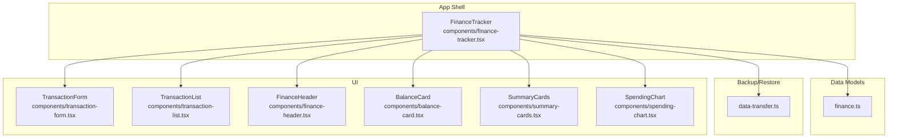
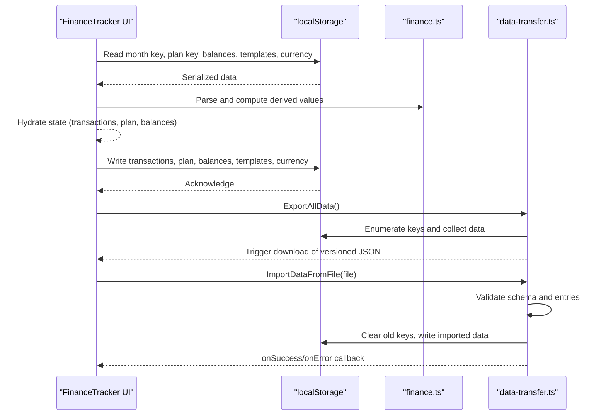
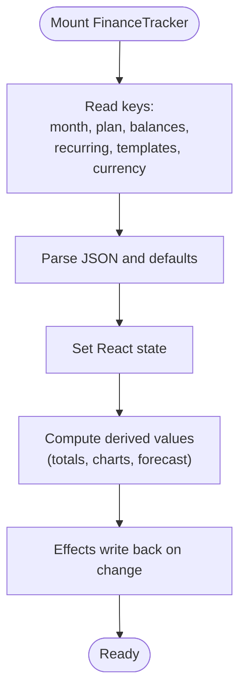
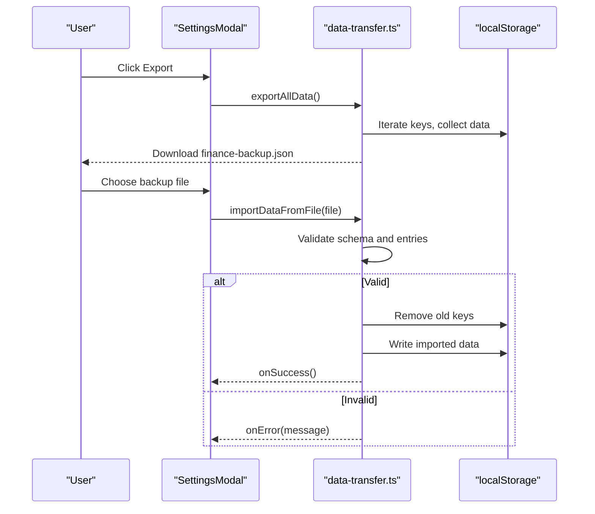
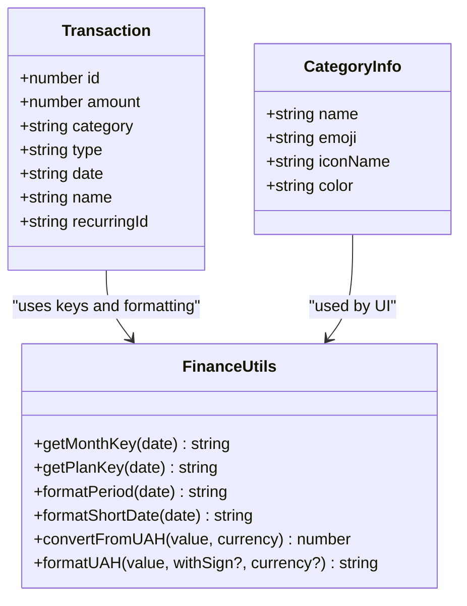
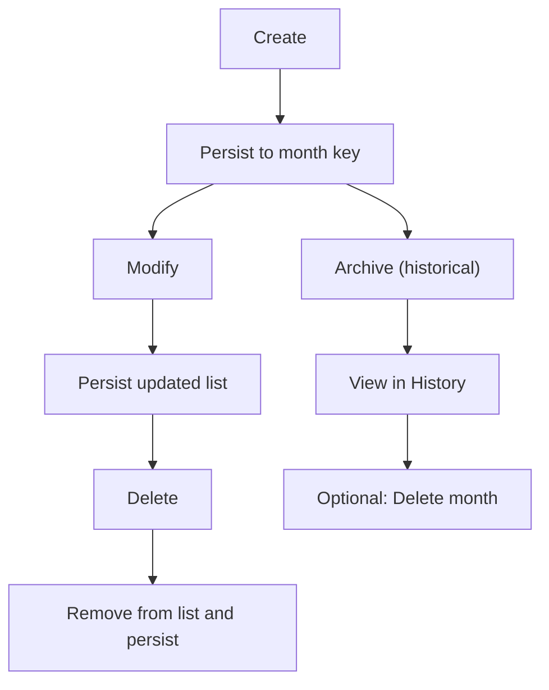
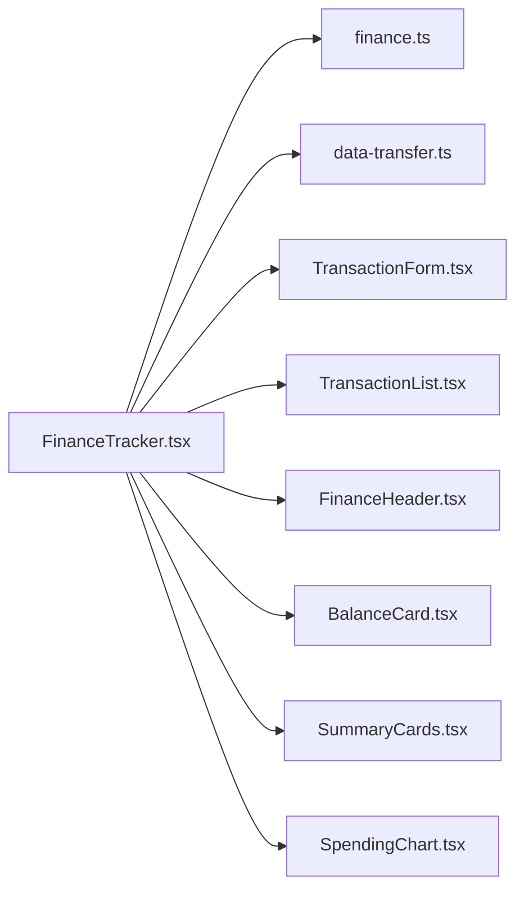

# Data Management

<cite>
**Referenced Files in This Document**
- [finance-tracker.tsx](file://components/finance-tracker.tsx)
- [data-transfer.ts](file://lib/data-transfer.ts)
- [finance.ts](file://lib/finance.ts)
- [transaction-form.tsx](file://components/transaction-form.tsx)
- [transaction-list.tsx](file://components/transaction-list.tsx)
- [finance-header.tsx](file://components/finance-header.tsx)
- [balance-card.tsx](file://components/balance-card.tsx)
- [summary-cards.tsx](file://components/summary-cards.tsx)
- [spending-chart.tsx](file://components/spending-chart.tsx)
- [page.tsx](file://app/page.tsx)
- [package.json](file://package.json)
</cite>

## Table of Contents
1. [Introduction](#introduction)
2. [Project Structure](#project-structure)
3. [Core Components](#core-components)
4. [Architecture Overview](#architecture-overview)
5. [Detailed Component Analysis](#detailed-component-analysis)
6. [Dependency Analysis](#dependency-analysis)
7. [Performance Considerations](#performance-considerations)
8. [Troubleshooting Guide](#troubleshooting-guide)
9. [Conclusion](#conclusion)
10. [Appendices](#appendices)

## Introduction
This document explains finTracker’s data management system with a focus on local storage integration, offline-first behavior, backup and import/export, data hydration from localStorage to React state, financial data models, error handling, lifecycle management, and performance considerations. It synthesizes the implementation visible in the repository to provide a practical guide for developers and power users.

## Project Structure
The data management logic spans a small set of focused modules:
- Application shell and orchestration: FinanceTracker component
- Financial models and utilities: finance.ts
- Backup/import/export: data-transfer.ts
- UI components that render and edit data: transaction-form.tsx, transaction-list.tsx, finance-header.tsx, balance-card.tsx, summary-cards.tsx, spending-chart.tsx
- Entry point: app/page.tsx

**Diagram sources**
- [finance-tracker.tsx](file://components/finance-tracker.tsx)
- [finance.ts](file://lib/finance.ts)
- [data-transfer.ts](file://lib/data-transfer.ts)
- [transaction-form.tsx](file://components/transaction-form.tsx)
- [transaction-list.tsx](file://components/transaction-list.tsx)
- [finance-header.tsx](file://components/finance-header.tsx)
- [balance-card.tsx](file://components/balance-card.tsx)
- [summary-cards.tsx](file://components/summary-cards.tsx)
- [spending-chart.tsx](file://components/spending-chart.tsx)

**Section sources**
- [page.tsx](file://app/page.tsx)
- [finance-tracker.tsx](file://components/finance-tracker.tsx)

## Core Components
- FinanceTracker orchestrates data hydration, persistence, and UI updates. It reads/writes localStorage keys for transactions, plans, balances, recurring templates, quick templates, and currency.
- finance.ts defines financial data models (Transaction, CategoryInfo), helpers (keys, formatting), and currency conversion.
- data-transfer.ts implements backup export and import, validating and sanitizing data during restore.

Key responsibilities:
- Hydration: On mount, FinanceTracker loads saved data for the active month and initializes defaults for missing keys.
- Persistence: Effects persist transactions, plans, balances, templates, and currency whenever state changes.
- Backup/Restore: Export creates a versioned JSON artifact; Import validates and replaces existing data atomically.

**Section sources**
- [finance-tracker.tsx](file://components/finance-tracker.tsx)
- [finance.ts](file://lib/finance.ts)
- [data-transfer.ts](file://lib/data-transfer.ts)

## Architecture Overview
The system follows an offline-first, localStorage-centric architecture:
- Data is stored under deterministic keys derived from the active month and plan.
- React state hydrates from localStorage on mount and persists changes via effects.
- Backup/restore uses a versioned JSON schema for portability and cross-device sync.

**Diagram sources**
- [finance-tracker.tsx](file://components/finance-tracker.tsx)
- [finance.ts](file://lib/finance.ts)
- [data-transfer.ts](file://lib/data-transfer.ts)

## Detailed Component Analysis

### Local Storage Keys and Hydration
- Month-bound transactions: keyed by a month identifier derived from the active date.
- Monthly plan: keyed by a plan identifier derived from the active date.
- Balances: stores card, cash, savings totals.
- Recurring templates: reusable monthly transaction templates.
- Quick templates: user-defined shortcuts for fast input.
- Active currency: persisted selection for rendering.

Hydration and persistence flow:
- On mount, FinanceTracker reads keys and sets state.
- Effects write back to localStorage whenever relevant state changes.
- A “hydrated” flag prevents writes before hydration completes.

**Diagram sources**
- [finance-tracker.tsx](file://components/finance-tracker.tsx)

**Section sources**
- [finance-tracker.tsx](file://components/finance-tracker.tsx)

### Backup and Import/Export System
- Export:
  - Iterates localStorage keys, filters finance_/plan_ entries, parses and collects arrays of transactions and numeric plan values.
  - Produces a versioned JSON artifact with metadata and data sections.
  - Triggers a browser download of the JSON file.
- Import:
  - Reads uploaded JSON, validates schema version and structure.
  - Validates each data entry conforms to expected shape.
  - Clears existing finance_/plan_ keys, then writes imported data.
  - Invokes success/error callbacks for UI feedback.

**Diagram sources**
- [finance-tracker.tsx](file://components/finance-tracker.tsx)
- [data-transfer.ts](file://lib/data-transfer.ts)

**Section sources**
- [data-transfer.ts](file://lib/data-transfer.ts)
- [finance-tracker.tsx](file://components/finance-tracker.tsx)

### Financial Data Models
- Transaction: core record with identifiers, amount, category, type, date, optional name, and optional recurring linkage.
- Categories: predefined lists for income and expense with metadata (emoji, icon name, color).
- Keys: month and plan keys derived from the active date.
- Formatting and currency: helpers for period labels, short dates, and currency formatting with conversion rates.

**Diagram sources**
- [finance.ts](file://lib/finance.ts)

**Section sources**
- [finance.ts](file://lib/finance.ts)

### Data Validation and Cross-Device Synchronization
- Import validation ensures:
  - JSON is readable and structured as expected.
  - Version matches.
  - Data entries are arrays and keyed correctly.
  - Plan entries are finite numbers.
- Cross-device synchronization:
  - The backup format is portable and device-agnostic.
  - Import replaces existing data for the target device, enabling manual sync across devices.

Note: There is no built-in server-side synchronization; manual import/export is the synchronization mechanism.

**Section sources**
- [data-transfer.ts](file://lib/data-transfer.ts)

### Data Lifecycle Management
- Creation:
  - New transactions are inserted at the head of the list and persisted immediately.
  - Recurring templates generate synthetic transactions when missing in the current month.
- Modification:
  - Editing updates in-place; state changes trigger persistence.
- Deletion:
  - Deleting removes from state and updates localStorage.
  - History view supports selective deletion of past months’ data.
- Archival:
  - Past months remain in localStorage as historical records; deletion is explicit.

**Diagram sources**
- [finance-tracker.tsx](file://components/finance-tracker.tsx)

**Section sources**
- [finance-tracker.tsx](file://components/finance-tracker.tsx)

### Automatic Synchronization Mechanisms
- There is no real-time or server-driven synchronization.
- Automatic generation of recurring transactions occurs during hydration if applicable.
- Users can manually synchronize by exporting from one device and importing on another.

**Section sources**
- [finance-tracker.tsx](file://components/finance-tracker.tsx)
- [data-transfer.ts](file://lib/data-transfer.ts)

### Error Handling Strategies
- Import errors:
  - Schema mismatch, invalid data entries, or parsing failures surface user-facing messages.
- Malformed localStorage entries:
  - Export skips unparsable entries; import tolerates invalid entries by validating the overall structure.
- Runtime errors:
  - Import failure triggers an error callback; UI alerts the user.

Recommendations:
- Validate backup files before import.
- Keep backups in a safe location for recovery.
- Prefer consistent date formats and categories to avoid mismatches.

**Section sources**
- [data-transfer.ts](file://lib/data-transfer.ts)
- [finance-tracker.tsx](file://components/finance-tracker.tsx)

### UI Components and Data Binding
- TransactionForm:
  - Parses expressions and smart-pastes amounts and categories from clipboard.
  - Applies quick templates and toggles recurring mode.
- TransactionList:
  - Renders transactions with icons, amounts, and actions.
- FinanceHeader:
  - Navigates periods and opens settings/history.
- BalanceCard, SummaryCards, SpendingChart:
  - Consume derived totals and currency to present visuals.

These components rely on FinanceTracker’s state and keys for data binding.

**Section sources**
- [transaction-form.tsx](file://components/transaction-form.tsx)
- [transaction-list.tsx](file://components/transaction-list.tsx)
- [finance-header.tsx](file://components/finance-header.tsx)
- [balance-card.tsx](file://components/balance-card.tsx)
- [summary-cards.tsx](file://components/summary-cards.tsx)
- [spending-chart.tsx](file://components/spending-chart.tsx)
- [finance-tracker.tsx](file://components/finance-tracker.tsx)

## Dependency Analysis
- FinanceTracker depends on:
  - finance.ts for models, keys, and formatting.
  - data-transfer.ts for backup/export/import.
  - UI components for rendering and editing.
- UI components depend on finance.ts for category and formatting utilities.

**Diagram sources**
- [finance-tracker.tsx](file://components/finance-tracker.tsx)
- [finance.ts](file://lib/finance.ts)
- [data-transfer.ts](file://lib/data-transfer.ts)
- [transaction-form.tsx](file://components/transaction-form.tsx)
- [transaction-list.tsx](file://components/transaction-list.tsx)
- [finance-header.tsx](file://components/finance-header.tsx)
- [balance-card.tsx](file://components/balance-card.tsx)
- [summary-cards.tsx](file://components/summary-cards.tsx)
- [spending-chart.tsx](file://components/spending-chart.tsx)

**Section sources**
- [finance-tracker.tsx](file://components/finance-tracker.tsx)
- [finance.ts](file://lib/finance.ts)
- [data-transfer.ts](file://lib/data-transfer.ts)
- [package.json](file://package.json)

## Performance Considerations
- Dataset size:
  - Transactions are stored per month; very large histories increase localStorage read/write time.
- Rendering:
  - Charts and lists iterate over transactions; large arrays can impact UI responsiveness.
- Optimization techniques:
  - Debounce or batch effect writes if adding many transactions rapidly.
  - Virtualize long lists if histories grow substantially.
  - Avoid unnecessary re-renders by memoizing derived computations.
  - Limit history retention by deleting old months when appropriate.
- Indexing:
  - Current implementation does not index by date or category; filtering is linear across transactions.
  - Consider precomputing aggregates per month if needed.

[No sources needed since this section provides general guidance]

## Troubleshooting Guide
Common issues and resolutions:
- Import fails:
  - Verify the file is the exported JSON and not corrupted.
  - Ensure the backup version matches expectations.
- Transactions not appearing:
  - Confirm the active month key exists and contains valid JSON.
  - Check for malformed entries that may be skipped during export.
- Recurring transactions missing:
  - Ensure recurring templates exist and the month’s synthetic transactions were generated.
- Currency display anomalies:
  - Confirm the active currency setting is persisted and valid.

Recovery procedures:
- Re-export current data to a new backup file.
- Manually inspect localStorage keys for anomalies and remove problematic entries if necessary.
- Re-import after cleaning up corrupted entries.

**Section sources**
- [data-transfer.ts](file://lib/data-transfer.ts)
- [finance-tracker.tsx](file://components/finance-tracker.tsx)

## Conclusion
finTracker’s data management is centered on a clean, offline-first model using localStorage and a straightforward backup/restore workflow. The FinanceTracker component orchestrates hydration and persistence, while finance.ts and data-transfer.ts define models and portability. The system is simple, predictable, and suitable for personal finance tracking with manual cross-device synchronization via JSON backups.

[No sources needed since this section summarizes without analyzing specific files]

## Appendices

### Backup Format Specification
- Version: integer (schema version)
- Exported At: ISO timestamp
- Data: object mapping month keys to arrays of transactions
- Plans: object mapping plan keys to numeric plan values

Example structure outline:
- version: 1
- exportedAt: "YYYY-MM-DDTHH:mm:ss.sssZ"
- data:
  - "finance_<year>_<month>": [{ id, amount, category, type, date, name?, recurringId? }]
- plans:
  - "plan_<year>_<month>": number

Validation rules:
- Version equals 1
- Data entries are arrays and keyed with month prefixes
- Plan entries are finite numbers

**Section sources**
- [data-transfer.ts](file://lib/data-transfer.ts)

### Import/Export Workflows
- Export:
  - Open settings, click export, download JSON.
- Import:
  - Open settings, choose backup file, confirm success or error message.

**Section sources**
- [finance-tracker.tsx](file://components/finance-tracker.tsx)
- [data-transfer.ts](file://lib/data-transfer.ts)