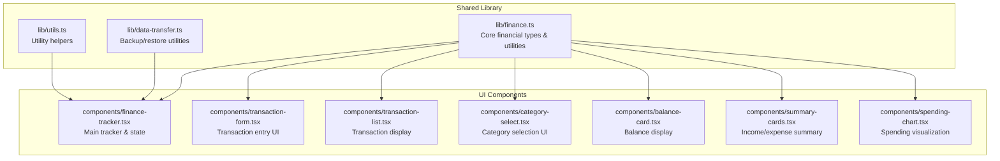
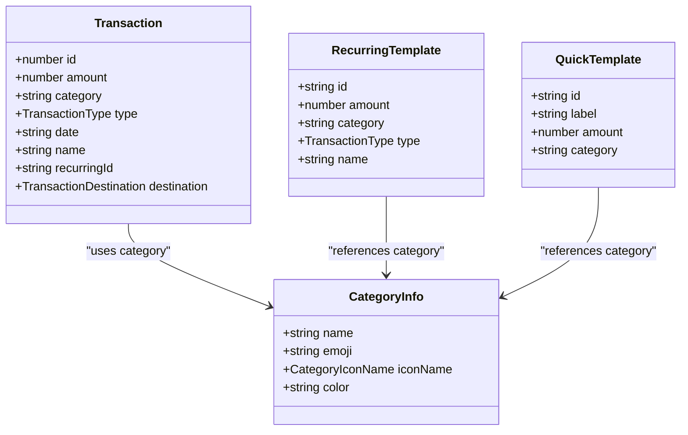
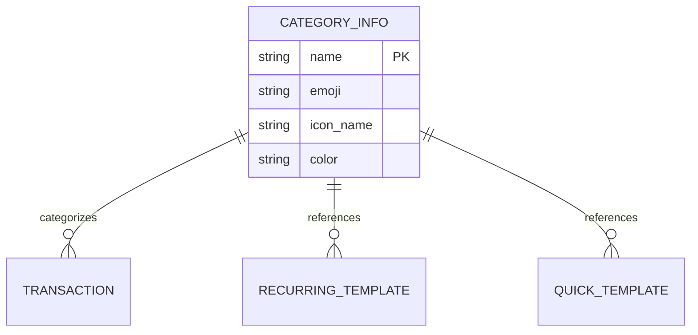
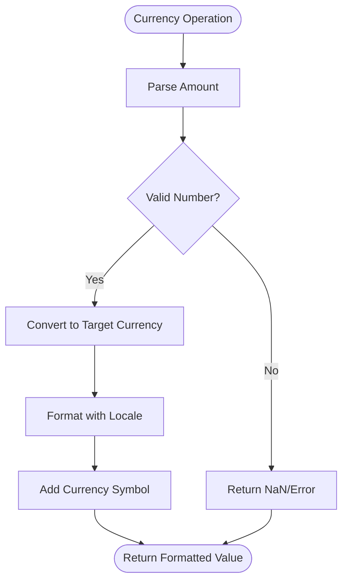
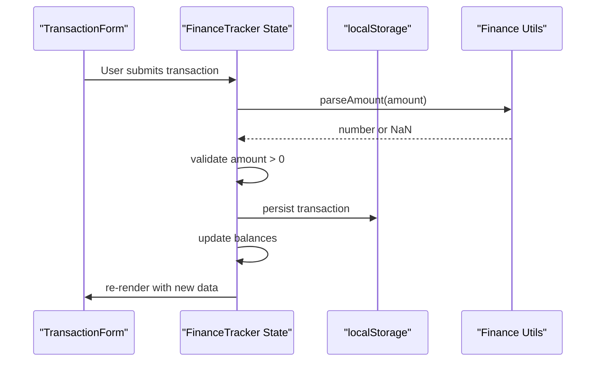
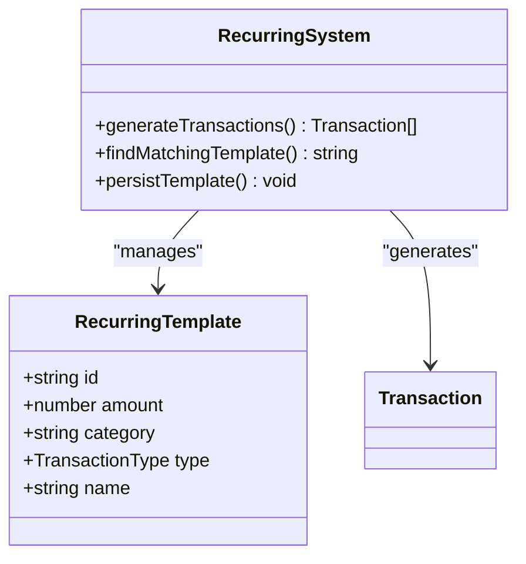
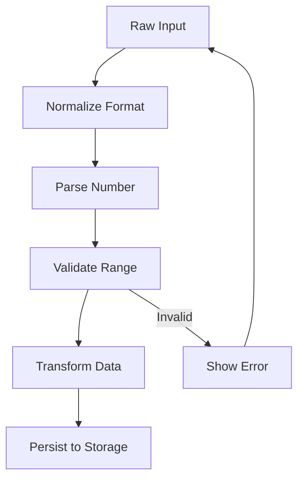
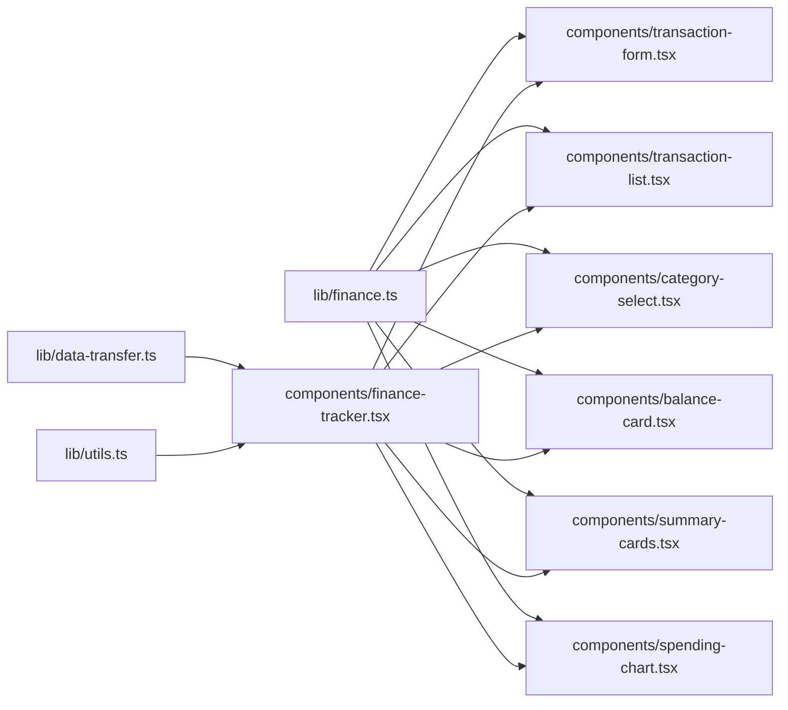
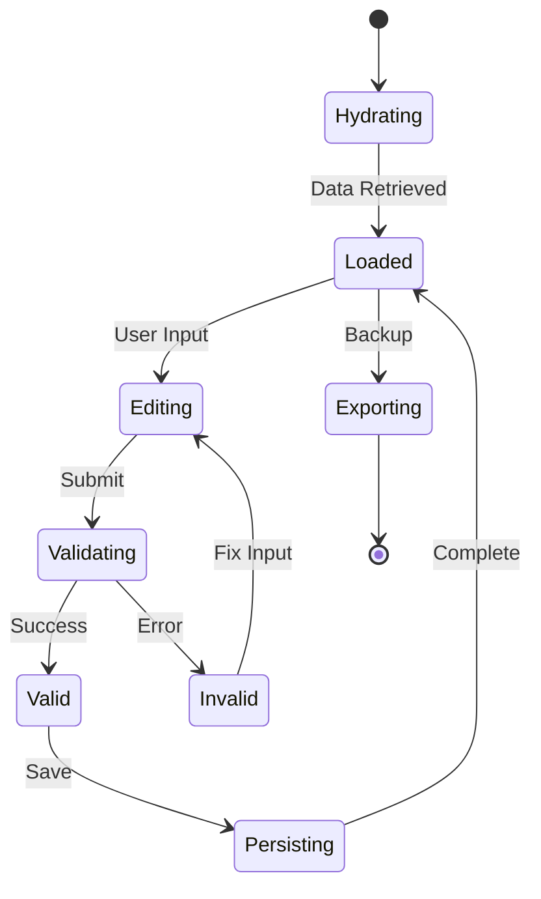

# Financial Data Models

<cite>
**Referenced Files in This Document**
- [finance.ts](file://lib/finance.ts)
- [data-transfer.ts](file://lib/data-transfer.ts)
- [finance-tracker.tsx](file://components/finance-tracker.tsx)
- [transaction-form.tsx](file://components/transaction-form.tsx)
- [transaction-list.tsx](file://components/transaction-list.tsx)
- [category-select.tsx](file://components/category-select.tsx)
- [balance-card.tsx](file://components/balance-card.tsx)
- [summary-cards.tsx](file://components/summary-cards.tsx)
- [spending-chart.tsx](file://components/spending-chart.tsx)
- [utils.ts](file://lib/utils.ts)
</cite>

## Table of Contents
1. [Introduction](#introduction)
2. [Project Structure](#project-structure)
3. [Core Components](#core-components)
4. [Architecture Overview](#architecture-overview)
5. [Detailed Component Analysis](#detailed-component-analysis)
6. [Dependency Analysis](#dependency-analysis)
7. [Performance Considerations](#performance-considerations)
8. [Troubleshooting Guide](#troubleshooting-guide)
9. [Conclusion](#conclusion)

## Introduction
This document provides comprehensive data model documentation for finTracker's financial entities and structures. It covers the Transaction interface, RecurringTemplate structure, QuickTemplate model, CurrencyCode enumeration, category system, validation rules, and data lifecycle management patterns. The goal is to help developers understand how financial data flows through the application, how it's validated and transformed, and how state mutations occur.

## Project Structure
The financial data models are primarily defined in the shared library module and consumed by UI components:

**Diagram sources**
- [finance.ts:1-124](file://lib/finance.ts#L1-L124)
- [data-transfer.ts:1-115](file://lib/data-transfer.ts#L1-L115)
- [finance-tracker.tsx:1-991](file://components/finance-tracker.tsx#L1-L991)

**Section sources**
- [finance.ts:1-124](file://lib/finance.ts#L1-L124)
- [finance-tracker.tsx:1-991](file://components/finance-tracker.tsx#L1-L991)

## Core Components

### Transaction Interface
The Transaction interface defines the core financial entity structure:

**Diagram sources**
- [finance.ts:43-52](file://lib/finance.ts#L43-L52)
- [finance.ts:1-35](file://lib/finance.ts#L1-L35)
- [finance-tracker.tsx:30-43](file://components/finance-tracker.tsx#L30-L43)

**Section sources**
- [finance.ts:43-52](file://lib/finance.ts#L43-L52)

### Category System
The category system provides structured categorization with emoji, icons, and color coding:

**Diagram sources**
- [finance.ts:1-35](file://lib/finance.ts#L1-L35)
- [finance.ts:16-35](file://lib/finance.ts#L16-L35)

**Section sources**
- [finance.ts:1-35](file://lib/finance.ts#L1-L35)

### Currency Management
The CurrencyCode enumeration supports UAH, USD, and EUR with automatic conversion and formatting:

**Diagram sources**
- [finance.ts:93-123](file://lib/finance.ts#L93-L123)

**Section sources**
- [finance.ts:93-123](file://lib/finance.ts#L93-L123)

## Architecture Overview

**Diagram sources**
- [finance-tracker.tsx:210-264](file://components/finance-tracker.tsx#L210-L264)
- [finance.ts:45-49](file://lib/finance.ts#L45-L49)

## Detailed Component Analysis

### Transaction Data Model
The Transaction interface serves as the foundation for all financial records:

**Properties:**
- `id`: Unique identifier for the transaction
- `amount`: Numeric transaction value (validated > 0)
- `category`: String category name (must match predefined categories)
- `type`: TransactionType ("income" | "expense")
- `date`: String date in DD/MM/YYYY format
- `name`: Optional descriptive name
- `recurringId`: Optional identifier for recurring transactions
- `destination`: Optional TransactionDestination ("card" | "cash" | "savings")

**Validation Rules:**
- Amount must be finite and positive
- Category must exist in predefined lists
- Date format must be valid
- RecurringId is optional but must be unique when present

**Section sources**
- [finance.ts:43-52](file://lib/finance.ts#L43-L52)
- [finance-tracker.tsx:210-264](file://components/finance-tracker.tsx#L210-L264)

### RecurringTemplate Structure
Automated transaction generation system:

**Diagram sources**
- [finance-tracker.tsx:30-36](file://components/finance-tracker.tsx#L30-L36)
- [finance-tracker.tsx:125-139](file://components/finance-tracker.tsx#L125-L139)

**Section sources**
- [finance-tracker.tsx:30-36](file://components/finance-tracker.tsx#L30-L36)
- [finance-tracker.tsx:125-139](file://components/finance-tracker.tsx#L125-L139)

### QuickTemplate Model
Transaction shortcut system for rapid entry:

**Properties:**
- `id`: Unique template identifier
- `label`: Display name for the template
- `amount`: Predefined amount value
- `category`: Associated category

**Usage Pattern:**
- Templates are stored in localStorage
- Applied instantly to form fields
- Can be customized by user

**Section sources**
- [finance-tracker.tsx:38-43](file://components/finance-tracker.tsx#L38-L43)
- [finance-tracker.tsx:51-55](file://components/finance-tracker.tsx#L51-L55)

### CurrencyCode Enumeration
Multi-currency support with automatic conversion:

**Supported Currencies:**
- UAH: Base currency (rate: 1.0)
- USD: Rate: 0.025
- EUR: Rate: 0.023

**Conversion Logic:**
- All stored values are in UAH base
- Display values converted based on selected currency
- Formatting uses Ukrainian locale with currency symbols

**Section sources**
- [finance.ts:40-41](file://lib/finance.ts#L40-L41)
- [finance.ts:93-123](file://lib/finance.ts#L93-L123)

### Category System Implementation
Hierarchical organization with visual representation:

**Category Types:**
- Expense categories: Grocery, Restaurants, Entertainment, Housing & Utilities, Gifts, Games, Personal
- Income categories: Salary, Bonus, Freelance, Other

**Visual Elements:**
- Emoji representation for quick recognition
- Color coding for visual hierarchy
- Icon mapping for UI consistency

**Section sources**
- [finance.ts:16-35](file://lib/finance.ts#L16-L35)
- [category-select.tsx:23-35](file://components/category-select.tsx#L23-L35)

### Data Validation and Transformation
Comprehensive validation pipeline:

**Diagram sources**
- [finance-tracker.tsx:45-49](file://components/finance-tracker.tsx#L45-L49)
- [transaction-form.tsx:25-35](file://components/transaction-form.tsx#L25-L35)

**Section sources**
- [finance-tracker.tsx:45-49](file://components/finance-tracker.tsx#L45-L49)
- [transaction-form.tsx:25-35](file://components/transaction-form.tsx#L25-L35)

## Dependency Analysis

**Diagram sources**
- [finance.ts:1-124](file://lib/finance.ts#L1-L124)
- [data-transfer.ts:1-115](file://lib/data-transfer.ts#L1-L115)
- [finance-tracker.tsx:1-991](file://components/finance-tracker.tsx#L1-L991)

**Section sources**
- [finance.ts:1-124](file://lib/finance.ts#L1-L124)
- [data-transfer.ts:1-115](file://lib/data-transfer.ts#L1-L115)
- [finance-tracker.tsx:1-991](file://components/finance-tracker.tsx#L1-L991)

## Performance Considerations
- Local storage operations are synchronous and can block UI thread
- Category rendering uses memoization to avoid unnecessary re-renders
- Currency conversion is lightweight but cached per render
- Large transaction sets may benefit from virtualization
- Debounced input parsing prevents excessive re-computation

## Troubleshooting Guide

### Common Data Issues
**Transaction Validation Failures:**
- Amount parsing errors indicate invalid numeric format
- Category mismatch occurs when category doesn't exist
- Date format issues cause display problems

**Recurring Template Problems:**
- Duplicate template detection prevents conflicts
- Missing category references cause template failures
- Storage quota exceeded prevents persistence

**Section sources**
- [finance-tracker.tsx:210-264](file://components/finance-tracker.tsx#L210-L264)
- [data-transfer.ts:70-87](file://lib/data-transfer.ts#L70-L87)

### Data Lifecycle Management
The application follows immutable patterns with controlled state updates:

**Diagram sources**
- [finance-tracker.tsx:109-144](file://components/finance-tracker.tsx#L109-L144)
- [data-transfer.ts:14-54](file://lib/data-transfer.ts#L14-L54)

### State Mutation Strategies
- Functional updates preserve immutability
- Batched updates reduce re-renders
- Selective state updates minimize computation
- Memoized computations cache expensive operations

**Section sources**
- [finance-tracker.tsx:266-307](file://components/finance-tracker.tsx#L266-L307)
- [finance-tracker.tsx:176-181](file://components/finance-tracker.tsx#L176-L181)

## Conclusion
finTracker's financial data models provide a robust foundation for personal finance management. The system balances flexibility with strong validation, supports multiple currencies with automatic conversion, and maintains clean separation between data models and UI components. The immutable state management approach ensures predictable behavior while the category system provides intuitive organization. The backup/restore functionality enables data portability and disaster recovery.