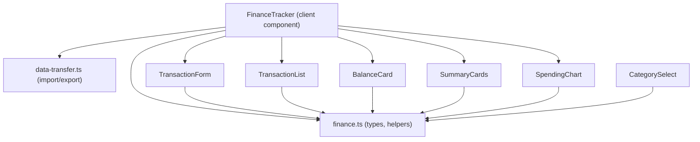
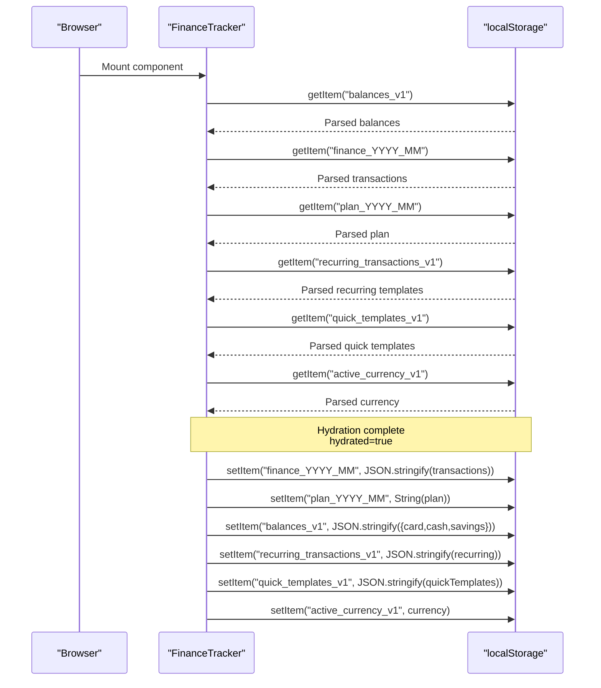
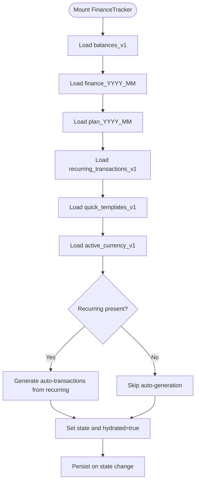
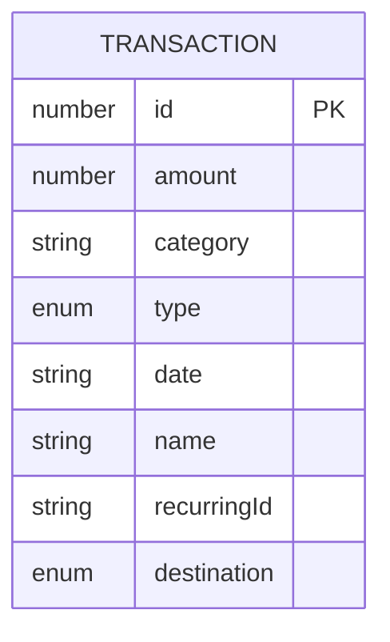
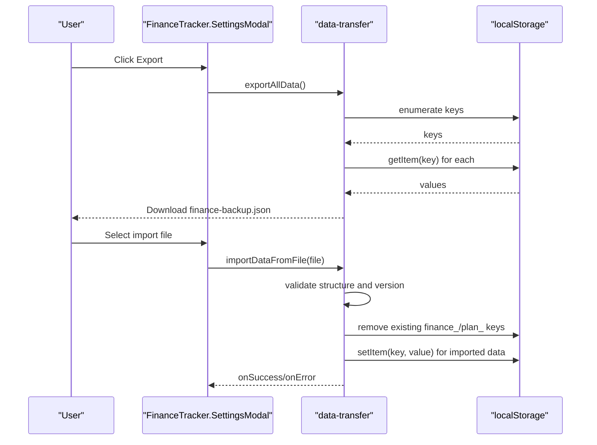
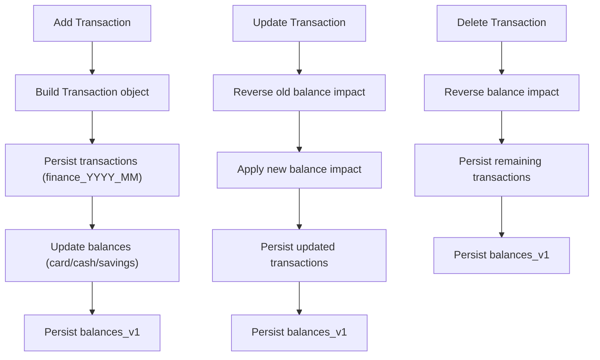
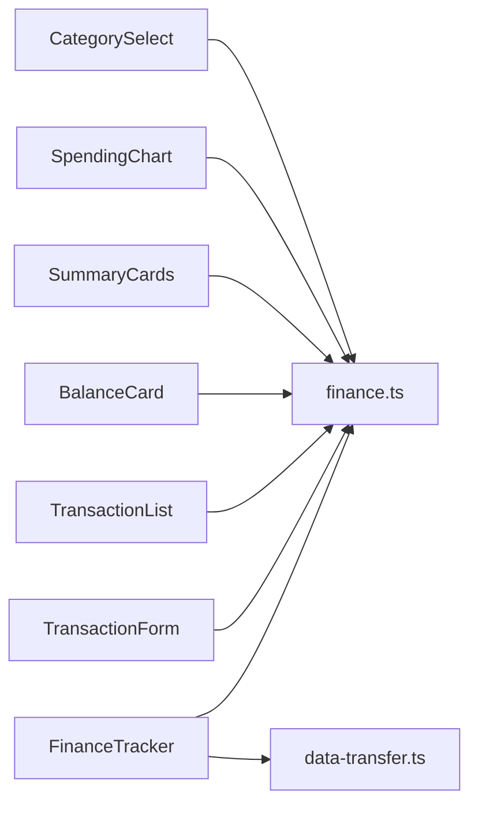

# Local Storage Integration

<cite>
**Referenced Files in This Document**
- [finance-tracker.tsx](file://components/finance-tracker.tsx)
- [finance.ts](file://lib/finance.ts)
- [data-transfer.ts](file://lib/data-transfer.ts)
- [transaction-list.tsx](file://components/transaction-list.tsx)
- [transaction-form.tsx](file://components/transaction-form.tsx)
- [balance-card.tsx](file://components/balance-card.tsx)
- [summary-cards.tsx](file://components/summary-cards.tsx)
- [spending-chart.tsx](file://components/spending-chart.tsx)
- [category-select.tsx](file://components/category-select.tsx)
</cite>

## Table of Contents
1. [Introduction](#introduction)
2. [Project Structure](#project-structure)
3. [Core Components](#core-components)
4. [Architecture Overview](#architecture-overview)
5. [Detailed Component Analysis](#detailed-component-analysis)
6. [Dependency Analysis](#dependency-analysis)
7. [Performance Considerations](#performance-considerations)
8. [Troubleshooting Guide](#troubleshooting-guide)
9. [Conclusion](#conclusion)

## Introduction
This document explains finTracker’s local storage integration for offline-first operation and cross-session persistence. It covers the key-value storage strategy, the month-based transaction keys, the data hydration lifecycle, and the automatic synchronization between localStorage and React state. It also documents the balance storage model, recurring and quick templates, currency preference persistence, and robustness against common failure modes such as quota exceeded, corrupted data, and browser compatibility issues.

## Project Structure
The local storage integration is centered around a single client component that orchestrates data loading, updates, and exports. Supporting libraries define the transaction schema and helpers for month keys and formatting. Utility modules encapsulate import/export operations.

**Diagram sources**
- [finance-tracker.tsx:57-545](file://components/finance-tracker.tsx#L57-L545)
- [finance.ts:43-65](file://lib/finance.ts#L43-L65)
- [data-transfer.ts:14-114](file://lib/data-transfer.ts#L14-L114)
- [transaction-list.tsx:14-101](file://components/transaction-list.tsx#L14-L101)
- [transaction-form.tsx:103-447](file://components/transaction-form.tsx#L103-L447)
- [balance-card.tsx:11-79](file://components/balance-card.tsx#L11-L79)
- [summary-cards.tsx:10-49](file://components/summary-cards.tsx#L10-L49)
- [spending-chart.tsx:16-95](file://components/spending-chart.tsx#L16-L95)
- [category-select.tsx:44-162](file://components/category-select.tsx#L44-L162)

**Section sources**
- [finance-tracker.tsx:57-545](file://components/finance-tracker.tsx#L57-L545)
- [finance.ts:43-65](file://lib/finance.ts#L43-L65)
- [data-transfer.ts:14-114](file://lib/data-transfer.ts#L14-L114)

## Core Components
- FinanceTracker orchestrates:
  - Hydration from localStorage on mount
  - Automatic persistence of transactions, balances, plans, templates, and currency
  - Import/export of backups
- finance.ts defines:
  - Transaction schema and optional fields
  - Month and plan key generators
  - Formatting and currency conversion helpers
- data-transfer.ts provides:
  - Export of all finance data to a JSON file
  - Import of backup JSON into localStorage

Key storage keys used:
- Month-based transaction storage: finance_YYYY_MM
- Plan storage: plan_YYYY_MM
- Balances: balances_v1
- Recurring templates: recurring_transactions_v1
- Quick templates: quick_templates_v1
- Active currency: active_currency_v1

**Section sources**
- [finance-tracker.tsx:89-174](file://components/finance-tracker.tsx#L89-L174)
- [finance.ts:43-65](file://lib/finance.ts#L43-L65)
- [data-transfer.ts:3-12](file://lib/data-transfer.ts#L3-L12)

## Architecture Overview
The system follows a predictable hydration-and-sync pattern:
- On mount, FinanceTracker reads localStorage and hydrates React state
- Subsequent state changes trigger immediate localStorage writes
- Periodic operations (import/export) manage cross-device or manual backups

**Diagram sources**
- [finance-tracker.tsx:91-174](file://components/finance-tracker.tsx#L91-L174)

## Detailed Component Analysis

### Data Hydration Lifecycle
- Balances: Loaded once on mount and persisted on subsequent changes
- Transactions: Loaded per active month; if none found, defaults to empty array
- Plan: Defaults to a constant if missing; removed when equal to default
- Recurring templates: Loaded and merged into transactions when generating auto-transactions
- Quick templates: Defaults applied if missing; persisted after edits
- Currency: Defaults to a supported code if missing; persisted on change

**Diagram sources**
- [finance-tracker.tsx:91-174](file://components/finance-tracker.tsx#L91-L174)

**Section sources**
- [finance-tracker.tsx:91-174](file://components/finance-tracker.tsx#L91-L174)

### Transaction Storage Format
- Keys: finance_YYYY_MM
- Value: Array of Transaction objects
- Schema (selected fields):
  - id: number
  - amount: number
  - category: string
  - type: "income" | "expense"
  - date: string (short date format)
  - name?: string
  - recurringId?: string
  - destination?: "card" | "cash" | "savings"

**Diagram sources**
- [finance.ts:43-52](file://lib/finance.ts#L43-L52)

**Section sources**
- [finance.ts:43-52](file://lib/finance.ts#L43-L52)

### Balance Storage Model
- Key: balances_v1
- Value: Object with numeric fields for each account
  - card: number
  - cash: number
  - savings: number

Persistence occurs whenever any balance changes and after hydration completes.

**Section sources**
- [finance-tracker.tsx:89-107](file://components/finance-tracker.tsx#L89-L107)

### Plan Storage
- Key: plan_YYYY_MM
- Value: number representing the planned income for that month
- Behavior: Removed when equal to default; otherwise stored as string

**Section sources**
- [finance-tracker.tsx:156-164](file://components/finance-tracker.tsx#L156-L164)
- [finance.ts:63-65](file://lib/finance.ts#L63-L65)

### Recurring Templates and Quick Templates
- Recurring templates:
  - Key: recurring_transactions_v1
  - Value: Array of template objects with id, amount, category, type, optional name
  - During hydration, auto-generated transactions are inserted if not already present
- Quick templates:
  - Key: quick_templates_v1
  - Value: Array of template objects with id, label, amount, category
  - Defaults applied if missing; persisted after edits

**Section sources**
- [finance-tracker.tsx:26-43](file://components/finance-tracker.tsx#L26-L43)
- [finance-tracker.tsx:114-118](file://components/finance-tracker.tsx#L114-L118)
- [finance-tracker.tsx:233-235](file://components/finance-tracker.tsx#L233-L235)
- [finance-tracker.tsx:171-174](file://components/finance-tracker.tsx#L171-L174)

### Currency Preference
- Key: active_currency_v1
- Value: One of "UAH", "USD", "EUR"
- Defaults applied if invalid or missing

**Section sources**
- [finance-tracker.tsx:119-124](file://components/finance-tracker.tsx#L119-L124)
- [finance-tracker.tsx:166-169](file://components/finance-tracker.tsx#L166-L169)

### Import/Export Operations
- Export:
  - Scans localStorage for keys starting with "finance_" and "plan_"
  - Builds a backup object with version, exportedAt, data map, and plans map
  - Creates a downloadable JSON file
- Import:
  - Reads a JSON file and validates structure and version
  - Clears existing finance and plan keys
  - Writes imported data back to localStorage

**Diagram sources**
- [data-transfer.ts:14-54](file://lib/data-transfer.ts#L14-L54)
- [data-transfer.ts:56-114](file://lib/data-transfer.ts#L56-L114)
- [finance-tracker.tsx:535-542](file://components/finance-tracker.tsx#L535-L542)

**Section sources**
- [data-transfer.ts:3-12](file://lib/data-transfer.ts#L3-L12)
- [data-transfer.ts:14-54](file://lib/data-transfer.ts#L14-L54)
- [data-transfer.ts:56-114](file://lib/data-transfer.ts#L56-L114)
- [finance-tracker.tsx:535-542](file://components/finance-tracker.tsx#L535-L542)

### Transaction CRUD and Balance Synchronization
- Add/update/delete operations adjust both in-memory state and localStorage
- Balance adjustments are applied immediately when adding/updating/deleting transactions
- Transfer operations record a synthetic income transaction for tracking while moving funds

**Diagram sources**
- [finance-tracker.tsx:210-346](file://components/finance-tracker.tsx#L210-L346)

**Section sources**
- [finance-tracker.tsx:210-346](file://components/finance-tracker.tsx#L210-L346)

## Dependency Analysis
- FinanceTracker depends on:
  - finance.ts for types, month/plan key generation, and formatting
  - data-transfer.ts for backup import/export
- Components depend on finance.ts for formatting and category metadata
- TransactionForm and CategorySelect provide user-driven inputs that feed into FinanceTracker’s state and localStorage

**Diagram sources**
- [finance-tracker.tsx:6-23](file://components/finance-tracker.tsx#L6-L23)
- [finance.ts:1-124](file://lib/finance.ts#L1-L124)
- [data-transfer.ts:1-115](file://lib/data-transfer.ts#L1-L115)
- [transaction-form.tsx:22-23](file://components/transaction-form.tsx#L22-L23)
- [transaction-list.tsx:4-4](file://components/transaction-list.tsx#L4-L4)
- [balance-card.tsx:1-1](file://components/balance-card.tsx#L1-L1)
- [summary-cards.tsx:2-2](file://components/summary-cards.tsx#L2-L2)
- [spending-chart.tsx:5-5](file://components/spending-chart.tsx#L5-L5)
- [category-select.tsx:21-21](file://components/category-select.tsx#L21-L21)

**Section sources**
- [finance-tracker.tsx:6-23](file://components/finance-tracker.tsx#L6-L23)
- [finance.ts:1-124](file://lib/finance.ts#L1-L124)
- [data-transfer.ts:1-115](file://lib/data-transfer.ts#L1-L115)

## Performance Considerations
- Single-key writes: Each state change triggers a single localStorage write for the affected key, minimizing IO overhead.
- Batched hydration: On mount, multiple reads occur once to initialize state efficiently.
- Conditional removal: Removes plan keys when equal to default to reduce storage footprint.
- Export/import scans: Iterates over localStorage keys linearly; acceptable for typical usage volumes.

[No sources needed since this section provides general guidance]

## Troubleshooting Guide

Common failure scenarios and recovery procedures:
- localStorage quota exceeded
  - Symptom: Writes silently fail or throw quota-related errors.
  - Recovery:
    - Reduce data volume by deleting older months’ transactions using the import/export workflow.
    - Use export to move data off-device, then clear localStorage and re-import.
- Corrupted data (malformed JSON or unexpected types)
  - Symptom: Missing or incorrect values after reload.
  - Recovery:
    - Use import to replace corrupted keys with a known-good backup.
    - Manually inspect and fix keys via developer tools if necessary.
- Browser compatibility issues
  - Symptom: localStorage APIs unavailable or blocked.
  - Recovery:
    - Verify browser supports localStorage.
    - Use an alternate browser or enable storage in private/incognito mode if applicable.
- Data not persisting across sessions
  - Verify hydrated flag is true and that no exceptions occurred during hydration.
  - Confirm keys exist and are readable; if missing, rehydrate by navigating to the relevant month.

Operational examples:
- Export all data
  - Trigger export from the settings modal; download creates a backup file.
  - Validate the backup contains expected finance_YYYY_MM and plan_YYYY_MM entries.
- Import backup
  - Select a valid backup file; the system clears existing finance_/plan_ keys and writes imported data.
  - After import, reopen the app to confirm transactions and plans are restored.

**Section sources**
- [data-transfer.ts:14-54](file://lib/data-transfer.ts#L14-L54)
- [data-transfer.ts:56-114](file://lib/data-transfer.ts#L56-L114)
- [finance-tracker.tsx:535-542](file://components/finance-tracker.tsx#L535-L542)

## Conclusion
finTracker’s local storage integration provides reliable offline persistence and cross-session continuity. By using month-based keys for transactions, explicit keys for plans, balances, templates, and currency, and a robust hydration-and-sync mechanism, the system ensures data remains consistent and recoverable. Import/export utilities further strengthen resilience against corruption and quota issues, enabling seamless data portability.