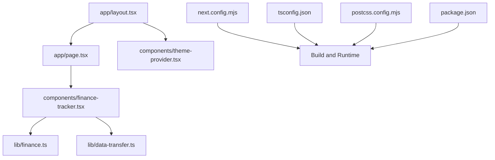
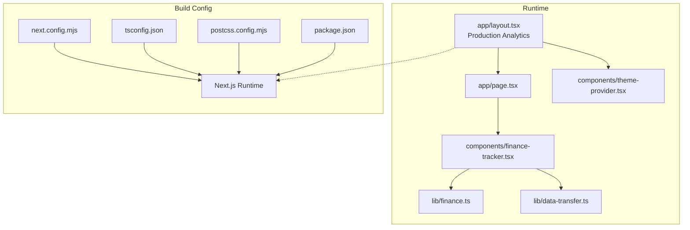
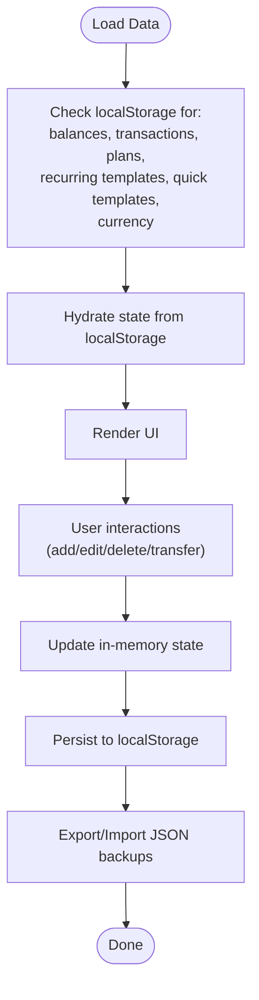
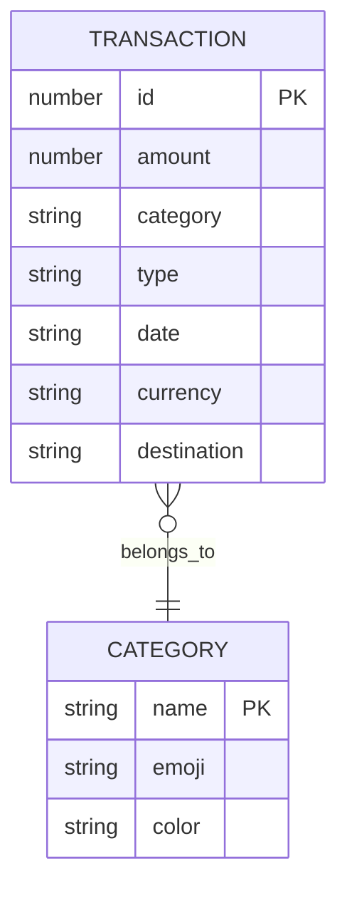
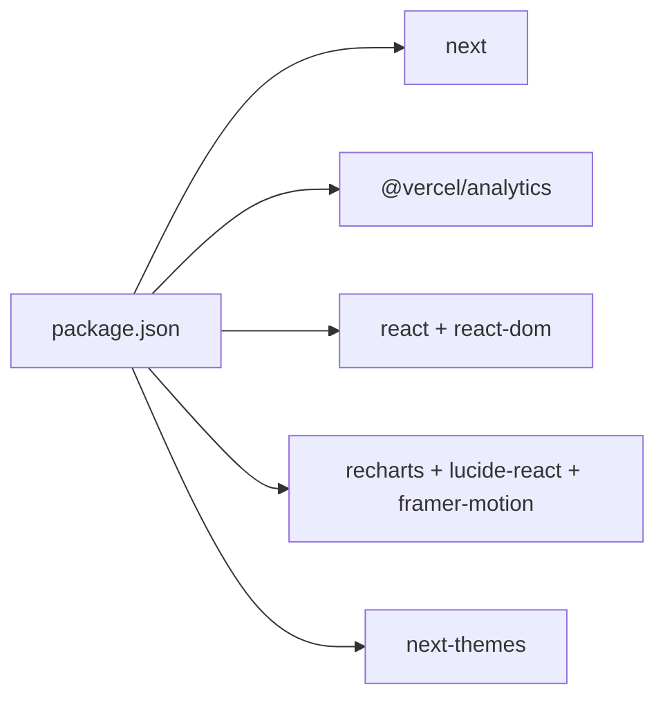

# Deployment and Production

<cite>
**Referenced Files in This Document**
- [next.config.mjs](file://next.config.mjs)
- [package.json](file://package.json)
- [tsconfig.json](file://tsconfig.json)
- [postcss.config.mjs](file://postcss.config.mjs)
- [app/layout.tsx](file://app/layout.tsx)
- [app/page.tsx](file://app/page.tsx)
- [components/theme-provider.tsx](file://components/theme-provider.tsx)
- [components/finance-tracker.tsx](file://components/finance-tracker.tsx)
- [lib/finance.ts](file://lib/finance.ts)
- [lib/data-transfer.ts](file://lib/data-transfer.ts)
</cite>

## Table of Contents
1. [Introduction](#introduction)
2. [Project Structure](#project-structure)
3. [Core Components](#core-components)
4. [Architecture Overview](#architecture-overview)
5. [Detailed Component Analysis](#detailed-component-analysis)
6. [Dependency Analysis](#dependency-analysis)
7. [Performance Considerations](#performance-considerations)
8. [Troubleshooting Guide](#troubleshooting-guide)
9. [Conclusion](#conclusion)
10. [Appendices](#appendices)

## Introduction
This document provides comprehensive guidance for deploying and operating finTracker in production environments. It covers build configuration with Next.js optimization settings, environment variable usage, platform-specific deployment steps for Vercel, Netlify, and traditional hosting providers, performance monitoring with Vercel Analytics, security considerations for client-side data storage and local-first architecture, maintenance and update strategies, monitoring and alerting, scaling and CDN considerations, and operational best practices for troubleshooting and incident response.

## Project Structure
finTracker is a Next.js 16 application written in TypeScript with Tailwind CSS v4. The runtime is client-rendered and uses localStorage for persistence. The repository includes:
- Application shell and routing under app/
- UI primitives and components under components/
- Shared logic under lib/
- Build-time configuration under next.config.mjs, tsconfig.json, and postcss.config.mjs
- Package scripts for development, build, and production startup

**Diagram sources**
- [app/layout.tsx](file://app/layout.tsx)
- [app/page.tsx](file://app/page.tsx)
- [components/finance-tracker.tsx](file://components/finance-tracker.tsx)
- [lib/finance.ts](file://lib/finance.ts)
- [lib/data-transfer.ts](file://lib/data-transfer.ts)
- [components/theme-provider.tsx](file://components/theme-provider.tsx)
- [next.config.mjs](file://next.config.mjs)
- [tsconfig.json](file://tsconfig.json)
- [postcss.config.mjs](file://postcss.config.mjs)
- [package.json](file://package.json)

**Section sources**
- [next.config.mjs](file://next.config.mjs)
- [tsconfig.json](file://tsconfig.json)
- [postcss.config.mjs](file://postcss.config.mjs)
- [package.json](file://package.json)

## Core Components
- Next.js configuration: Disables TypeScript checking during builds and optimizes static image handling for client-side rendering.
- Analytics integration: Vercel Analytics is conditionally included in production via the root layout.
- Client-side persistence: Local-first architecture stores balances, transactions, plans, currencies, and templates in browser localStorage.
- Data transfer utilities: Export/import of financial data to/from JSON for backup and recovery.
- Theming: Client-side theme provider for dark/light mode support.

Key production implications:
- Analytics are enabled only in production builds.
- No server-side runtime dependencies are present; deployment focuses on static asset delivery and CDN caching.
- Security depends on protecting localStorage and ensuring secure transport (HTTPS).

**Section sources**
- [next.config.mjs](file://next.config.mjs)
- [app/layout.tsx](file://app/layout.tsx)
- [components/finance-tracker.tsx](file://components/finance-tracker.tsx)
- [lib/data-transfer.ts](file://lib/data-transfer.ts)
- [components/theme-provider.tsx](file://components/theme-provider.tsx)

## Architecture Overview
The application is a single-page client application built with Next.js. The root layout injects analytics in production and sets viewport and metadata. The main page renders the FinanceTracker component, which orchestrates state, persistence, and UI.

**Diagram sources**
- [app/layout.tsx](file://app/layout.tsx)
- [app/page.tsx](file://app/page.tsx)
- [components/finance-tracker.tsx](file://components/finance-tracker.tsx)
- [lib/finance.ts](file://lib/finance.ts)
- [lib/data-transfer.ts](file://lib/data-transfer.ts)
- [components/theme-provider.tsx](file://components/theme-provider.tsx)
- [next.config.mjs](file://next.config.mjs)
- [tsconfig.json](file://tsconfig.json)
- [postcss.config.mjs](file://postcss.config.mjs)
- [package.json](file://package.json)

## Detailed Component Analysis

### Next.js Build and Runtime Configuration
- TypeScript: Build errors are ignored to allow faster CI/CD pipelines; ensure linting is performed separately.
- Images: Unoptimized images are used to avoid external image service dependencies.
- PostCSS/Tailwind: Tailwind plugin is configured for CSS generation.
- Scripts: Standard Next.js scripts for dev, build, start, and lint.

Operational notes:
- Keep ignoreBuildErrors enabled only in controlled CI/CD contexts; validate types locally.
- Verify that unoptimized images align with performance budgets; consider enabling remote images later if CDN caching is available.

**Section sources**
- [next.config.mjs](file://next.config.mjs)
- [postcss.config.mjs](file://postcss.config.mjs)
- [package.json](file://package.json)

### Analytics Integration (Vercel Analytics)
- Analytics component is conditionally rendered in production builds.
- No explicit environment variables are required; analytics rely on Vercel’s runtime.

Operational notes:
- Ensure NODE_ENV is set to production in your deployment platform to enable analytics.
- Monitor Vercel Analytics dashboards for traffic, performance, and error signals.

**Section sources**
- [app/layout.tsx](file://app/layout.tsx)

### Client-Side Persistence and Data Model
The FinanceTracker component persists data in localStorage under keys derived from month and plan identifiers. Backup and restore are supported via JSON files.

**Diagram sources**
- [components/finance-tracker.tsx](file://components/finance-tracker.tsx)
- [lib/data-transfer.ts](file://lib/data-transfer.ts)

**Section sources**
- [components/finance-tracker.tsx](file://components/finance-tracker.tsx)
- [lib/finance.ts](file://lib/finance.ts)
- [lib/data-transfer.ts](file://lib/data-transfer.ts)

### Theme Provider
- Client-side theme provider supports dark/light mode switching.
- No server-side rendering concerns; safe for static hosting.

**Section sources**
- [components/theme-provider.tsx](file://components/theme-provider.tsx)

### Data Model and Keys
- Categories, currencies, and transaction types are defined centrally.
- Keys for persistence include balances, monthly transactions, monthly plans, recurring templates, quick templates, and currency preference.

**Diagram sources**
- [lib/finance.ts](file://lib/finance.ts)

**Section sources**
- [lib/finance.ts](file://lib/finance.ts)

## Dependency Analysis
External dependencies relevant to production:
- next: Application runtime and build system.
- @vercel/analytics: Analytics SDK.
- react, react-dom: Client-side rendering.
- recharts, lucide-react, framer-motion: UI and charts.
- next-themes: Client-side theme management.

**Diagram sources**
- [package.json](file://package.json)

**Section sources**
- [package.json](file://package.json)

## Performance Considerations
- Build-time:
  - Keep TypeScript checks disabled during build for speed; rely on linting and tests.
  - Images are unoptimized; consider enabling remote images and CDN caching if bandwidth and performance require it.
- Runtime:
  - Analytics are enabled only in production; ensure NODE_ENV=production.
  - Client-side rendering with localStorage avoids server calls; keep UI updates minimal to reduce re-renders.
  - Use memoization and efficient state updates to minimize heavy computations.
- Monitoring:
  - Integrate Vercel Analytics for real-user performance insights.
  - Add error tracking (e.g., Sentry) for client-side exceptions.

[No sources needed since this section provides general guidance]

## Troubleshooting Guide
Common production issues and resolutions:
- Analytics not reporting:
  - Verify NODE_ENV is set to production and Analytics component is present in production builds.
- Data not persisting:
  - Confirm localStorage is enabled in the browser and not blocked by privacy settings.
  - Validate that keys match expected prefixes (balances, finance_, plan_, recurring, quick templates, currency).
- Import/Export failures:
  - Ensure uploaded JSON matches the expected backup schema and is readable.
  - Clear corrupted entries if present.
- Theme not applying:
  - Confirm the ThemeProvider wraps the application root.

**Section sources**
- [app/layout.tsx](file://app/layout.tsx)
- [components/finance-tracker.tsx](file://components/finance-tracker.tsx)
- [lib/data-transfer.ts](file://lib/data-transfer.ts)
- [components/theme-provider.tsx](file://components/theme-provider.tsx)

## Conclusion
finTracker is a client-side application optimized for static hosting and CDN delivery. Production readiness hinges on correct build configuration, enabling analytics in production, securing client-side data, and establishing monitoring and backup procedures. The local-first design simplifies deployment while requiring robust user education around data portability and recovery.

[No sources needed since this section summarizes without analyzing specific files]

## Appendices

### A. Build Configuration Reference
- next.config.mjs: Build-time settings for TypeScript and images.
- tsconfig.json: Strict TypeScript compilation with bundler module resolution.
- postcss.config.mjs: Tailwind plugin configuration.
- package.json: Scripts and dependencies.

**Section sources**
- [next.config.mjs](file://next.config.mjs)
- [tsconfig.json](file://tsconfig.json)
- [postcss.config.mjs](file://postcss.config.mjs)
- [package.json](file://package.json)

### B. Environment Variables and Secrets
- None required for client-side runtime.
- For analytics and error tracking, configure platform-specific environment variables as per vendor documentation.

**Section sources**
- [app/layout.tsx](file://app/layout.tsx)
- [package.json](file://package.json)

### C. Deployment Guides

#### Vercel
- Configure project with Next.js settings and enable Analytics.
- Set environment variables for analytics and optional error tracking.
- Enable CDN caching and HTTPS; verify production analytics.

**Section sources**
- [app/layout.tsx](file://app/layout.tsx)
- [package.json](file://package.json)

#### Netlify
- Build command: next build
- Publish directory: .next/static
- Environment variables: NODE_ENV=production
- Enable CDN and HTTPS; verify analytics.

**Section sources**
- [next.config.mjs](file://next.config.mjs)
- [package.json](file://package.json)

#### Traditional Hosting Providers
- Build artifacts: next build
- Serve .next/static with a static web server.
- Ensure HTTPS termination at the edge or load balancer.
- Configure CDN caching for static assets.

**Section sources**
- [next.config.mjs](file://next.config.mjs)
- [package.json](file://package.json)

### D. Monitoring and Alerting
- Vercel Analytics: Traffic, performance, and error insights.
- Optional: Client-side error tracking (e.g., Sentry) for unhandled exceptions.
- Metrics: Page load times, session durations, and conversion events (e.g., adding transactions).

**Section sources**
- [app/layout.tsx](file://app/layout.tsx)
- [package.json](file://package.json)

### E. Security Considerations
- Client-side data storage:
  - Store only non-sensitive financial summaries and preferences.
  - Educate users to back up data regularly via export.
  - Avoid storing secrets or sensitive credentials in localStorage.
- Transport security:
  - Enforce HTTPS at the CDN/load balancer level.
- Privacy:
  - Comply with applicable privacy regulations; provide a privacy policy and data subject controls.

**Section sources**
- [components/finance-tracker.tsx](file://components/finance-tracker.tsx)
- [lib/data-transfer.ts](file://lib/data-transfer.ts)

### F. Maintenance, Updates, and Rollback
- Update strategy:
  - Test updates in staging; validate analytics and localStorage behavior.
  - Use semantic versioning and feature flags if introducing breaking changes.
- Rollback:
  - Revert to the previous release tag and redeploy.
  - If localStorage schema changes, provide migration utilities or instruct users to export/import.

**Section sources**
- [lib/data-transfer.ts](file://lib/data-transfer.ts)

### G. Scaling and CDN
- Horizontal scaling:
  - Stateless frontend scales horizontally behind a CDN.
- CDN configuration:
  - Cache static assets aggressively; set appropriate cache-control headers.
  - Use origin pull or push depending on provider capabilities.
- Load balancing:
  - Distribute traffic across CDN edges and origin servers.

**Section sources**
- [next.config.mjs](file://next.config.mjs)
- [package.json](file://package.json)

### H. Operational Best Practices
- Observability:
  - Monitor uptime, error rates, and analytics trends.
- Logging:
  - Centralize client-side logs if using error tracking.
- Incident response:
  - Define escalation paths for extended outages or data anomalies.
  - Communicate with users promptly and provide recovery steps.

**Section sources**
- [app/layout.tsx](file://app/layout.tsx)
- [package.json](file://package.json)