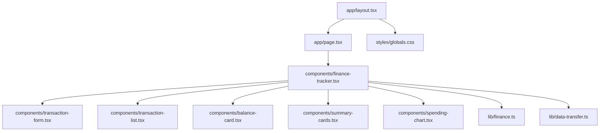

# Getting Started

<cite>
**Referenced Files in This Document**
- [package.json](file://package.json)
- [next.config.mjs](file://next.config.mjs)
- [tsconfig.json](file://tsconfig.json)
- [app/layout.tsx](file://app/layout.tsx)
- [app/page.tsx](file://app/page.tsx)
- [components/finance-tracker.tsx](file://components/finance-tracker.tsx)
- [components/transaction-form.tsx](file://components/transaction-form.tsx)
- [components/transaction-list.tsx](file://components/transaction-list.tsx)
- [components/balance-card.tsx](file://components/balance-card.tsx)
- [components/summary-cards.tsx](file://components/summary-cards.tsx)
- [components/spending-chart.tsx](file://components/spending-chart.tsx)
- [lib/finance.ts](file://lib/finance.ts)
- [lib/data-transfer.ts](file://lib/data-transfer.ts)
- [styles/globals.css](file://styles/globals.css)
</cite>

## Table of Contents
1. [Introduction](#introduction)
2. [Prerequisites](#prerequisites)
3. [Installation](#installation)
4. [Development Server](#development-server)
5. [Project Structure Overview](#project-structure-overview)
6. [Basic Usage](#basic-usage)
7. [Build and Production Deployment](#build-and-production-deployment)
8. [Troubleshooting](#troubleshooting)
9. [Conclusion](#conclusion)

## Introduction
finTracker is a personal finance application built with Next.js App Router, TypeScript, Tailwind CSS, Radix UI, and Recharts. It helps you track income and expenses, manage balances across card, cash, and savings, visualize spending by category, and forecast monthly remaining funds. Data is persisted locally in the browser’s storage so everything stays on your device.

## Prerequisites
- Operating system: Windows, macOS, or Linux
- Node.js: The project targets a modern runtime compatible with the specified dependencies. Ensure you have a recent LTS or current Node.js version installed. The project uses Next.js 16.2.4 and related tooling that expect a sufficiently recent Node.js runtime.
- Package manager: npm or yarn. The scripts in the repository are defined for npm. yarn can also be used if preferred.
- Git: Required to clone the repository.

**Section sources**
- [package.json:5-10](file://package.json#L5-L10)
- [next.config.mjs:1-12](file://next.config.mjs#L1-L12)
- [tsconfig.json:8-18](file://tsconfig.json#L8-L18)

## Installation
Follow these steps to set up the project locally:

1. Clone the repository
   - Use your terminal to clone the repository to your local machine.
2. Navigate into the project directory
3. Install dependencies
   - Using npm: run the install script defined in the package manifest.
   - Alternatively, using yarn: run the equivalent yarn install command.
4. Verify installation
   - After installation completes, you can proceed to start the development server.

Notes:
- The repository includes a Next.js configuration that intentionally ignores TypeScript build errors during development and disables optimized image handling for local builds.
- TypeScript is configured with strict checks and bundler module resolution.

**Section sources**
- [package.json:5-10](file://package.json#L5-L10)
- [next.config.mjs:3-8](file://next.config.mjs#L3-L8)
- [tsconfig.json:10-18](file://tsconfig.json#L10-L18)

## Development Server
Start the Next.js development server:

- Run the development script defined in the package manifest.
- The server starts on the port indicated by Next.js defaults. Open your browser to the address shown in the terminal to view the app.

Initial setup verification:
- The root route renders the main FinanceTracker component.
- The layout applies global fonts, metadata, and analytics in production.
- The UI displays balance cards, summary cards, spending breakdown chart, and the transaction list.

**Section sources**
- [package.json:6](file://package.json#L6)
- [app/page.tsx:1-6](file://app/page.tsx#L1-L6)
- [app/layout.tsx:16-37](file://app/layout.tsx#L16-L37)

## Project Structure Overview
High-level organization:
- app/: Next.js App Router pages and shared layout
- components/: UI components and page-level features
- lib/: shared business logic and data transfer utilities
- styles/: global CSS and Tailwind configuration
- next.config.mjs, tsconfig.json, package.json: build and tooling configuration

Key files and roles:
- app/layout.tsx: Root layout with metadata, viewport, fonts, and analytics
- app/page.tsx: Entry page rendering the FinanceTracker
- components/finance-tracker.tsx: Central state and UI composition for transactions, balances, summaries, charts, and settings
- components/transaction-form.tsx: Form for adding/editing transactions with smart parsing and quick templates
- components/transaction-list.tsx: List of transactions with edit/delete actions
- components/balance-card.tsx: Displays global balance and per-account balances
- components/summary-cards.tsx: Income and expense totals
- components/spending-chart.tsx: Pie chart and breakdown of expenses
- lib/finance.ts: Categories, currency conversion/formatting, and helpers
- lib/data-transfer.ts: Import/export of all local data to/from JSON
- styles/globals.css: Tailwind and theme variables

**Diagram sources**
- [app/layout.tsx:1-53](file://app/layout.tsx#L1-L53)
- [app/page.tsx:1-6](file://app/page.tsx#L1-L6)
- [components/finance-tracker.tsx:1-800](file://components/finance-tracker.tsx#L1-L800)
- [components/transaction-form.tsx:1-401](file://components/transaction-form.tsx#L1-L401)
- [components/transaction-list.tsx:1-92](file://components/transaction-list.tsx#L1-L92)
- [components/balance-card.tsx:1-80](file://components/balance-card.tsx#L1-L80)
- [components/summary-cards.tsx:1-50](file://components/summary-cards.tsx#L1-L50)
- [components/spending-chart.tsx:1-96](file://components/spending-chart.tsx#L1-L96)
- [lib/finance.ts:1-122](file://lib/finance.ts#L1-L122)
- [lib/data-transfer.ts:1-115](file://lib/data-transfer.ts#L1-L115)
- [styles/globals.css:1-126](file://styles/globals.css#L1-L126)

**Section sources**
- [app/layout.tsx:1-53](file://app/layout.tsx#L1-L53)
- [app/page.tsx:1-6](file://app/page.tsx#L1-L6)
- [components/finance-tracker.tsx:1-800](file://components/finance-tracker.tsx#L1-L800)
- [lib/finance.ts:1-122](file://lib/finance.ts#L1-L122)
- [lib/data-transfer.ts:1-115](file://lib/data-transfer.ts#L1-L115)
- [styles/globals.css:1-126](file://styles/globals.css#L1-L126)

## Basic Usage
Add transactions:
- Open the bottom sheet by tapping the floating action button.
- Toggle income or expense.
- Enter an amount (supports math expressions and paste from clipboard).
- Select a category.
- Optionally mark as recurring to auto-generate future transactions.
- Confirm to add; the list updates immediately.

View financial summaries:
- The “Global Balance” card shows card plus cash.
- “Income” and “Expenses” summary cards show totals.
- The spending chart visualizes expense distribution by category and estimates remaining funds for the month.

Navigate the interface:
- Use the header controls to change the active month and toggle history.
- Switch currencies (UAH, USD, EUR) via the balance card controls.
- Manage templates and settings from the settings modal.

Backup and restore:
- Export all data to a JSON file from the settings panel.
- Import a previously exported backup to restore data.

**Section sources**
- [components/finance-tracker.tsx:207-292](file://components/finance-tracker.tsx#L207-L292)
- [components/transaction-form.tsx:159-190](file://components/transaction-form.tsx#L159-L190)
- [components/balance-card.tsx:11-77](file://components/balance-card.tsx#L11-L77)
- [components/summary-cards.tsx:10-49](file://components/summary-cards.tsx#L10-L49)
- [components/spending-chart.tsx:16-95](file://components/spending-chart.tsx#L16-L95)
- [lib/data-transfer.ts:14-54](file://lib/data-transfer.ts#L14-L54)
- [lib/data-transfer.ts:56-114](file://lib/data-transfer.ts#L56-L114)

## Build and Production Deployment
Build the project:
- Run the build script defined in the package manifest. This compiles the Next.js application for production.

Start the production server:
- Run the start script defined in the package manifest. This launches the compiled Next.js server.

Basic configuration options:
- TypeScript settings are configured for strictness and bundler resolution.
- Next.js configuration disables image optimization and tolerates TypeScript build errors during development.

**Section sources**
- [package.json:7-8](file://package.json#L7-L8)
- [tsconfig.json:10-18](file://tsconfig.json#L10-L18)
- [next.config.mjs:3-8](file://next.config.mjs#L3-L8)

## Troubleshooting
Common setup issues and fixes:
- Node.js version mismatch
  - Symptom: Build fails or runtime errors.
  - Action: Ensure your Node.js version is compatible with Next.js 16.x and the project dependencies. Use a current LTS or recent Node.js version.
- Missing dependencies after clone
  - Symptom: Running the dev server fails due to missing modules.
  - Action: Install dependencies using the package manager scripts defined in the repository.
- TypeScript errors during development
  - Symptom: Linter or build warnings.
  - Action: The Next.js configuration is set to ignore TypeScript build errors in development. Resolve issues if you want stricter checks.
- Images not optimized
  - Symptom: Images render without optimization.
  - Action: Image optimization is intentionally disabled in development. This is expected and does not impact functionality.

Data and UI issues:
- Transactions not persisting
  - Symptom: Transactions disappear after refresh.
  - Action: Data is stored in local storage. Ensure your browser allows local storage and you are not in private mode that clears storage.
- Backup import fails
  - Symptom: Import reports invalid format or fails.
  - Action: Ensure the file is a valid version 1 backup JSON and matches the expected structure.

**Section sources**
- [next.config.mjs:3-8](file://next.config.mjs#L3-L8)
- [lib/data-transfer.ts:63-114](file://lib/data-transfer.ts#L63-L114)

## Conclusion
You are ready to track your finances with finTracker. Start the development server, add transactions, and explore the dashboard. Use the settings to manage balances, templates, and backups. For production, build and start the server using the provided scripts. If you encounter issues, verify your Node.js version, reinstall dependencies, and check the Next.js and TypeScript configurations.