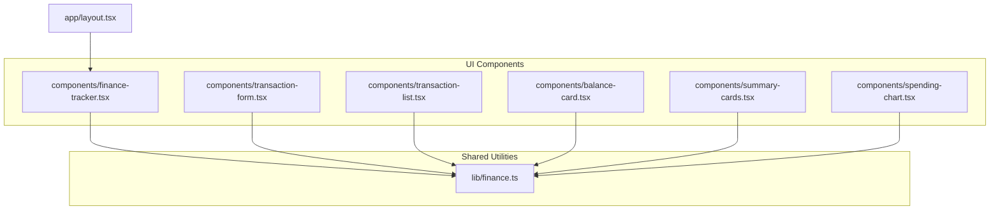
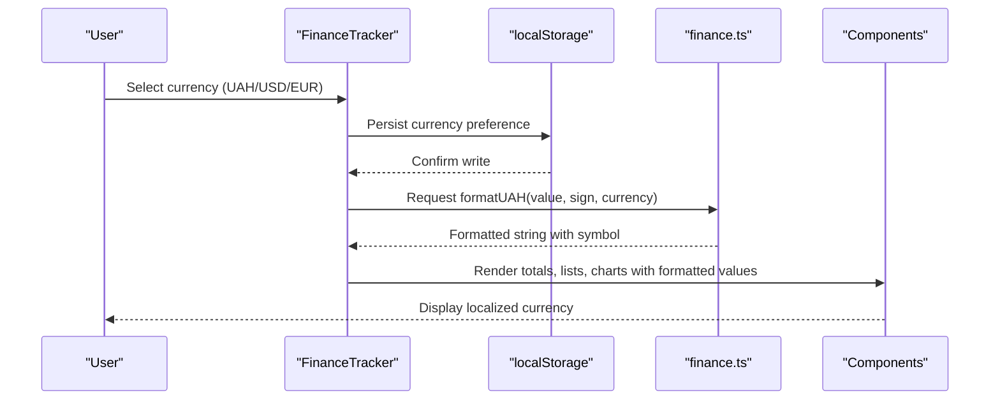
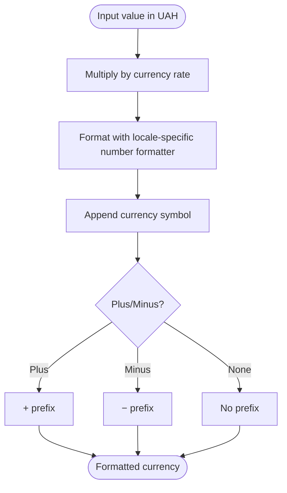
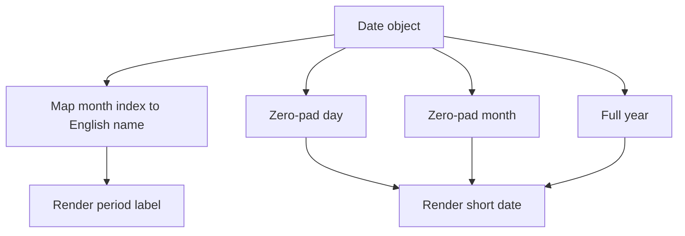
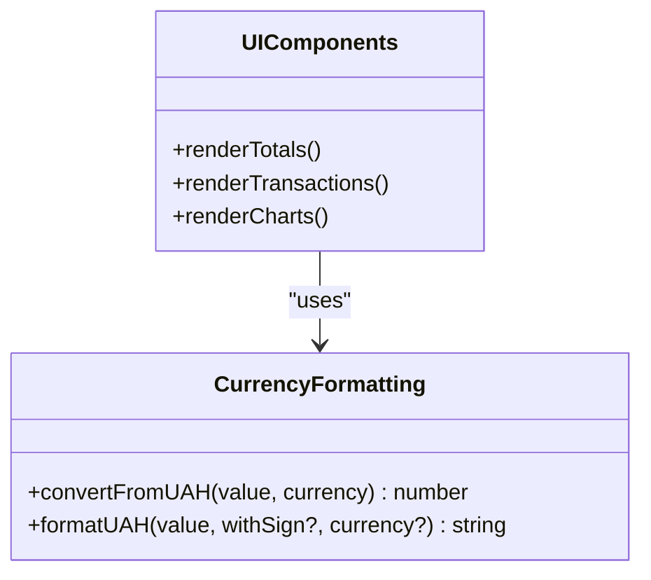
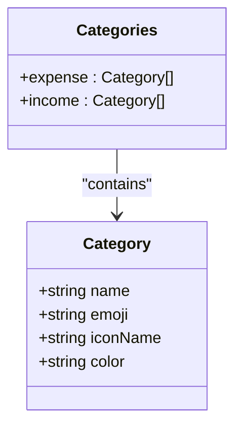
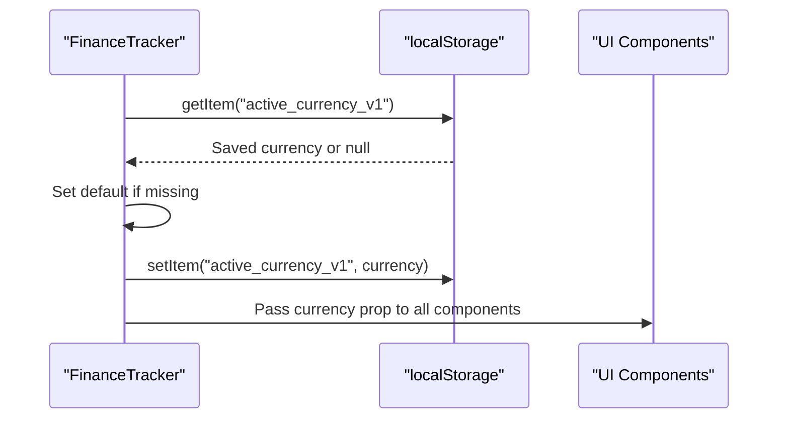
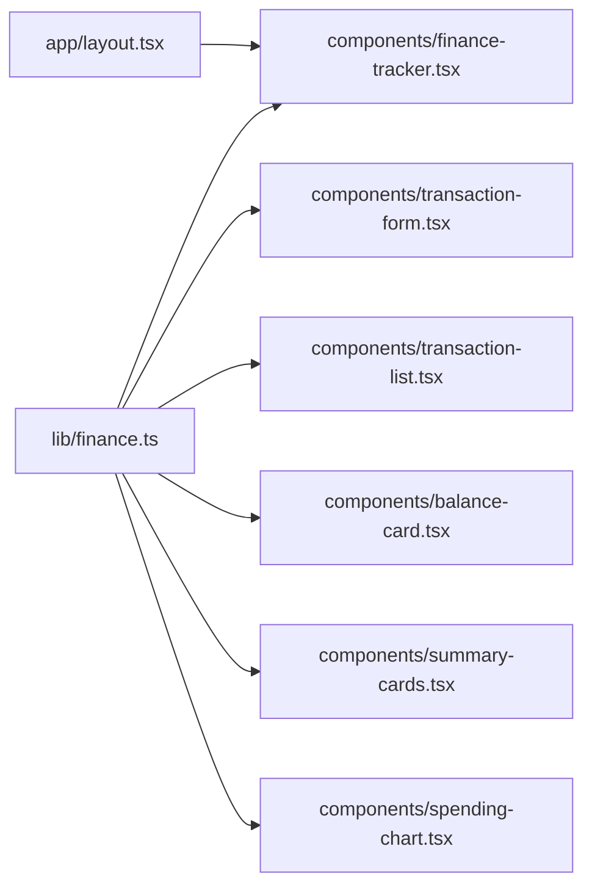

# Internationalization and Localization

<cite>
**Referenced Files in This Document**
- [finance.ts](file://lib/finance.ts)
- [finance-tracker.tsx](file://components/finance-tracker.tsx)
- [transaction-form.tsx](file://components/transaction-form.tsx)
- [transaction-list.tsx](file://components/transaction-list.tsx)
- [balance-card.tsx](file://components/balance-card.tsx)
- [summary-cards.tsx](file://components/summary-cards.tsx)
- [spending-chart.tsx](file://components/spending-chart.tsx)
- [layout.tsx](file://app/layout.tsx)
- [utils.ts](file://lib/utils.ts)
- [theme-provider.tsx](file://components/theme-provider.tsx)
</cite>

## Table of Contents
1. [Introduction](#introduction)
2. [Project Structure](#project-structure)
3. [Core Components](#core-components)
4. [Architecture Overview](#architecture-overview)
5. [Detailed Component Analysis](#detailed-component-analysis)
6. [Dependency Analysis](#dependency-analysis)
7. [Performance Considerations](#performance-considerations)
8. [Troubleshooting Guide](#troubleshooting-guide)
9. [Conclusion](#conclusion)
10. [Appendices](#appendices)

## Introduction
This document explains finTracker’s internationalization and localization features with a focus on multi-currency support, date formatting, number formatting, and category representation. It covers how the application currently handles UAH, USD, and EUR, how dates are localized, and how currency formatting is applied consistently across components. It also outlines extensibility patterns for adding new currencies, languages, and regional formats, along with best practices for maintaining consistency and handling financial data localization challenges.

## Project Structure
The internationalization and localization logic is primarily implemented in a small set of shared utilities and UI components:
- Shared financial utilities define currency types, constants, formatting helpers, and category metadata.
- UI components consume these utilities to render localized currency values, dates, and category emojis.
- The application layout sets the base HTML language attribute for accessibility and browser heuristics.

**Diagram sources**
- [finance.ts:1-124](file://lib/finance.ts#L1-L124)
- [finance-tracker.tsx:1-461](file://components/finance-tracker.tsx#L1-L461)
- [transaction-form.tsx:1-411](file://components/transaction-form.tsx#L1-L411)
- [transaction-list.tsx:1-102](file://components/transaction-list.tsx#L1-L102)
- [balance-card.tsx:1-80](file://components/balance-card.tsx#L1-L80)
- [summary-cards.tsx:1-50](file://components/summary-cards.tsx#L1-L50)
- [spending-chart.tsx:1-96](file://components/spending-chart.tsx#L1-L96)
- [layout.tsx:1-52](file://app/layout.tsx#L1-L52)

**Section sources**
- [finance.ts:1-124](file://lib/finance.ts#L1-L124)
- [finance-tracker.tsx:1-461](file://components/finance-tracker.tsx#L1-L461)
- [layout.tsx:1-52](file://app/layout.tsx#L1-L52)

## Core Components
- Currency and formatting utilities:
  - Currency codes and symbols for UAH, USD, EUR.
  - Fixed conversion rates from the base currency (UAH).
  - Number formatting using a locale-specific formatter with fixed fractional digits.
  - Category metadata including emoji and color.
  - Short date formatting helper and period formatting helper.
- UI components:
  - Finance tracker orchestrates state, loads/saves preferences, and passes currency/formatting props.
  - Transaction form supports parsing clipboard amounts and applying category heuristics.
  - Transaction list renders amounts with sign and category emoji.
  - Balance card and summary cards render totals using the active currency.
  - Spending chart displays category breakdowns with localized values.

**Section sources**
- [finance.ts:39-124](file://lib/finance.ts#L39-L124)
- [finance-tracker.tsx:56-172](file://components/finance-tracker.tsx#L56-L172)
- [transaction-form.tsx:1-411](file://components/transaction-form.tsx#L1-L411)
- [transaction-list.tsx:1-102](file://components/transaction-list.tsx#L1-L102)
- [balance-card.tsx:1-80](file://components/balance-card.tsx#L1-L80)
- [summary-cards.tsx:1-50](file://components/summary-cards.tsx#L1-L50)
- [spending-chart.tsx:1-96](file://components/spending-chart.tsx#L1-L96)

## Architecture Overview
The localization architecture centers on a single source of truth for currency and formatting logic in the shared utilities, consumed by UI components. Preferences like the active currency are persisted and restored per session.

**Diagram sources**
- [finance-tracker.tsx:117-167](file://components/finance-tracker.tsx#L117-L167)
- [finance.ts:109-123](file://lib/finance.ts#L109-L123)
- [balance-card.tsx:31-32](file://components/balance-card.tsx#L31-L32)
- [summary-cards.tsx:28-29](file://components/summary-cards.tsx#L28-L29)
- [spending-chart.tsx:67-68](file://components/spending-chart.tsx#L67-L68)

## Detailed Component Analysis

### Multi-Currency Support and Conversion
- Base currency: UAH.
- Conversion rates are fixed ratios from UAH to target currencies.
- Formatting uses a locale-specific formatter with fixed fractional digits and a currency symbol appended.
- Category emoji and color are independent of currency selection and are shown alongside amounts.

**Diagram sources**
- [finance.ts:99-123](file://lib/finance.ts#L99-L123)

**Section sources**
- [finance.ts:93-123](file://lib/finance.ts#L93-L123)
- [finance-tracker.tsx:668-669](file://components/finance-tracker.tsx#L668-L669)
- [transaction-list.tsx:56-57](file://components/transaction-list.tsx#L56-L57)
- [balance-card.tsx:31-32](file://components/balance-card.tsx#L31-L32)
- [summary-cards.tsx:28-29](file://components/summary-cards.tsx#L28-L29)
- [spending-chart.tsx:67-68](file://components/spending-chart.tsx#L67-L68)

### Date Localization and Formatting
- Period formatting uses English month names regardless of locale.
- Short date formatting uses a D/M/YYYY pattern with zero-padded day/month.
- These choices simplify storage keys and avoid ambiguity in parsing.

**Diagram sources**
- [finance.ts:67-91](file://lib/finance.ts#L67-L91)
- [finance-tracker.tsx:83-85](file://components/finance-tracker.tsx#L83-L85)

**Section sources**
- [finance.ts:67-91](file://lib/finance.ts#L67-L91)
- [finance-tracker.tsx:83-85](file://components/finance-tracker.tsx#L83-L85)

### Number Formatting and Regional Display Preferences
- Numbers are formatted with a locale-specific formatter and fixed fractional digits.
- The formatter is configured to show whole numbers without decimals when applicable.
- Symbols are attached after the formatted number to reflect the selected currency.

**Diagram sources**
- [finance.ts:105-123](file://lib/finance.ts#L105-L123)
- [balance-card.tsx:31-32](file://components/balance-card.tsx#L31-L32)
- [summary-cards.tsx:28-29](file://components/summary-cards.tsx#L28-L29)
- [spending-chart.tsx:67-68](file://components/spending-chart.tsx#L67-L68)
- [transaction-list.tsx:56-57](file://components/transaction-list.tsx#L56-L57)

**Section sources**
- [finance.ts:109-123](file://lib/finance.ts#L109-L123)
- [balance-card.tsx:31-32](file://components/balance-card.tsx#L31-L32)
- [summary-cards.tsx:28-29](file://components/summary-cards.tsx#L28-L29)
- [spending-chart.tsx:67-68](file://components/spending-chart.tsx#L67-L68)
- [transaction-list.tsx:56-57](file://components/transaction-list.tsx#L56-L57)

### Category Localization, Emojis, and Cultural Considerations
- Categories are defined with names, emoji, icon names, and colors.
- Emojis are used for visual recognition and are culture-independent for basic categories.
- Category names are currently static and not localized; translations would require a dedicated i18n layer.

**Diagram sources**
- [finance.ts:1-37](file://lib/finance.ts#L1-L37)

**Section sources**
- [finance.ts:16-37](file://lib/finance.ts#L16-L37)
- [transaction-list.tsx:62-74](file://components/transaction-list.tsx#L62-L74)

### Locale-Aware Date Handling and Time Zone Management
- Dates are handled as JavaScript Date objects and formatted for display.
- There is no explicit timezone conversion; all dates are treated as local time.
- For production deployments requiring timezone-awareness, consider:
  - Storing timestamps with timezone offsets.
  - Using a library like date-fns-tz for conversions.
  - Normalizing to UTC for storage and converting to user’s local timezone for display.

[No sources needed since this section provides general guidance]

### Regional Preferences Persistence
- Active currency is persisted to localStorage and restored on load.
- Other preferences (balances, plans, templates) are similarly persisted.

**Diagram sources**
- [finance-tracker.tsx:117-122](file://components/finance-tracker.tsx#L117-L122)
- [finance-tracker.tsx:164-167](file://components/finance-tracker.tsx#L164-L167)

**Section sources**
- [finance-tracker.tsx:117-122](file://components/finance-tracker.tsx#L117-L122)
- [finance-tracker.tsx:164-167](file://components/finance-tracker.tsx#L164-L167)

### Extensibility: Adding New Currencies, Languages, and Formats
- New currencies:
  - Add to the currency union and symbol/rate records.
  - Ensure conversion rates are maintained or fetched dynamically.
- New languages:
  - Introduce translation keys and a loader.
  - Localize category names and static labels.
- Regional formats:
  - Extend date formatting helpers to accept locale identifiers.
  - Adjust number formatting to respect locale-specific decimal/thousands separators.

[No sources needed since this section provides general guidance]

## Dependency Analysis
The UI components depend on shared utilities for currency formatting, category metadata, and date helpers. The finance tracker manages persistence and state propagation.

**Diagram sources**
- [finance.ts:1-124](file://lib/finance.ts#L1-L124)
- [finance-tracker.tsx:1-461](file://components/finance-tracker.tsx#L1-L461)
- [transaction-form.tsx:1-411](file://components/transaction-form.tsx#L1-L411)
- [transaction-list.tsx:1-102](file://components/transaction-list.tsx#L1-L102)
- [balance-card.tsx:1-80](file://components/balance-card.tsx#L1-L80)
- [summary-cards.tsx:1-50](file://components/summary-cards.tsx#L1-L50)
- [spending-chart.tsx:1-96](file://components/spending-chart.tsx#L1-L96)
- [layout.tsx:1-52](file://app/layout.tsx#L1-L52)

**Section sources**
- [finance.ts:1-124](file://lib/finance.ts#L1-L124)
- [finance-tracker.tsx:1-461](file://components/finance-tracker.tsx#L1-L461)

## Performance Considerations
- Currency formatting is lightweight and performed on demand; memoization is not required for typical usage.
- Persisting preferences avoids repeated parsing and reduces re-renders.
- Category emoji rendering is constant-time lookups.

[No sources needed since this section provides general guidance]

## Troubleshooting Guide
- Currency mismatch after switching:
  - Verify the active currency is persisted and restored on load.
  - Ensure all components receive the currency prop and call the formatting helper.
- Incorrect totals:
  - Confirm amounts are numeric and positive before formatting.
  - Check that recurring templates are stored in the base currency and converted on display.
- Date parsing issues:
  - The short date format is D/M/YYYY; ensure inputs match this pattern.
  - For ambiguous dates, consider enforcing locale-aware parsing.

**Section sources**
- [finance-tracker.tsx:117-122](file://components/finance-tracker.tsx#L117-L122)
- [finance-tracker.tsx:164-167](file://components/finance-tracker.tsx#L164-L167)
- [finance.ts:86-91](file://lib/finance.ts#L86-L91)
- [finance.ts:109-123](file://lib/finance.ts#L109-L123)

## Conclusion
finTracker implements a pragmatic, locale-consistent approach to internationalization:
- Multi-currency support is centralized with fixed conversion rates and consistent symbol placement.
- Date formatting is explicit and unambiguous, aiding reliable storage and retrieval.
- Category emojis provide cross-language visual cues.
To expand to new markets, introduce a robust i18n layer, dynamic exchange rates, and timezone-aware handling while preserving the existing formatting and persistence patterns.

[No sources needed since this section summarizes without analyzing specific files]

## Appendices

### Best Practices for Extending to New Markets
- Use a dedicated i18n library and key-based translations for category names and static text.
- Fetch and cache exchange rates from a trusted provider; normalize to a base currency for storage.
- Store timestamps with explicit timezone offsets; convert to user’s local time for display.
- Allow users to choose number/date/time formats aligned with regional preferences.

[No sources needed since this section provides general guidance]