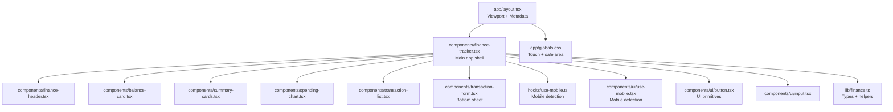
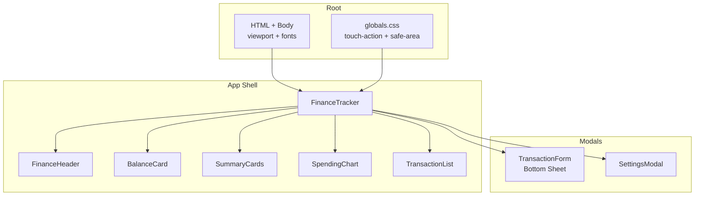
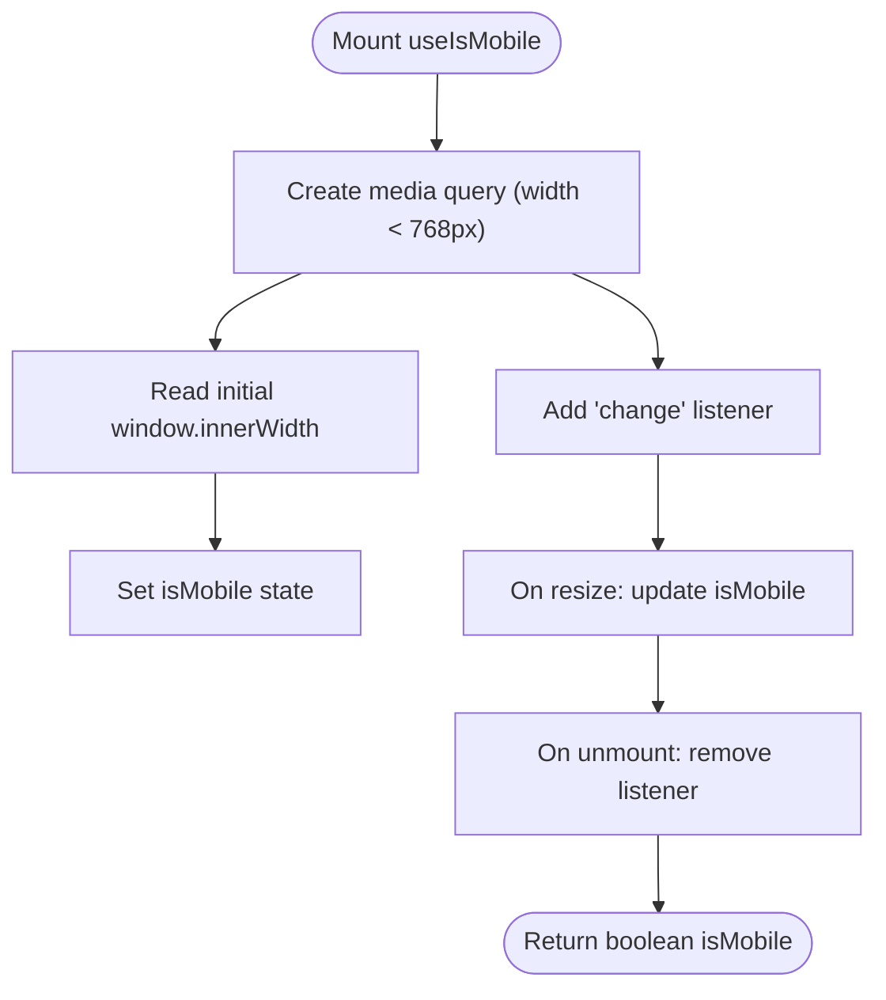
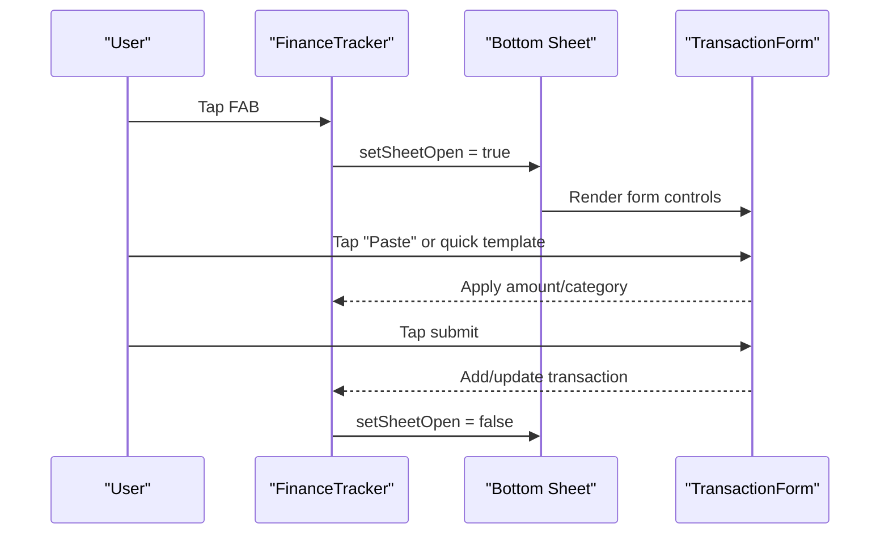
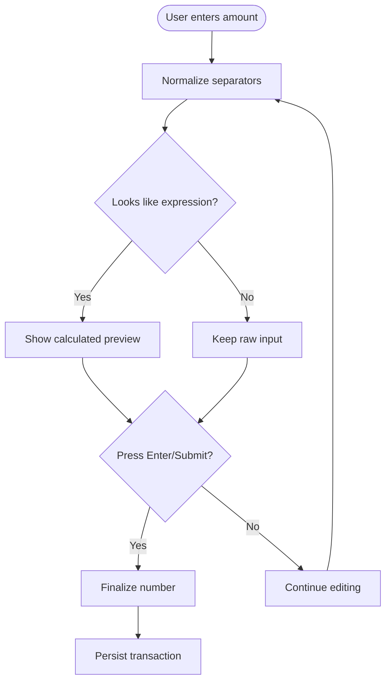
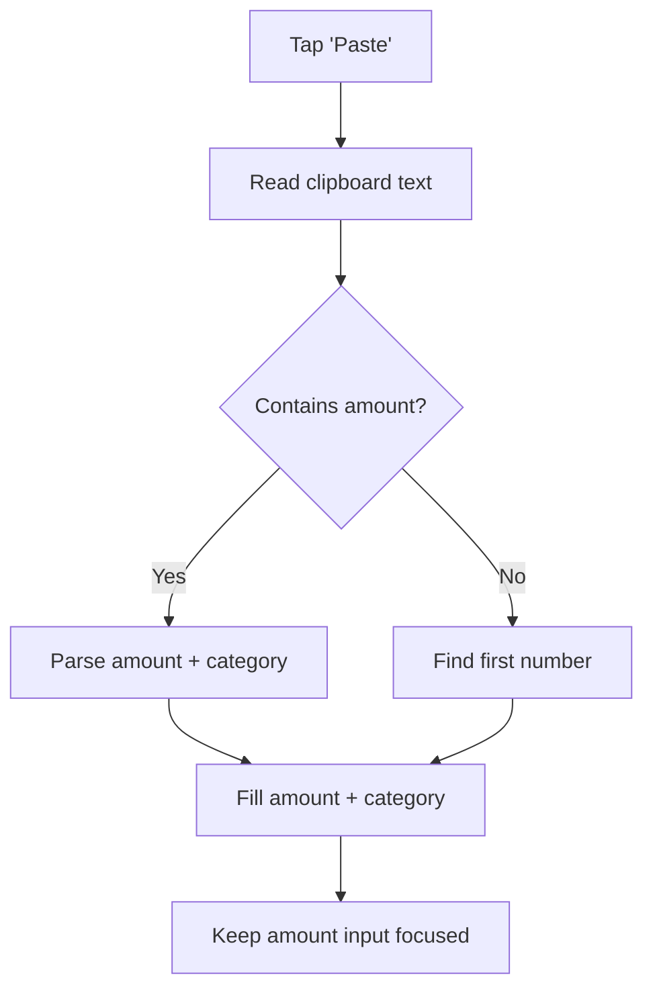
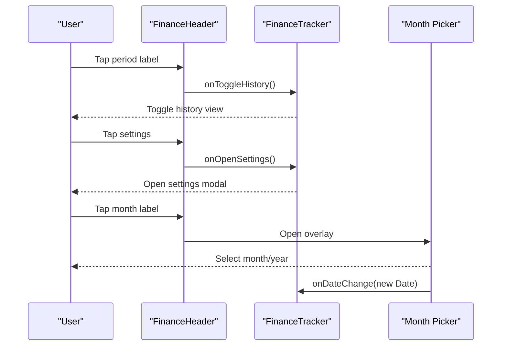
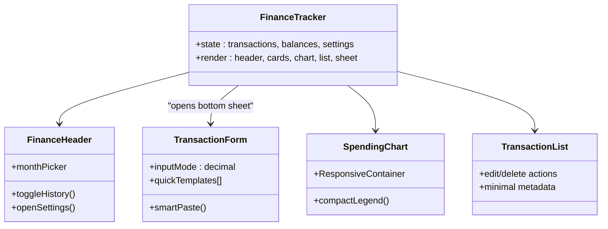
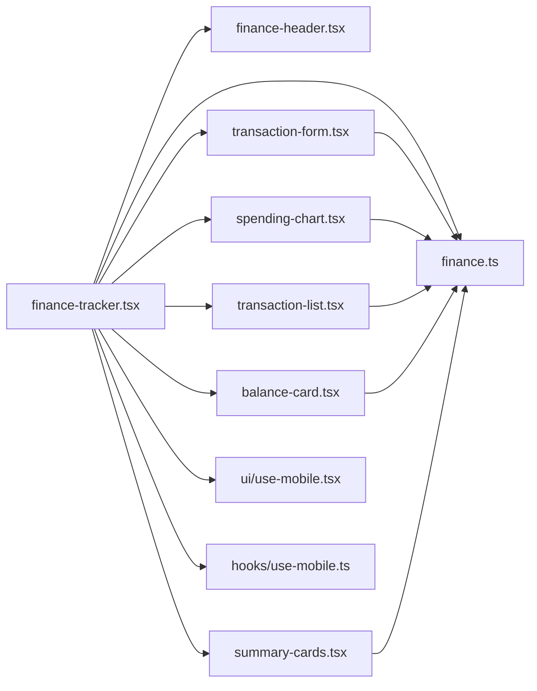

# Mobile-First Experience

<cite>
**Referenced Files in This Document**
- [layout.tsx](file://app/layout.tsx)
- [globals.css](file://app/globals.css)
- [use-mobile.tsx](file://components/ui/use-mobile.tsx)
- [use-mobile.ts](file://hooks/use-mobile.ts)
- [finance-tracker.tsx](file://components/finance-tracker.tsx)
- [transaction-form.tsx](file://components/transaction-form.tsx)
- [finance-header.tsx](file://components/finance-header.tsx)
- [summary-cards.tsx](file://components/summary-cards.tsx)
- [spending-chart.tsx](file://components/spending-chart.tsx)
- [balance-card.tsx](file://components/balance-card.tsx)
- [transaction-list.tsx](file://components/transaction-list.tsx)
- [button.tsx](file://components/ui/button.tsx)
- [input.tsx](file://components/ui/input.tsx)
- [finance.ts](file://lib/finance.ts)
- [utils.ts](file://lib/utils.ts)
</cite>

## Table of Contents
1. [Introduction](#introduction)
2. [Project Structure](#project-structure)
3. [Core Components](#core-components)
4. [Architecture Overview](#architecture-overview)
5. [Detailed Component Analysis](#detailed-component-analysis)
6. [Dependency Analysis](#dependency-analysis)
7. [Performance Considerations](#performance-considerations)
8. [Troubleshooting Guide](#troubleshooting-guide)
9. [Conclusion](#conclusion)
10. [Appendices](#appendices)

## Introduction
This document explains finTracker’s mobile-first design and user experience. It covers the responsive design principles, viewport configuration, touch interaction patterns, gesture-based navigation, mobile-optimized input methods, clipboard integration, quick transaction entry, simplified navigation, accessibility, and performance optimizations. It also documents the mobile breakpoint strategy, component adaptation patterns, and guidance for testing across devices.

## Project Structure
The application follows a mobile-first Next.js structure with a single-page layout and a central FinanceTracker component orchestrating the UI. Utility hooks detect mobile breakpoints, and shared UI primitives provide consistent spacing and interaction affordances. Global styles enforce touch-friendly defaults and safe areas.

**Diagram sources**
- [layout.tsx:1-53](file://app/layout.tsx#L1-L53)
- [finance-tracker.tsx:1-461](file://components/finance-tracker.tsx#L1-L461)
- [finance-header.tsx:1-129](file://components/finance-header.tsx#L1-L129)
- [balance-card.tsx:1-80](file://components/balance-card.tsx#L1-L80)
- [summary-cards.tsx:1-50](file://components/summary-cards.tsx#L1-L50)
- [spending-chart.tsx:1-96](file://components/spending-chart.tsx#L1-L96)
- [transaction-list.tsx:1-102](file://components/transaction-list.tsx#L1-L102)
- [transaction-form.tsx:1-408](file://components/transaction-form.tsx#L1-L408)
- [use-mobile.ts:1-20](file://hooks/use-mobile.ts#L1-L20)
- [use-mobile.tsx:1-20](file://components/ui/use-mobile.tsx#L1-L20)
- [button.tsx:1-61](file://components/ui/button.tsx#L1-L61)
- [input.tsx:1-22](file://components/ui/input.tsx#L1-L22)
- [finance.ts:1-124](file://lib/finance.ts#L1-L124)
- [globals.css:1-142](file://app/globals.css#L1-L142)

**Section sources**
- [layout.tsx:1-53](file://app/layout.tsx#L1-L53)
- [globals.css:1-142](file://app/globals.css#L1-L142)
- [finance-tracker.tsx:1-461](file://components/finance-tracker.tsx#L1-L461)
- [use-mobile.ts:1-20](file://hooks/use-mobile.ts#L1-L20)
- [use-mobile.tsx:1-20](file://components/ui/use-mobile.tsx#L1-L20)

## Core Components
- Viewport and metadata: Configured at the root layout to lock zoom and define icons.
- Mobile detection hook: Provides a stable isMobile signal for component adaptation.
- FinanceTracker: Central orchestrator rendering header, cards, charts, lists, and modals/sheets.
- TransactionForm: Optimized for mobile input, math accessory bar, smart paste, and quick templates.
- UI primitives: Buttons and inputs tuned for touch and small screens.
- Finance utilities: Types, categories, formatting, and currency conversion.

**Section sources**
- [layout.tsx:9-37](file://app/layout.tsx#L9-L37)
- [use-mobile.ts:3-19](file://hooks/use-mobile.ts#L3-L19)
- [use-mobile.tsx:3-19](file://components/ui/use-mobile.tsx#L3-L19)
- [finance-tracker.tsx:56-461](file://components/finance-tracker.tsx#L56-L461)
- [transaction-form.tsx:103-408](file://components/transaction-form.tsx#L103-L408)
- [button.tsx:7-37](file://components/ui/button.tsx#L7-L37)
- [input.tsx:5-19](file://components/ui/input.tsx#L5-L19)
- [finance.ts:1-124](file://lib/finance.ts#L1-L124)

## Architecture Overview
The mobile-first architecture centers on a fixed maximum width container with a primary bottom sheet for adding/editing transactions. Navigation is simplified with a floating action button and modal overlays. Charts and lists adapt to narrow widths while preserving readability.

**Diagram sources**
- [layout.tsx:39-52](file://app/layout.tsx#L39-L52)
- [globals.css:118-127](file://app/globals.css#L118-L127)
- [finance-tracker.tsx:311-461](file://components/finance-tracker.tsx#L311-L461)
- [transaction-form.tsx:406-408](file://components/transaction-form.tsx#L406-L408)

## Detailed Component Analysis

### Viewport and Meta Tags
- Locks zoom to improve readability and prevents user scaling.
- Defines icon sets for light/dark modes and platform-specific icons.

**Section sources**
- [layout.tsx:9-37](file://app/layout.tsx#L9-L37)

### Mobile Breakpoint Strategy
- A shared 768px breakpoint is used to switch behavior on smaller screens.
- The hook listens to media queries and window resize to compute isMobile.

**Diagram sources**
- [use-mobile.ts:3-19](file://hooks/use-mobile.ts#L3-L19)
- [use-mobile.tsx:3-19](file://components/ui/use-mobile.tsx#L3-L19)

**Section sources**
- [use-mobile.ts:3-19](file://hooks/use-mobile.ts#L3-L19)
- [use-mobile.tsx:3-19](file://components/ui/use-mobile.tsx#L3-L19)

### Touch Interaction Patterns and Gesture-Based Navigation
- Global touch-action policies enable manipulation and pan gestures for optimal scrolling and dragging.
- Safe-area insets are respected in bottom sheets and modals.
- Bottom sheet uses spring animations and drag handle for natural dismissal.
- Header month picker overlays are dismissible by clicking outside.

**Diagram sources**
- [finance-tracker.tsx:360-428](file://components/finance-tracker.tsx#L360-L428)
- [transaction-form.tsx:344-383](file://components/transaction-form.tsx#L344-L383)

**Section sources**
- [globals.css:121-126](file://app/globals.css#L121-L126)
- [finance-tracker.tsx:360-428](file://components/finance-tracker.tsx#L360-L428)
- [transaction-form.tsx:344-383](file://components/transaction-form.tsx#L344-L383)

### Mobile-Optimized Input Methods
- Decimal input mode for numeric fields to show appropriate mobile keyboards.
- Auto-focus and cursor positioning optimized with requestAnimationFrame and timeouts.
- Expression evaluation with live preview for math-like input.
- Accessory math bar for quick operator insertion on iOS.
- Smart paste from clipboard with merchant keyword detection.

**Diagram sources**
- [transaction-form.tsx:25-35](file://components/transaction-form.tsx#L25-L35)
- [transaction-form.tsx:143-172](file://components/transaction-form.tsx#L143-L172)

**Section sources**
- [transaction-form.tsx:143-172](file://components/transaction-form.tsx#L143-L172)
- [transaction-form.tsx:290-304](file://components/transaction-form.tsx#L290-L304)
- [transaction-form.tsx:327-341](file://components/transaction-form.tsx#L327-L341)
- [transaction-form.tsx:180-197](file://components/transaction-form.tsx#L180-L197)

### Clipboard Integration and Quick Transaction Entry
- Smart paste detects currency amounts and maps merchant keywords to categories.
- Quick templates provide one-tap amounts with icons and labels.
- Templates are persisted locally and can be customized.

**Diagram sources**
- [transaction-form.tsx:46-58](file://components/transaction-form.tsx#L46-L58)
- [transaction-form.tsx:180-197](file://components/transaction-form.tsx#L180-L197)

**Section sources**
- [transaction-form.tsx:46-58](file://components/transaction-form.tsx#L46-L58)
- [transaction-form.tsx:180-197](file://components/transaction-form.tsx#L180-L197)
- [finance-tracker.tsx:50-54](file://components/finance-tracker.tsx#L50-L54)
- [finance-tracker.tsx:200-205](file://components/finance-tracker.tsx#L200-L205)

### Simplified Navigation and Modal Design
- Floating Action Button opens the bottom sheet for new/edit forms.
- Settings modal slides up from the bottom with a close handle.
- Month picker overlays are constrained and dismissible.

**Diagram sources**
- [finance-header.tsx:44-54](file://components/finance-header.tsx#L44-L54)
- [finance-header.tsx:56-101](file://components/finance-header.tsx#L56-L101)
- [finance-tracker.tsx:294-299](file://components/finance-tracker.tsx#L294-L299)

**Section sources**
- [finance-header.tsx:44-54](file://components/finance-header.tsx#L44-L54)
- [finance-header.tsx:56-101](file://components/finance-header.tsx#L56-L101)
- [finance-tracker.tsx:294-299](file://components/finance-tracker.tsx#L294-L299)

### Accessibility Considerations
- Semantic roles and labels: buttons include aria-labels; interactive elements indicate state with aria-pressed.
- Screen reader support: Hidden “aria-hidden” decorative elements avoid noise; sr-only spans provide context.
- Focus management: Inputs auto-focus with preventScroll; selection maintained during edits.
- Keyboard optimization: Enter triggers submission; Escape cancels edit when applicable.

**Section sources**
- [transaction-form.tsx:210-245](file://components/transaction-form.tsx#L210-L245)
- [transaction-form.tsx:290-304](file://components/transaction-form.tsx#L290-L304)
- [transaction-form.tsx:385-404](file://components/transaction-form.tsx#L385-L404)
- [finance-header.tsx:108-124](file://components/finance-header.tsx#L108-L124)
- [transaction-list.tsx:77-94](file://components/transaction-list.tsx#L77-L94)

### Component Adaptation Patterns
- Fixed maximum width container ensures readable line lengths on phones.
- Grids and lists adapt to narrow widths; icons and minimal text preserve legibility.
- Charts use responsive containers and compact legends for small screens.
- Cards emphasize key metrics with clear typography hierarchy.

**Diagram sources**
- [finance-tracker.tsx:311-358](file://components/finance-tracker.tsx#L311-L358)
- [transaction-form.tsx:103-120](file://components/transaction-form.tsx#L103-L120)
- [finance-header.tsx:20-27](file://components/finance-header.tsx#L20-L27)
- [spending-chart.tsx:16-31](file://components/spending-chart.tsx#L16-L31)
- [transaction-list.tsx:14-20](file://components/transaction-list.tsx#L14-L20)

**Section sources**
- [finance-tracker.tsx:327-358](file://components/finance-tracker.tsx#L327-L358)
- [spending-chart.tsx:32-48](file://components/spending-chart.tsx#L32-L48)
- [transaction-list.tsx:26-98](file://components/transaction-list.tsx#L26-L98)

### UI Primitives for Mobile
- Button variants and sizes are optimized for touch targets and small screens.
- Input fields include focus-visible rings and proper sizing for mobile keyboards.

**Section sources**
- [button.tsx:7-37](file://components/ui/button.tsx#L7-L37)
- [input.tsx:5-19](file://components/ui/input.tsx#L5-L19)

## Dependency Analysis
- FinanceTracker depends on shared utilities for categories, formatting, and keys.
- UI hooks and components are decoupled and reusable across contexts.
- Global styles unify touch behavior and safe-area handling.

**Diagram sources**
- [finance-tracker.tsx:17-22](file://components/finance-tracker.tsx#L17-L22)
- [finance.ts:1-124](file://lib/finance.ts#L1-L124)
- [use-mobile.tsx:1-20](file://components/ui/use-mobile.tsx#L1-L20)
- [use-mobile.ts:1-20](file://hooks/use-mobile.ts#L1-L20)

**Section sources**
- [finance-tracker.tsx:17-22](file://components/finance-tracker.tsx#L17-L22)
- [finance.ts:1-124](file://lib/finance.ts#L1-L124)

## Performance Considerations
- Minimize re-renders by keeping state local to FinanceTracker and passing callbacks down.
- Use memoization for derived values (e.g., chart data) to avoid heavy recomputations.
- Prefer CSS transforms and opacity for animations; avoid layout thrashing.
- Lazy-load non-critical assets; keep chart libraries tree-shaken.
- Optimize input handling: throttle expression evaluation and avoid blocking UI thread.
- Respect safe-area insets to prevent content overlap with device notches.

[No sources needed since this section provides general guidance]

## Troubleshooting Guide
- Clipboard permissions: Smart paste requires permission; handle exceptions gracefully and fall back to manual input.
- Input focus issues: Ensure focus logic runs after render; use requestAnimationFrame and timeouts for reliable placement.
- Bottom sheet dismissal: Verify backdrop click and drag handle interactions; confirm animation cleanup on unmount.
- Media query mismatch: On resize, ensure the mobile hook updates promptly; test with devtools device toolbar.

**Section sources**
- [transaction-form.tsx:180-197](file://components/transaction-form.tsx#L180-L197)
- [transaction-form.tsx:143-164](file://components/transaction-form.tsx#L143-L164)
- [finance-tracker.tsx:370-428](file://components/finance-tracker.tsx#L370-L428)
- [use-mobile.ts:8-16](file://hooks/use-mobile.ts#L8-L16)

## Conclusion
finTracker implements a cohesive mobile-first experience through a locked viewport, a robust mobile detection hook, and a bottom-sheet-centric interaction model. Touch-friendly inputs, smart paste, quick templates, and simplified navigation streamline daily use. Global styles and UI primitives ensure consistent behavior across devices, while accessibility attributes and focus management improve inclusivity. Following the patterns and recommendations here will help maintain a smooth, responsive experience on mobile browsers.

## Appendices

### Mobile Breakpoints and Container Strategy
- Breakpoint: 768px; below this threshold, components adapt for phones.
- Container: Fixed max-width with centered padding to constrain content width.
- Safe areas: env(safe-area-inset-*) used in bottom sheets and modals.

**Section sources**
- [use-mobile.ts:3-19](file://hooks/use-mobile.ts#L3-L19)
- [use-mobile.tsx:3-19](file://components/ui/use-mobile.tsx#L3-L19)
- [finance-tracker.tsx:327-358](file://components/finance-tracker.tsx#L327-L358)
- [finance-tracker.tsx:391-392](file://components/finance-tracker.tsx#L391-L392)

### Testing Guidelines
- Test on real devices and emulators across major OS versions.
- Validate gesture interactions: tap targets, swipe-to-dismiss, and keyboard visibility.
- Verify accessibility: VoiceOver/Narrator navigation, keyboard-only flows, and focus order.
- Measure performance: Largest Contentful Paint (LCP), First Input Delay (FID), and Cumulative Layout Shift (CLS).

[No sources needed since this section provides general guidance]