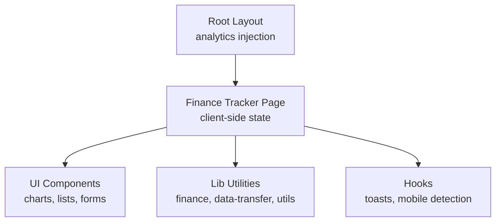
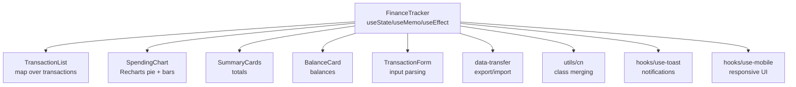
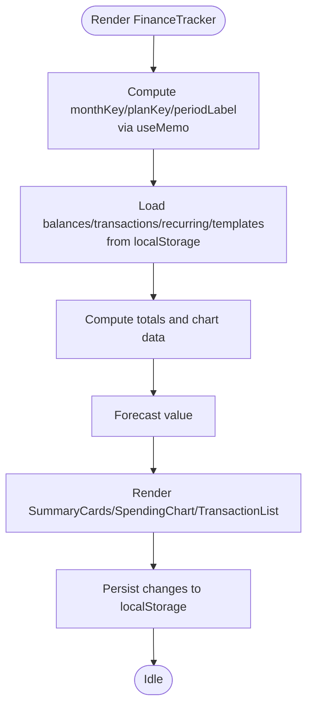
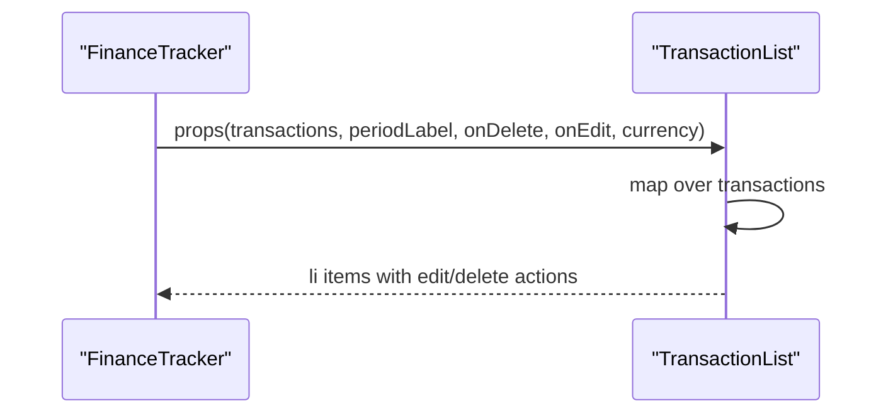
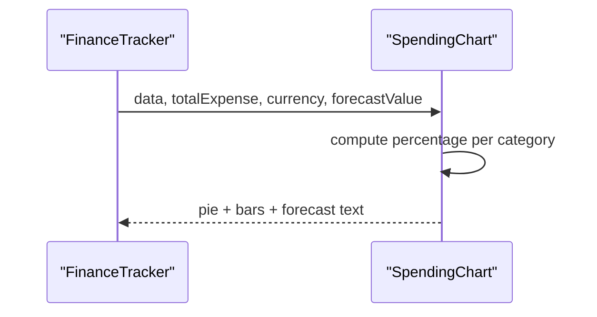
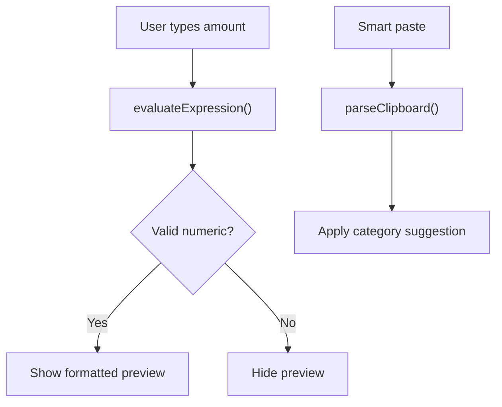
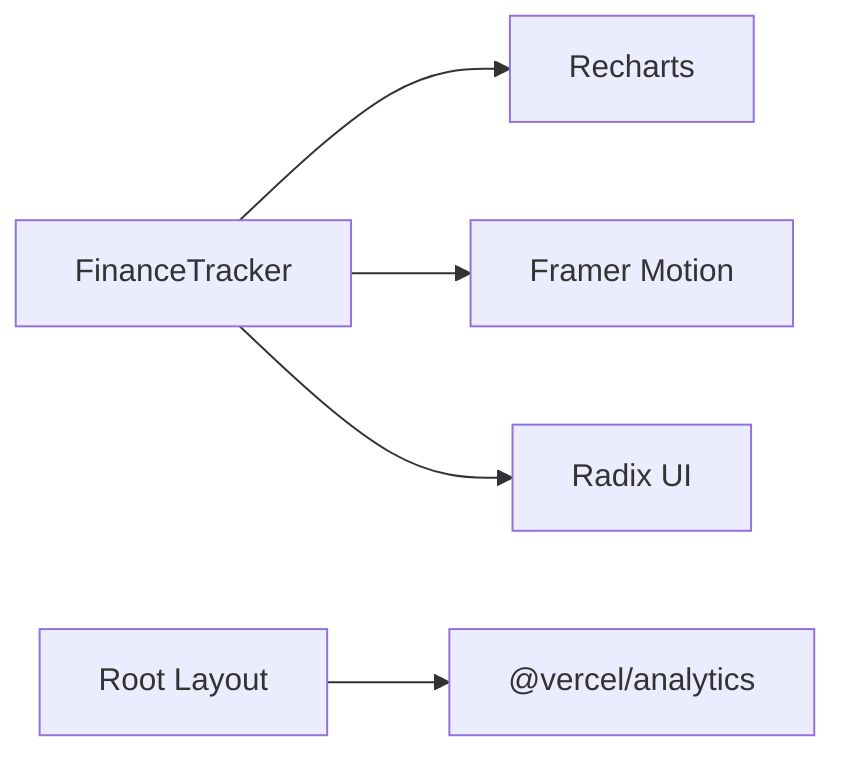

# Performance and Optimization

<cite>
**Referenced Files in This Document**
- [next.config.mjs](file://next.config.mjs)
- [package.json](file://package.json)
- [layout.tsx](file://app/layout.tsx)
- [finance.ts](file://lib/finance.ts)
- [utils.ts](file://lib/utils.ts)
- [finance-tracker.tsx](file://components/finance-tracker.tsx)
- [transaction-list.tsx](file://components/transaction-list.tsx)
- [spending-chart.tsx](file://components/spending-chart.tsx)
- [summary-cards.tsx](file://components/summary-cards.tsx)
- [transaction-form.tsx](file://components/transaction-form.tsx)
- [data-transfer.ts](file://lib/data-transfer.ts)
- [use-toast.ts](file://hooks/use-toast.ts)
- [use-mobile.ts](file://hooks/use-mobile.ts)
</cite>

## Table of Contents
1. [Introduction](#introduction)
2. [Project Structure](#project-structure)
3. [Core Components](#core-components)
4. [Architecture Overview](#architecture-overview)
5. [Detailed Component Analysis](#detailed-component-analysis)
6. [Dependency Analysis](#dependency-analysis)
7. [Performance Considerations](#performance-considerations)
8. [Troubleshooting Guide](#troubleshooting-guide)
9. [Conclusion](#conclusion)
10. [Appendices](#appendices)

## Introduction
This document consolidates performance optimization strategies and best practices for finTracker, focusing on Next.js build optimization, memory management, lazy loading, browser performance, profiling and monitoring, financial calculation efficiency, chart rendering, caching and prefetching, and scalable performance testing. It synthesizes the repository’s current implementation and provides actionable guidance grounded in the codebase.

## Project Structure
The application follows a conventional Next.js App Router layout with a clear separation of concerns:
- App shell and analytics integration in the root layout
- Feature components under components/
- Shared utilities and domain logic under lib/
- Hooks for UI behavior under hooks/

**Diagram sources**
- [layout.tsx:39-52](file://app/layout.tsx#L39-L52)
- [finance-tracker.tsx:57-475](file://components/finance-tracker.tsx#L57-L475)

**Section sources**
- [layout.tsx:1-53](file://app/layout.tsx#L1-L53)
- [finance-tracker.tsx:1-921](file://components/finance-tracker.tsx#L1-L921)

## Core Components
- FinanceTracker orchestrates state, persistence, derived computations, and UI composition.
- TransactionList renders large lists efficiently with minimal re-renders.
- SpendingChart leverages Recharts for responsive pie charts with per-category bars.
- SummaryCards and BalanceCard present aggregated metrics with concise markup.
- TransactionForm handles input parsing, smart paste, and quick templates with focused UX.
- Hooks provide toast notifications and mobile-aware behavior.

**Section sources**
- [finance-tracker.tsx:57-475](file://components/finance-tracker.tsx#L57-L475)
- [transaction-list.tsx:14-101](file://components/transaction-list.tsx#L14-L101)
- [spending-chart.tsx:16-95](file://components/spending-chart.tsx#L16-L95)
- [summary-cards.tsx:10-49](file://components/summary-cards.tsx#L10-L49)
- [transaction-form.tsx:103-447](file://components/transaction-form.tsx#L103-L447)
- [use-toast.ts:171-192](file://hooks/use-toast.ts#L171-L192)
- [use-mobile.ts:5-19](file://hooks/use-mobile.ts#L5-L19)

## Architecture Overview
The runtime architecture centers on client-side state management with localStorage-backed persistence. Derived computations are memoized to minimize recalculation overhead. Charts render only visible data, and UI surfaces avoid heavy DOM thrashing.

**Diagram sources**
- [finance-tracker.tsx:57-475](file://components/finance-tracker.tsx#L57-L475)
- [transaction-list.tsx:14-101](file://components/transaction-list.tsx#L14-L101)
- [spending-chart.tsx:16-95](file://components/spending-chart.tsx#L16-L95)
- [summary-cards.tsx:10-49](file://components/summary-cards.tsx#L10-L49)
- [transaction-form.tsx:103-447](file://components/transaction-form.tsx#L103-L447)
- [data-transfer.ts:14-54](file://lib/data-transfer.ts#L14-L54)
- [utils.ts:4-6](file://lib/utils.ts#L4-L6)
- [use-toast.ts:171-192](file://hooks/use-toast.ts#L171-L192)
- [use-mobile.ts:5-19](file://hooks/use-mobile.ts#L5-L19)

## Detailed Component Analysis

### FinanceTracker: State, Memoization, and Rendering Patterns
- Uses memoization for derived values (month keys, period label) to stabilize props and reduce downstream recomputations.
- Persists and hydrates state from localStorage to avoid expensive server-side rendering for personal data.
- Computation-heavy logic (totals, chart data, forecast) is computed once per render and reused across child components.

**Diagram sources**
- [finance-tracker.tsx:85-87](file://components/finance-tracker.tsx#L85-L87)
- [finance-tracker.tsx:109-144](file://components/finance-tracker.tsx#L109-L144)
- [finance-tracker.tsx:176-200](file://components/finance-tracker.tsx#L176-L200)
- [finance-tracker.tsx:183-190](file://components/finance-tracker.tsx#L183-L190)

**Section sources**
- [finance-tracker.tsx:57-475](file://components/finance-tracker.tsx#L57-L475)

### TransactionList: Efficient List Rendering
- Renders a list of transactions with minimal conditional branches and stable keys.
- Uses concise markup and avoids unnecessary wrappers to reduce DOM size.

**Diagram sources**
- [finance-tracker.tsx:365-371](file://components/finance-tracker.tsx#L365-L371)
- [transaction-list.tsx:14-101](file://components/transaction-list.tsx#L14-L101)

**Section sources**
- [transaction-list.tsx:14-101](file://components/transaction-list.tsx#L14-L101)

### SpendingChart: Chart Rendering and Responsiveness
- Uses Recharts with ResponsiveContainer for adaptive sizing.
- Renders a pie chart plus per-category bars; percentages are computed inline for each item.

**Diagram sources**
- [finance-tracker.tsx:361-361](file://components/finance-tracker.tsx#L361-L361)
- [spending-chart.tsx:16-95](file://components/spending-chart.tsx#L16-L95)

**Section sources**
- [spending-chart.tsx:16-95](file://components/spending-chart.tsx#L16-L95)

### TransactionForm: Input Parsing and Smart Paste
- Implements expression evaluation and clipboard parsing to accelerate data entry.
- Uses memoized previews and focused input handling to improve responsiveness.

**Diagram sources**
- [transaction-form.tsx:25-35](file://components/transaction-form.tsx#L25-L35)
- [transaction-form.tsx:46-58](file://components/transaction-form.tsx#L46-L58)
- [transaction-form.tsx:146-150](file://components/transaction-form.tsx#L146-L150)

**Section sources**
- [transaction-form.tsx:103-447](file://components/transaction-form.tsx#L103-L447)

### SummaryCards and BalanceCard: Lightweight Metrics
- Minimal DOM and deterministic rendering for metric cards.
- Currency formatting delegated to shared utilities.

**Section sources**
- [summary-cards.tsx:10-49](file://components/summary-cards.tsx#L10-L49)
- [balance-card.tsx:11-79](file://components/balance-card.tsx#L11-L79)

### Hooks: Notifications and Mobile Responsiveness
- use-toast manages a capped toast queue with scheduled removal to avoid memory leaks.
- use-isMobile adapts UI behavior based on viewport conditions.

**Section sources**
- [use-toast.ts:171-192](file://hooks/use-toast.ts#L171-L192)
- [use-mobile.ts:5-19](file://hooks/use-mobile.ts#L5-L19)

## Dependency Analysis
External libraries impacting performance:
- Recharts for charting
- Framer Motion for animations
- Radix UI primitives for accessible components
- Vercel Analytics for performance monitoring

**Diagram sources**
- [package.json:40-61](file://package.json#L40-L61)
- [layout.tsx:3](file://app/layout.tsx#L3)

**Section sources**
- [package.json:11-72](file://package.json#L11-L72)
- [layout.tsx:39-52](file://app/layout.tsx#L39-L52)

## Performance Considerations

### Next.js Build Optimization
- Code splitting: Next.js automatically splits routes and dynamic imports. Keep feature components split to avoid loading unused bundles.
- Static generation: Not applicable for this client-side, localStorage-driven app. Favor client-side rendering with incremental improvements.
- Bundle analysis: Run the Next.js build with analyzer plugins to inspect bundle composition and remove unused dependencies.

Recommendations:
- Audit imports to ensure only necessary Recharts components are included.
- Prefer tree-shakeable icons and components.
- Monitor bundle growth after adding new UI primitives.

**Section sources**
- [next.config.mjs:1-12](file://next.config.mjs#L1-L12)
- [package.json:11-72](file://package.json#L11-L72)

### Memory Management for Large Datasets
- Current approach stores monthly transactions and plans in localStorage. For very large histories:
  - Paginate or virtualize lists.
  - Limit localStorage reads/writes to essential moments (e.g., on state change).
  - Normalize transaction objects to reduce duplication.
- Use weak references cautiously; localStorage is the primary cache.

Optimization ideas:
- Periodic compaction of localStorage entries.
- Debounce heavy writes during rapid edits.

**Section sources**
- [finance-tracker.tsx:109-144](file://components/finance-tracker.tsx#L109-L144)
- [finance-tracker.tsx:146-164](file://components/finance-tracker.tsx#L146-L164)
- [data-transfer.ts:14-54](file://lib/data-transfer.ts#L14-L54)

### Lazy Loading Strategies
- Components: Keep current component boundaries; dynamic imports can be considered for optional modals or heavy tooling.
- Images: The configuration disables optimized images; if images are added later, enable image optimization carefully.
- Data fetching: Client-side data is localStorage-based; for server-side data, use dynamic imports and SWR-like patterns to defer and cache.

**Section sources**
- [next.config.mjs:6-8](file://next.config.mjs#L6-L8)
- [finance-tracker.tsx:57-475](file://components/finance-tracker.tsx#L57-L475)

### Browser Performance: React.memo, useCallback, Efficient Re-rendering
- Current components render frequently due to prop changes; introduce memoization where appropriate:
  - Wrap child components with memoization if their props rarely change.
  - Use callbacks for event handlers passed down to children.
- Avoid recalculating derived data inside render; compute once and pass as props.
- Minimize reflows by avoiding forced synchronous layout reads in tight loops.

Guidelines:
- Memoize TransactionList and chart-related props.
- Memoize callbacks for edit/delete handlers.
- Use stable keys for list items.

**Section sources**
- [finance-tracker.tsx:365-371](file://components/finance-tracker.tsx#L365-L371)
- [transaction-list.tsx:14-101](file://components/transaction-list.tsx#L14-L101)

### Financial Calculations and Data Processing
- Totals and chart data are computed from filtered arrays; for large datasets:
  - Precompute aggregates incrementally on mutation.
  - Use immutable updates to preserve referential equality when possible.
- Forecast computation depends on current date and days in month; memoize where feasible.

**Section sources**
- [finance-tracker.tsx:176-200](file://components/finance-tracker.tsx#L176-L200)
- [finance-tracker.tsx:183-190](file://components/finance-tracker.tsx#L183-L190)

### Chart Rendering Performance
- Recharts is efficient for small-to-medium datasets; for large series:
  - Reduce data points or aggregate categories.
  - Avoid frequent re-creation of data arrays; reuse references when possible.
- Use ResponsiveContainer judiciously; consider fixed sizes if responsiveness is not critical.

**Section sources**
- [spending-chart.tsx:32-47](file://components/spending-chart.tsx#L32-L47)

### Caching, Prefetching, and Reducing Unnecessary Computations
- localStorage acts as a client-side cache; persist only when necessary.
- Prefetching: Not applicable for localStorage; for server-side data, prefetch critical routes.
- Reduce computations:
  - Memoize derived values (month keys, period label).
  - Avoid redundant filtering and reduce operations per render.

**Section sources**
- [finance-tracker.tsx:85-87](file://components/finance-tracker.tsx#L85-L87)
- [finance-tracker.tsx:109-144](file://components/finance-tracker.tsx#L109-L144)

### Profiling and Monitoring
- Vercel Analytics is enabled in production; use it to track page load metrics and user interactions.
- For deeper insights, integrate React Profiler or use browser DevTools’ Performance panel to identify long tasks and layout thrashing.

**Section sources**
- [layout.tsx:48](file://app/layout.tsx#L48)

## Troubleshooting Guide
Common performance issues and remedies:
- Slow list rendering: Verify stable keys and avoid unnecessary re-renders in child components.
- Heavy localStorage operations: Batch writes and avoid synchronous parsing on every keystroke.
- Excessive chart redraws: Ensure data arrays are stable and avoid recreating data objects on each render.
- Toast memory growth: Confirm capped toast limit and scheduled removal are functioning.

**Section sources**
- [transaction-list.tsx:14-101](file://components/transaction-list.tsx#L14-L101)
- [finance-tracker.tsx:146-164](file://components/finance-tracker.tsx#L146-L164)
- [spending-chart.tsx:16-95](file://components/spending-chart.tsx#L16-L95)
- [use-toast.ts:74-127](file://hooks/use-toast.ts#L74-L127)

## Conclusion
finTracker’s current design leverages client-side state and localStorage for a snappy, offline-friendly experience. To scale performance:
- Introduce memoization and stable references for props and callbacks.
- Optimize financial computations and chart data generation.
- Monitor with Vercel Analytics and browser tools.
- Plan for pagination/virtualization and selective caching as datasets grow.

## Appendices

### Next.js Configuration and Dependencies
- next.config.mjs disables image optimization; consider enabling it if images are introduced.
- Dependencies include Recharts, Framer Motion, and Radix UI; audit for unused exports.

**Section sources**
- [next.config.mjs:1-12](file://next.config.mjs#L1-L12)
- [package.json:11-72](file://package.json#L11-L72)