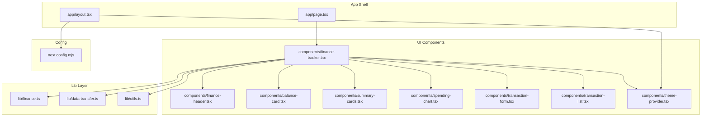
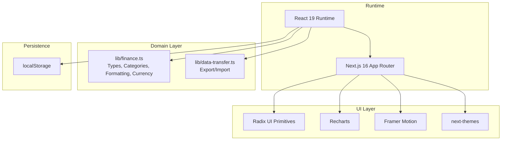
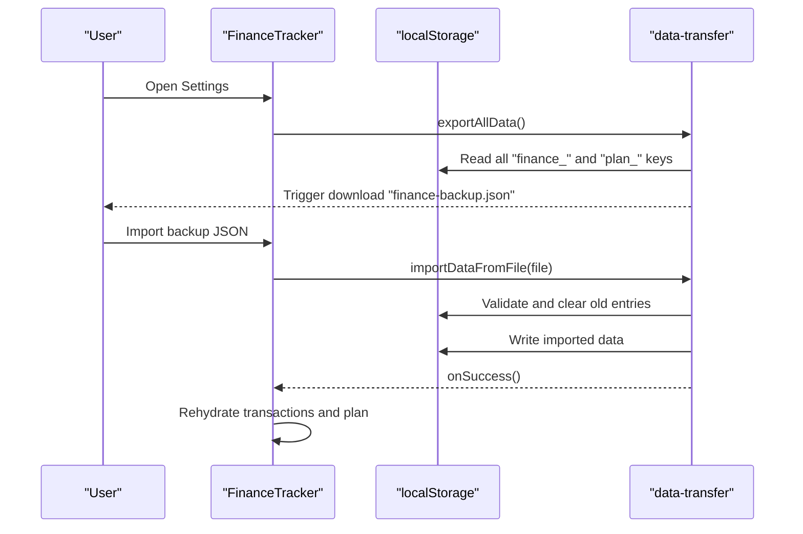
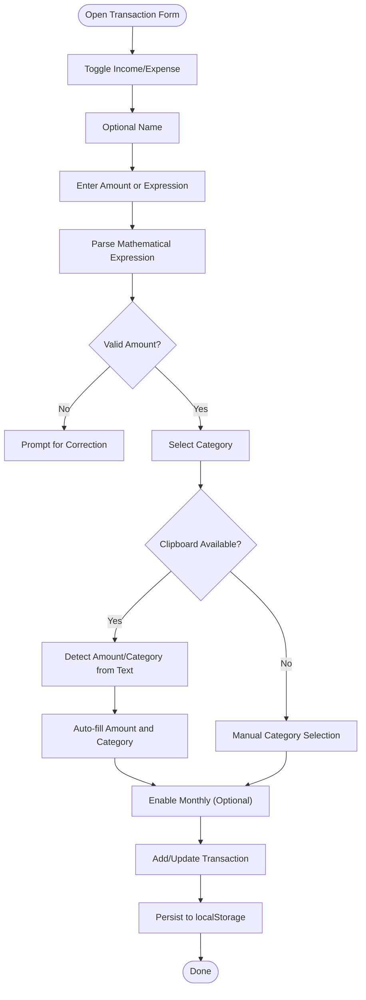
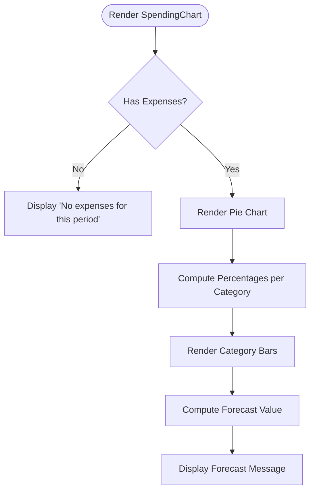
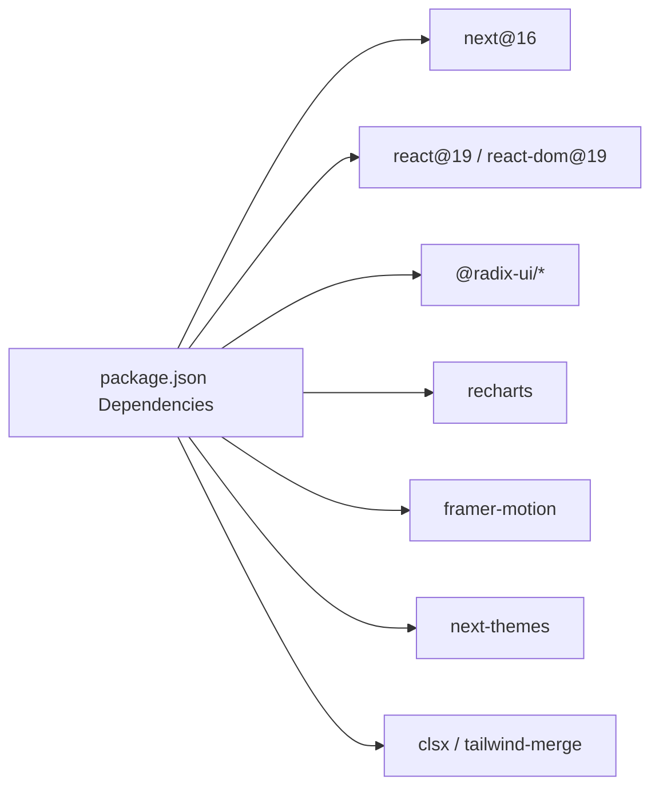

# Project Overview

<cite>
**Referenced Files in This Document**
- [package.json](file://package.json)
- [next.config.mjs](file://next.config.mjs)
- [app/layout.tsx](file://app/layout.tsx)
- [app/page.tsx](file://app/page.tsx)
- [lib/finance.ts](file://lib/finance.ts)
- [lib/data-transfer.ts](file://lib/data-transfer.ts)
- [lib/utils.ts](file://lib/utils.ts)
- [components/theme-provider.tsx](file://components/theme-provider.tsx)
- [components/finance-tracker.tsx](file://components/finance-tracker.tsx)
- [components/finance-header.tsx](file://components/finance-header.tsx)
- [components/balance-card.tsx](file://components/balance-card.tsx)
- [components/summary-cards.tsx](file://components/summary-cards.tsx)
- [components/spending-chart.tsx](file://components/spending-chart.tsx)
- [components/transaction-form.tsx](file://components/transaction-form.tsx)
- [components/transaction-list.tsx](file://components/transaction-list.tsx)
</cite>

## Table of Contents
1. [Introduction](#introduction)
2. [Project Structure](#project-structure)
3. [Core Components](#core-components)
4. [Architecture Overview](#architecture-overview)
5. [Detailed Component Analysis](#detailed-component-analysis)
6. [Dependency Analysis](#dependency-analysis)
7. [Performance Considerations](#performance-considerations)
8. [Troubleshooting Guide](#troubleshooting-guide)
9. [Conclusion](#conclusion)

## Introduction
finTracker is a personal finance management application designed to help users track monthly income and expenses with intelligent categorization, real-time transaction logging, financial visualization, and local-first data persistence. The application emphasizes a mobile-first, user-centric experience with a dark-themed UI optimized for readability and accessibility. It supports multiple currencies and provides forecasting insights to help users stay on top of their finances.

Key value propositions:
- Real-time transaction logging with smart parsing and quick templates
- Financial visualization through interactive charts and summary cards
- Local-first data persistence with robust import/export capabilities
- Cross-device synchronization via portable backups (local storage keys)
- Intelligent categorization and recurring transaction templates
- Forecasting to estimate end-of-month balances based on current spending trends

Target audience:
- Individuals seeking a lightweight, privacy-focused personal finance tracker
- Users who prefer local data storage and manual backup/restore workflows
- Anyone needing a straightforward way to monitor monthly income and expenses with minimal friction

## Project Structure
The project follows a Next.js 16 app directory structure with a clear separation of concerns:
- app/: Application shell, metadata, viewport configuration, and root page
- components/: Reusable UI components and feature-specific modules
- hooks/: Shared hooks for mobile detection and toast notifications
- lib/: Business logic, data transfer utilities, and shared types
- public/: Static assets (icons, etc.)
- styles/: Global CSS and Tailwind configuration

**Diagram sources**
- [app/layout.tsx:1-53](file://app/layout.tsx#L1-L53)
- [app/page.tsx:1-6](file://app/page.tsx#L1-L6)
- [components/finance-tracker.tsx:1-907](file://components/finance-tracker.tsx#L1-L907)
- [components/finance-header.tsx:1-129](file://components/finance-header.tsx#L1-L129)
- [components/balance-card.tsx:1-80](file://components/balance-card.tsx#L1-L80)
- [components/summary-cards.tsx:1-50](file://components/summary-cards.tsx#L1-L50)
- [components/spending-chart.tsx:1-96](file://components/spending-chart.tsx#L1-L96)
- [components/transaction-form.tsx:1-401](file://components/transaction-form.tsx#L1-L401)
- [components/transaction-list.tsx:1-92](file://components/transaction-list.tsx#L1-L92)
- [components/theme-provider.tsx:1-12](file://components/theme-provider.tsx#L1-L12)
- [lib/finance.ts:1-122](file://lib/finance.ts#L1-L122)
- [lib/data-transfer.ts:1-115](file://lib/data-transfer.ts#L1-L115)
- [lib/utils.ts:1-7](file://lib/utils.ts#L1-L7)
- [next.config.mjs:1-12](file://next.config.mjs#L1-L12)

**Section sources**
- [app/layout.tsx:1-53](file://app/layout.tsx#L1-L53)
- [app/page.tsx:1-6](file://app/page.tsx#L1-L6)
- [next.config.mjs:1-12](file://next.config.mjs#L1-L12)

## Core Components
- FinanceTracker: Orchestrates state, persistence, and UI composition. Manages transactions, balances, plans, recurring templates, quick templates, and currency selection. Implements month navigation, history view, and settings modal.
- FinanceHeader: Provides month/year navigation, history toggle, and settings access.
- BalanceCard: Displays global balance (card + cash), individual balances, and currency selector.
- SummaryCards: Shows total income and expenses for the selected period.
- SpendingChart: Renders an interactive pie chart of expense categories with percentage bars and forecasting.
- TransactionForm: Handles amount input, category selection, smart paste, math expression evaluation, quick templates, and recurring transaction creation.
- TransactionList: Lists transactions with edit/delete actions and category emojis.
- ThemeProvider: Wraps the app with theme switching capabilities.
- Finance utilities: Define categories, currency conversion, formatting, and date helpers.
- Data transfer: Export/import functionality for backup and restore.

**Section sources**
- [components/finance-tracker.tsx:1-907](file://components/finance-tracker.tsx#L1-L907)
- [components/finance-header.tsx:1-129](file://components/finance-header.tsx#L1-L129)
- [components/balance-card.tsx:1-80](file://components/balance-card.tsx#L1-L80)
- [components/summary-cards.tsx:1-50](file://components/summary-cards.tsx#L1-L50)
- [components/spending-chart.tsx:1-96](file://components/spending-chart.tsx#L1-L96)
- [components/transaction-form.tsx:1-401](file://components/transaction-form.tsx#L1-L401)
- [components/transaction-list.tsx:1-92](file://components/transaction-list.tsx#L1-L92)
- [components/theme-provider.tsx:1-12](file://components/theme-provider.tsx#L1-L12)
- [lib/finance.ts:1-122](file://lib/finance.ts#L1-L122)
- [lib/data-transfer.ts:1-115](file://lib/data-transfer.ts#L1-L115)

## Architecture Overview
The application uses a client-side-first architecture built on Next.js 16 with React 19. State is managed locally with React hooks and persisted to localStorage. UI components are composed using Radix UI primitives and styled with Tailwind CSS. Charts are rendered with Recharts, and animations leverage Framer Motion. Internationalization is handled via currency formatting and locale-aware number formatting.

**Diagram sources**
- [package.json:11-61](file://package.json#L11-L61)
- [components/finance-tracker.tsx:1-907](file://components/finance-tracker.tsx#L1-L907)
- [lib/finance.ts:1-122](file://lib/finance.ts#L1-L122)
- [lib/data-transfer.ts:1-115](file://lib/data-transfer.ts#L1-L115)

**Section sources**
- [package.json:11-61](file://package.json#L11-L61)
- [components/finance-tracker.tsx:1-907](file://components/finance-tracker.tsx#L1-L907)

## Detailed Component Analysis

### Mobile-First Design Philosophy
- The app targets a maximum device width suitable for phones and uses viewport configuration to disable user scaling for a consistent layout.
- The UI relies on bottom sheets and touch-friendly controls, with focused layouts optimized for single-hand operation.
- Typography and spacing are tuned for small screens, and interactive elements are sized for touch targets.

**Section sources**
- [app/layout.tsx:9-14](file://app/layout.tsx#L9-L14)
- [components/finance-tracker.tsx:360-428](file://components/finance-tracker.tsx#L360-L428)

### Local-First Data Persistence Strategy
- All data is stored in localStorage under deterministic keys:
  - Monthly transactions: "finance_<year>_<month>"
  - Monthly plans: "plan_<year>_<month>"
  - Balances: "balances_v1"
  - Recurring templates: "recurring_transactions_v1"
  - Quick templates: "quick_templates_v1"
  - Active currency: "active_currency_v1"
- On startup, the app hydrates state from localStorage and persists updates reactively.
- Import/Export:
  - Export: Serializes all finance and plan entries into a single JSON file.
  - Import: Validates the backup format, clears existing entries, and writes imported data.

**Diagram sources**
- [components/finance-tracker.tsx:430-458](file://components/finance-tracker.tsx#L430-L458)
- [lib/data-transfer.ts:14-54](file://lib/data-transfer.ts#L14-L54)
- [lib/data-transfer.ts:56-114](file://lib/data-transfer.ts#L56-L114)

**Section sources**
- [components/finance-tracker.tsx:87-172](file://components/finance-tracker.tsx#L87-L172)
- [lib/data-transfer.ts:1-115](file://lib/data-transfer.ts#L1-L115)

### Real-Time Transaction Logging and Intelligence
- Amount parsing supports decimal input normalization and mathematical expressions.
- Smart paste detects amounts and categories from clipboard text using keyword matching.
- Quick templates enable rapid entry of frequent transactions.
- Recurring templates generate monthly transactions automatically when missing.

**Diagram sources**
- [components/transaction-form.tsx:21-54](file://components/transaction-form.tsx#L21-L54)
- [components/transaction-form.tsx:159-171](file://components/transaction-form.tsx#L159-L171)
- [components/transaction-form.tsx:173-190](file://components/transaction-form.tsx#L173-L190)
- [components/finance-tracker.tsx:207-249](file://components/finance-tracker.tsx#L207-L249)

**Section sources**
- [components/transaction-form.tsx:1-401](file://components/transaction-form.tsx#L1-L401)
- [components/finance-tracker.tsx:200-249](file://components/finance-tracker.tsx#L200-L249)

### Financial Visualization and Forecasting
- SpendingChart displays expense distribution as a pie chart with category bars and percentages.
- SummaryCards show total income and expenses for the selected period.
- Forecasting computes projected remaining funds based on average daily spending and days left in the month.

**Diagram sources**
- [components/spending-chart.tsx:16-95](file://components/spending-chart.tsx#L16-L95)
- [components/summary-cards.tsx:10-49](file://components/summary-cards.tsx#L10-L49)
- [components/finance-tracker.tsx:190-198](file://components/finance-tracker.tsx#L190-L198)

**Section sources**
- [components/spending-chart.tsx:1-96](file://components/spending-chart.tsx#L1-L96)
- [components/summary-cards.tsx:1-50](file://components/summary-cards.tsx#L1-L50)
- [components/finance-tracker.tsx:190-198](file://components/finance-tracker.tsx#L190-L198)

### Cross-Device Synchronization
- Synchronization is achieved via portable backups. Users export a JSON file containing all monthly transactions and plans, then import it on another device.
- The import process validates the backup format and replaces local data atomically.

**Section sources**
- [lib/data-transfer.ts:1-115](file://lib/data-transfer.ts#L1-L115)
- [components/finance-tracker.tsx:451-457](file://components/finance-tracker.tsx#L451-L457)

### Internationalization and Currency Support
- The application defines multiple supported currencies and provides conversion helpers.
- Amounts are formatted according to locale-specific conventions and currency symbols.
- Users can switch the active currency, and templates are stored in base UAH for consistent rendering.

**Section sources**
- [lib/finance.ts:40-121](file://lib/finance.ts#L40-L121)
- [components/balance-card.tsx:55-76](file://components/balance-card.tsx#L55-L76)
- [components/finance-tracker.tsx:73-167](file://components/finance-tracker.tsx#L73-L167)

## Dependency Analysis
The project leverages a modern frontend stack with clear boundaries between UI, domain logic, and persistence.

**Diagram sources**
- [package.json:11-61](file://package.json#L11-L61)

**Section sources**
- [package.json:11-61](file://package.json#L11-L61)

## Performance Considerations
- Client-side rendering with React 19 ensures fast interactivity and smooth animations.
- Local storage usage minimizes network overhead; however, large datasets may impact hydration performance. Consider batching updates and deferring heavy computations to idle callbacks.
- Chart rendering is optimized with responsive containers and minimal re-renders; avoid unnecessary prop changes to reduce layout thrashing.
- Image optimization is disabled to maintain simplicity; asset sizes should remain small for mobile networks.

[No sources needed since this section provides general guidance]

## Troubleshooting Guide
Common issues and resolutions:
- Backup import fails: Ensure the file is a valid version 1 backup and contains expected keys. Validate that all entries are arrays of transaction-like objects.
- Amount parsing errors: Verify decimal separators and mathematical expressions conform to accepted formats.
- Currency mismatch: Confirm active currency is set correctly; templates are stored in base UAH and converted on render.
- Missing data after import: Confirm the import succeeded and that localStorage keys were written; check browser storage limits.

**Section sources**
- [lib/data-transfer.ts:63-114](file://lib/data-transfer.ts#L63-L114)
- [components/transaction-form.tsx:21-31](file://components/transaction-form.tsx#L21-L31)
- [components/finance-tracker.tsx:164-172](file://components/finance-tracker.tsx#L164-L172)

## Conclusion
finTracker delivers a streamlined, privacy-first personal finance experience with a focus on ease of use and insightful visualization. Its mobile-first design, intelligent categorization, and robust import/export workflows make it practical for everyday budgeting. By combining React 19, Next.js 16, Radix UI, and Recharts, the application achieves a responsive, accessible interface while maintaining a clean separation of concerns and efficient local persistence.