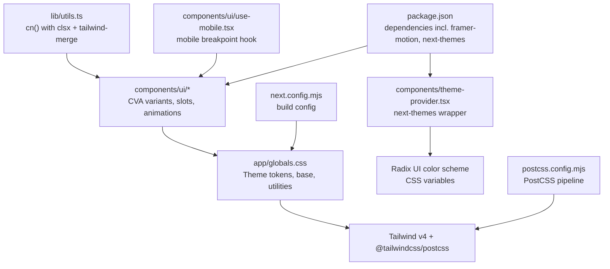
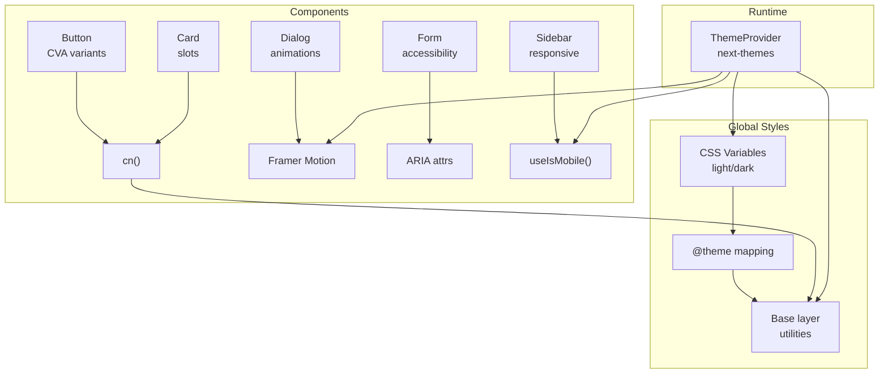
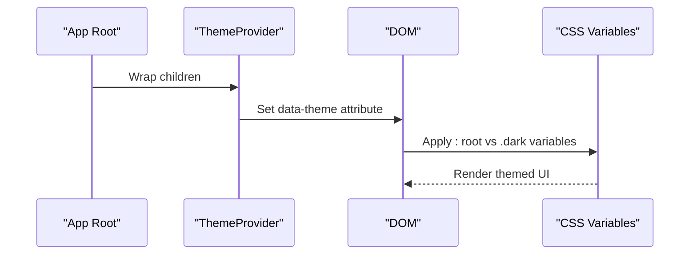
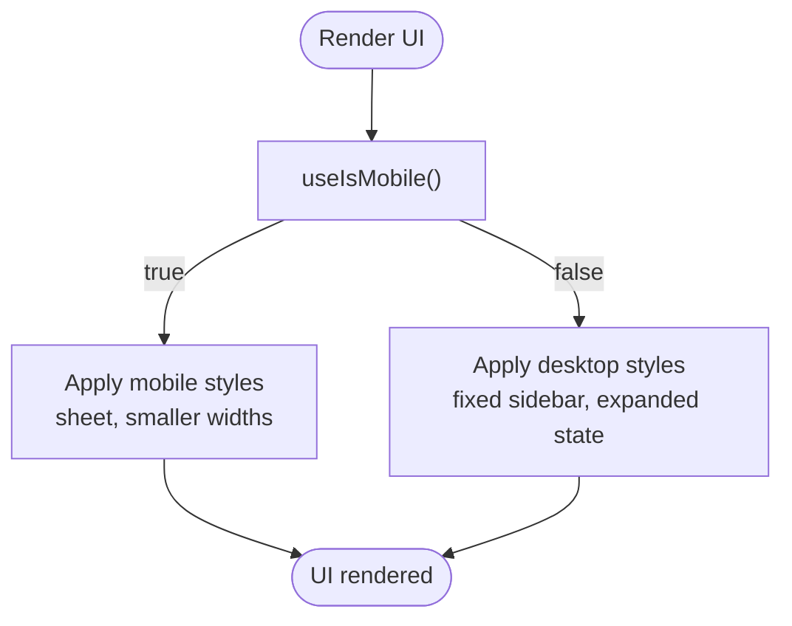
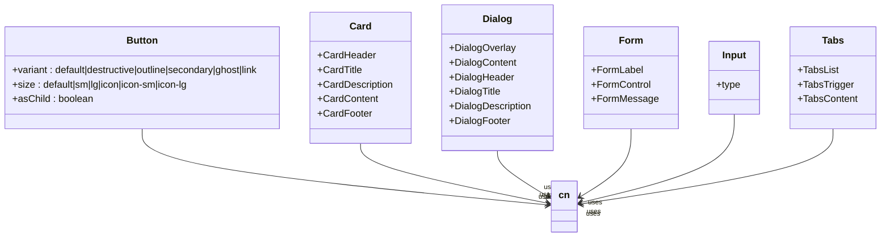
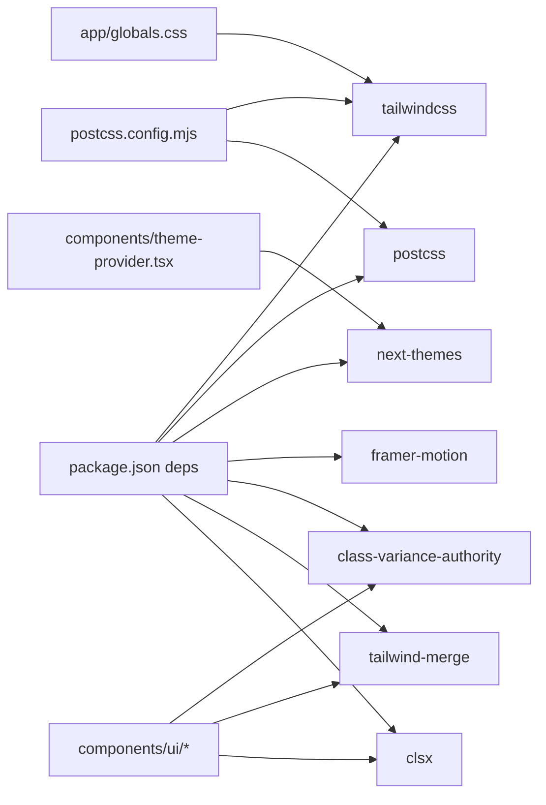

# Styling and Theming

<cite>
**Referenced Files in This Document**
- [app/globals.css](file://app/globals.css)
- [components/theme-provider.tsx](file://components/theme-provider.tsx)
- [components/ui/button.tsx](file://components/ui/button.tsx)
- [components/ui/card.tsx](file://components/ui/card.tsx)
- [components/ui/dialog.tsx](file://components/ui/dialog.tsx)
- [components/ui/form.tsx](file://components/ui/form.tsx)
- [components/ui/input.tsx](file://components/ui/input.tsx)
- [components/ui/label.tsx](file://components/ui/label.tsx)
- [components/ui/sidebar.tsx](file://components/ui/sidebar.tsx)
- [components/ui/tabs.tsx](file://components/ui/tabs.tsx)
- [components/ui/use-mobile.tsx](file://components/ui/use-mobile.tsx)
- [lib/utils.ts](file://lib/utils.ts)
- [next.config.mjs](file://next.config.mjs)
- [postcss.config.mjs](file://postcss.config.mjs)
- [package.json](file://package.json)
</cite>

## Table of Contents
1. [Introduction](#introduction)
2. [Project Structure](#project-structure)
3. [Core Components](#core-components)
4. [Architecture Overview](#architecture-overview)
5. [Detailed Component Analysis](#detailed-component-analysis)
6. [Dependency Analysis](#dependency-analysis)
7. [Performance Considerations](#performance-considerations)
8. [Troubleshooting Guide](#troubleshooting-guide)
9. [Conclusion](#conclusion)
10. [Appendices](#appendices)

## Introduction
This document explains finTracker’s styling and theming system. It covers Tailwind CSS configuration and utility-first styling, the dark/light theme implementation via next-themes and Radix UI color schemes, responsive design with a mobile-first approach, component styling patterns, CSS-in-JS integration, and animation support with Framer Motion. It also provides guidelines for maintaining design consistency, customizing themes, and implementing new styling patterns, along with accessibility considerations such as color contrast and responsive behavior.

## Project Structure
The styling system is organized around:
- Global CSS and theme tokens
- Utility-first Tailwind classes
- Component-level UI primitives
- Theme provider integration
- Responsive helpers and breakpoints
- Animation and motion utilities

**Diagram sources**
- [app/globals.css:1-142](file://app/globals.css#L1-L142)
- [components/theme-provider.tsx:1-12](file://components/theme-provider.tsx#L1-L12)
- [lib/utils.ts:1-7](file://lib/utils.ts#L1-L7)
- [components/ui/use-mobile.tsx:1-20](file://components/ui/use-mobile.tsx#L1-L20)
- [postcss.config.mjs:1-9](file://postcss.config.mjs#L1-L9)
- [next.config.mjs:1-12](file://next.config.mjs#L1-L12)
- [package.json:1-73](file://package.json#L1-L73)

**Section sources**
- [app/globals.css:1-142](file://app/globals.css#L1-L142)
- [components/theme-provider.tsx:1-12](file://components/theme-provider.tsx#L1-L12)
- [lib/utils.ts:1-7](file://lib/utils.ts#L1-L7)
- [components/ui/use-mobile.tsx:1-20](file://components/ui/use-mobile.tsx#L1-L20)
- [postcss.config.mjs:1-9](file://postcss.config.mjs#L1-L9)
- [next.config.mjs:1-12](file://next.config.mjs#L1-L12)
- [package.json:1-73](file://package.json#L1-L73)

## Core Components
- Theme tokens and CSS variables define a consistent palette and spacing scale for light and dark modes.
- next-themes manages theme persistence and switching, integrating with Radix UI color schemes.
- Tailwind v4 powers utility-first styling with custom variants and layering.
- Component library uses class-variance-authority (CVA) for variant composition and clsx/tailwind-merge for class merging.
- PostCSS pipeline compiles Tailwind and animations.
- Mobile-first responsive utilities and a breakpoint hook enable adaptive layouts.

**Section sources**
- [app/globals.css:1-142](file://app/globals.css#L1-L142)
- [components/theme-provider.tsx:1-12](file://components/theme-provider.tsx#L1-L12)
- [package.json:11-61](file://package.json#L11-L61)
- [lib/utils.ts:1-7](file://lib/utils.ts#L1-L7)

## Architecture Overview
The theming and styling architecture ties together global tokens, component variants, and runtime theme switching.

**Diagram sources**
- [app/globals.css:6-116](file://app/globals.css#L6-L116)
- [components/ui/button.tsx:7-37](file://components/ui/button.tsx#L7-L37)
- [components/ui/card.tsx:5-16](file://components/ui/card.tsx#L5-L16)
- [components/ui/dialog.tsx:33-81](file://components/ui/dialog.tsx#L33-L81)
- [components/ui/form.tsx:90-105](file://components/ui/form.tsx#L90-L105)
- [components/ui/sidebar.tsx:56-152](file://components/ui/sidebar.tsx#L56-L152)
- [components/theme-provider.tsx:9-11](file://components/theme-provider.tsx#L9-L11)
- [lib/utils.ts:4-6](file://lib/utils.ts#L4-L6)

## Detailed Component Analysis

### Tailwind CSS Configuration and Global Tokens
- CSS custom properties define color tokens for light and dark modes, including backgrounds, foregrounds, primary/accent palettes, borders, inputs, rings, and chart colors.
- A custom dark variant targets nested selectors for deep descendant theming.
- Tailwind v4 theme mapping exposes CSS variables as Tailwind color families and radius scales.
- Base layer applies global borders, outline rings, and body background/foreground.
- Utilities layer defines reusable helpers such as scrollbar hiding and fade edges.

Implementation highlights:
- Theme tokens and variants: [app/globals.css:6-116](file://app/globals.css#L6-L116)
- Base layer and utilities: [app/globals.css:118-142](file://app/globals.css#L118-L142)

**Section sources**
- [app/globals.css:1-142](file://app/globals.css#L1-L142)

### Dark/Light Theme Implementation with next-themes and Radix UI Color Schemes
- ThemeProvider wraps the app to manage theme state and persistence.
- CSS variables act as Radix UI color schemes, enabling semantic theming across components.
- The dark selector updates all tokens for dark mode.

Implementation highlights:
- Provider wrapper: [components/theme-provider.tsx:9-11](file://components/theme-provider.tsx#L9-L11)
- Light/dark tokens: [app/globals.css:6-75](file://app/globals.css#L6-L75)

**Diagram sources**
- [components/theme-provider.tsx:9-11](file://components/theme-provider.tsx#L9-L11)
- [app/globals.css:42-75](file://app/globals.css#L42-L75)

**Section sources**
- [components/theme-provider.tsx:1-12](file://components/theme-provider.tsx#L1-L12)
- [app/globals.css:1-142](file://app/globals.css#L1-L142)

### Responsive Design Principles and Breakpoints
- Mobile-first approach: base styles target small screens; modifiers apply at larger breakpoints.
- A dedicated hook detects mobile viewport width using a breakpoint constant.
- Sidebar adapts to mobile via a sheet and respects the mobile breakpoint for behavior toggles.

Implementation highlights:
- Breakpoint hook: [components/ui/use-mobile.tsx:3-19](file://components/ui/use-mobile.tsx#L3-L19)
- Sidebar mobile/offcanvas behavior: [components/ui/sidebar.tsx:183-206](file://components/ui/sidebar.tsx#L183-L206)

**Diagram sources**
- [components/ui/use-mobile.tsx:5-19](file://components/ui/use-mobile.tsx#L5-L19)
- [components/ui/sidebar.tsx:183-206](file://components/ui/sidebar.tsx#L183-L206)

**Section sources**
- [components/ui/use-mobile.tsx:1-20](file://components/ui/use-mobile.tsx#L1-L20)
- [components/ui/sidebar.tsx:183-206](file://components/ui/sidebar.tsx#L183-L206)

### Component Styling Patterns and CSS-in-JS Integration
- CVA variants encapsulate component variants and sizes, composing Tailwind classes safely.
- cn() merges classes with clsx and tailwind-merge to avoid conflicts.
- Radix UI primitives integrate with data-slot attributes for consistent styling and accessibility.
- Animations leverage Framer Motion classes (e.g., animate-in/out) for overlay transitions.

Examples:
- Button with variants and sizes: [components/ui/button.tsx:7-37](file://components/ui/button.tsx#L7-L37)
- Card with slots and responsive grid: [components/ui/card.tsx:5-29](file://components/ui/card.tsx#L5-L29)
- Dialog with overlay animations: [components/ui/dialog.tsx:33-81](file://components/ui/dialog.tsx#L33-L81)
- Form label and error state: [components/ui/form.tsx:90-105](file://components/ui/form.tsx#L90-L105)
- Input focus and invalid states: [components/ui/input.tsx:5-19](file://components/ui/input.tsx#L5-L19)
- Tabs with active state styling: [components/ui/tabs.tsx:21-51](file://components/ui/tabs.tsx#L21-L51)

**Diagram sources**
- [components/ui/button.tsx:39-60](file://components/ui/button.tsx#L39-L60)
- [components/ui/card.tsx:5-92](file://components/ui/card.tsx#L5-L92)
- [components/ui/dialog.tsx:9-143](file://components/ui/dialog.tsx#L9-L143)
- [components/ui/form.tsx:19-167](file://components/ui/form.tsx#L19-L167)
- [components/ui/input.tsx:5-21](file://components/ui/input.tsx#L5-L21)
- [components/ui/tabs.tsx:8-66](file://components/ui/tabs.tsx#L8-L66)
- [lib/utils.ts:4-6](file://lib/utils.ts#L4-L6)

**Section sources**
- [components/ui/button.tsx:1-61](file://components/ui/button.tsx#L1-L61)
- [components/ui/card.tsx:1-93](file://components/ui/card.tsx#L1-L93)
- [components/ui/dialog.tsx:1-144](file://components/ui/dialog.tsx#L1-L144)
- [components/ui/form.tsx:1-168](file://components/ui/form.tsx#L1-L168)
- [components/ui/input.tsx:1-22](file://components/ui/input.tsx#L1-L22)
- [components/ui/tabs.tsx:1-67](file://components/ui/tabs.tsx#L1-L67)
- [lib/utils.ts:1-7](file://lib/utils.ts#L1-L7)

### Animation Support with Framer Motion
- Animate utilities are imported and applied to overlay transitions in dialogs to achieve smooth appear/disappear effects.
- Motion classes integrate with Tailwind classes for consistent animation timing and easing.

Implementation highlights:
- Overlay animations: [components/ui/dialog.tsx:40-47](file://components/ui/dialog.tsx#L40-L47)

**Section sources**
- [components/ui/dialog.tsx:1-144](file://components/ui/dialog.tsx#L1-L144)
- [package.json:47](file://package.json#L47)

### Accessibility Considerations
- Focus states: consistent ring and border focus indicators for inputs and interactive elements.
- Error states: form labels and inputs reflect validation errors with explicit color and ARIA attributes.
- Semantic labeling: labels and form controls use proper associations for assistive technologies.
- Contrast: theme tokens are defined with sufficient contrast per mode; verify against WCAG guidelines during customization.

Implementation highlights:
- Focus-visible rings: [components/ui/button.tsx:8](file://components/ui/button.tsx#L8), [components/ui/input.tsx:10-13](file://components/ui/input.tsx#L10-L13)
- Form error state: [components/ui/form.tsx:90-105](file://components/ui/form.tsx#L90-L105), [components/ui/label.tsx:8-22](file://components/ui/label.tsx#L8-L22)

**Section sources**
- [components/ui/button.tsx:1-61](file://components/ui/button.tsx#L1-L61)
- [components/ui/input.tsx:1-22](file://components/ui/input.tsx#L1-L22)
- [components/ui/form.tsx:1-168](file://components/ui/form.tsx#L1-L168)
- [components/ui/label.tsx:1-25](file://components/ui/label.tsx#L1-L25)

## Dependency Analysis
The styling system relies on Tailwind v4, PostCSS, next-themes, and Radix UI color schemes. Component libraries use CVA and cn() for robust class composition.

**Diagram sources**
- [package.json:11-61](file://package.json#L11-L61)
- [postcss.config.mjs:1-9](file://postcss.config.mjs#L1-L9)
- [app/globals.css:1-2](file://app/globals.css#L1-L2)
- [components/ui/button.tsx:3](file://components/ui/button.tsx#L3)
- [lib/utils.ts:1-2](file://lib/utils.ts#L1-L2)
- [components/theme-provider.tsx:5-7](file://components/theme-provider.tsx#L5-L7)

**Section sources**
- [package.json:1-73](file://package.json#L1-L73)
- [postcss.config.mjs:1-9](file://postcss.config.mjs#L1-L9)
- [app/globals.css:1-142](file://app/globals.css#L1-L142)
- [lib/utils.ts:1-7](file://lib/utils.ts#L1-L7)
- [components/ui/button.tsx:1-61](file://components/ui/button.tsx#L1-L61)
- [components/theme-provider.tsx:1-12](file://components/theme-provider.tsx#L1-L12)

## Performance Considerations
- Prefer utility-first classes over ad-hoc CSS to reduce bundle size and increase maintainability.
- Use cn() to merge classes efficiently and avoid redundant Tailwind rules.
- Keep theme tokens centralized to minimize repeated overrides.
- Limit heavy animations to essential interactions to preserve responsiveness.

## Troubleshooting Guide
- Theme not applying:
  - Verify the ThemeProvider wraps the app and that data-theme is set on the root element.
  - Confirm CSS variables are present in :root and .dark blocks.
- Dark mode mismatch:
  - Ensure the dark selector targets descendants consistently.
  - Check that next-themes is configured to respect system preference if desired.
- Responsive issues:
  - Validate useIsMobile returns the expected boolean at the intended breakpoint.
  - Confirm Tailwind breakpoints and responsive modifiers align with expectations.
- Focus or accessibility problems:
  - Inspect focus-visible rings and ARIA attributes on form controls.
  - Ensure labels associate with inputs and messages are announced.

**Section sources**
- [components/theme-provider.tsx:9-11](file://components/theme-provider.tsx#L9-L11)
- [app/globals.css:42-75](file://app/globals.css#L42-L75)
- [components/ui/use-mobile.tsx:5-19](file://components/ui/use-mobile.tsx#L5-L19)
- [components/ui/form.tsx:90-105](file://components/ui/form.tsx#L90-L105)

## Conclusion
finTracker’s styling system combines Tailwind v4, CSS variables, next-themes, and Radix UI color schemes to deliver a consistent, themeable, and accessible design system. Component primitives built with CVA and cn() ensure predictable styling, while responsive utilities and a mobile breakpoint hook support a mobile-first approach. Animations from Framer Motion enhance UX transitions. Following the guidelines below will help maintain visual consistency and simplify future customization.

## Appendices

### Guidelines for Maintaining Design Consistency
- Centralize theme tokens in global CSS variables; update both light and dark modes together.
- Use CVA for component variants and sizes; compose classes via cn().
- Prefer semantic color tokens (e.g., primary, destructive) over hardcoded colors.
- Keep base layer minimal; add utilities sparingly and reuse patterns.

### Customizing Themes
- Modify CSS variables in :root and .dark to adjust palettes and radii.
- Add new tokens under @theme mapping for Tailwind integration.
- Extend component variants in CVA where appropriate.

### Implementing New Styling Patterns
- Define utility classes in the utilities layer when reusable.
- Introduce new component variants using CVA and export variant props.
- Use data-slot attributes for consistent targeting and accessibility.

### Examples
- Theme customization example path: [app/globals.css:6-116](file://app/globals.css#L6-L116)
- Component styling extension example path: [components/ui/button.tsx:7-37](file://components/ui/button.tsx#L7-L37)
- Best practices reference: [lib/utils.ts:4-6](file://lib/utils.ts#L4-L6), [components/ui/dialog.tsx:40-47](file://components/ui/dialog.tsx#L40-L47)