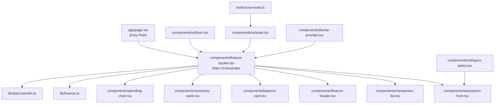
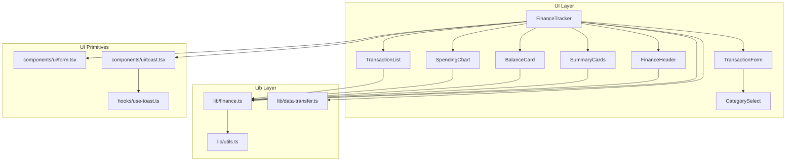
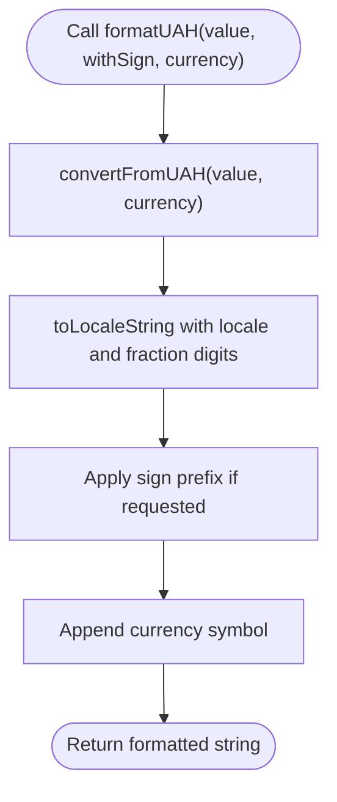
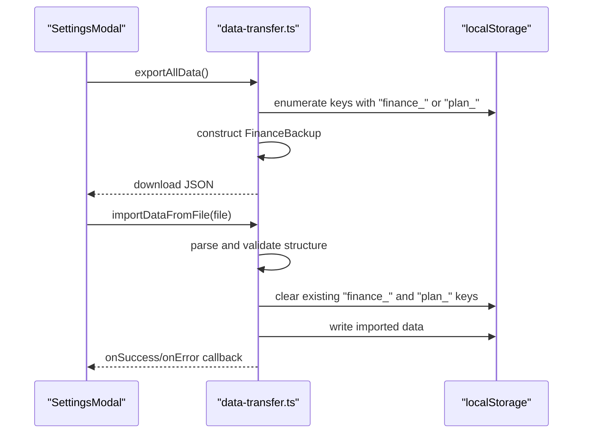
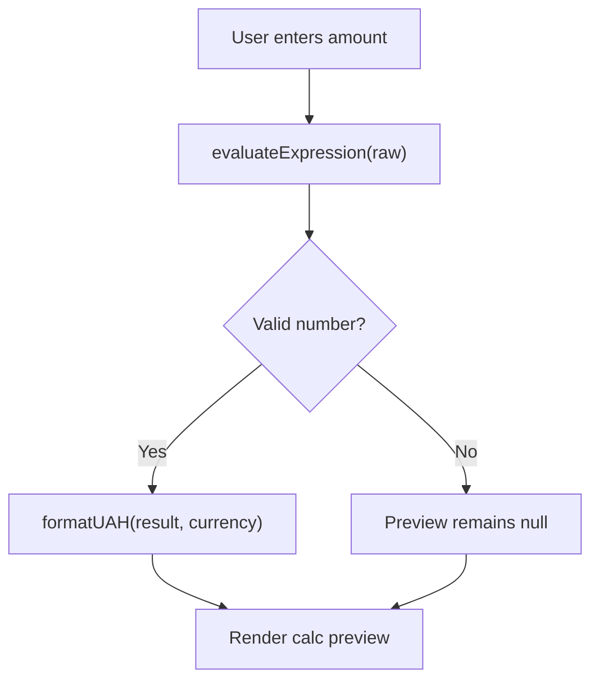
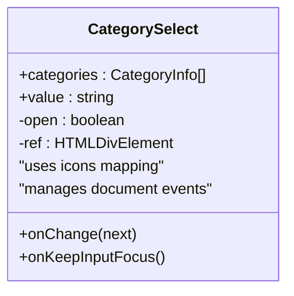
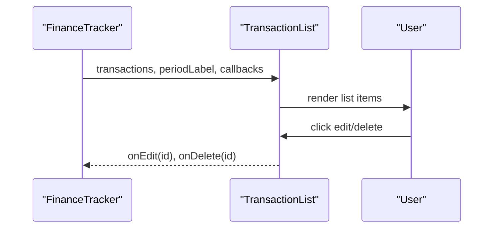
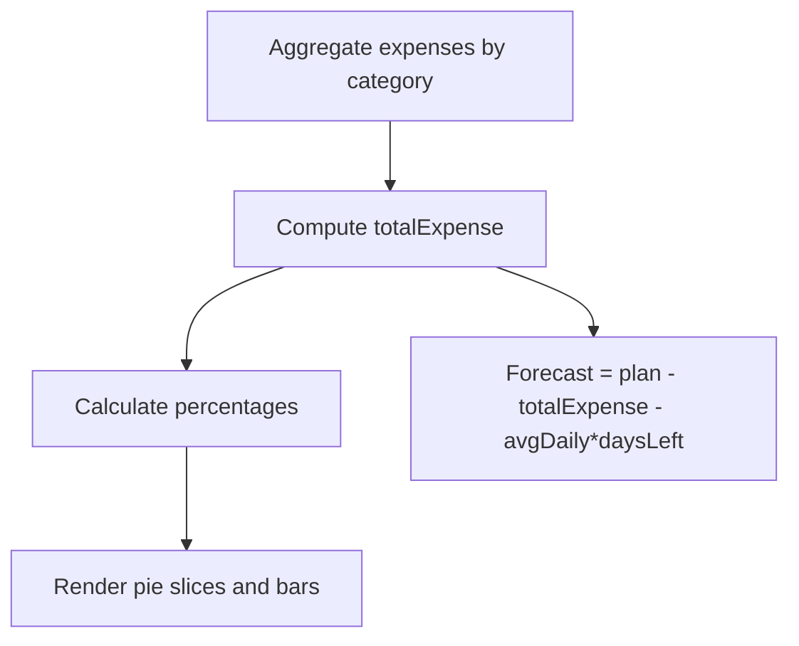
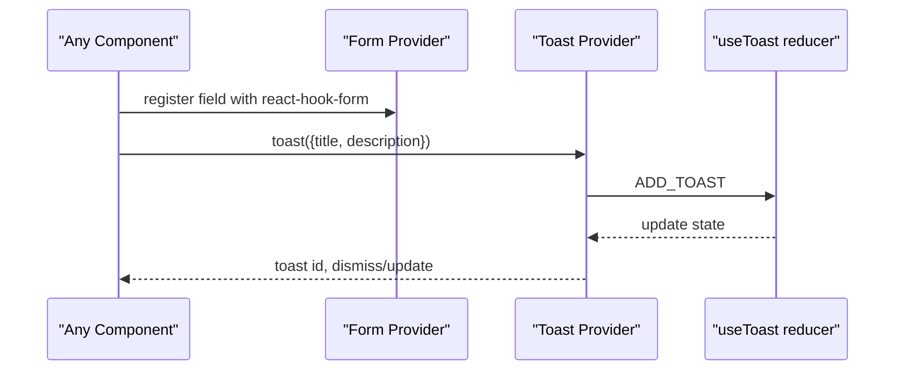
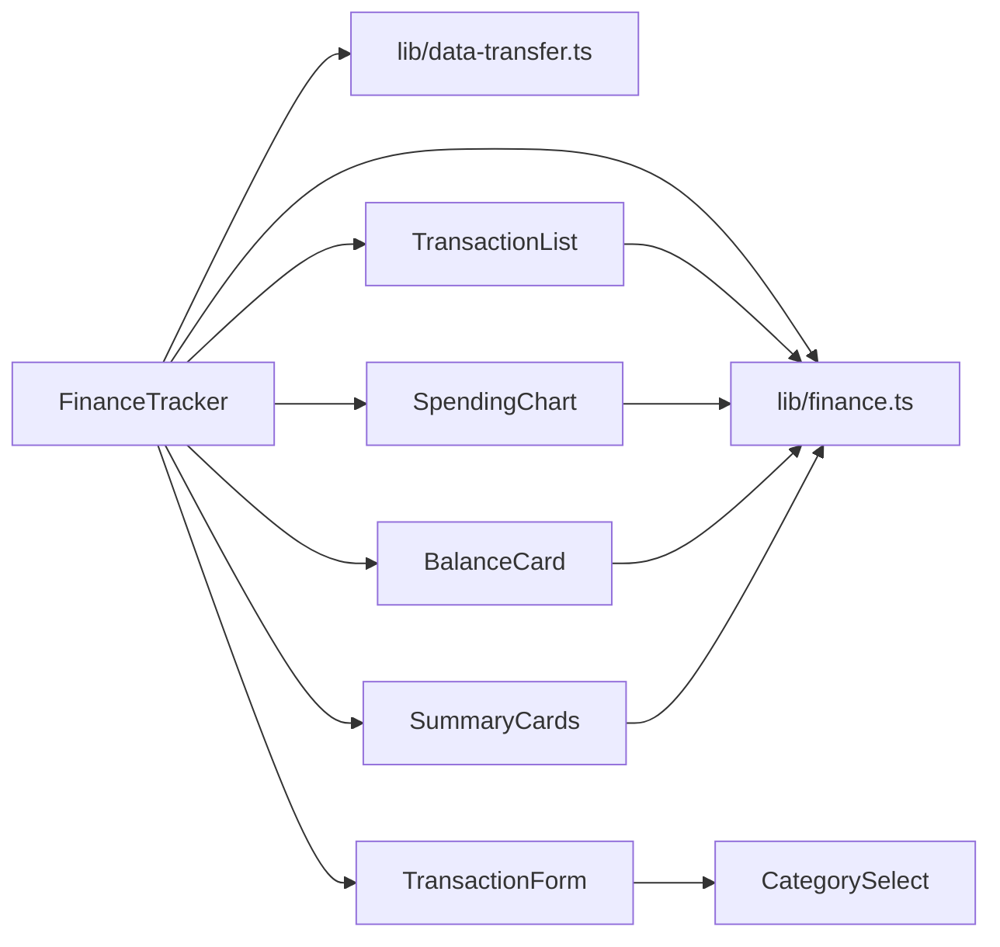

# Testing and Debugging

<cite>
**Referenced Files in This Document**
- [package.json](file://package.json)
- [app/page.tsx](file://app/page.tsx)
- [components/finance-tracker.tsx](file://components/finance-tracker.tsx)
- [components/transaction-form.tsx](file://components/transaction-form.tsx)
- [components/transaction-list.tsx](file://components/transaction-list.tsx)
- [components/category-select.tsx](file://components/category-select.tsx)
- [components/finance-header.tsx](file://components/finance-header.tsx)
- [components/balance-card.tsx](file://components/balance-card.tsx)
- [components/summary-cards.tsx](file://components/summary-cards.tsx)
- [components/spending-chart.tsx](file://components/spending-chart.tsx)
- [components/theme-provider.tsx](file://components/theme-provider.tsx)
- [components/ui/form.tsx](file://components/ui/form.tsx)
- [components/ui/toast.tsx](file://components/ui/toast.tsx)
- [hooks/use-toast.ts](file://hooks/use-toast.ts)
- [lib/finance.ts](file://lib/finance.ts)
- [lib/data-transfer.ts](file://lib/data-transfer.ts)
- [lib/utils.ts](file://lib/utils.ts)
</cite>

## Table of Contents
1. [Introduction](#introduction)
2. [Project Structure](#project-structure)
3. [Core Components](#core-components)
4. [Architecture Overview](#architecture-overview)
5. [Detailed Component Analysis](#detailed-component-analysis)
6. [Dependency Analysis](#dependency-analysis)
7. [Performance Considerations](#performance-considerations)
8. [Troubleshooting Guide](#troubleshooting-guide)
9. [Conclusion](#conclusion)
10. [Appendices](#appendices)

## Introduction
This document provides comprehensive testing and debugging strategies tailored to finTracker. It covers unit testing for financial calculations and utilities, component testing for React UIs, form validation, and user interactions. It also outlines integration testing for data persistence, backup/restore, and cross-component communication. Practical debugging techniques, error handling, logging, performance testing, memory leak detection, and browser-specific diagnostics are included. Finally, it offers best practices for financial applications, robust validation, edge-case handling, and maintaining code quality as the application evolves.

## Project Structure
The application follows a component-driven architecture with a clear separation of concerns:
- Application entry renders the main FinanceTracker component.
- FinanceTracker orchestrates state, persistence, and UI composition.
- Utility libraries encapsulate financial logic and data transfer.
- UI primitives and components are modular and reusable.

**Diagram sources**
- [app/page.tsx:1-6](file://app/page.tsx#L1-L6)
- [components/finance-tracker.tsx:1-80](file://components/finance-tracker.tsx#L1-L80)
- [components/transaction-form.tsx:1-40](file://components/transaction-form.tsx#L1-L40)
- [components/transaction-list.tsx:1-15](file://components/transaction-list.tsx#L1-L15)
- [components/finance-header.tsx:1-20](file://components/finance-header.tsx#L1-L20)
- [components/balance-card.tsx:1-15](file://components/balance-card.tsx#L1-L15)
- [components/summary-cards.tsx:1-10](file://components/summary-cards.tsx#L1-L10)
- [components/spending-chart.tsx:1-16](file://components/spending-chart.tsx#L1-L16)
- [lib/finance.ts:1-20](file://lib/finance.ts#L1-L20)
- [lib/data-transfer.ts:1-15](file://lib/data-transfer.ts#L1-L15)
- [components/ui/form.tsx:1-20](file://components/ui/form.tsx#L1-L20)
- [components/ui/toast.tsx:1-10](file://components/ui/toast.tsx#L1-L10)
- [hooks/use-toast.ts:1-10](file://hooks/use-toast.ts#L1-L10)
- [components/category-select.tsx:1-20](file://components/category-select.tsx#L1-L20)
- [components/theme-provider.tsx:1-12](file://components/theme-provider.tsx#L1-L12)

**Section sources**
- [app/page.tsx:1-6](file://app/page.tsx#L1-L6)
- [components/finance-tracker.tsx:1-80](file://components/finance-tracker.tsx#L1-L80)

## Core Components
This section highlights core modules and their roles in testing and debugging:
- Financial utilities: currency conversion, formatting, categorization, and date helpers.
- Data transfer: backup and restore of localStorage data.
- UI components: form input parsing, category selection, transaction list rendering, charts, and summaries.
- Orchestration: state management, persistence, recurring templates, and cross-component communication.

Key responsibilities for testing:
- Unit tests for financial calculations and formatting.
- Component tests for form parsing, validation, and user interactions.
- Integration tests for localStorage persistence and backup/restore flows.
- Cross-component tests for state propagation and UI updates.

**Section sources**
- [lib/finance.ts:1-124](file://lib/finance.ts#L1-L124)
- [lib/data-transfer.ts:1-115](file://lib/data-transfer.ts#L1-L115)
- [components/transaction-form.tsx:1-448](file://components/transaction-form.tsx#L1-L448)
- [components/transaction-list.tsx:1-102](file://components/transaction-list.tsx#L1-L102)
- [components/spending-chart.tsx:1-96](file://components/spending-chart.tsx#L1-L96)
- [components/summary-cards.tsx:1-50](file://components/summary-cards.tsx#L1-L50)
- [components/balance-card.tsx:1-80](file://components/balance-card.tsx#L1-L80)
- [components/category-select.tsx:1-163](file://components/category-select.tsx#L1-L163)
- [components/finance-header.tsx:1-129](file://components/finance-header.tsx#L1-L129)

## Architecture Overview
The system is client-side focused with localStorage as the primary persistence layer. The main orchestration component manages state hydration, updates, and persistence. UI components are thin and rely on shared utilities for financial formatting and categorization.

**Diagram sources**
- [components/finance-tracker.tsx:57-476](file://components/finance-tracker.tsx#L57-L476)
- [components/transaction-form.tsx:103-448](file://components/transaction-form.tsx#L103-L448)
- [components/transaction-list.tsx:14-102](file://components/transaction-list.tsx#L14-L102)
- [components/spending-chart.tsx:16-96](file://components/spending-chart.tsx#L16-L96)
- [components/balance-card.tsx:11-80](file://components/balance-card.tsx#L11-L80)
- [components/summary-cards.tsx:10-50](file://components/summary-cards.tsx#L10-L50)
- [components/finance-header.tsx:20-129](file://components/finance-header.tsx#L20-L129)
- [components/category-select.tsx:44-163](file://components/category-select.tsx#L44-L163)
- [lib/finance.ts:1-124](file://lib/finance.ts#L1-L124)
- [lib/data-transfer.ts:1-115](file://lib/data-transfer.ts#L1-L115)
- [lib/utils.ts:1-7](file://lib/utils.ts#L1-L7)
- [components/ui/form.tsx:19-168](file://components/ui/form.tsx#L19-L168)
- [components/ui/toast.tsx:10-130](file://components/ui/toast.tsx#L10-L130)
- [hooks/use-toast.ts:1-192](file://hooks/use-toast.ts#L1-L192)

## Detailed Component Analysis

### Financial Utilities and Calculations
- Currency conversion and formatting: conversion rates, locale-aware formatting, plus/minus sign handling.
- Period helpers: month and plan key generation for localStorage.
- Category lookup and emoji resolution.
- Robust numeric parsing for expressions and raw amounts.

Recommended unit tests:
- Conversion correctness across currencies.
- Formatting boundaries (zero, negative, fractional).
- Parsing edge cases (expressions, commas vs decimals, invalid inputs).
- Period key generation and localization.

**Diagram sources**
- [lib/finance.ts:105-123](file://lib/finance.ts#L105-L123)

**Section sources**
- [lib/finance.ts:1-124](file://lib/finance.ts#L1-L124)

### Backup and Restore (Data Transfer)
- Export all localStorage entries prefixed with finance_/plan_ into a structured backup object.
- Import validates version, data shape, and writes to localStorage after clearing previous entries.
- Robust error handling with user feedback.

Recommended integration tests:
- Export/import roundtrip with valid and malformed data.
- Validation failures for wrong version/format.
- Edge cases: missing keys, NaN values, corrupted JSON.

**Diagram sources**
- [components/finance-tracker.tsx:466-473](file://components/finance-tracker.tsx#L466-L473)
- [lib/data-transfer.ts:14-54](file://lib/data-transfer.ts#L14-L54)
- [lib/data-transfer.ts:56-114](file://lib/data-transfer.ts#L56-L114)

**Section sources**
- [lib/data-transfer.ts:1-115](file://lib/data-transfer.ts#L1-L115)
- [components/finance-tracker.tsx:466-473](file://components/finance-tracker.tsx#L466-L473)

### Transaction Form and Parsing
- Expression evaluation for math-like inputs.
- Clipboard parsing for amount and category inference.
- Quick templates and smart paste.
- Focus management and mobile UX.

Recommended unit tests:
- Expression parser: valid arithmetic, invalid characters, non-finite results.
- Clipboard parsing: presence/absence of currency markers, keyword matching.
- Focus restoration after edits.

**Diagram sources**
- [components/transaction-form.tsx:25-35](file://components/transaction-form.tsx#L25-L35)
- [components/transaction-form.tsx:146-150](file://components/transaction-form.tsx#L146-L150)
- [lib/finance.ts:109-123](file://lib/finance.ts#L109-L123)

**Section sources**
- [components/transaction-form.tsx:1-448](file://components/transaction-form.tsx#L1-L448)
- [lib/finance.ts:1-124](file://lib/finance.ts#L1-L124)

### Category Select Dropdown
- Dynamic icon and color mapping per category.
- Click-outside and Escape handling.
- Smooth animations with motion primitives.

Recommended component tests:
- Selection updates and re-rendering.
- Keyboard accessibility (Escape closes).
- Click-outside behavior.

**Diagram sources**
- [components/category-select.tsx:44-163](file://components/category-select.tsx#L44-L163)
- [lib/finance.ts:1-37](file://lib/finance.ts#L1-L37)

**Section sources**
- [components/category-select.tsx:1-163](file://components/category-select.tsx#L1-L163)
- [lib/finance.ts:1-37](file://lib/finance.ts#L1-L37)

### Transaction List Rendering
- Signed amount formatting and category emoji.
- Edit and delete actions.
- Empty state handling.

Recommended component tests:
- Rendering order and truncation.
- Accessibility attributes and labels.
- Action callbacks invoked correctly.

**Diagram sources**
- [components/finance-tracker.tsx:366-372](file://components/finance-tracker.tsx#L366-L372)
- [components/transaction-list.tsx:14-102](file://components/transaction-list.tsx#L14-L102)

**Section sources**
- [components/transaction-list.tsx:1-102](file://components/transaction-list.tsx#L1-L102)
- [components/finance-tracker.tsx:366-372](file://components/finance-tracker.tsx#L366-L372)

### Charts and Summaries
- Pie chart breakdown and percentage bars.
- Summary cards for income and expenses.
- Forecast computation based on current habits.

Recommended integration tests:
- Data aggregation correctness.
- Percentage rounding and zero-data handling.
- Forecast boundary conditions.

**Diagram sources**
- [components/spending-chart.tsx:16-96](file://components/spending-chart.tsx#L16-L96)
- [components/summary-cards.tsx:10-50](file://components/summary-cards.tsx#L10-L50)
- [components/finance-tracker.tsx:192-200](file://components/finance-tracker.tsx#L192-L200)

**Section sources**
- [components/spending-chart.tsx:1-96](file://components/spending-chart.tsx#L1-L96)
- [components/summary-cards.tsx:1-50](file://components/summary-cards.tsx#L1-L50)
- [components/finance-tracker.tsx:192-200](file://components/finance-tracker.tsx#L192-L200)

### UI Form Abstractions and Toast Notifications
- Reusable form field wrappers and state integration.
- Toast provider and reducer managing dismissal/removal.

Recommended component tests:
- Form state propagation and validation messages.
- Toast lifecycle and dismissal behavior.

**Diagram sources**
- [components/ui/form.tsx:19-168](file://components/ui/form.tsx#L19-L168)
- [hooks/use-toast.ts:74-127](file://hooks/use-toast.ts#L74-L127)
- [components/ui/toast.tsx:10-130](file://components/ui/toast.tsx#L10-L130)

**Section sources**
- [components/ui/form.tsx:1-168](file://components/ui/form.tsx#L1-L168)
- [hooks/use-toast.ts:1-192](file://hooks/use-toast.ts#L1-L192)
- [components/ui/toast.tsx:1-130](file://components/ui/toast.tsx#L1-L130)

## Dependency Analysis
- FinanceTracker depends on:
  - lib/finance.ts for types, constants, and formatting.
  - lib/data-transfer.ts for backup/restore.
  - UI components for rendering and interactions.
  - UI form primitives and toast system for validation and notifications.
- TransactionForm depends on:
  - CategorySelect for category selection.
  - lib/finance.ts for formatting and currency.
- TransactionList depends on:
  - lib/finance.ts for formatting and emojis.
- Charts and summaries depend on:
  - lib/finance.ts for categories and colors.

Potential coupling and cohesion:
- Strong cohesion within lib/finance.ts and lib/data-transfer.ts.
- Loose coupling via props and callbacks between FinanceTracker and child components.
- Centralized state in FinanceTracker reduces duplication but requires careful testing of cross-component updates.

**Diagram sources**
- [components/finance-tracker.tsx:57-476](file://components/finance-tracker.tsx#L57-L476)
- [lib/finance.ts:1-124](file://lib/finance.ts#L1-L124)
- [lib/data-transfer.ts:1-115](file://lib/data-transfer.ts#L1-L115)
- [components/transaction-form.tsx:103-448](file://components/transaction-form.tsx#L103-L448)
- [components/transaction-list.tsx:14-102](file://components/transaction-list.tsx#L14-L102)
- [components/spending-chart.tsx:16-96](file://components/spending-chart.tsx#L16-L96)
- [components/balance-card.tsx:11-80](file://components/balance-card.tsx#L11-L80)
- [components/summary-cards.tsx:10-50](file://components/summary-cards.tsx#L10-L50)
- [components/category-select.tsx:44-163](file://components/category-select.tsx#L44-L163)

**Section sources**
- [components/finance-tracker.tsx:57-476](file://components/finance-tracker.tsx#L57-L476)
- [lib/finance.ts:1-124](file://lib/finance.ts#L1-L124)
- [lib/data-transfer.ts:1-115](file://lib/data-transfer.ts#L1-L115)

## Performance Considerations
- Minimize re-renders:
  - Use useMemo for derived computations (e.g., chart data, forecast).
  - Use callbacks with useCallback where appropriate.
- Efficient localStorage operations:
  - Batch writes and avoid frequent reads/writes.
  - Debounce or throttle persistence handlers.
- Virtualization and responsive charts:
  - Ensure charts resize efficiently and avoid unnecessary recalculations.
- Mobile-first UX:
  - Avoid layout thrashing during focus management and animations.

[No sources needed since this section provides general guidance]

## Troubleshooting Guide
Common issues and debugging strategies:

- Data synchronization problems
  - Symptoms: transactions not persisting, balances inconsistent, settings not applied.
  - Checks:
    - Verify localStorage keys and values after operations.
    - Confirm hydration flag prevents premature writes.
    - Inspect useEffect dependencies for monthKey/planKey changes.
  - Tools:
    - Browser DevTools Application panel for localStorage inspection.
    - Console logs around persistence hooks.

- Financial calculation errors
  - Symptoms: incorrect totals, formatting anomalies, currency mismatches.
  - Checks:
    - Validate conversion rates and locale formatting.
    - Ensure numeric parsing handles commas/decimals consistently.
    - Test boundary values (zero, negatives, NaN).
  - Tools:
    - Unit test coverage for formatUAH and conversion functions.
    - Console assertions for intermediate values.

- UI rendering issues
  - Symptoms: flickering, focus loss, dropdown not closing.
  - Checks:
    - Verify event listeners cleanup and focus restoration.
    - Confirm animation frames and timeouts are canceled.
  - Tools:
    - React DevTools Profiler for render bottlenecks.
    - Browser DevTools Elements panel for DOM state.

- Backup/restore failures
  - Symptoms: import fails silently, partial data written.
  - Checks:
    - Validate backup JSON structure and version.
    - Ensure error callbacks are invoked and surfaced to users.
  - Tools:
    - Network tab for FileReader errors.
    - Console for thrown exceptions.

**Section sources**
- [components/finance-tracker.tsx:91-175](file://components/finance-tracker.tsx#L91-L175)
- [lib/finance.ts:105-123](file://lib/finance.ts#L105-L123)
- [lib/data-transfer.ts:56-114](file://lib/data-transfer.ts#L56-L114)
- [components/transaction-form.tsx:146-167](file://components/transaction-form.tsx#L146-L167)

## Conclusion
By focusing on unit tests for financial utilities, component tests for form parsing and interactions, and integration tests for persistence and backup flows, finTracker can maintain correctness and reliability. Adopting robust error handling, clear logging, and performance-conscious patterns ensures a smooth user experience. Regular debugging sessions with targeted tools and checklists will help sustain code quality as the application evolves.

[No sources needed since this section summarizes without analyzing specific files]

## Appendices

### Testing Best Practices for Financial Applications
- Always test boundary conditions: zero, negative, NaN, Infinity.
- Normalize input formats (commas vs decimals) before parsing.
- Validate currency conversion rates and rounding behavior.
- Mock localStorage for deterministic tests.
- Use snapshot tests cautiously for UI; prefer property-based tests for data.

[No sources needed since this section provides general guidance]

### Writing Effective Tests
- Isolate units: separate financial calculations from UI.
- Use descriptive test names indicating preconditions, actions, and expectations.
- Cover edge cases: invalid inputs, missing data, malformed JSON.
- Assert side effects: localStorage writes, callbacks, and UI updates.

[No sources needed since this section provides general guidance]

### Debugging Complex Financial Data Flows
- Trace data through each stage: input parsing → state update → persistence → UI rendering.
- Instrument key functions with console logs or breakpoints.
- Use Redux DevTools or React DevTools to inspect state transitions.
- Validate cross-component updates via logs and UI checks.

[No sources needed since this section provides general guidance]

### Maintaining Code Quality
- Enforce type safety with TypeScript.
- Keep components pure and predictable.
- Extract shared logic into utilities and hooks.
- Review and refactor after adding features like templates and settings.

[No sources needed since this section provides general guidance]