# Base Components

<cite>
**Referenced Files in This Document**
- [button.tsx](file://components/ui/button.tsx)
- [input.tsx](file://components/ui/input.tsx)
- [form.tsx](file://components/ui/form.tsx)
- [label.tsx](file://components/ui/label.tsx)
- [textarea.tsx](file://components/ui/textarea.tsx)
- [select.tsx](file://components/ui/select.tsx)
- [dialog.tsx](file://components/ui/dialog.tsx)
- [card.tsx](file://components/ui/card.tsx)
- [table.tsx](file://components/ui/table.tsx)
- [checkbox.tsx](file://components/ui/checkbox.tsx)
- [toggle.tsx](file://components/ui/toggle.tsx)
- [switch.tsx](file://components/ui/switch.tsx)
- [badge.tsx](file://components/ui/badge.tsx)
- [alert.tsx](file://components/ui/alert.tsx)
- [avatar.tsx](file://components/ui/avatar.tsx)
- [spinner.tsx](file://components/ui/spinner.tsx)
- [utils.ts](file://lib/utils.ts)
</cite>

## Table of Contents
1. [Introduction](#introduction)
2. [Project Structure](#project-structure)
3. [Core Components](#core-components)
4. [Architecture Overview](#architecture-overview)
5. [Detailed Component Analysis](#detailed-component-analysis)
6. [Dependency Analysis](#dependency-analysis)
7. [Performance Considerations](#performance-considerations)
8. [Accessibility and UX Guidelines](#accessibility-and-ux-guidelines)
9. [Troubleshooting Guide](#troubleshooting-guide)
10. [Conclusion](#conclusion)
11. [Appendices](#appendices)

## Introduction
This document describes finTracker’s base UI components and their usage patterns. It focuses on foundational building blocks: Button, Input, Form (with React Hook Form integration), Select, Dialog, Card, and Table. For each component, we outline props, variants, sizes, styling patterns, accessibility features, and composition approaches. We also explain how slots and Radix UI primitives are used, how to customize Tailwind classes, and how to maintain design system consistency.

## Project Structure
The base UI components live under components/ui and are built with:
- Radix UI primitives for accessible, unstyled foundations
- Class Variance Authority (CVA) for variant and size systems
- Tailwind CSS with a merged class utility for safe composition
- React Hook Form integration for forms

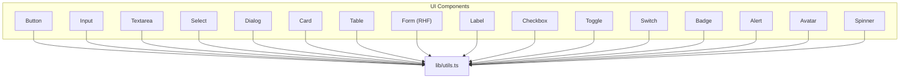

**Diagram sources**
- [button.tsx:1-61](file://components/ui/button.tsx#L1-L61)
- [input.tsx:1-22](file://components/ui/input.tsx#L1-L22)
- [textarea.tsx:1-19](file://components/ui/textarea.tsx#L1-L19)
- [select.tsx:1-186](file://components/ui/select.tsx#L1-L186)
- [dialog.tsx:1-144](file://components/ui/dialog.tsx#L1-L144)
- [card.tsx:1-93](file://components/ui/card.tsx#L1-L93)
- [table.tsx:1-117](file://components/ui/table.tsx#L1-L117)
- [form.tsx:1-168](file://components/ui/form.tsx#L1-L168)
- [label.tsx:1-25](file://components/ui/label.tsx#L1-L25)
- [checkbox.tsx:1-33](file://components/ui/checkbox.tsx#L1-L33)
- [toggle.tsx:1-48](file://components/ui/toggle.tsx#L1-L48)
- [switch.tsx:1-30](file://components/ui/switch.tsx#L1-L30)
- [badge.tsx:1-47](file://components/ui/badge.tsx#L1-L47)
- [alert.tsx:1-67](file://components/ui/alert.tsx#L1-L67)
- [avatar.tsx:1-54](file://components/ui/avatar.tsx#L1-L54)
- [spinner.tsx:1-17](file://components/ui/spinner.tsx#L1-L17)
- [utils.ts:1-7](file://lib/utils.ts#L1-L7)

**Section sources**
- [button.tsx:1-61](file://components/ui/button.tsx#L1-L61)
- [input.tsx:1-22](file://components/ui/input.tsx#L1-L22)
- [form.tsx:1-168](file://components/ui/form.tsx#L1-L168)
- [select.tsx:1-186](file://components/ui/select.tsx#L1-L186)
- [dialog.tsx:1-144](file://components/ui/dialog.tsx#L1-L144)
- [card.tsx:1-93](file://components/ui/card.tsx#L1-L93)
- [table.tsx:1-117](file://components/ui/table.tsx#L1-L117)
- [utils.ts:1-7](file://lib/utils.ts#L1-L7)

## Core Components
This section summarizes the primary base components and their capabilities.

- Button
  - Variants: default, destructive, outline, secondary, ghost, link
  - Sizes: default, sm, lg, icon, icon-sm, icon-lg
  - Features: slot composition via Radix Slot, focus-visible rings, aria-invalid integration
  - Accessibility: supports focus-visible ring, aria-invalid, and proper semantics
  - Customization: pass className to override styles; asChild enables semantic tag wrapping

- Input
  - Purpose: single-line text input with consistent focus states and invalid state styling
  - Features: focus-visible ring, aria-invalid integration, placeholder and selection styling
  - Accessibility: integrates with form components via aria-describedby and aria-invalid

- Textarea
  - Purpose: multi-line text area with similar focus and invalid state styling
  - Accessibility: same aria integration as Input

- Select
  - Primitives: Root, Group, Value, Trigger, Content, Viewport, Label, Item, Separator, ScrollUp/Down buttons
  - Trigger sizing: sm/default
  - Features: popper positioning, scrollable viewport, icons, focus-visible ring, aria-invalid
  - Accessibility: keyboard navigation, ARIA roles, scrolling controls

- Dialog
  - Primitives: Root, Trigger, Portal, Overlay, Content, Close, Header, Footer, Title, Description
  - Features: overlay fade and zoom animations, optional close button with sr-only label
  - Accessibility: focus trapping, Escape handling, ARIA roles and labels

- Card
  - Parts: Card, CardHeader, CardTitle, CardDescription, CardAction, CardContent, CardFooter
  - Features: responsive grid layout in header, action alignment, borders and shadows
  - Composition: uses @container for adaptive header layout

- Table
  - Parts: Table container, Table, TableHeader, TableBody, TableFooter, TableRow, TableHead, TableCell, TableCaption
  - Features: horizontal scrolling container, hover and selected states, checkbox alignment helpers
  - Accessibility: semantic table structure, hover/selected states for keyboard users

- Form (React Hook Form integration)
  - Components: Form (FormProvider), FormItem, FormLabel, FormControl, FormDescription, FormMessage, FormField
  - Hooks: useFormField
  - Features: automatic aria-describedby and aria-invalid wiring, error message rendering, label association
  - Accessibility: associates labels with controls, manages error IDs

- Additional base components (relevant for composition and patterns)
  - Label, Checkbox, Toggle, Switch, Badge, Alert, Avatar, Spinner
  - All follow consistent focus-visible ring, aria-invalid, and slot-based composition

**Section sources**
- [button.tsx:7-37](file://components/ui/button.tsx#L7-L37)
- [input.tsx:5-19](file://components/ui/input.tsx#L5-L19)
- [textarea.tsx:5-16](file://components/ui/textarea.tsx#L5-L16)
- [select.tsx:9-185](file://components/ui/select.tsx#L9-L185)
- [dialog.tsx:9-143](file://components/ui/dialog.tsx#L9-L143)
- [card.tsx:5-92](file://components/ui/card.tsx#L5-L92)
- [table.tsx:7-116](file://components/ui/table.tsx#L7-L116)
- [form.tsx:19-167](file://components/ui/form.tsx#L19-L167)
- [label.tsx:8-22](file://components/ui/label.tsx#L8-L22)
- [checkbox.tsx:9-30](file://components/ui/checkbox.tsx#L9-L30)
- [toggle.tsx:9-45](file://components/ui/toggle.tsx#L9-L45)
- [switch.tsx:8-27](file://components/ui/switch.tsx#L8-L27)
- [badge.tsx:7-46](file://components/ui/badge.tsx#L7-L46)
- [alert.tsx:6-35](file://components/ui/alert.tsx#L6-L35)
- [avatar.tsx:8-51](file://components/ui/avatar.tsx#L8-L51)
- [spinner.tsx:5-14](file://components/ui/spinner.tsx#L5-L14)

## Architecture Overview
The base components share a consistent architecture:
- Use Radix UI primitives for accessible behavior
- Apply CVA for variant and size systems
- Compose Tailwind classes via a centralized cn utility
- Expose slot attributes for testing and styling hooks
- Integrate with React Hook Form for forms

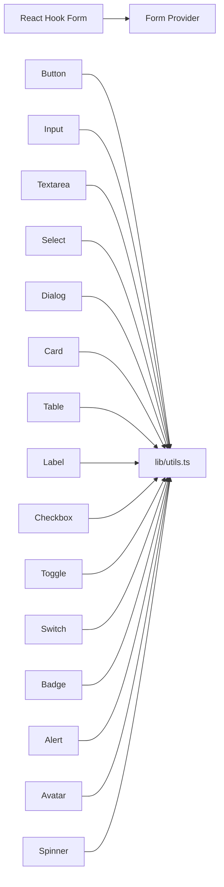

**Diagram sources**
- [button.tsx:1-61](file://components/ui/button.tsx#L1-L61)
- [input.tsx:1-22](file://components/ui/input.tsx#L1-L22)
- [textarea.tsx:1-19](file://components/ui/textarea.tsx#L1-L19)
- [select.tsx:1-186](file://components/ui/select.tsx#L1-L186)
- [dialog.tsx:1-144](file://components/ui/dialog.tsx#L1-L144)
- [card.tsx:1-93](file://components/ui/card.tsx#L1-L93)
- [table.tsx:1-117](file://components/ui/table.tsx#L1-L117)
- [form.tsx:1-168](file://components/ui/form.tsx#L1-L168)
- [label.tsx:1-25](file://components/ui/label.tsx#L1-L25)
- [checkbox.tsx:1-33](file://components/ui/checkbox.tsx#L1-L33)
- [toggle.tsx:1-48](file://components/ui/toggle.tsx#L1-L48)
- [switch.tsx:1-30](file://components/ui/switch.tsx#L1-L30)
- [badge.tsx:1-47](file://components/ui/badge.tsx#L1-L47)
- [alert.tsx:1-67](file://components/ui/alert.tsx#L1-L67)
- [avatar.tsx:1-54](file://components/ui/avatar.tsx#L1-L54)
- [spinner.tsx:1-17](file://components/ui/spinner.tsx#L1-L17)
- [utils.ts:1-7](file://lib/utils.ts#L1-L7)

## Detailed Component Analysis

### Button
- Props
  - className: string
  - variant: one of default, destructive, outline, secondary, ghost, link
  - size: one of default, sm, lg, icon, icon-sm, icon-lg
  - asChild: boolean (wraps children with Slot)
  - All other button attributes supported
- Behavior
  - Uses CVA for variant and size
  - Focus-visible ring and destructive variants adjust ring color
  - aria-invalid influences ring color for form integration
  - asChild allows rendering anchor tags or other elements while preserving styles
- Accessibility
  - Inherits focus-visible ring and aria-invalid integration
  - Supports keyboard activation and screen reader labeling via parent contexts
- Customization
  - Pass additional className to augment styles safely
  - Use asChild to render semantic anchors or links

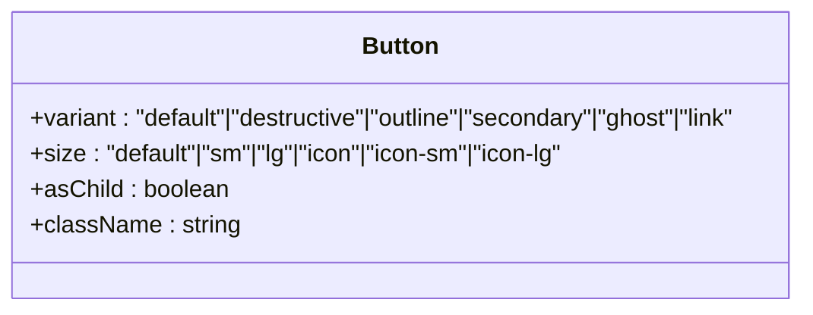

**Diagram sources**
- [button.tsx:39-58](file://components/ui/button.tsx#L39-L58)

**Section sources**
- [button.tsx:7-37](file://components/ui/button.tsx#L7-L37)
- [button.tsx:39-58](file://components/ui/button.tsx#L39-L58)

### Input
- Props
  - className: string
  - type: input type
  - All other input attributes supported
- Behavior
  - Focus-visible ring and destructive ring on aria-invalid
  - Placeholder and selection styling included
  - Dark mode background and input-specific colors
- Accessibility
  - Integrates with Form components via aria-describedby and aria-invalid
  - Works seamlessly with Label and FormControl

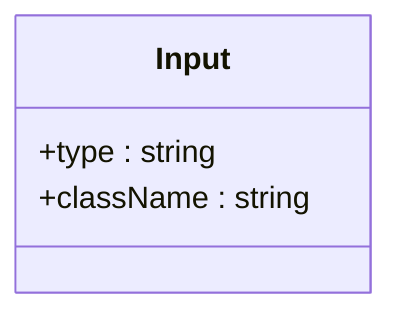

**Diagram sources**
- [input.tsx:5-19](file://components/ui/input.tsx#L5-L19)

**Section sources**
- [input.tsx:5-19](file://components/ui/input.tsx#L5-L19)

### Textarea
- Props
  - className: string
  - All textarea attributes supported
- Behavior
  - Same focus-visible and aria-invalid styling as Input
  - Selection and placeholder styling included
- Accessibility
  - Same integration patterns as Input

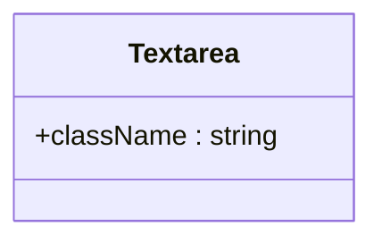

**Diagram sources**
- [textarea.tsx:5-16](file://components/ui/textarea.tsx#L5-L16)

**Section sources**
- [textarea.tsx:5-16](file://components/ui/textarea.tsx#L5-L16)

### Select
- Components
  - Root, Group, Value, Trigger (size: sm/default), Content (position: popper), Label, Item, Separator, ScrollUpButton, ScrollDownButton
- Props
  - Trigger accepts size prop
  - Content accepts position prop
  - All components forward primitive props
- Behavior
  - Popper positioning with slide-in/out animations
  - Scrollable viewport with up/down buttons
  - Focus-visible ring and destructive ring on aria-invalid
- Accessibility
  - Keyboard navigation, ARIA roles, scroll controls, and indicator for selected item

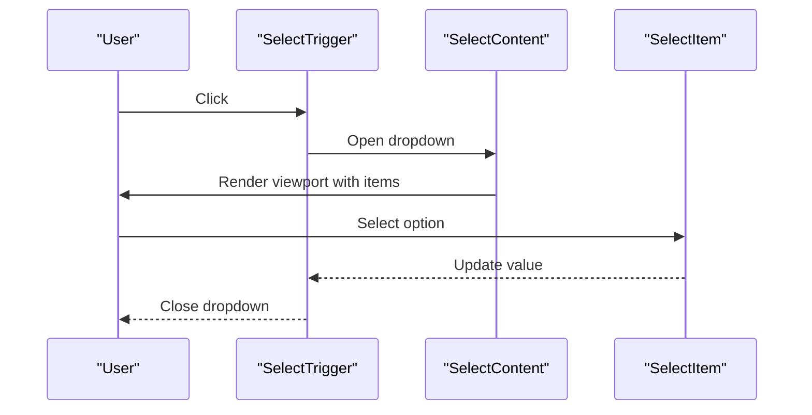

**Diagram sources**
- [select.tsx:27-86](file://components/ui/select.tsx#L27-L86)
- [select.tsx:101-123](file://components/ui/select.tsx#L101-L123)

**Section sources**
- [select.tsx:9-185](file://components/ui/select.tsx#L9-L185)

### Dialog
- Components
  - Root, Trigger, Portal, Overlay, Content (showCloseButton: boolean), Close, Header, Footer, Title, Description
- Props
  - Content accepts showCloseButton flag
- Behavior
  - Fade and zoom animations on open/close
  - Overlay click and Escape key close
  - Optional close button with sr-only label
- Accessibility
  - Focus trapping, ARIA modal roles, and screen reader-friendly close button

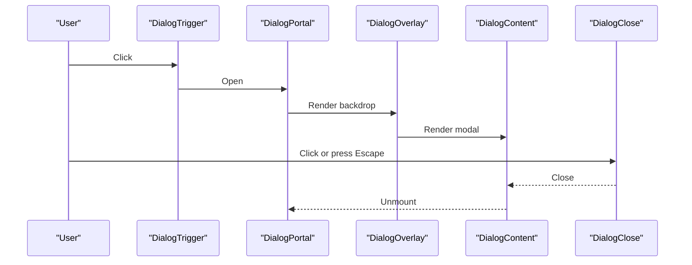

**Diagram sources**
- [dialog.tsx:15-81](file://components/ui/dialog.tsx#L15-L81)

**Section sources**
- [dialog.tsx:9-143](file://components/ui/dialog.tsx#L9-L143)

### Card
- Components
  - Card, CardHeader, CardTitle, CardDescription, CardAction, CardContent, CardFooter
- Behavior
  - Header grid adapts to presence of action via data-slot
  - Container uses container queries for responsive layout
- Composition
  - Action placed in top-right grid cell when present

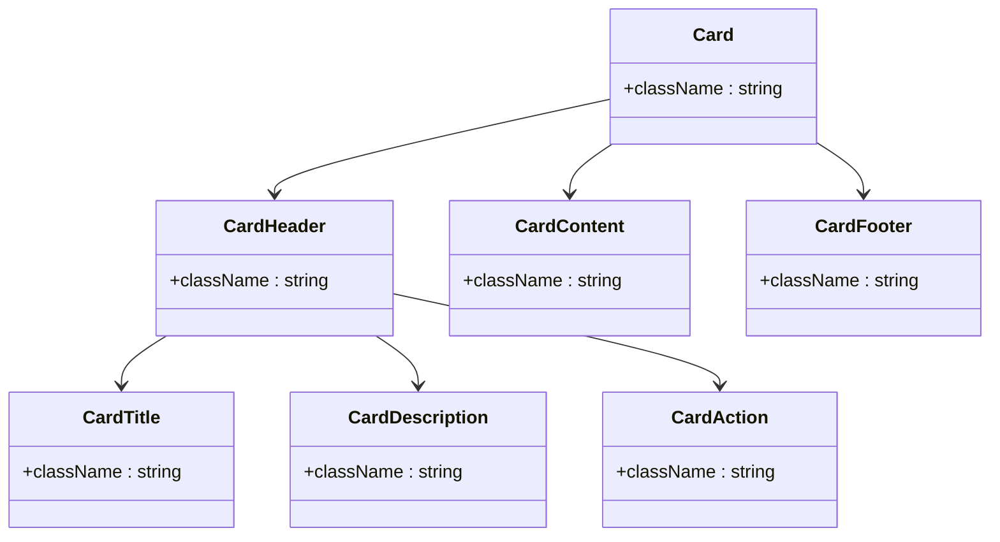

**Diagram sources**
- [card.tsx:5-92](file://components/ui/card.tsx#L5-L92)

**Section sources**
- [card.tsx:5-92](file://components/ui/card.tsx#L5-L92)

### Table
- Components
  - Table container, Table, TableHeader, TableBody, TableFooter, TableRow, TableHead, TableCell, TableCaption
- Behavior
  - Horizontal scrolling container for small screens
  - Hover and selected states for interactivity
  - Checkbox alignment helpers for accessible selection
- Accessibility
  - Semantic table structure supports keyboard navigation and assistive tech

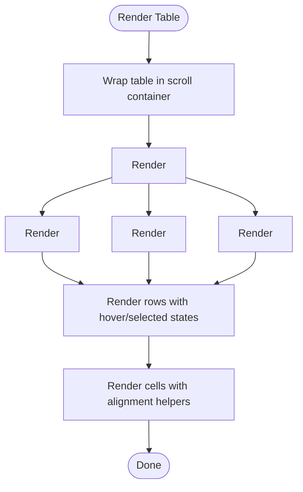

**Diagram sources**
- [table.tsx:7-116](file://components/ui/table.tsx#L7-L116)

**Section sources**
- [table.tsx:7-116](file://components/ui/table.tsx#L7-L116)

### Form (React Hook Form integration)
- Components
  - Form (FormProvider), FormItem, FormLabel, FormControl, FormDescription, FormMessage, FormField
  - Hook: useFormField
- Behavior
  - Automatically wires aria-describedby and aria-invalid
  - Renders error messages when present
  - Associates labels with controls via generated IDs
- Usage pattern
  - Wrap fields in FormField
  - Use FormItem, FormLabel, FormControl, FormDescription, FormMessage for structure
  - Use useFormField inside custom components to access IDs and error state

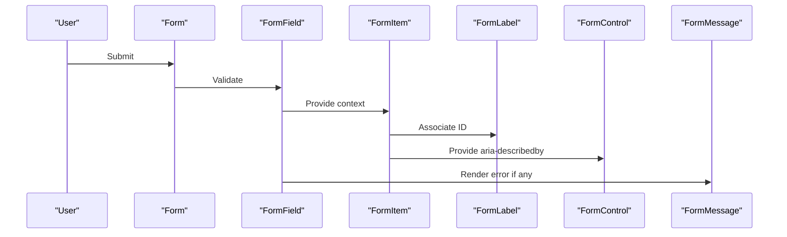

**Diagram sources**
- [form.tsx:32-66](file://components/ui/form.tsx#L32-L66)
- [form.tsx:76-123](file://components/ui/form.tsx#L76-L123)
- [form.tsx:138-156](file://components/ui/form.tsx#L138-L156)

**Section sources**
- [form.tsx:19-167](file://components/ui/form.tsx#L19-L167)

### Supporting Components (patterns and composition)
- Label
  - Uses Radix Label primitive with consistent typography and disabled states
- Checkbox
  - Uses Radix Checkbox with indicator and focus-visible ring
- Toggle
  - Uses Radix Toggle with variant and size system
- Switch
  - Uses Radix Switch with thumb translation and focus-visible ring
- Badge
  - Uses CVA for variant system and slot composition
- Alert
  - Uses CVA for variant and role="alert"
- Avatar
  - Uses Radix Avatar with image and fallback
- Spinner
  - Uses Loader2Icon with role="status" and aria-label

**Section sources**
- [label.tsx:8-22](file://components/ui/label.tsx#L8-L22)
- [checkbox.tsx:9-30](file://components/ui/checkbox.tsx#L9-L30)
- [toggle.tsx:9-45](file://components/ui/toggle.tsx#L9-L45)
- [switch.tsx:8-27](file://components/ui/switch.tsx#L8-L27)
- [badge.tsx:7-46](file://components/ui/badge.tsx#L7-L46)
- [alert.tsx:6-35](file://components/ui/alert.tsx#L6-L35)
- [avatar.tsx:8-51](file://components/ui/avatar.tsx#L8-L51)
- [spinner.tsx:5-14](file://components/ui/spinner.tsx#L5-L14)

## Dependency Analysis
- Internal dependencies
  - All components depend on lib/utils.ts for cn merging
  - Form components depend on React Hook Form and Radix UI
  - Select and Dialog depend on Radix UI primitives
- External dependencies
  - class-variance-authority for variant/sizing systems
  - lucide-react for icons
  - tailwind-merge and clsx for class merging

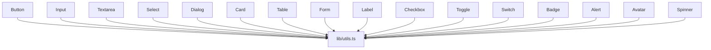

**Diagram sources**
- [utils.ts:1-7](file://lib/utils.ts#L1-L7)
- [button.tsx:1-61](file://components/ui/button.tsx#L1-L61)
- [input.tsx:1-22](file://components/ui/input.tsx#L1-L22)
- [textarea.tsx:1-19](file://components/ui/textarea.tsx#L1-L19)
- [select.tsx:1-186](file://components/ui/select.tsx#L1-L186)
- [dialog.tsx:1-144](file://components/ui/dialog.tsx#L1-L144)
- [card.tsx:1-93](file://components/ui/card.tsx#L1-L93)
- [table.tsx:1-117](file://components/ui/table.tsx#L1-L117)
- [form.tsx:1-168](file://components/ui/form.tsx#L1-L168)
- [label.tsx:1-25](file://components/ui/label.tsx#L1-L25)
- [checkbox.tsx:1-33](file://components/ui/checkbox.tsx#L1-L33)
- [toggle.tsx:1-48](file://components/ui/toggle.tsx#L1-L48)
- [switch.tsx:1-30](file://components/ui/switch.tsx#L1-L30)
- [badge.tsx:1-47](file://components/ui/badge.tsx#L1-L47)
- [alert.tsx:1-67](file://components/ui/alert.tsx#L1-L67)
- [avatar.tsx:1-54](file://components/ui/avatar.tsx#L1-L54)
- [spinner.tsx:1-17](file://components/ui/spinner.tsx#L1-L17)

**Section sources**
- [utils.ts:1-7](file://lib/utils.ts#L1-L7)

## Performance Considerations
- Prefer variant and size props over ad-hoc className overrides to keep styles predictable and cache-friendly
- Use asChild sparingly; it adds a wrapper element but preserves semantics
- Keep Select and Dialog content minimal to reduce reflows during animations
- Avoid excessive nested wrappers; leverage slot attributes for styling hooks
- Use container queries in Card header to avoid unnecessary recalculations on resize

## Accessibility and UX Guidelines
- Focus management
  - All interactive components apply focus-visible rings and outline-none focus styles
  - Dialog traps focus; Select and Dialog manage keyboard navigation
- Screen reader support
  - Form components wire aria-describedby and aria-invalid automatically
  - Dialog close button includes a sr-only label
  - Alert uses role="alert"
- Keyboard navigation
  - Select supports arrow keys, Home/End, Enter, and Escape
  - Dialog supports Escape to close
  - Toggle and Switch are keyboard operable
- Validation states
  - aria-invalid integrates with destructive ring colors for error states
  - FormMessage renders errors consistently

## Troubleshooting Guide
- Button does not inherit styles when used as a link
  - Ensure asChild is set to wrap children with Slot
  - Verify variant and size are valid
- Input/Textarea focus ring not visible
  - Confirm focus-visible ring classes are not overridden by global resets
  - Check that aria-invalid is not unintentionally applied
- Select dropdown misaligned
  - Adjust position prop to "popper" or "overlay"
  - Ensure trigger height/width CSS variables are available
- Dialog not closing on overlay click
  - Verify DialogPortal wraps DialogOverlay and Content
  - Ensure DialogOverlay is rendered before Content
- Form label not associated with input
  - Wrap the input in FormControl and pair with FormLabel
  - Ensure FormItem generates IDs and FormLabel uses htmlFor
- Table row hover not working
  - Confirm hover:bg-muted/50 is not overridden by parent styles
  - Ensure rows are not disabled or selected

**Section sources**
- [button.tsx:49-57](file://components/ui/button.tsx#L49-L57)
- [input.tsx:10-15](file://components/ui/input.tsx#L10-L15)
- [select.tsx:58-85](file://components/ui/select.tsx#L58-L85)
- [dialog.tsx:57-80](file://components/ui/dialog.tsx#L57-L80)
- [form.tsx:90-123](file://components/ui/form.tsx#L90-L123)
- [table.tsx:55-65](file://components/ui/table.tsx#L55-L65)

## Conclusion
finTracker’s base UI components provide a cohesive, accessible, and customizable foundation. They leverage Radix UI for behavior, CVA for variants, and Tailwind for styling, with React Hook Form integration for forms. By following the composition patterns and accessibility guidelines outlined here, teams can build consistent, maintainable interfaces that scale across the application.

## Appendices
- Extending components
  - Add new variants via CVA in existing components or create new components with CVA
  - Use asChild for semantic wrappers; ensure slot attributes remain consistent
  - Keep className merging via cn to avoid conflicting styles
- Design system consistency
  - Centralize tokens via Tailwind and theme variables
  - Reuse slot attributes for automated testing and style hooks
  - Document variant and size options per component to prevent divergence