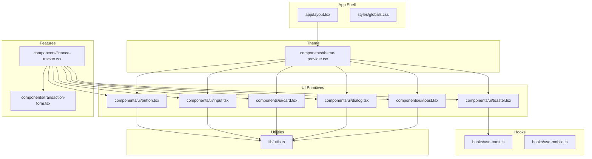
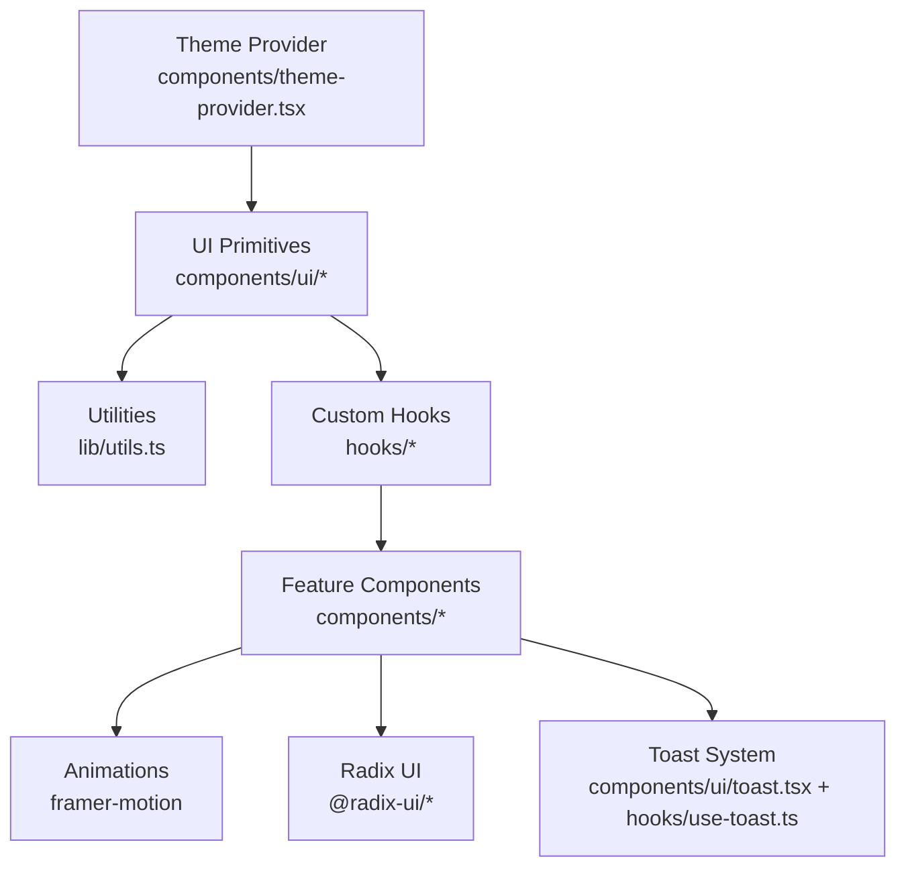
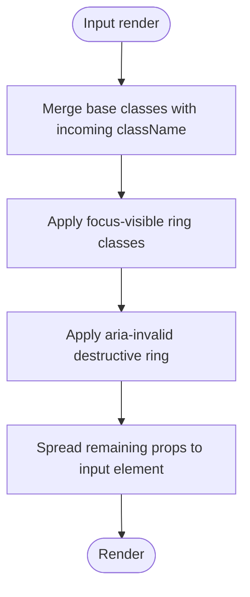
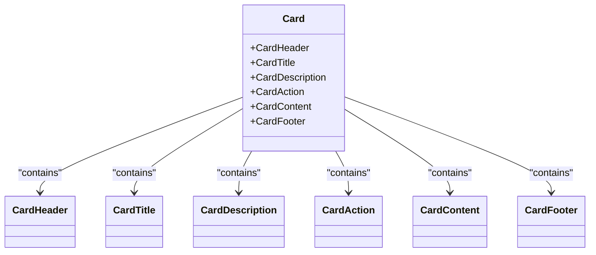
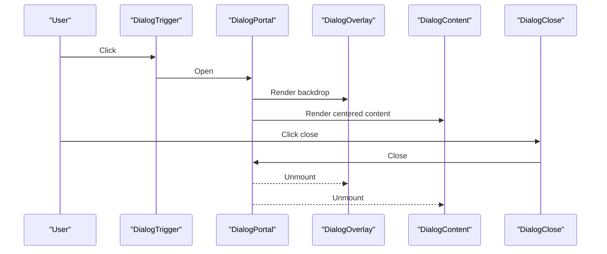
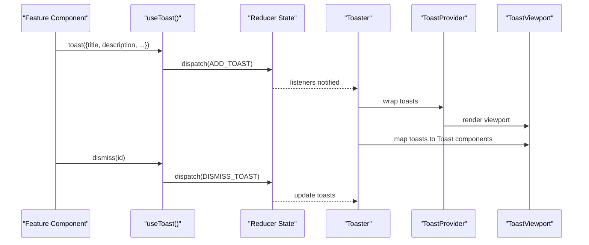
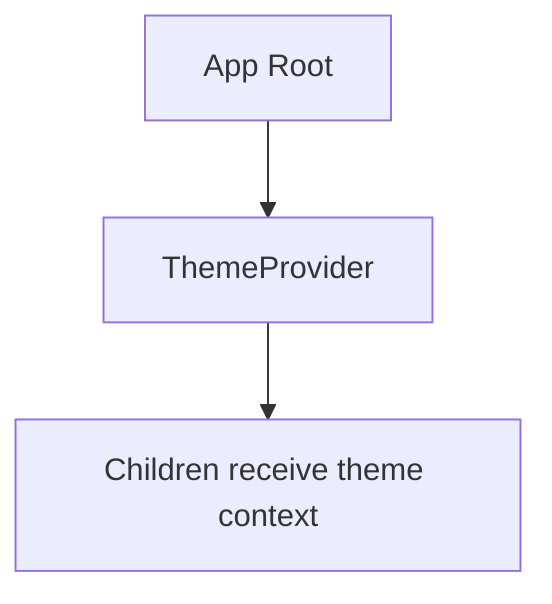
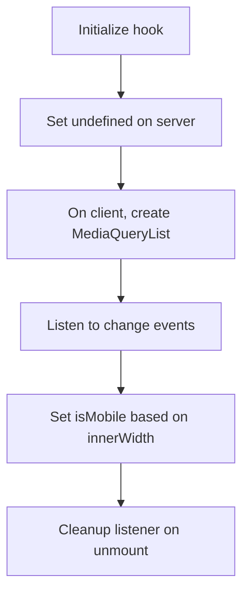
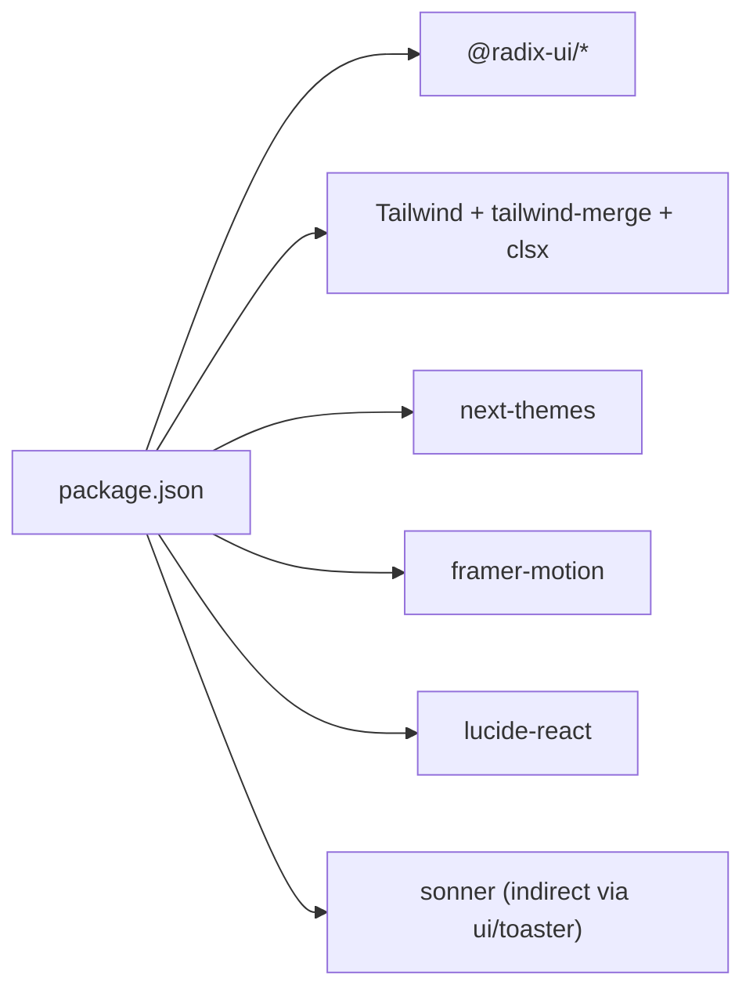

# Component Composition and Patterns

<cite>
**Referenced Files in This Document**
- [button.tsx](file://components/ui/button.tsx)
- [input.tsx](file://components/ui/input.tsx)
- [card.tsx](file://components/ui/card.tsx)
- [dialog.tsx](file://components/ui/dialog.tsx)
- [toast.tsx](file://components/ui/toast.tsx)
- [toaster.tsx](file://components/ui/toaster.tsx)
- [use-toast.ts](file://hooks/use-toast.ts)
- [use-mobile.ts](file://hooks/use-mobile.ts)
- [use-mobile.ts](file://hooks/use-mobile.ts)
- [theme-provider.tsx](file://components/theme-provider.tsx)
- [utils.ts](file://lib/utils.ts)
- [finance-tracker.tsx](file://components/finance-tracker.tsx)
- [transaction-form.tsx](file://components/transaction-form.tsx)
- [layout.tsx](file://app/layout.tsx)
- [globals.css](file://styles/globals.css)
- [package.json](file://package.json)
</cite>

## Table of Contents
1. [Introduction](#introduction)
2. [Project Structure](#project-structure)
3. [Core Components](#core-components)
4. [Architecture Overview](#architecture-overview)
5. [Detailed Component Analysis](#detailed-component-analysis)
6. [Dependency Analysis](#dependency-analysis)
7. [Performance Considerations](#performance-considerations)
8. [Troubleshooting Guide](#troubleshooting-guide)
9. [Conclusion](#conclusion)
10. [Appendices](#appendices)

## Introduction
This document explains finTracker’s component composition patterns and architectural principles. It focuses on how Radix UI primitives are composed with Tailwind CSS and a custom design system, how utility functions merge class names and forward refs, and how custom hooks integrate state and behavior. It also covers mobile-first patterns, the toast notification system, theme provider implementation, and guidelines for consistency, reusability, performance, accessibility, testing, documentation, and contributions.

## Project Structure
The project follows a feature-based organization with a dedicated components/ui directory for reusable UI primitives and a components directory for application-specific features. Styling is centralized via Tailwind and a custom CSS layer that defines design tokens and theme variants. Hooks encapsulate cross-cutting concerns like toasts and responsive behavior.



**Diagram sources**
- [layout.tsx:1-53](file://app/layout.tsx#L1-L53)
- [globals.css:1-126](file://styles/globals.css#L1-L126)
- [theme-provider.tsx:1-12](file://components/theme-provider.tsx#L1-L12)
- [button.tsx:1-61](file://components/ui/button.tsx#L1-L61)
- [input.tsx:1-22](file://components/ui/input.tsx#L1-L22)
- [card.tsx:1-93](file://components/ui/card.tsx#L1-L93)
- [dialog.tsx:1-144](file://components/ui/dialog.tsx#L1-L144)
- [toast.tsx:1-130](file://components/ui/toast.tsx#L1-L130)
- [toaster.tsx:1-36](file://components/ui/toaster.tsx#L1-L36)
- [use-toast.ts:1-192](file://hooks/use-toast.ts#L1-L192)
- [use-mobile.ts:1-20](file://hooks/use-mobile.ts#L1-L20)
- [utils.ts:1-7](file://lib/utils.ts#L1-L7)
- [finance-tracker.tsx:1-991](file://components/finance-tracker.tsx#L1-L991)
- [transaction-form.tsx:1-448](file://components/transaction-form.tsx#L1-L448)

**Section sources**
- [layout.tsx:1-53](file://app/layout.tsx#L1-L53)
- [globals.css:1-126](file://styles/globals.css#L1-L126)
- [package.json:1-73](file://package.json#L1-L73)

## Core Components
This section documents the foundational patterns used across UI primitives and application components.

- Class name merging and composition
  - A single utility merges Tailwind classes safely, combining and deduplicating inputs.
  - Example path: [utils.ts:cn:4-6](file://lib/utils.ts#L4-L6)

- Radix UI composition
  - Components wrap Radix UI primitives, expose consistent props, and attach data-slot attributes for testability and styling hooks.
  - Example paths:
    - [button.tsx:Slot + variants:49-57](file://components/ui/button.tsx#L49-L57)
    - [dialog.tsx:Root, Trigger, Portal, Content, Overlay, Close:9-81](file://components/ui/dialog.tsx#L9-L81)

- Variant-driven styling with class-variance-authority
  - Buttons define variants and sizes for consistent, composable styles.
  - Example path: [button.tsx:buttonVariants:7-37](file://components/ui/button.tsx#L7-L37)

- ForwardRef and prop forwarding
  - Components that render primitive elements or Radix roots use forwardRef and spread props to preserve accessibility and behavior.
  - Example paths:
    - [toast.tsx:ToastViewport, Toast, ToastAction, ToastClose, ToastTitle, ToastDescription:12-113](file://components/ui/toast.tsx#L12-L113)

- Accessibility and focus management
  - Focus-visible rings, aria-invalid states, and semantic roles are applied consistently.
  - Example paths:
    - [button.tsx:focus-visible ring:8-8](file://components/ui/button.tsx#L8-L8)
    - [input.tsx:focus-visible ring:11-13](file://components/ui/input.tsx#L11-L13)

- Theme provider integration
  - Theme switching is delegated to next-themes with a thin wrapper.
  - Example path: [theme-provider.tsx:ThemeProvider:9-11](file://components/theme-provider.tsx#L9-L11)

- Mobile optimization patterns
  - A hook detects mobile breakpoints and stabilizes SSR hydration.
  - Example path: [use-mobile.ts:useIsMobile:5-18](file://hooks/use-mobile.ts#L5-L18)

**Section sources**
- [utils.ts:1-7](file://lib/utils.ts#L1-L7)
- [button.tsx:1-61](file://components/ui/button.tsx#L1-L61)
- [dialog.tsx:1-144](file://components/ui/dialog.tsx#L1-L144)
- [toast.tsx:1-130](file://components/ui/toast.tsx#L1-L130)
- [input.tsx:1-22](file://components/ui/input.tsx#L1-L22)
- [theme-provider.tsx:1-12](file://components/theme-provider.tsx#L1-L12)
- [use-mobile.ts:1-20](file://hooks/use-mobile.ts#L1-L20)

## Architecture Overview
The application layers UI primitives, theme, and utilities beneath feature components. Feature components orchestrate state, compose primitives, and manage animations and dialogs. The toast system is decoupled via a custom hook and provider.



**Diagram sources**
- [theme-provider.tsx:1-12](file://components/theme-provider.tsx#L1-L12)
- [button.tsx:1-61](file://components/ui/button.tsx#L1-L61)
- [input.tsx:1-22](file://components/ui/input.tsx#L1-L22)
- [card.tsx:1-93](file://components/ui/card.tsx#L1-L93)
- [dialog.tsx:1-144](file://components/ui/dialog.tsx#L1-L144)
- [toast.tsx:1-130](file://components/ui/toast.tsx#L1-L130)
- [toaster.tsx:1-36](file://components/ui/toaster.tsx#L1-L36)
- [use-toast.ts:1-192](file://hooks/use-toast.ts#L1-L192)
- [finance-tracker.tsx:1-991](file://components/finance-tracker.tsx#L1-L991)

## Detailed Component Analysis

### Button Pattern: Variants, Slots, and Prop Forwarding
The Button component demonstrates:
- Variant composition via class-variance-authority
- Polymorphic rendering with Radix Slot
- Safe class merging with cn
- Focus-visible and invalid-state styling
- data-slot for testability

```mermaid
classDiagram
class Button {
+props : ComponentProps<"button"> & VariantProps<buttonVariants> & {asChild? : boolean}
+render() Element
}
class buttonVariants {
+variants : {variant, size}
+defaultVariants
}
class cn {
+cn(...inputs) string
}
Button --> buttonVariants : "uses"
Button --> cn : "merges classes"
```

**Diagram sources**
- [button.tsx:39-60](file://components/ui/button.tsx#L39-L60)
- [button.tsx:7-37](file://components/ui/button.tsx#L7-L37)
- [utils.ts:4-6](file://lib/utils.ts#L4-L6)

**Section sources**
- [button.tsx:1-61](file://components/ui/button.tsx#L1-L61)
- [utils.ts:1-7](file://lib/utils.ts#L1-L7)

### Input Pattern: Consistent Styling and Focus States
The Input component applies:
- Consistent border, background, and focus-visible ring styles
- aria-invalid integration for form feedback
- data-slot for styling hooks



**Diagram sources**
- [input.tsx:5-19](file://components/ui/input.tsx#L5-L19)

**Section sources**
- [input.tsx:1-22](file://components/ui/input.tsx#L1-L22)

### Card Composition: Header, Title, Description, Content, Footer
The Card family exposes a cohesive container with named parts:
- Card: base container
- CardHeader/CardTitle/CardDescription/CardAction/CardContent/CardFooter: structured slots



**Diagram sources**
- [card.tsx:5-92](file://components/ui/card.tsx#L5-L92)

**Section sources**
- [card.tsx:1-93](file://components/ui/card.tsx#L1-L93)

### Dialog Composition: Overlay, Content, Close, and Portal
The Dialog stack composes Radix primitives with Tailwind overlays and animations:
- Portal ensures proper stacking context
- Overlay applies backdrop and fade transitions
- Content centers content with responsive sizing
- Close button integrates with accessibility semantics



**Diagram sources**
- [dialog.tsx:9-81](file://components/ui/dialog.tsx#L9-L81)

**Section sources**
- [dialog.tsx:1-144](file://components/ui/dialog.tsx#L1-L144)

### Toast Notification System: Hook, Provider, and Renderer
The toast system is built around a custom hook and a Radix-based renderer:
- use-toast manages state, actions, and a simple reducer
- Toaster renders the provider, viewport, and toast list
- toast() returns imperative controls (dismiss, update)



**Diagram sources**
- [use-toast.ts:142-191](file://hooks/use-toast.ts#L142-L191)
- [toaster.tsx:13-35](file://components/ui/toaster.tsx#L13-L35)
- [toast.tsx:10-113](file://components/ui/toast.tsx#L10-L113)

**Section sources**
- [use-toast.ts:1-192](file://hooks/use-toast.ts#L1-L192)
- [toaster.tsx:1-36](file://components/ui/toaster.tsx#L1-L36)
- [toast.tsx:1-130](file://components/ui/toast.tsx#L1-L130)

### Theme Provider Implementation
The ThemeProvider wraps next-themes to supply theme-aware context to the app.



**Diagram sources**
- [theme-provider.tsx:9-11](file://components/theme-provider.tsx#L9-L11)

**Section sources**
- [theme-provider.tsx:1-12](file://components/theme-provider.tsx#L1-L12)

### Mobile Optimization Pattern
The useIsMobile hook detects mobile breakpoints and stabilizes SSR hydration by listening to MediaQueryList events.



**Diagram sources**
- [use-mobile.ts:5-18](file://hooks/use-mobile.ts#L5-L18)

**Section sources**
- [use-mobile.ts:1-20](file://hooks/use-mobile.ts#L1-L20)

### Practical Examples: Composition, Prop Forwarding, and State Management
- Composing Button with polymorphic Slot and variants
  - Path: [button.tsx:Slot usage:49-57](file://components/ui/button.tsx#L49-L57)
- Prop forwarding with forwardRef in toast components
  - Paths: [toast.tsx:forwardRef for Viewport, Toast, Action, Close:12-89](file://components/ui/toast.tsx#L12-L89)
- State management integration in FinanceTracker
  - Paths: [finance-tracker.tsx:useState, useEffect, memoization:57-174](file://components/finance-tracker.tsx#L57-L174)
- Form composition with TransactionForm
  - Paths: [transaction-form.tsx:toggle types, destination, templates:103-447](file://components/transaction-form.tsx#L103-L447)

**Section sources**
- [button.tsx:39-60](file://components/ui/button.tsx#L39-L60)
- [toast.tsx:12-113](file://components/ui/toast.tsx#L12-L113)
- [finance-tracker.tsx:57-174](file://components/finance-tracker.tsx#L57-L174)
- [transaction-form.tsx:103-447](file://components/transaction-form.tsx#L103-L447)

## Dependency Analysis
External libraries underpin the design system and composability:
- Radix UI: primitives for accessible overlays, dialogs, toasts, and controls
- Tailwind + tailwind-merge + clsx: utility-first styling and safe class merging
- next-themes: theme provider
- framer-motion: animations for sheets and modals
- lucide-react: icons



**Diagram sources**
- [package.json:11-61](file://package.json#L11-L61)

**Section sources**
- [package.json:1-73](file://package.json#L1-L73)

## Performance Considerations
- Prefer variant-based styling to minimize runtime style churn.
- Use forwardRef and minimal wrappers to avoid unnecessary DOM nodes.
- Defer heavy computations to useMemo/useCallback in feature components.
- Limit toast queue size and remove stale toasts promptly.
- Keep animations lightweight and scoped to visible areas.

## Troubleshooting Guide
- Button focus-visible ring not appearing
  - Verify focus-visible ring classes are present and not overridden by className.
  - Reference: [button.tsx:ring classes:8-8](file://components/ui/button.tsx#L8-L8)
- Input focus ring missing
  - Confirm focus-visible ring classes are merged.
  - Reference: [input.tsx:focus ring:11-13](file://components/ui/input.tsx#L11-L13)
- Dialog overlay not covering viewport
  - Ensure Portal is wrapping Overlay and Content.
  - Reference: [dialog.tsx:Portal + Overlay + Content:58-80](file://components/ui/dialog.tsx#L58-L80)
- Toast not dismissing
  - Check useToast reducer and action dispatches.
  - Reference: [use-toast.ts:DISMISS_TOAST:90-114](file://hooks/use-toast.ts#L90-L114)
- Theme not applying
  - Wrap app with ThemeProvider and ensure next-themes is configured.
  - Reference: [theme-provider.tsx:ThemeProvider:9-11](file://components/theme-provider.tsx#L9-L11)

**Section sources**
- [button.tsx:7-8](file://components/ui/button.tsx#L7-L8)
- [input.tsx:11-13](file://components/ui/input.tsx#L11-L13)
- [dialog.tsx:58-80](file://components/ui/dialog.tsx#L58-L80)
- [use-toast.ts:90-114](file://hooks/use-toast.ts#L90-L114)
- [theme-provider.tsx:9-11](file://components/theme-provider.tsx#L9-L11)

## Conclusion
finTracker’s design system is built on consistent primitives, variant-driven styling, and accessible Radix UI compositions. Utilities unify class merging, while hooks encapsulate cross-cutting concerns like toasts and responsiveness. The result is a cohesive, extensible component architecture that prioritizes accessibility, performance, and maintainability.

## Appendices

### Design System Principles and Tokens
- Color scheme
  - Base palette defined via oklch tokens in CSS variables and applied through Tailwind theme.
  - Reference: [globals.css:CSS variables:6-40](file://styles/globals.css#L6-L40), [globals.css:dark overrides:42-75](file://styles/globals.css#L42-L75), [globals.css:@theme:77-116](file://styles/globals.css#L77-L116)
- Typography scale
  - Fonts defined via @theme and applied globally.
  - Reference: [globals.css:@theme fonts:77-80](file://styles/globals.css#L77-L80)
- Spacing and radius scale
  - Radius tokens derived from a base radius and mapped to Tailwind scale.
  - Reference: [globals.css:radius tokens:104-107](file://styles/globals.css#L104-L107)
- Semantic tokens
  - Background, foreground, primary, secondary, muted, accent, destructive, borders, input, ring, and chart colors.
  - Reference: [globals.css:semantic tokens:80-103](file://styles/globals.css#L80-L103)

**Section sources**
- [globals.css:1-126](file://styles/globals.css#L1-L126)

### Component Reusability Guidelines
- Encapsulate styling in variants and shared utilities.
- Use data-slot attributes for testability and styling hooks.
- Prefer forwardRef for composability and accessibility.
- Keep props minimal and leverage polymorphic rendering where appropriate.

### Accessibility Compliance Checklist
- All interactive controls have focus indicators and keyboard operability.
- Dialogs and toasts announce content via screen readers.
- Icons include accessible labels where needed.
- ARIA attributes (e.g., aria-invalid) are applied conditionally.

### Testing Standards
- Unit tests for hooks and small utilities.
- Component tests using data-slot selectors.
- Integration tests for composed flows (dialogs, forms, toasts).

### Documentation Standards
- Document props, variants, and behavioral expectations per component.
- Include usage examples and composition patterns.
- Link to related components and shared utilities.

### Contribution Guidelines
- Follow the established component composition patterns.
- Add variants thoughtfully and reuse shared utilities.
- Ensure accessibility and responsive behavior.
- Update design tokens and globals.css when introducing new semantic colors or scales.