# Specialized Components

<cite>
**Referenced Files in This Document**
- [category-select.tsx](file://components/category-select.tsx)
- [balance-card.tsx](file://components/balance-card.tsx)
- [finance-header.tsx](file://components/finance-header.tsx)
- [transaction-form.tsx](file://components/transaction-form.tsx)
- [transaction-list.tsx](file://components/transaction-list.tsx)
- [spending-chart.tsx](file://components/spending-chart.tsx)
- [summary-cards.tsx](file://components/summary-cards.tsx)
- [theme-provider.tsx](file://components/theme-provider.tsx)
- [finance.ts](file://lib/finance.ts)
- [finance-tracker.tsx](file://components/finance-tracker.tsx)
- [data-transfer.ts](file://lib/data-transfer.ts)
</cite>

## Table of Contents
1. [Introduction](#introduction)
2. [Project Structure](#project-structure)
3. [Core Components](#core-components)
4. [Architecture Overview](#architecture-overview)
5. [Detailed Component Analysis](#detailed-component-analysis)
6. [Dependency Analysis](#dependency-analysis)
7. [Performance Considerations](#performance-considerations)
8. [Troubleshooting Guide](#troubleshooting-guide)
9. [Conclusion](#conclusion)
10. [Appendices](#appendices)

## Introduction
This document provides comprehensive technical and practical documentation for finTracker’s specialized business components. It focuses on:
- CategorySelect for financial categorization
- BalanceCard for financial summaries
- FinanceHeader for navigation and controls
- TransactionForm for smart transaction entry with clipboard integration
- TransactionList for displaying and managing transactions
- SpendingChart for financial visualization
- SummaryCards for key metrics display
- ThemeProvider for dark/light mode switching

Each component’s business logic, data handling patterns, and integration with the finance domain are explained, along with usage examples, state management integration, data flow patterns, props/event handlers, customization options, performance considerations, accessibility features, mobile optimization, and extension guidelines.

## Project Structure
The specialized components live under the components directory and collaborate with shared domain logic in lib/finance.ts. The main FinanceTracker orchestrates state, persistence, and rendering of these components.

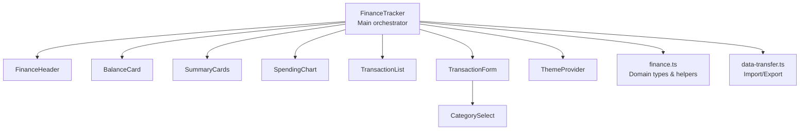

**Diagram sources**
- [finance-tracker.tsx:1-545](file://components/finance-tracker.tsx#L1-L545)
- [finance-header.tsx:1-129](file://components/finance-header.tsx#L1-L129)
- [balance-card.tsx:1-80](file://components/balance-card.tsx#L1-L80)
- [summary-cards.tsx:1-50](file://components/summary-cards.tsx#L1-L50)
- [spending-chart.tsx:1-96](file://components/spending-chart.tsx#L1-L96)
- [transaction-list.tsx:1-102](file://components/transaction-list.tsx#L1-L102)
- [transaction-form.tsx:1-448](file://components/transaction-form.tsx#L1-L448)
- [category-select.tsx:1-163](file://components/category-select.tsx#L1-L163)
- [theme-provider.tsx:1-12](file://components/theme-provider.tsx#L1-L12)
- [finance.ts:1-124](file://lib/finance.ts#L1-L124)
- [data-transfer.ts:1-115](file://lib/data-transfer.ts#L1-L115)

**Section sources**
- [finance-tracker.tsx:1-545](file://components/finance-tracker.tsx#L1-L545)
- [finance.ts:1-124](file://lib/finance.ts#L1-L124)

## Core Components
This section outlines the primary specialized components and their roles in the finance domain.

- CategorySelect: Dropdown for selecting transaction categories with icons, colors, and animated selection UX.
- BalanceCard: Displays global balance (card + cash), individual balances, savings, and currency switcher.
- FinanceHeader: Provides period navigation, history toggle, and settings access.
- TransactionForm: Smart transaction entry with type toggling, destination selection, category dropdown, quick templates, math keypad, and clipboard parsing.
- TransactionList: Renders transactions with edit/delete actions and destination indicators.
- SpendingChart: Visualizes expense breakdown by category and forecasts remaining funds.
- SummaryCards: Shows total income and total expenses for the period.
- ThemeProvider: Wraps the app with next-themes for dark/light mode.

**Section sources**
- [category-select.tsx:1-163](file://components/category-select.tsx#L1-L163)
- [balance-card.tsx:1-80](file://components/balance-card.tsx#L1-L80)
- [finance-header.tsx:1-129](file://components/finance-header.tsx#L1-L129)
- [transaction-form.tsx:1-448](file://components/transaction-form.tsx#L1-L448)
- [transaction-list.tsx:1-102](file://components/transaction-list.tsx#L1-L102)
- [spending-chart.tsx:1-96](file://components/spending-chart.tsx#L1-L96)
- [summary-cards.tsx:1-50](file://components/summary-cards.tsx#L1-L50)
- [theme-provider.tsx:1-12](file://components/theme-provider.tsx#L1-L12)

## Architecture Overview
The FinanceTracker component manages state for transactions, balances, plan, currency, and UI sheets. It computes derived values (totals, chart data, forecast) and passes props down to specialized components. Persistence is handled via localStorage keys for monthly data, plans, balances, and quick templates.

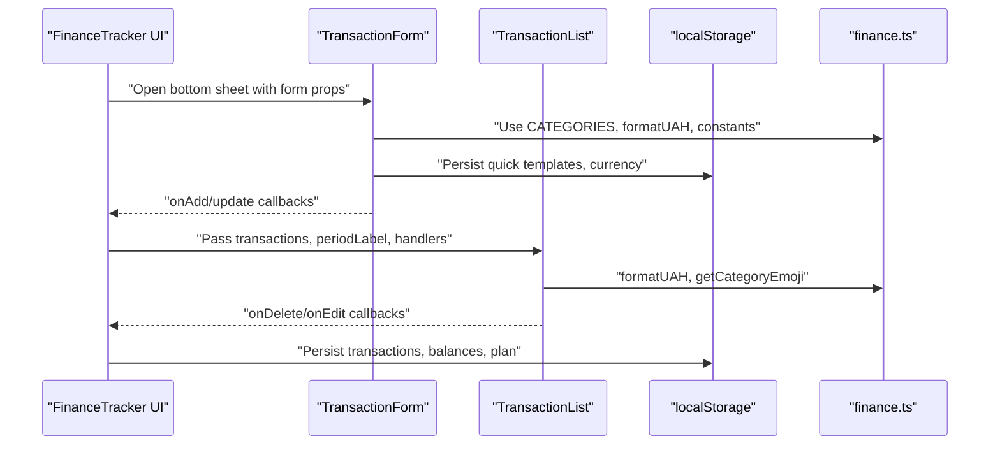

**Diagram sources**
- [finance-tracker.tsx:57-545](file://components/finance-tracker.tsx#L57-L545)
- [transaction-form.tsx:103-448](file://components/transaction-form.tsx#L103-L448)
- [transaction-list.tsx:14-102](file://components/transaction-list.tsx#L14-L102)
- [finance.ts:16-124](file://lib/finance.ts#L16-L124)

**Section sources**
- [finance-tracker.tsx:57-545](file://components/finance-tracker.tsx#L57-L545)

## Detailed Component Analysis

### CategorySelect
- Purpose: Dropdown for choosing transaction categories with animated presentation and keyboard/mouse interaction.
- Business logic:
  - Maintains open/closed state and handles document click/escape to close.
  - Renders selected category with icon and color.
  - Presents category list with icons, colors, and selection feedback.
- Data handling:
  - Receives categories array, current value, and onChange callback.
  - Uses CategoryInfo and CategoryIconName from finance.ts.
- Accessibility:
  - Proper aria-haspopup, aria-expanded, role="listbox/option", aria-selected.
- Props:
  - categories: readonly CategoryInfo[]
  - value: string
  - onChange: (next: string) => void
  - onKeepInputFocus?: () => void
- Events:
  - Clicks trigger onChange and optional focus retention.
- Customization:
  - Colors and icons mapped via ICONS registry.
- Performance:
  - Uses spring animations; list items animate in sequence.

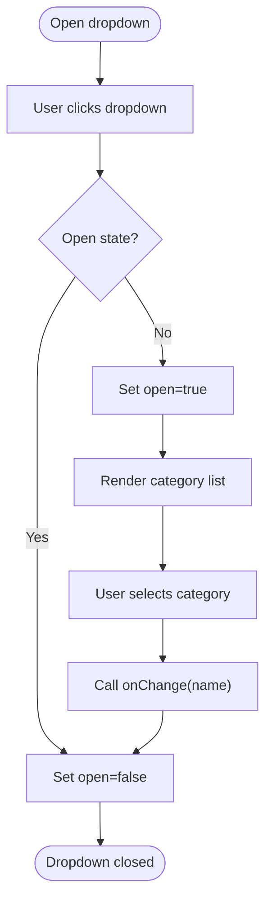

**Diagram sources**
- [category-select.tsx:44-163](file://components/category-select.tsx#L44-L163)

**Section sources**
- [category-select.tsx:1-163](file://components/category-select.tsx#L1-L163)
- [finance.ts:1-52](file://lib/finance.ts#L1-L52)

### BalanceCard
- Purpose: Summarizes global balance (card + cash), shows cash, savings, and allows currency switching.
- Business logic:
  - Computes global balance as card + cash.
  - Provides currency switcher with three options and active state.
  - Uses formatUAH for consistent currency display.
- Data handling:
  - Props include card, cash, savings, currency, and onCurrencyChange.
- Accessibility:
  - Buttons use aria-pressed for active state.
- Props:
  - card: number
  - cash: number
  - savings: number
  - currency: CurrencyCode
  - onCurrencyChange: (currency: CurrencyCode) => void
- Events:
  - Currency buttons call onCurrencyChange.
- Customization:
  - Gradient backgrounds and color accents.
- Performance:
  - Stateless component; renders quickly.

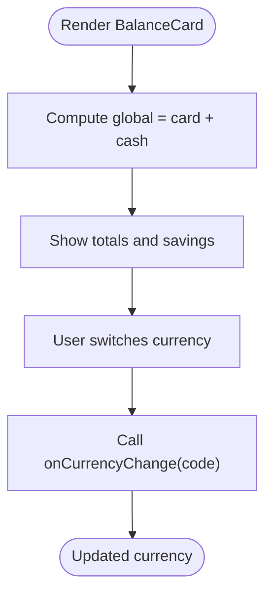

**Diagram sources**
- [balance-card.tsx:11-80](file://components/balance-card.tsx#L11-L80)
- [finance.ts:93-123](file://lib/finance.ts#L93-L123)

**Section sources**
- [balance-card.tsx:1-80](file://components/balance-card.tsx#L1-L80)
- [finance.ts:93-123](file://lib/finance.ts#L93-L123)

### FinanceHeader
- Purpose: Navigation and controls for period selection, history toggle, and settings.
- Business logic:
  - Toggles month/year picker with overlay.
  - Navigates periods via onDateChange.
  - Controls history visibility and settings modal.
- Data handling:
  - Props include periodLabel, currentDate, handlers, and historyOpen flag.
- Accessibility:
  - Uses aria-labels and aria-pressed for interactive elements.
- Props:
  - periodLabel: string
  - currentDate: Date
  - onDateChange: (date: Date) => void
  - onToggleHistory: () => void
  - historyOpen: boolean
  - onOpenSettings: () => void
- Events:
  - Month/year selection updates date.
  - History/settings toggles call respective handlers.
- Customization:
  - Month names configured locally.
- Performance:
  - Lightweight; picker overlays use fixed positioning.

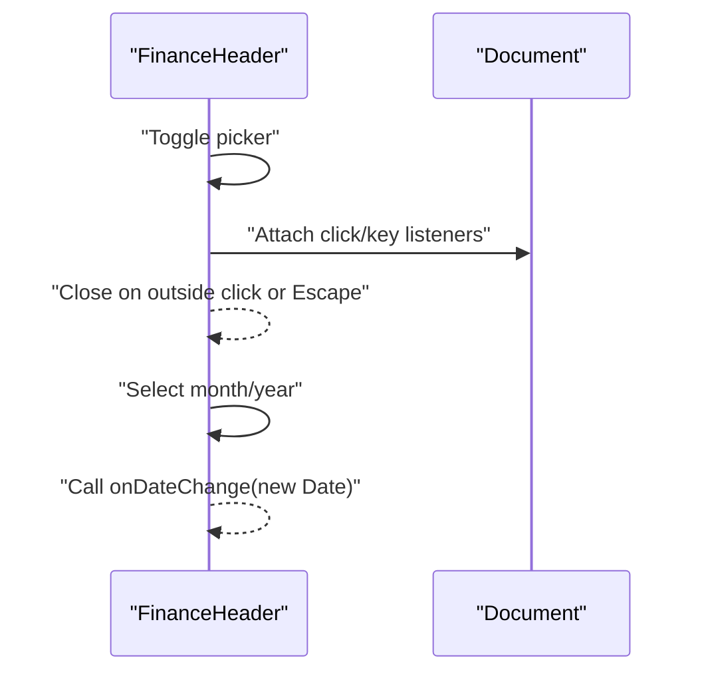

**Diagram sources**
- [finance-header.tsx:20-129](file://components/finance-header.tsx#L20-L129)

**Section sources**
- [finance-header.tsx:1-129](file://components/finance-header.tsx#L1-L129)

### TransactionForm
- Purpose: Smart transaction entry with type toggling, destination selection, category dropdown, quick templates, math keypad, and clipboard integration.
- Business logic:
  - Type toggle switches between income/expense and resets category.
  - Destination selection varies by type (card, cash, savings for income).
  - Category dropdown uses CategorySelect.
  - Quick templates provide instant amounts and categories.
  - Math keypad inserts operators for iOS decimal input.
  - Clipboard parsing extracts amount and category from text.
  - Expression evaluation supports basic arithmetic.
  - Transfer action moves money between card/cash.
- Data handling:
  - Props include isIncome, amount, name, isRecurring, currency, quickTemplates, category, destination, and callbacks.
  - Uses CATEGORIES, formatUAH, and TransactionDestination from finance.ts.
- Accessibility:
  - Proper labels, aria-pressed, and keyboard support (Enter/Escape).
- Props:
  - isIncome: boolean
  - setIsIncome: (v: boolean) => void
  - amount: string
  - setAmount: (v: string) => void
  - name: string
  - setName: (v: string) => void
  - isRecurring: boolean
  - setIsRecurring: (v: boolean) => void
  - currency: CurrencyCode
  - quickTemplates: QuickTemplate[]
  - onApplyTemplate: (template: QuickTemplate) => void
  - category: string
  - setCategory: (v: string) => void
  - destination: TransactionDestination
  - setDestination: (v: TransactionDestination) => void
  - onTransfer?: () => void
  - onAdd: () => void
  - onCancelEdit?: () => void
  - isEditing: boolean
- Events:
  - Submit resolves expression, sets amount, and calls onAdd.
  - Paste reads clipboard and parses amount/category.
  - Template selection applies amount/category/name.
- Customization:
  - Quick templates configurable; fallbacks provided.
  - Icons mapped per template label.
- Performance:
  - Focus management optimized for mobile; requestAnimationFrame retries.
  - Expression preview computed on change.

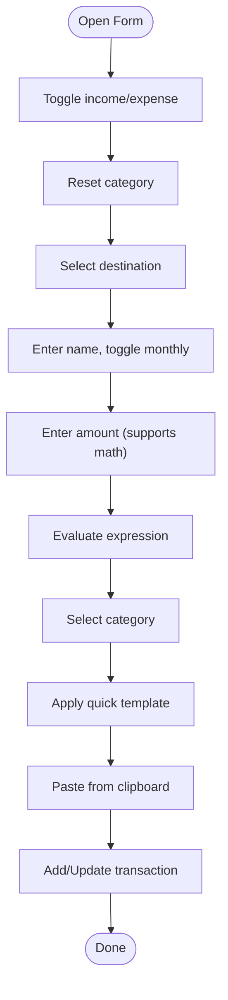

**Diagram sources**
- [transaction-form.tsx:103-448](file://components/transaction-form.tsx#L103-L448)
- [category-select.tsx:44-163](file://components/category-select.tsx#L44-L163)
- [finance.ts:16-52](file://lib/finance.ts#L16-L52)

**Section sources**
- [transaction-form.tsx:1-448](file://components/transaction-form.tsx#L1-L448)
- [finance.ts:16-52](file://lib/finance.ts#L16-L52)

### TransactionList
- Purpose: Displays transactions for the selected period with edit/delete actions.
- Business logic:
  - Renders signed amounts with income/expense colors.
  - Shows optional name, category emoji, date, and destination.
  - Provides edit and delete actions.
- Data handling:
  - Props include transactions, periodLabel, handlers, and currency.
  - Uses formatUAH and getCategoryEmoji from finance.ts.
- Accessibility:
  - Buttons use aria-labels and icons for actions.
- Props:
  - transactions: Transaction[]
  - periodLabel: string
  - onDelete: (id: number) => void
  - onEdit: (tx: Transaction) => void
  - currency: CurrencyCode
- Events:
  - Edit/Delete call respective handlers.
- Customization:
  - Destination badges adapt color by destination.
- Performance:
  - Stateless rendering; minimal reflows.

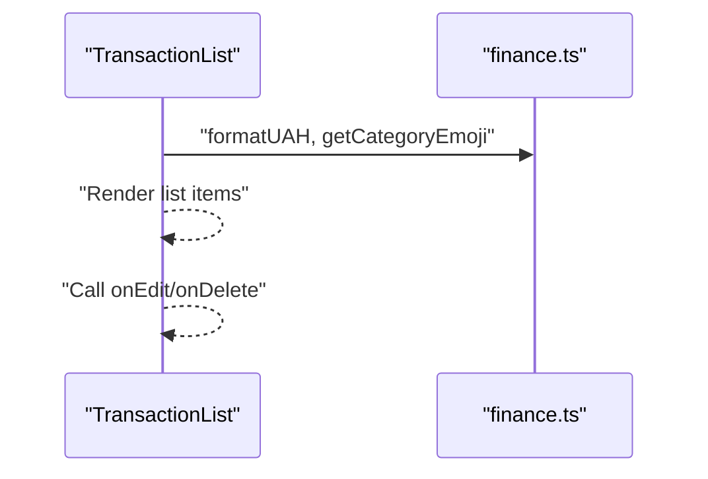

**Diagram sources**
- [transaction-list.tsx:14-102](file://components/transaction-list.tsx#L14-L102)
- [finance.ts:54-57](file://lib/finance.ts#L54-L57)

**Section sources**
- [transaction-list.tsx:1-102](file://components/transaction-list.tsx#L1-L102)
- [finance.ts:54-57](file://lib/finance.ts#L54-L57)

### SpendingChart
- Purpose: Visualizes expense breakdown by category and shows forecasted remaining funds.
- Business logic:
  - Builds pie chart segments from expense categories.
  - Calculates percentage per category and displays bars with category colors.
  - Shows forecast value based on current habits and remaining days.
- Data handling:
  - Props include data (ChartDatum[]), totalExpense, currency, and forecastValue.
  - Uses COLORS and CATEGORIES from finance.ts.
- Accessibility:
  - Uses aria-hidden for decorative icons; labels via text content.
- Props:
  - data: ChartDatum[]
  - totalExpense: number
  - currency: CurrencyCode
  - forecastValue: number
- Customization:
  - Colors cycle through predefined palette.
- Performance:
  - Recharts-based; responsive container adapts to layout.

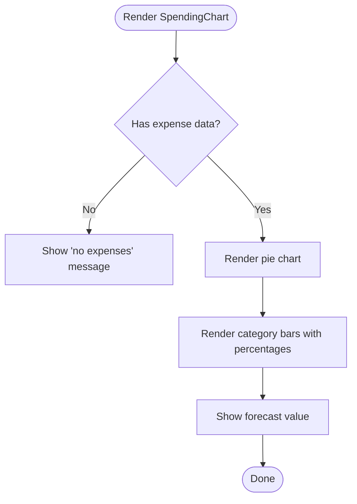

**Diagram sources**
- [spending-chart.tsx:16-96](file://components/spending-chart.tsx#L16-L96)
- [finance.ts:37-37](file://lib/finance.ts#L37-L37)

**Section sources**
- [spending-chart.tsx:1-96](file://components/spending-chart.tsx#L1-L96)
- [finance.ts:37-37](file://lib/finance.ts#L37-L37)

### SummaryCards
- Purpose: Displays total income and total expenses for the period.
- Business logic:
  - Formats totals with plus/minus sign depending on value.
  - Uses distinct colors for income vs. expenses.
- Data handling:
  - Props include totalIncome, totalExpense, and currency.
  - Uses formatUAH from finance.ts.
- Accessibility:
  - Emphasizes contrast and readable typography.
- Props:
  - totalIncome: number
  - totalExpense: number
  - currency: CurrencyCode
- Performance:
  - Stateless component.

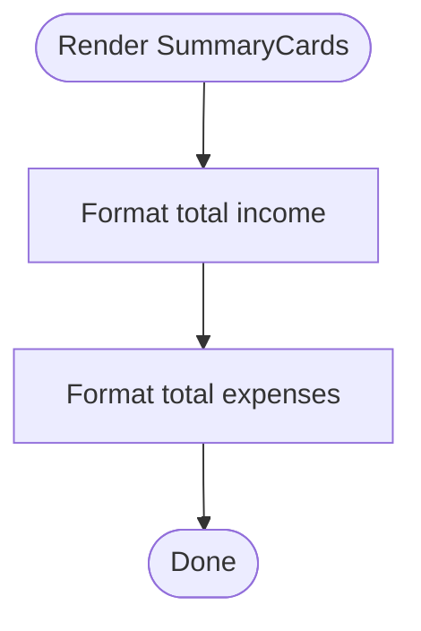

**Diagram sources**
- [summary-cards.tsx:10-50](file://components/summary-cards.tsx#L10-L50)
- [finance.ts:109-123](file://lib/finance.ts#L109-L123)

**Section sources**
- [summary-cards.tsx:1-50](file://components/summary-cards.tsx#L1-L50)
- [finance.ts:109-123](file://lib/finance.ts#L109-L123)

### ThemeProvider
- Purpose: Provides dark/light mode switching using next-themes.
- Business logic:
  - Thin wrapper around NextThemesProvider.
- Props:
  - Inherits ThemeProviderProps from next-themes.
- Integration:
  - Wrapped around app root to enable theme switching.

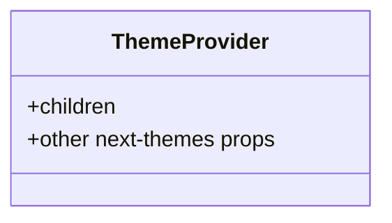

**Diagram sources**
- [theme-provider.tsx:9-11](file://components/theme-provider.tsx#L9-L11)

**Section sources**
- [theme-provider.tsx:1-12](file://components/theme-provider.tsx#L1-L12)

## Dependency Analysis
The specialized components depend on shared domain types and helpers in finance.ts and integrate with FinanceTracker for state and persistence.

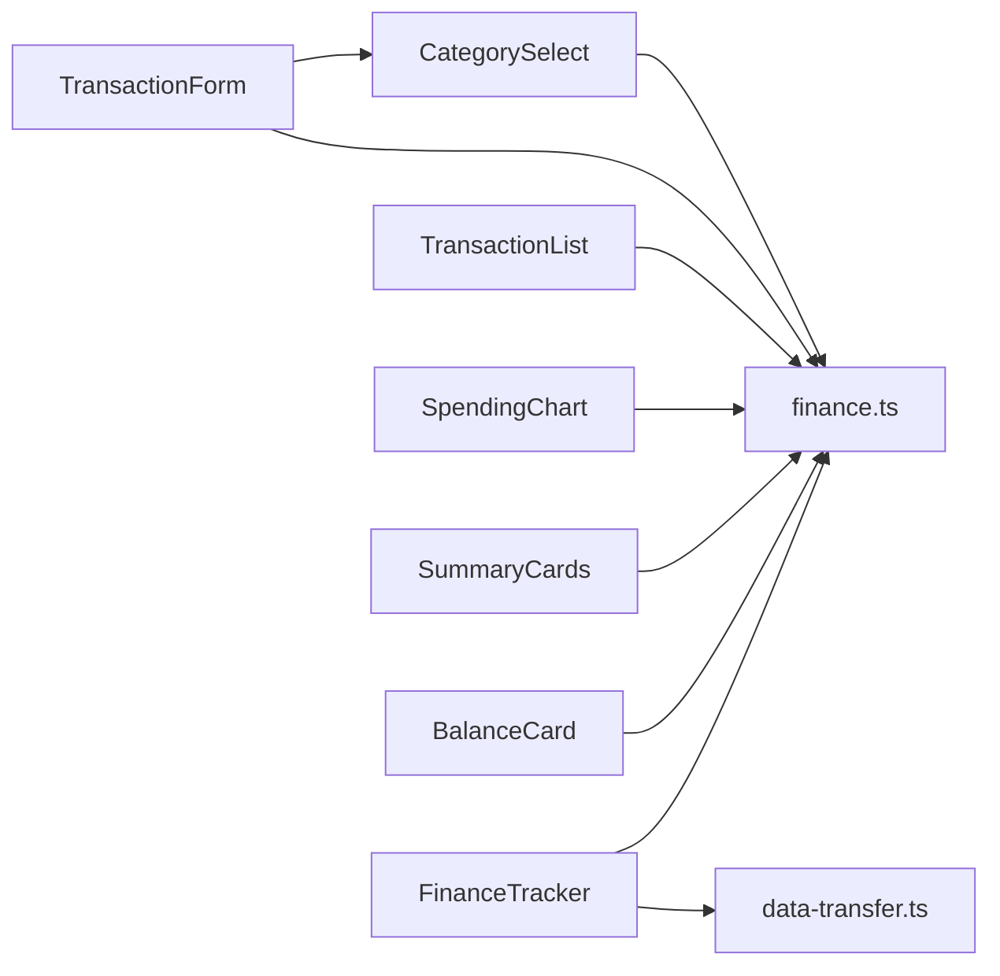

**Diagram sources**
- [category-select.tsx:21-21](file://components/category-select.tsx#L21-L21)
- [transaction-form.tsx:22-23](file://components/transaction-form.tsx#L22-L23)
- [transaction-list.tsx:4-4](file://components/transaction-list.tsx#L4-L4)
- [spending-chart.tsx:5-5](file://components/spending-chart.tsx#L5-L5)
- [summary-cards.tsx:2-2](file://components/summary-cards.tsx#L2-L2)
- [balance-card.tsx:1-1](file://components/balance-card.tsx#L1-L1)
- [finance-tracker.tsx:6-16](file://components/finance-tracker.tsx#L6-L16)
- [data-transfer.ts:1-1](file://lib/data-transfer.ts#L1-L1)

**Section sources**
- [finance.ts:1-124](file://lib/finance.ts#L1-L124)
- [finance-tracker.tsx:1-545](file://components/finance-tracker.tsx#L1-L545)

## Performance Considerations
- Animation and UX:
  - CategorySelect and FinanceHeader use framer-motion; ensure smooth animation by avoiding layout thrashing and keeping lists short.
  - TransactionForm defers focus and uses requestAnimationFrame to optimize mobile input behavior.
- Rendering:
  - TransactionList and SpendingChart render many DOM nodes; memoize derived data (e.g., chartData) to minimize re-renders.
- Data access:
  - FinanceTracker computes totals and chart data from transactions; cache where possible to reduce repeated filtering/reducing.
- Storage:
  - LocalStorage writes are batched; avoid frequent writes by debouncing or batching state updates.
- Clipboard:
  - TransactionForm’s clipboard read is asynchronous; handle errors gracefully and avoid blocking UI.

[No sources needed since this section provides general guidance]

## Troubleshooting Guide
- Clipboard integration:
  - If paste does not work, ensure browser permissions allow clipboard access and that the clipboard contains a parsable amount or merchant hint.
- Category selection:
  - If the dropdown does not close, verify document click listeners are attached and not prematurely removed.
- Amount parsing:
  - Expression evaluation accepts basic arithmetic; ensure input matches expected numeric format and positive values.
- Currency display:
  - If currency symbols appear incorrect, confirm currency code and conversion rates in finance.ts.
- History view:
  - If past months do not appear, check localStorage keys and ensure they match expected patterns (finance_YYYY_MM, plan_YYYY_MM).

**Section sources**
- [transaction-form.tsx:183-200](file://components/transaction-form.tsx#L183-L200)
- [category-select.tsx:51-65](file://components/category-select.tsx#L51-L65)
- [finance.ts:93-123](file://lib/finance.ts#L93-L123)
- [finance-tracker.tsx:859-991](file://components/finance-tracker.tsx#L859-L991)

## Conclusion
These specialized components form the backbone of finTracker’s finance domain. They combine robust business logic with thoughtful UX, strong accessibility, and efficient data handling. By leveraging shared domain types and helpers, they remain cohesive and extensible while enabling powerful features like smart transaction entry, visualization, and persistence.

[No sources needed since this section summarizes without analyzing specific files]

## Appendices

### Usage Examples and Integration Patterns
- Integrating CategorySelect:
  - Pass categories from CATEGORIES, bind value and onChange to parent state, and optionally keep input focus after selection.
- Using BalanceCard:
  - Provide card, cash, savings, and currency; wire onCurrencyChange to persist and update display.
- FinanceHeader:
  - Bind periodLabel, currentDate, and onDateChange to navigate periods; connect historyOpen and onToggleHistory to show/hide history.
- TransactionForm:
  - Wire isIncome, amount, name, isRecurring, category, destination, and callbacks; use quickTemplates for convenience.
- TransactionList:
  - Pass transactions, periodLabel, and handlers for edit/delete; ensure currency formatting is consistent.
- SpendingChart:
  - Build data from expense categories and totals; pass forecastValue for projected remaining funds.
- SummaryCards:
  - Provide totalIncome and totalExpense; ensure currency is consistent across the app.
- ThemeProvider:
  - Wrap the app with ThemeProvider to enable theme switching.

**Section sources**
- [finance-tracker.tsx:409-545](file://components/finance-tracker.tsx#L409-L545)
- [finance.ts:16-52](file://lib/finance.ts#L16-L52)

### Extension Guidelines
- Adding new categories:
  - Extend CATEGORIES in finance.ts with new CategoryInfo entries; update icons and colors as needed.
- Customizing TransactionForm:
  - Add new quick templates; extend merchant keyword mapping for smarter clipboard parsing.
- Enhancing Visualization:
  - Modify SpendingChart to include more granular slices or additional metrics.
- Persistence:
  - Use data-transfer.ts patterns for importing/exporting backups; ensure schema versioning and validation.

**Section sources**
- [finance.ts:16-52](file://lib/finance.ts#L16-L52)
- [data-transfer.ts:3-114](file://lib/data-transfer.ts#L3-L114)