# UI Component Library

<cite>
**Referenced Files in This Document**
- [button.tsx](file://components/ui/button.tsx)
- [input.tsx](file://components/ui/input.tsx)
- [form.tsx](file://components/ui/form.tsx)
- [field.tsx](file://components/ui/field.tsx)
- [label.tsx](file://components/ui/label.tsx)
- [textarea.tsx](file://components/ui/textarea.tsx)
- [checkbox.tsx](file://components/ui/checkbox.tsx)
- [radio-group.tsx](file://components/ui/radio-group.tsx)
- [select.tsx](file://components/ui/select.tsx)
- [category-select.tsx](file://components/category-select.tsx)
- [balance-card.tsx](file://components/balance-card.tsx)
- [theme-provider.tsx](file://components/theme-provider.tsx)
- [transaction-form.tsx](file://components/transaction-form.tsx)
- [utils.ts](file://lib/utils.ts)
- [layout.tsx](file://app/layout.tsx)
</cite>

## Table of Contents
1. [Introduction](#introduction)
2. [Project Structure](#project-structure)
3. [Core Components](#core-components)
4. [Architecture Overview](#architecture-overview)
5. [Detailed Component Analysis](#detailed-component-analysis)
6. [Dependency Analysis](#dependency-analysis)
7. [Performance Considerations](#performance-considerations)
8. [Accessibility Features](#accessibility-features)
9. [Responsive Design and Cross-Browser Compatibility](#responsive-design-and-cross-browser-compatibility)
10. [Styling and Animation Guidelines](#styling-and-animation-guidelines)
11. [Extending Components and Maintaining Consistency](#extending-components-and-maintaining-consistency)
12. [Troubleshooting Guide](#troubleshooting-guide)
13. [Conclusion](#conclusion)

## Introduction
This document describes finTracker’s UI component library, focusing on base components (Button, Input, Form, Field, Label, Textarea, Checkbox, RadioGroup, Select), specialized components (CategorySelect, BalanceCard, ThemeProvider), and the composition patterns that unify Radix UI primitives with Tailwind CSS. It also covers integration with React Hook Form, accessibility, responsiveness, cross-browser compatibility, animations with Framer Motion, and guidelines for extending and maintaining consistency across the application.

## Project Structure
The UI library is organized under components/ui for shared base components and components for domain-specific widgets. Utility helpers centralize Tailwind class merging, while the app layout defines global fonts, viewport, and theme background.

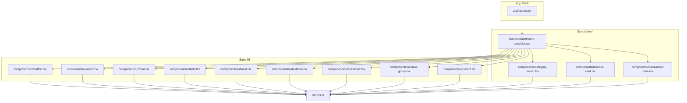

**Diagram sources**
- [layout.tsx:39-52](file://app/layout.tsx#L39-L52)
- [button.tsx:1-61](file://components/ui/button.tsx#L1-L61)
- [input.tsx:1-22](file://components/ui/input.tsx#L1-L22)
- [form.tsx:1-168](file://components/ui/form.tsx#L1-L168)
- [field.tsx:1-245](file://components/ui/field.tsx#L1-L245)
- [label.tsx:1-25](file://components/ui/label.tsx#L1-L25)
- [textarea.tsx:1-19](file://components/ui/textarea.tsx#L1-L19)
- [checkbox.tsx:1-33](file://components/ui/checkbox.tsx#L1-L33)
- [radio-group.tsx:1-46](file://components/ui/radio-group.tsx#L1-L46)
- [select.tsx:1-186](file://components/ui/select.tsx#L1-L186)
- [category-select.tsx:1-163](file://components/category-select.tsx#L1-L163)
- [balance-card.tsx:1-80](file://components/balance-card.tsx#L1-L80)
- [theme-provider.tsx:1-12](file://components/theme-provider.tsx#L1-L12)
- [transaction-form.tsx:1-401](file://components/transaction-form.tsx#L1-L401)
- [utils.ts:1-7](file://lib/utils.ts#L1-L7)

**Section sources**
- [layout.tsx:39-52](file://app/layout.tsx#L39-L52)
- [utils.ts:1-7](file://lib/utils.ts#L1-L7)

## Core Components
This section documents the foundational UI components and their composition patterns.

- Button
  - Purpose: Unified button primitive with variant and size scales, supporting slottable rendering.
  - Variants: default, destructive, outline, secondary, ghost, link.
  - Sizes: default, sm, lg, icon, icon-sm, icon-lg.
  - Accessibility: Focus-visible ring, aria-invalid integration, pointer-events disabled state.
  - Composition: Uses cva for variants, Radix Slot for polymorphism, and cn for class merging.

- Input
  - Purpose: Text input with focus-visible ring, invalid state styling, and consistent padding.
  - Accessibility: Focus-visible ring, aria-invalid integration.

- Form (React Hook Form integration)
  - Purpose: Provides FormProvider, FormField, FormItem, FormLabel, FormControl, FormDescription, FormMessage.
  - Accessibility: Auto-associates labels, manages aria-describedby and aria-invalid, exposes useFormField hook.

- Field (Form grouping utilities)
  - Purpose: Field, FieldLabel, FieldDescription, FieldError, FieldGroup, FieldLegend, FieldSeparator, FieldSet, FieldContent, FieldTitle.
  - Orientation: vertical, horizontal, responsive.
  - Accessibility: Supports invalid state, nested grouping semantics.

- Label
  - Purpose: Styled label with disabled state handling and peer/peer-disabled utilities.

- Textarea
  - Purpose: Multi-line text input with focus-visible ring and invalid state styling.

- Checkbox
  - Purpose: Checkbox with indicator, focus-visible ring, and checked state styling.

- RadioGroup
  - Purpose: Radio group container and item with indicator.

- Select
  - Purpose: Select menu built on Radix UI with trigger, content, items, separators, and scroll buttons.

**Section sources**
- [button.tsx:7-37](file://components/ui/button.tsx#L7-L37)
- [input.tsx:5-19](file://components/ui/input.tsx#L5-L19)
- [form.tsx:19-167](file://components/ui/form.tsx#L19-L167)
- [field.tsx:57-95](file://components/ui/field.tsx#L57-L95)
- [label.tsx:8-22](file://components/ui/label.tsx#L8-L22)
- [textarea.tsx:5-15](file://components/ui/textarea.tsx#L5-L15)
- [checkbox.tsx:9-29](file://components/ui/checkbox.tsx#L9-L29)
- [radio-group.tsx:9-43](file://components/ui/radio-group.tsx#L9-L43)
- [select.tsx:9-86](file://components/ui/select.tsx#L9-L86)

## Architecture Overview
The component library composes Radix UI primitives with Tailwind utility classes and optional animations via Framer Motion. React Hook Form is integrated at the Form level to provide robust form state, validation, and accessibility attributes.

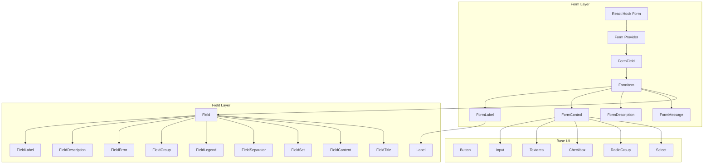

**Diagram sources**
- [form.tsx:19-167](file://components/ui/form.tsx#L19-L167)
- [field.tsx:57-95](file://components/ui/field.tsx#L57-L95)
- [label.tsx:8-22](file://components/ui/label.tsx#L8-L22)
- [input.tsx:5-19](file://components/ui/input.tsx#L5-L19)
- [textarea.tsx:5-15](file://components/ui/textarea.tsx#L5-L15)
- [checkbox.tsx:9-29](file://components/ui/checkbox.tsx#L9-L29)
- [radio-group.tsx:9-43](file://components/ui/radio-group.tsx#L9-L43)
- [select.tsx:9-86](file://components/ui/select.tsx#L9-L86)

## Detailed Component Analysis

### Button
- Props
  - className: Additional Tailwind classes.
  - variant: One of default, destructive, outline, secondary, ghost, link.
  - size: One of default, sm, lg, icon, icon-sm, icon-lg.
  - asChild: Render using Radix Slot to preserve semantic semantics.
  - Native button props: disabled, type, onClick, etc.
- Events: Standard button events (onClick, onPointerDown).
- Accessibility: Focus-visible ring, aria-invalid integration, pointer-events disabled state.
- Styling: Uses cva variants and cn for merging.

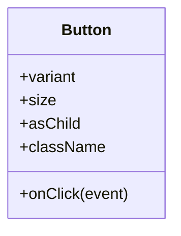

**Diagram sources**
- [button.tsx:39-58](file://components/ui/button.tsx#L39-L58)

**Section sources**
- [button.tsx:7-37](file://components/ui/button.tsx#L7-L37)
- [button.tsx:39-58](file://components/ui/button.tsx#L39-L58)

### Input
- Props
  - className: Additional Tailwind classes.
  - type: HTML input type.
  - Native input props: value, onChange, onBlur, etc.
- Accessibility: Focus-visible ring, aria-invalid integration.
- Styling: Tailwind utilities for border, padding, transitions, and selection colors.

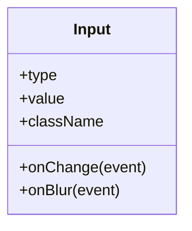

**Diagram sources**
- [input.tsx:5-19](file://components/ui/input.tsx#L5-L19)

**Section sources**
- [input.tsx:5-19](file://components/ui/input.tsx#L5-L19)

### Form (React Hook Form integration)
- Components
  - Form: Wrapper around FormProvider.
  - FormField: Wraps Controller with context.
  - FormItem: Provides unique ID context.
  - FormLabel: Styled label bound to form item.
  - FormControl: Slot that injects aria-* attributes.
  - FormDescription: Light descriptive text.
  - FormMessage: Renders validation messages.
- Hooks
  - useFormField: Exposes id, name, aria attributes, and field state.
- Accessibility
  - Associates labels with inputs via htmlFor.
  - Sets aria-describedby and aria-invalid automatically.
  - Ensures screen reader-friendly messaging.

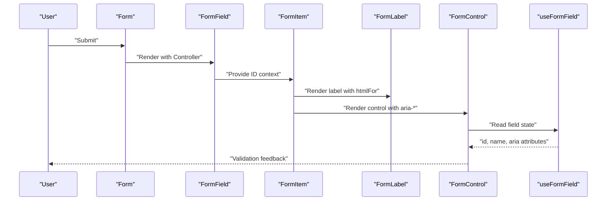

**Diagram sources**
- [form.tsx:19-167](file://components/ui/form.tsx#L19-L167)

**Section sources**
- [form.tsx:19-167](file://components/ui/form.tsx#L19-L167)

### Field (Form grouping utilities)
- Props
  - orientation: vertical, horizontal, responsive.
  - className: Additional Tailwind classes.
- Features
  - FieldGroup, FieldLegend, FieldSeparator, FieldSet, FieldContent, FieldTitle.
  - FieldError supports single message or list rendering.
- Accessibility
  - Invalid state styling, nested grouping semantics.

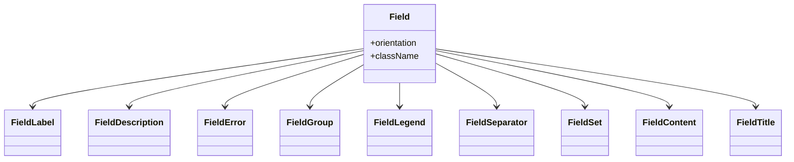

**Diagram sources**
- [field.tsx:57-95](file://components/ui/field.tsx#L57-L95)
- [field.tsx:110-139](file://components/ui/field.tsx#L110-L139)
- [field.tsx:141-154](file://components/ui/field.tsx#L141-L154)
- [field.tsx:186-231](file://components/ui/field.tsx#L186-L231)

**Section sources**
- [field.tsx:57-95](file://components/ui/field.tsx#L57-L95)
- [field.tsx:110-139](file://components/ui/field.tsx#L110-L139)
- [field.tsx:141-154](file://components/ui/field.tsx#L141-L154)
- [field.tsx:186-231](file://components/ui/field.tsx#L186-L231)

### Label
- Props
  - className: Additional Tailwind classes.
- Behavior
  - Disabled state handling via peer-disabled utilities.

**Section sources**
- [label.tsx:8-22](file://components/ui/label.tsx#L8-L22)

### Textarea
- Props
  - className: Additional Tailwind classes.
- Accessibility: Focus-visible ring, aria-invalid integration.

**Section sources**
- [textarea.tsx:5-15](file://components/ui/textarea.tsx#L5-L15)

### Checkbox
- Props
  - className: Additional Tailwind classes.
- Behavior
  - Checked state styling, focus-visible ring, indicator.

**Section sources**
- [checkbox.tsx:9-29](file://components/ui/checkbox.tsx#L9-L29)

### RadioGroup
- Props
  - className: Additional Tailwind classes.
- Behavior
  - Indicator with fill circle, focus-visible ring.

**Section sources**
- [radio-group.tsx:9-43](file://components/ui/radio-group.tsx#L9-L43)

### Select
- Props
  - Root: Base Select element.
  - Trigger: size (sm, default), children, className.
  - Content: position (popper), children, className.
  - Item: children, className.
  - Scroll buttons: up/down.
  - Value, Group, Label, Separator.
- Accessibility
  - Popover positioning, scroll controls, indicator.

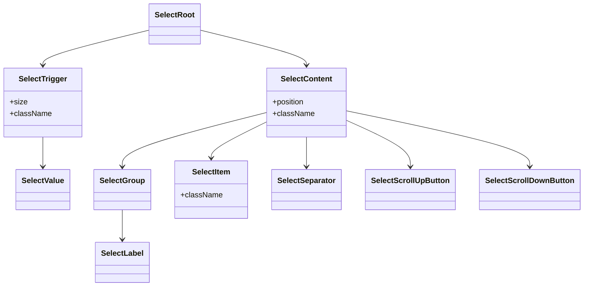

**Diagram sources**
- [select.tsx:9-86](file://components/ui/select.tsx#L9-L86)
- [select.tsx:101-123](file://components/ui/select.tsx#L101-L123)
- [select.tsx:138-172](file://components/ui/select.tsx#L138-L172)

**Section sources**
- [select.tsx:9-86](file://components/ui/select.tsx#L9-L86)
- [select.tsx:101-123](file://components/ui/select.tsx#L101-L123)
- [select.tsx:138-172](file://components/ui/select.tsx#L138-L172)

### CategorySelect
- Purpose: Animated category picker with icons, colors, and keyboard/mouse interactions.
- Props
  - categories: readonly CategoryInfo[].
  - value: string (selected category name).
  - onChange: (next: string) => void.
  - onKeepInputFocus?: () => void.
- Interactions
  - Click/toggle dropdown, click option to select, Escape to close, document clicks outside to close.
- Accessibility
  - aria-haspopup, aria-expanded, role="listbox", role="option", aria-selected.
- Animation
  - Framer Motion for dropdown entrance/exit and staggered item animations.

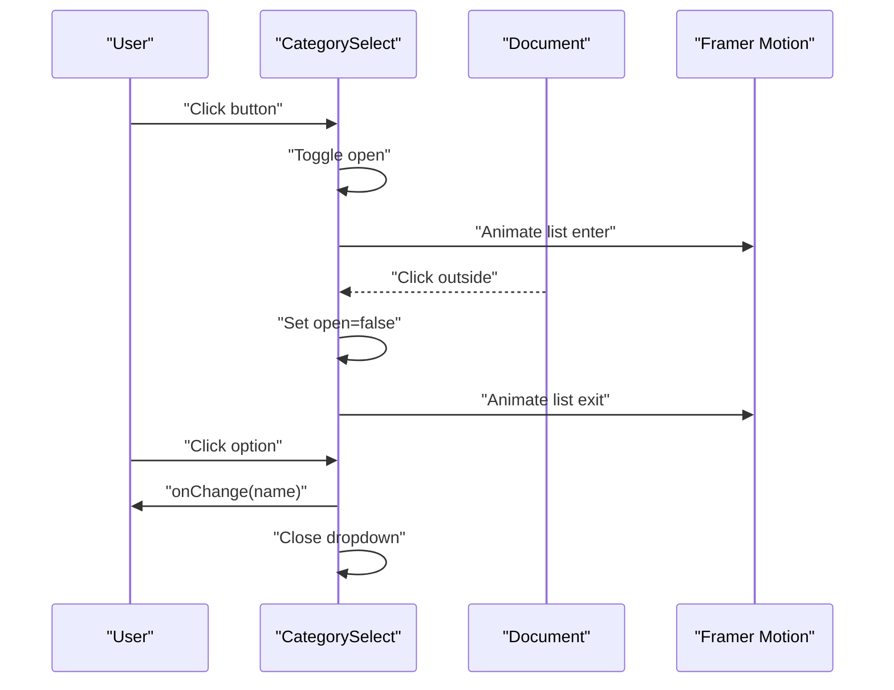

**Diagram sources**
- [category-select.tsx:44-162](file://components/category-select.tsx#L44-L162)

**Section sources**
- [category-select.tsx:37-42](file://components/category-select.tsx#L37-L42)
- [category-select.tsx:44-162](file://components/category-select.tsx#L44-L162)

### BalanceCard
- Purpose: Financial summary card with currency switch and gradient glow effects.
- Props
  - card: number.
  - cash: number.
  - savings: number.
  - currency: CurrencyCode.
  - onCurrencyChange: (currency: CurrencyCode) => void.
- Interactions
  - Currency toggle buttons with pressed state and shadow highlight.
- Accessibility
  - aria-pressed on currency buttons.

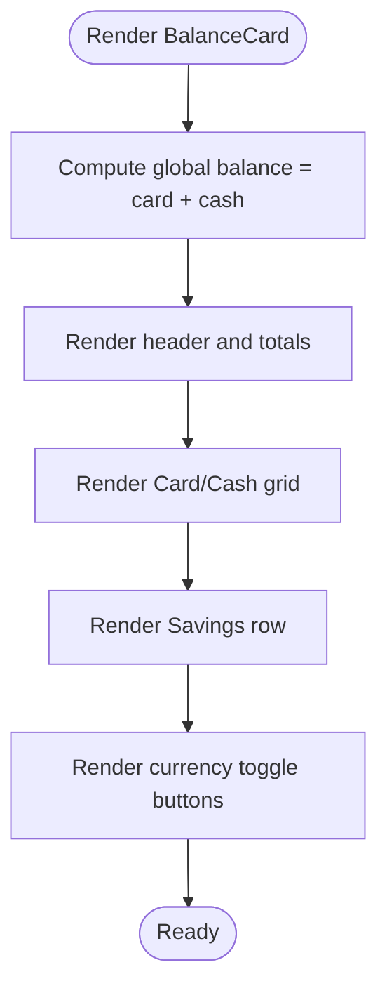

**Diagram sources**
- [balance-card.tsx:11-79](file://components/balance-card.tsx#L11-L79)

**Section sources**
- [balance-card.tsx:3-9](file://components/balance-card.tsx#L3-L9)
- [balance-card.tsx:11-79](file://components/balance-card.tsx#L11-L79)

### ThemeProvider
- Purpose: Dark/light mode switching powered by next-themes.
- Props
  - children: ReactNode.
  - Other next-themes props (e.g., storageKey, themes, defaultTheme).
- Integration
  - Wraps app shell to enable theme-aware components.

**Section sources**
- [theme-provider.tsx:9-11](file://components/theme-provider.tsx#L9-L11)

### TransactionForm
- Purpose: Full-featured transaction entry form with smart parsing, templates, and math keyboard.
- Props
  - isIncome, setIsIncome
  - amount, setAmount
  - name, setName
  - isRecurring, setIsRecurring
  - currency
  - quickTemplates, onApplyTemplate
  - category, setCategory
  - onAdd, onCancelEdit, isEditing
- Features
  - Type toggle (Expense/Income).
  - Smart paste from clipboard with amount extraction and category hints.
  - Expression evaluation with live preview.
  - Quick templates and math accessory bar.
  - Focus management for mobile and dynamic updates.
- Accessibility
  - Proper labels, aria-pressed, aria-haspopup, aria-expanded.

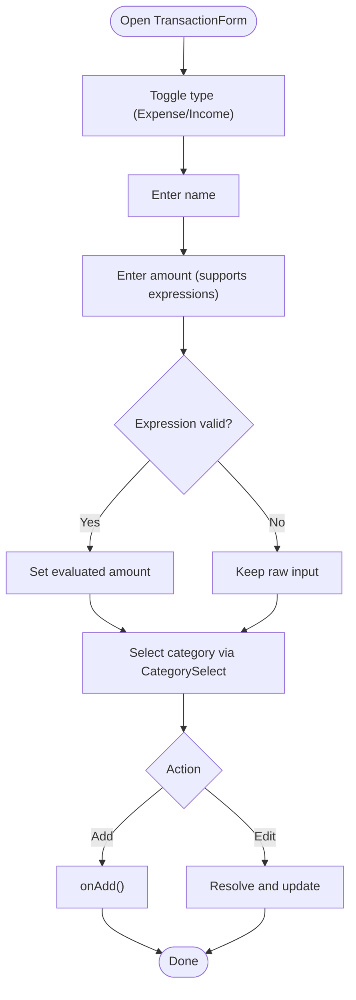

**Diagram sources**
- [transaction-form.tsx:96-400](file://components/transaction-form.tsx#L96-L400)

**Section sources**
- [transaction-form.tsx:77-94](file://components/transaction-form.tsx#L77-L94)
- [transaction-form.tsx:113-400](file://components/transaction-form.tsx#L113-L400)

## Dependency Analysis
- Component coupling
  - Base components depend on Radix UI primitives and Tailwind utilities.
  - Form components depend on React Hook Form and Radix UI labels.
  - Specialized components (CategorySelect, BalanceCard, TransactionForm) compose base components and optionally integrate animations.
- Class merging
  - All components use cn from lib/utils.ts to merge classes safely.

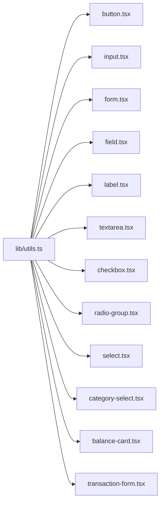

**Diagram sources**
- [utils.ts:4-6](file://lib/utils.ts#L4-L6)
- [button.tsx:5-5](file://components/ui/button.tsx#L5-L5)
- [input.tsx:3-3](file://components/ui/input.tsx#L3-L3)
- [form.tsx:16-16](file://components/ui/form.tsx#L16-L16)
- [field.tsx:6-6](file://components/ui/field.tsx#L6-L6)
- [label.tsx:6-6](file://components/ui/label.tsx#L6-L6)
- [textarea.tsx:3-3](file://components/ui/textarea.tsx#L3-L3)
- [checkbox.tsx:7-7](file://components/ui/checkbox.tsx#L7-L7)
- [radio-group.tsx:7-7](file://components/ui/radio-group.tsx#L7-L7)
- [select.tsx:7-7](file://components/ui/select.tsx#L7-L7)
- [category-select.tsx:4-4](file://components/category-select.tsx#L4-L4)
- [balance-card.tsx:1-1](file://components/balance-card.tsx#L1-L1)
- [transaction-form.tsx:3-3](file://components/transaction-form.tsx#L3-L3)

**Section sources**
- [utils.ts:4-6](file://lib/utils.ts#L4-L6)

## Performance Considerations
- Prefer slottable components (asChild) to avoid extra DOM wrappers.
- Use cva variants judiciously to minimize class churn.
- Defer heavy computations (expression parsing) to effect callbacks and memoization where appropriate.
- Limit re-renders by passing stable callbacks and avoiding unnecessary prop drilling.
- Use Framer Motion sparingly; ensure transforms are hardware-accelerated.

## Accessibility Features
- Focus management
  - Buttons and inputs expose focus-visible rings; ensure keyboard navigation remains smooth.
- ARIA attributes
  - Form components set aria-describedby and aria-invalid based on field state.
  - CategorySelect sets aria-haspopup, aria-expanded, role="listbox", role="option", aria-selected.
  - BalanceCard uses aria-pressed on currency toggles.
- Labels and semantics
  - FormLabel associates with inputs via htmlFor.
  - Field components provide structured grouping and legends.

**Section sources**
- [form.tsx:90-123](file://components/ui/form.tsx#L90-L123)
- [category-select.tsx:73-94](file://components/category-select.tsx#L73-L94)
- [balance-card.tsx:65-72](file://components/balance-card.tsx#L65-L72)

## Responsive Design and Cross-Browser Compatibility
- Responsiveness
  - Field supports responsive orientation using container queries and @media conditions.
  - Inputs and buttons adapt sizes and spacing across breakpoints.
- Cross-browser compatibility
  - Radix UI polyfills and Tailwind defaults provide broad compatibility.
  - Avoid vendor-prefixed CSS; rely on Tailwind utilities and modern browser APIs.
  - Test focus-visible behavior and keyboard navigation across browsers.

**Section sources**
- [field.tsx:68-72](file://components/ui/field.tsx#L68-L72)
- [layout.tsx:9-14](file://app/layout.tsx#L9-L14)

## Styling and Animation Guidelines
- Tailwind classes
  - Use semantic color tokens (primary, secondary, destructive, muted) and spacing scales.
  - Combine data-slot attributes for consistent targeting in tests and advanced styling.
- Animations
  - Use Framer Motion for entrance/exit and item-level staggered animations in CategorySelect.
  - Keep transitions subtle and performant; prefer transform and opacity changes.
- Design system
  - Maintain consistent radii, shadows, and typography scales across components.
  - Centralize theme tokens in Tailwind configuration and leverage dark mode variants.

**Section sources**
- [category-select.tsx:96-105](file://components/category-select.tsx#L96-L105)
- [button.tsx:8-36](file://components/ui/button.tsx#L8-L36)

## Extending Components and Maintaining Consistency
- Extend base components
  - Add new variants via cva in button.tsx and export new size/variant combinations.
  - Introduce new Form components by following FormItem/FormLabel/FormControl patterns.
- Maintain consistency
  - Use cn for class merging to avoid specificity wars.
  - Keep accessibility attributes synchronized with state changes.
  - Reuse Field utilities for grouped form controls to preserve UX.
- Integration patterns
  - Wrap specialized components (e.g., CategorySelect) with Form components for validation.
  - Use ThemeProvider at the app root to propagate theme changes.

**Section sources**
- [button.tsx:7-37](file://components/ui/button.tsx#L7-L37)
- [form.tsx:19-167](file://components/ui/form.tsx#L19-L167)
- [field.tsx:57-95](file://components/ui/field.tsx#L57-L95)
- [theme-provider.tsx:9-11](file://components/theme-provider.tsx#L9-L11)

## Troubleshooting Guide
- Form validation not reflected
  - Ensure FormField wraps the control and use useFormField to access error and ids.
- Focus issues on mobile
  - Verify focus management sequences and preventScroll usage in forms.
- Dropdown not closing
  - Confirm document click listeners and Escape key handling in CategorySelect.
- Styling conflicts
  - Use data-slot attributes and cn merging to avoid overrides.

**Section sources**
- [form.tsx:45-66](file://components/ui/form.tsx#L45-L66)
- [transaction-form.tsx:136-157](file://components/transaction-form.tsx#L136-L157)
- [category-select.tsx:51-65](file://components/category-select.tsx#L51-L65)
- [utils.ts:4-6](file://lib/utils.ts#L4-L6)

## Conclusion
finTracker’s UI component library combines Radix UI primitives with Tailwind CSS and React Hook Form to deliver accessible, consistent, and extensible components. Specialized components like CategorySelect and BalanceCard showcase animation and financial-specific UX, while the base components provide a solid foundation for building complex forms and interactive layouts. Following the guidelines here ensures maintainability, accessibility, and a cohesive design system across the application.